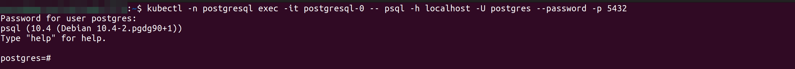

If you want to learn how to orchestrate your PostgreSQL database containers then you are in the right place.

Kubernetes has made IT professionals build portable and scalable cloud-native applications. Orchestrating a database with Kubernetes isn’t the same as orchestrating microservices, frontend apps, or backend apps of some sort. When it comes to databases, things like ensuring high data availability, volumes, and state management come into play.

In this tutorial, you’ll learn how to orchestrate a PostgreSQL database with Kubernetes. This tutorial will walk you through the steps of ensuring high data availability with Kubernetes persistent volumes and persistent volume claims, manage database state with Kubernetes stateful sets, and scaling up to prevent downtime and recovery from failures.

Ready? Let’s begin.



If you’d like to follow along with this tutorial, you will need the following:

- Local Kubernetes cluster up and running-this tutorial uses Minikube.
- A Linux machine – This tutorial uses Ubuntu 20.04.3 LTS.


## Ensuring High Data Availability with Persistent Volumes and Persistent Volume Claims

Prior to orchestrating a database on Kubernetes, the first thing to consider is high data availability. The reason you’ll need to do this is that when or if the database scales down and comes back up, it still maintains the same data. This simply means there’s no data loss.

1. Create a file to store the configuration settings for your persistent volume and paste in the following code snippets.

This tutorial stores the configuration settings in a file called `pv.yaml`.


apiVersion: v1
kind: PersistentVolume
metadata:
   name: postgresql-persistent-volume # Name of the persistent volume
   labels:
     type: local
spec:
   storageClassName: hostpath # Name of the storage class
   capacity:
     storage: 2Gi # Amount of storage this volume should hold
   accessModes:
     - ReadWriteOnce # To be read and written only once
   hostPath: # Storage class type
     path: '/mnt/data' # File path to mount volume



2. Run the `kubectl apply` command to create the persistent volume.

        kubectl apply -f pv.yaml
   Confirm if your persistent volume exists by running the command below:

        kubectl get pv


Visit the [Kubernetes documentation](https://kubernetes.io/docs/concepts/storage/persistent-volumes/) to learn more about persistent volumes

3. Create a namespace `postgresql` to deploy, orchestrate your Postgresql database and manage it’s resources using the following `kubectl create` command:

        kubectl create ns postgresql

4. Create a file `pvc.yaml` and add the following configuration settings for the postgresql namespace. This configuration settings will create a persistent volume claim for your database in the postgresql namespace.


apiVersion: v1
kind: PersistentVolumeClaim
metadata:
  name: postgresql-persistent-volume-claim # Name of the persistent volume claim
spec:
  storageClassName: hostpath # Name of the storage class
  accessModes:
    - ReadWriteOnce # Indicates this claim can only be read and written once
  resources:
    requests:
      storage: 300Mi # Indicates this claim requests only 300Mi of storage from a PV


5. Configure the *postgresql* namespace to use the persistent volume created for your cluster using persistent volume claim:

With persistent volume claims, pods running accross namespaces will have access to use some amount of storage from your persistent volume to store data.


        kubectl apply -n postgresql -f pvc.yaml

Since you have now ensured high data availability for your database, you can now proceed to creating a config map to store the credentials needed to access your database.

## Creating Database Credentials with Kubernetes ConfigMaps

Kubernetes config maps are used to store environment variables that your database needs to be accessible. 

Create a file called `psql-config-map.yaml` and paste in the following configuration settings:

The code below will create a config map called `postgresql-config-map` with environment variables `POSTGRESQL_DB` and `POSTGRESSQL_ROOT_PASSWORD` stored in key-value pairs in the data block.


apiVersion: v1
kind: ConfigMap
metadata:
   name: postgresql-config-map # Name of the ConfigMap
   labels:
     app: postgresql
data:
  POSTGRES_DB: 'postgresdb' # The name of the PosgreSQL database
    POSTGRES_USER: 'postgres' #
  POSTGRES_PASSWORD: 'root' # The root password of the PosgreSQL database



For your PostgreSQL database, run the command below to create a config map for the PostgreSQL namespace in your Kubernetes cluster.

    kubectl apply -n postgresql -f psql-config-map.yaml

Now that you have a config map that stores all the data that your database needs to be accessible, you are now ready to deploy this database up to Kubernetes using Kubernetes stateful sets.

## Managing Database State with Kubernetes StatefulSets

Kubernetes StatefulSets are used to deploy stateful applications up to Kubernetes. These applications are mainly databases. A MySql database, a PosgreSql database or MongoDB database.

1. Create a file called `postgresql-statefulset.yaml` and paste in the following configuration settings:

The code below will create a StatefulSet called posgresql that uses a *persistent volume claim* `postgresql-persistent-volume-claim` and listens on port `5432`


apiVersion: apps/v1
kind: StatefulSet
metadata:
  name: postgresql # The name of the StatefulSet
spec:
  serviceName: postgresql # The name of the service this StatefulSet should use
  selector:
    matchLabels:
      app: postgresql
  replicas: 1 # Indicates this StatefulSet should only create one instance of the mysql database
  template:
    metadata:
      labels:
        app: postgresql
    spec:
      containers:
        - name: postgres # The name of the MySQL container
          image: postgres:10.4 # The image of the MySQL database
          imagePullPolicy: "IfNotPresent"
          ports:
          - containerPort: 5432 # The port number PostgreSQL listens on
          envFrom:
          - configMapRef:
              name: postgresql-config-map # Indicates this StatfulSet should a config map called mysql-config to access the MySQL database
          volumeMounts:
          - name: data
            mountPath: /var/lib/postgresql/data # Data should be mounted onto this file path
      volumes:
      - name: data
        persistentVolumeClaim:
          claimName: postgresql-persistent-volume-claim  # Indicates the mysql database should use a PVC called mysql-claim


2. Create this StatefulSet by running the `kubectl` command below:

        kubectl apply -n postgresql -f posgresql-statefulset.yaml

3. Check the number of instances (pods) of your PostgreSQL database, using the `kubectl` command below:

        kubectl get -n postgresql pods

## Exposing the PostgreSQL Database with a Kubernetes Service Object

Kubernetes service objects are used to expose applications to external clien. So, to expose your PostgreSQL database, you’ll need to create a Kubernetes service object.

1. Create a file called `postgres-service.yaml` and paste in the following configuration settings:


apiVersion: v1
kind: Service
metadata:
   name: postgresql
   labels:
     app: postgresql
spec:
   selector:
     app: postgresql
   ports:
     - protocol: TCP
       name: http
       port: 5432
       targetPort: 5432



2. Run the `kubectl` command below to create this service:

        kubectl apply -n postgresql -f postgres-service.yaml

3. Confirm that the service is up and running using the `kubectl` command below:

    kubectl get -n postgresql service

## Accessing the PostgreSql Admin

Since you now have three instances of your PostgreSQL database running, you can access your PostgreSql database via the admin to communicate and store data in it. Execute the command below to access PostgreSql database using one of the pods.

The command below will access the `postgresql-0` pod and open it up.

    kubectl -n postgresql exec -it postgresql-0 -- psql -h localhost -U postgres --password -p 5432

You will be prompted to input the PostgreSQL database password. Input the password specified in your config map which is `root` in this case.
On a successful connection, you should have the following output, which indicates that you can interact with the PostgreSQL database.

You can now go-ahead and interact with your database.

## Auto-scaling the PostgreSQL database

When it comes to working with databases, scaling is a significant part especially in production environments. As the data or traffic in your application increases, the need for more infrastructure and resources comes to play. These infrastructures are Disk space and number of CPUs. ANd, these resources are number of nodes and pods needed in your Kubernetes cluster.

Auto-scaling comes in two flavors, you can either scale a database vertically, or horizontally (once at a time and not simultaneously). [Horizontal pod auto-scaling](https://kubernetes.io/docs/tasks/run-application/horizontal-pod-autoscale/) will deploy more pods (scale out) when there is an increased load in an application and scale down when the load reduces, while [vertical pod auto-scaling](https://www.giantswarm.io/blog/vertical-autoscaling-in-kubernetes) will assign more resources (Disk space and CPU) to the pods already running your application.

In Kubernetes, a *HorizontalPodAutoscaler* (HPA) is used to scale a database horizontally and is implemented as a Kubernetes API and a controller which is also applicable to the Vertical*lPodAutoscaler* (VPA)

In this section, you’ll be scaling the PostgreSql database horizonatally using the Kubernetes *HorizontalPodAutoscaler.*

Prior to scalling your database horizontally, you need to first deploy a metrics server to collect resource metrics from the Kubelets in your cluster which will then be exposed through the Kubernetes API. The *HorizontalPodAutoscaler* will then use these resource metrics to know when to scale out or scale down.

To deploy a metrics server follow the steps below:
1. Create a file called `metrics-server-deployment.yaml` and paste in the configuration settings below:

The metrics-server configuration from the [repository on Github](https://github.com/kubernetes-sigs/metrics-server).



apiVersion: v1
kind: ServiceAccount
metadata:
  labels:
    k8s-app: metrics-server
  name: metrics-server
  namespace: kube-system
---
apiVersion: rbac.authorization.k8s.io/v1
kind: ClusterRole
metadata:
  labels:
    k8s-app: metrics-server
    rbac.authorization.k8s.io/aggregate-to-admin: "true"
    rbac.authorization.k8s.io/aggregate-to-edit: "true"
    rbac.authorization.k8s.io/aggregate-to-view: "true"
  name: system:aggregated-metrics-reader
rules:
- apiGroups:
  - metrics.k8s.io
  resources:
  - pods
  - nodes
  verbs:
  - get
  - list
  - watch
---
apiVersion: rbac.authorization.k8s.io/v1
kind: ClusterRole
metadata:
  labels:
    k8s-app: metrics-server
  name: system:metrics-server
rules:
- apiGroups:
  - ""
  resources:
  - nodes/metrics
  verbs:
  - get
- apiGroups:
  - ""
  resources:
  - pods
  - nodes
  verbs:
  - get
  - list
  - watch
---
apiVersion: rbac.authorization.k8s.io/v1
kind: RoleBinding
metadata:
  labels:
    k8s-app: metrics-server
  name: metrics-server-auth-reader
  namespace: kube-system
roleRef:
  apiGroup: rbac.authorization.k8s.io
  kind: Role
  name: extension-apiserver-authentication-reader
subjects:
- kind: ServiceAccount
  name: metrics-server
  namespace: kube-system
---
apiVersion: rbac.authorization.k8s.io/v1
kind: ClusterRoleBinding
metadata:
  labels:
    k8s-app: metrics-server
  name: metrics-server:system:auth-delegator
roleRef:
  apiGroup: rbac.authorization.k8s.io
  kind: ClusterRole
  name: system:auth-delegator
subjects:
- kind: ServiceAccount
  name: metrics-server
  namespace: kube-system
---
apiVersion: rbac.authorization.k8s.io/v1
kind: ClusterRoleBinding
metadata:
  labels:
    k8s-app: metrics-server
  name: system:metrics-server
roleRef:
  apiGroup: rbac.authorization.k8s.io
  kind: ClusterRole
  name: system:metrics-server
subjects:
- kind: ServiceAccount
  name: metrics-server
  namespace: kube-system
---
apiVersion: v1
kind: Service
metadata:
  labels:
    k8s-app: metrics-server
  name: metrics-server
  namespace: kube-system
spec:
  ports:
  - name: https
    port: 443
    protocol: TCP
    targetPort: https
  selector:
    k8s-app: metrics-server
---
apiVersion: apps/v1
kind: Deployment
metadata:
  labels:
    k8s-app: metrics-server
  name: metrics-server
  namespace: kube-system
spec:
  selector:
    matchLabels:
      k8s-app: metrics-server
  strategy:
    rollingUpdate:
      maxUnavailable: 0
  template:
    metadata:
      labels:
        k8s-app: metrics-server
    spec:
      containers:
      - args:
        - --cert-dir=/tmp
        - --secure-port=4443
        - --kubelet-preferred-address-types=InternalIP,ExternalIP,Hostname
        - --kubelet-use-node-status-port
        - --metric-resolution=15s
        - --kubelet-insecure-tls
        image: k8s.gcr.io/metrics-server/metrics-server:v0.6.1
        imagePullPolicy: IfNotPresent
        livenessProbe:
          failureThreshold: 3
          httpGet:
            path: /livez
            port: https
            scheme: HTTPS
          periodSeconds: 10
        name: metrics-server
        ports:
        - containerPort: 4443
          name: https
          protocol: TCP
        readinessProbe:
          failureThreshold: 3
          httpGet:
            path: /readyz
            port: https
            scheme: HTTPS
          initialDelaySeconds: 20
          periodSeconds: 10
        resources:
          requests:
            cpu: 100m
            memory: 200Mi
        securityContext:
          allowPrivilegeEscalation: false
          readOnlyRootFilesystem: true
          runAsNonRoot: true
          runAsUser: 1000
        volumeMounts:
        - mountPath: /tmp
          name: tmp-dir
      nodeSelector:
        kubernetes.io/os: linux
      priorityClassName: system-cluster-critical
      serviceAccountName: metrics-server
      volumes:
      - emptyDir: {}
        name: tmp-dir
---
apiVersion: apiregistration.k8s.io/v1
kind: APIService
metadata:
  labels:
    k8s-app: metrics-server
  name: v1beta1.metrics.k8s.io
spec:
  group: metrics.k8s.io
  groupPriorityMinimum: 100
  insecureSkipTLSVerify: true
  service:
    name: metrics-server
    namespace: kube-system
  version: v1beta1
  versionPriority: 100


2. Run the `kubectl` command below to deploy the metrics server in your Kubernetes cluster:

        kubectl create -f metrics-server-deployment.yaml

If deployed successfully, you should have an output similar to the one below:

3. By default, the metrics-server is deployed into the `kube-system` namespace. Confirm if the metrics server is up and running using the command below:

        kubectl -n kube-system get pods

4. Verify if you can collect metric resources on your Kubernetes cluster using the metrics server by running the following `kubectl` command:

        kubectl top nodes


If you are outputted `metrics not available yet` you’ll need to wait a few minutes for your metrics to be available.
posgresql-statefulset.yaml

Since you now have the metrics-server up and running in your Kubernetes cluster, you can now go ahead and set resource limits.

### Setting resource limits

Resource limits on Kubernetes are enforced by the Kubelet to only allow a pod in your Kubernetes cluster to use only the amount of resources you set it to use. That way, your cluster’s pods don’t use more of that resource than the limit you set.

It is important to set the resource limits for your Kubernetes cluster, or else the HPA will not work.

Edit the `posgresql-statefulset.yaml` file to have the configuration settings below, in the container block, right after the `imagePullPolicy` key.


...
resources:
   limits:
     cpu: "100m"
    requests:
      cpu: "100m"
...


Reapply your already deployed StatefulSet to add up the changes using the `kubectl` command below:

     kubectl apply -n Postgresql -f postgresql-statefulset.yaml

You are now ready to scale your database application horizontally.

### Scaling the Database Horizontally

Since you have now set your resource limits, you are now ready to use the Kubernetes *HorizontalPodAutoscaler* to scale your database.

1. Run the command below to scale your Kubernetes cluster horizontally:

The command below will autoscale the StatefulSet (postgresql) in the *postgresql* namespace and set the minimum and maximum replica to `1` and `5` respectively, with a CPU percentage of `20`.

        kubectl autoscale -n postgresql statefulset  postgresql --min 1 --max 5 --cpu-percent 20

2. Verify the current status of your *HorizontalPodAutoscaler (HPA)* using the command below:

        kubectl get hpa

3. Additionally, you can run the `kubectl top` command to see how much of the CPU your pod is running:

        kubectl top pods

So when the number of CPU (cores) used by your application increases to *100M,* the *HorizontalPodAutoscaler* will scale out your application.

## Conclusion

In this article you have learned how to orchestrate a PostgreSQL database with Kubernetes, In the process of orchestrating your PostgreSQL database, you have learned how to ensure high data availability using Kubernetes persistent volumes and persistent volume claims; since a database is a stateful application, you have also learned how to manage your application state using the Kubernetes StatefulSets, configured a config map to store data that is needed to access your database, and exposed your database through a Kubernetes service.

Above all, you now have the ability to scale your database horizontally using the Kubernetes HPA. This way, you can rest assured that you will have zero downtime.

