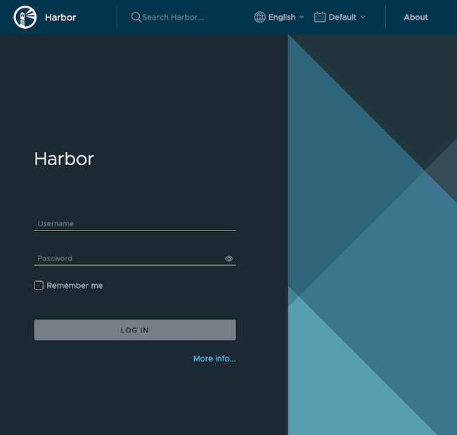
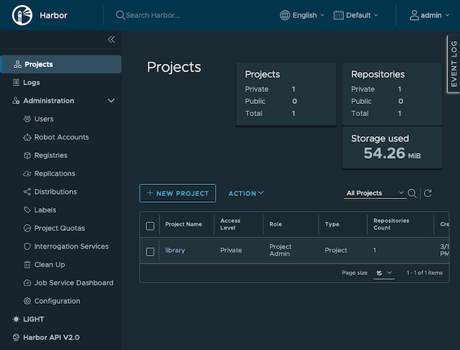
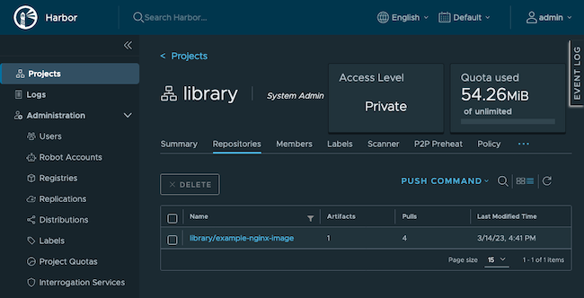

Harbor is an open-source and self-hosted registry for container images. With Harbor, you can securely store and access your own collection of Docker images without resorting to an external service, like Docker Hub. Harbor's security and compliance features ensure your registry has the level of control that you need.

## In this Guide

This guide shows how to set up a Harbor registry on a dedicated compute instance in the cloud. It also shows how to create an LKE cluster that authenticates with the registry and pulls images from it.

- The [What is Harbor](#what-is-harbor) section provides more information about the Harbor service and how it compares to other registries, like Docker Hub.

- The [How to Set Up Harbor](#how-to-set-up-harbor) section details how to install and configure Harbor.

- The [How to Start Working with Harbor](#how-to-start-working-with-harbor) section shows how to access the Harbor dashboard and how to add images to the registry.

- The [How to Use the Harbor Registry with LKE](#how-to-use-the-harbor-registry-with-lke) section shows how to connect a Kubernetes cluster to the registry.

## Before You Begin

The Harbor installation in this guide assumes that you have [a domain name registered through a domain registrar](/docs/products/networking/dns-manager/get-started/#register-the-domain), and that you can edit the DNS records for this domain. This is so that SSL connections can be configured for the Harbor server. If you do not have a domain name, register one now.

The infrastructure for this guide is created on the Akamai Connected Cloud platform. If you do not already have one, [create an account](/docs/products/platform/get-started/) for the platform.

The following is a summary of the infrastructure created in this guide. Instructions for creating these services are included later in the guide:

- A compute instance that runs the Harbor server software

- An LKE cluster with 3 nodes, used to demonstrate pulling an image from the Harbor server.

If you would like to remove these services after you finish following the guide, review our [Stop Further Billing](/docs/products/platform/billing/guides/stop-billing/) guide. For more information on how billing for services works, review the [Billing Overview](/docs/products/platform/billing/).


This guide is written for a non-root user. Commands that require elevated privileges are prefixed with `sudo`. If you’re not familiar with the `sudo` command, see the [Users and Groups](/docs/guides/linux-users-and-groups/) guide.


## What is Harbor?

[Harbor](https://goharbor.io/) offers an open-source solution for self-hosting a container image registry. It is a project within the Cloud Native Computing Foundation (CNCF). Harbor puts security and compliance at the center of its design, with features like access policies and roles, vulnerability scanning, and image signing.

With minimal configuration, Harbor integrates with tools like the Docker command-line interface (CLI) and kubectl. From the Docker CLI, you can log in to your Harbor registry to securely push and pull images. Kubernetes tools can likewise securely authenticate with your Harbor registry and allow you to deploy containers directly from images stored in the registry.

### Harbor vs Docker Hub: Why Use Harbor?

The most significant distinction between Harbor and Docker Hub is that Harbor can be self-hosted. By self-hosting Harbor, you gain a degree of control over things like compliance and access that you lack with a service like Docker Hub and other external cloud-hosted solutions.

Harbor also comes with a suite of features that can enhance security and compliance. These features come with fine-grained controls for you to configure your registry.

To help decide which registry to use, consider these trade-offs:

- Docker Hub provides an accessible registry with plenty of existing images to leverage. However, you lose a degree of control over the data and you do not get the same robust security and compliance features.

- Harbor centers on securing your images, with a suite of features to control access and roles and to mitigate vulnerabilities. Because it is self-hosted, Harbor has an initial setup and requires on-going system administration and maintenance.

## How to Set Up Harbor

To get started, you need to prepare a system to run the Harbor server software. The process involves installing and configuring some prerequisites and then installing Harbor itself.

The server is your Harbor access point. It gives you an administrative interface for your Harbor instance as well as a host for your Harbor registry. Your Docker and Kubernetes tools can then connect to your Harbor registry to pull container images.

### Configure DNS Records

This tutorial requires you to have a domain for your Harbor server. Doing so allows you to use Let's Encrypt for SSL certification. For example code and commands, the tutorial uses `harbor.example.com` as the domain name.

In your DNS manager for your own domain, create an [A record](/docs/guides/dns-overview/#a-and-aaaa) named `harbor`:

- If you use the Linode DNS Manager, follow our [Manage DNS Records](/docs/products/networking/dns-manager/guides/manage-dns-records/) guide to create the new a record.

- If you use another DNS manager, follow their instructions for creating the A record.


If you use another DNS manager but would like to start using the Linode DNS Manager, refer to these guides:

    - [DNS Manager - Get Started](/docs/products/networking/dns-manager/get-started/)
    - [Configure Your Domain's Authoritative Name Servers](/docs/products/networking/dns-manager/guides/authoritative-name-servers/)
    - [Incoming DNS Zone Transfers](/docs/products/networking/dns-manager/guides/incoming-dns-zone-transfers/)


### Provision a Compute Instance

For this tutorial, the Harbor server is run on a compute instance. Follow these instructions to create the instance:

1. Follow the [Creating a Compute Instance](/docs/guides/creating-a-compute-instance/) guide to create the instance. Instructions for installing Harbor on Debian, Ubuntu, CentOS, and Fedora are included in this guide.

    Images stored with the registry are kept in the compute instance's included [persistent storage](/docs/products/compute/compute-instances/guides/disks-and-storage/#understanding-storage). Different instance plans have different amounts of included storage. You should pick a plan whose storage can accommodate the total size of the images you want to store. Review the [pricing page](/pricing/) to determine which plan has enough storage for you. If you intend to use this server for testing and learning, a plan with minimal specs is adequate.

1. Follow our [Setting Up and Securing a Compute Instance](/docs/guides/set-up-and-secure/) guide to update your system,create a limited user account, and harden SSH access. You may also wish to set the timezone and configure your hostname.

### Install Docker and Docker Compose

Docker and the Docker Compose plugin are required for running Harbor:

1. Refer to the [official instructions](https://docs.docker.com/engine/install/#server) and install Docker Engine and the Docker Compose plugin for your compute instance's operating system.

1. Ensure that the Docker daemon is running:

    ```command {title="Harbor compute instance"}
    sudo systemctl status docker
    ```

    ```output
    ● docker.service - Docker Application Container Engine
    Loaded: loaded (/usr/lib/systemd/system/docker.service; enabled; vendor preset: disabled)
    Active: active (running) since Thu 2023-02-16 20:38:07 UTC; 1s ago
        Docs: https://docs.docker.com
    ```

1. If it is not running (`active`), enable and start the Docker daemon with these commands.

    ```command {title="Harbor compute instance"}
    sudo systemctl enable docker
    sudo systemctl start docker
    ```

### Configure the Firewall

To allow connections to your Harbor server, your firewall needs to have the HTTP port (**80**) and HTTPS port (**443**) open. The steps below provide commands to open the HTTP and HTTPS ports on several major Linux distributions. These use the default firewall managers for each of the named distributions.



Use UFW to open the necessary ports:

```command {title="Harbor compute instance"}
sudo ufw allow http
sudo ufw allow https
sudo ufw allow ssh
sudo ufw reload
```

Make sure UFW is enabled and running:

```command {title="Harbor compute instance"}
sudo systemctl start ufw
sudo systemctl enable ufw
sudo ufw enable
```


Use firewalld to open the necessary ports:

```command {title="Harbor compute instance"}
sudo firewall-cmd --zone=public --add-service=http --permanent
sudo firewall-cmd --zone=public --add-service=https --permanent
sudo firewall-cmd --zone=public --add-service=ssh --permanent
sudo firewall-cmd --set-default-zone=public
sudo firewall-cmd --reload
```

Make sure firewalld is enabled and running:

```command {title="Harbor compute instance"}
sudo systemctl start firewalld
sudo systemctl enable firewalld
```



### Set Up SSL

Using SSL lets you secure traffic to and from your Harbor server. You can create self-signed certificates, but typically it is more convenient to use a certificate authority like [Let's Encrypt](https://letsencrypt.org).

[Certbot](https://certbot.eff.org) is a tool that provides an interface for requesting and downloading certificates from Let's Encrypt. This tutorial uses Certbot to set up an SSL certificate:

1. To install Certbot, follow one of our [Certbot for NGINX guides](/docs/guides/enabling-https-using-certbot/#nginx). For this tutorial, follow just the **Installing Snapd** and **Installing Certbot** sections. *Do not* follow that guide's steps for requesting a certificate.

1. Use Certbot to request a certificate for your domain (given after the `-d` option), using the [standalone verification](https://eff-certbot.readthedocs.io/en/stable/using.html#standalone) option. Replace the domain in this command with your Harbor server's domain:

    ```command {title="Harbor compute instance"}
    sudo certbot certonly --standalone -d harbor.example.com
    ```

1. Once the process has finished, Certbot should output the location of your certificate and key files, as shown here. These locations need to be specified in the Harbor configuration file later in this guide, so copy them into your notes now.

    ```output
    [...]
    Successfully received certificate.
    Certificate is saved at: /etc/letsencrypt/live/harbor.example.com/fullchain.pem
    Key is saved at:         /etc/letsencrypt/live/harbor.example.com/privkey.pem
    [...]
    ```

### Install Harbor

1. Download the package with the latest Harbor installer from the Harbor [releases page](https://github.com/goharbor/harbor/releases/latest). You can choose either the online or offline installer.

    The command below streamlines this step. It grabs the download link for the latest offline installer package and downloads it as `harbor-offline-installer.tgz`.

    ```command {title="Harbor compute instance"}
    curl -s https://api.github.com/repos/goharbor/harbor/releases/latest \
    | grep "browser_download_url.*harbor-offline-installer.*.tgz\"" \
    | tail -n 1 \
    | cut -d : -f 2,3 \
    | tr -d \" \
    | wget -O harbor-offline-installer.tgz -qi -
    ```

    Be sure to do this in a directory where you want to keep the Harbor installer's own subdirectory. You should retain the Harbor installer even after installation, as it includes scripts for making configuration changes later.

1. Extract the installer package, which places the installer contents within a `harbor/` subdirectory of the current directory. You may first need to install the `tar` tool, which you should be able to get through your system's package manager.

    ```command {title="Harbor compute instance"}
    tar xzvf harbor-offline-installer.tgz
    ```

1. Navigate into the new `harbor/` directory and make a copy of the included configuration file template, named `harbor.yml`. This copy serves as your Harbor instance configuration.

    ```command {title="Harbor compute instance"}
    cd harbor
    cp harbor.yml.tmpl harbor.yml
    ```

1. Open the `harbor.yml` file in a text editor. Begin adjusting the configuration to fit your needs.

    Several of the required parameters can retain their default values, like the `http` parameter. The following are required parameters that you should make initial adjustments to:

    - `hostname`: Set this to your Harbor server's domain (e.g. `harbor.example.com`).

    - `https`: Modify the `certificate` and `private_key` sub-parameters to point to the locations of your SSL certificate and key files. These were provided by Certbot in the [Set Up SSL](#set-up-ssl) section.

        Using the example output in the previous section, the parameters would look like the following:

        ```file {title="harbor.yml" lang="yml"}
        # [...]
        https:
          port: 443
          certificate: /etc/letsencrypt/live/harbor.example.com/fullchain.pem
          private_key: /etc/letsencrypt/live/harbor.example.com/privkey.pem
        # [...]
        ```

    As well, adjust the following passwords in the configuration file. If these are not changed, your Harbor instance is more vulnerable to attacks:

    - `harbor_admin_password`: Replace with an initial password for the administrator user. This password is reset again in the next section after first logging in, but changing the default here mitigates attacks between when you install the server and when you log in.

    - `database`: Replace the `password` sub-parameter with a more secure password for Harbor's PostgreSQL database.

1. With your configuration changes in place, run the installation script:

    ```command {title="Harbor compute instance"}
    sudo ./install.sh
    ```

    You should be able to follow along with the progress as Harbor installs. At the end the script notifies you that the installation has completed successfully:

    ```output
    ✔ ----Harbor has been installed and started successfully.----
    ```

## How to Start Working with Harbor

Once the installation has finished, Harbor begins running and is ready to use. The next sections show how to access your Harbor server and how to populate the registry with a custom Docker image.

### Access Harbor

Harbor's dashboard is exposed at the domain you configured above. For this tutorial, that means navigating to `https://harbor.example.com` to access the Harbor login page.

[](harbor-login.png)

Enter the username `admin`, and the administrator password from the `harbor.yml` file from the previous section.

Logging in takes you to the Harbor dashboard, where you can see details of your Harbor instance and begin managing its settings. Be sure to take a look around and familiarize yourself with all of the options available.

[](harbor-dashboard.png)

You should change your administrator password after you first log in:

1. Select the **admin** option from the upper right

1. Select the **Change Password** from the dropdown menu

### Add Images to Harbor

From the Harbor dashboard, you can see all of your Harbor resources. To get the most out of Harbor, you should populate the registry with container images. These images then appear within the dashboard and are accessible directly from your Harbor registry's address.

Harbor organizes images into projects, so you should first either create a project to your liking or modify the default `library` project. You can do all of this from the **Projects** option on the left menu.

The examples in this tutorial use the default project (`library`) but change the project's accessibility from public to private:

1. Select **Projects** from the left menu.

1. Select **library** from the list of projects.

1. Select the **Configuration** tab.

1. Uncheck the **Public** option.

1. Click the **Save** button.

The next sections show how to create your own Docker image and push it to your Harbor registry.

#### Create a Docker Image

To begin, you need a Docker image. This tutorial creates a simple image that includes NGINX and a basic website. Later in the tutorial, you can see this website fully deployed from Harbor to your LKE cluster.

The following instructions can be run from your local workstation. They require that you have Docker installed on your workstation. If you do not have Docker installed locally, review the [official instructions](https://docs.docker.com/engine/install/) for installing it.

1. Make a directory to store the image configuration file and its resources, and navigate into that directory.

    ```command {title="Your workstation"}
    mkdir ~/example-nginx-image
    cd ~/example-nginx-image
    ```

1. Add an `nginx-default.conf` file there with the contents shown here. These define a minimal NGINX static server.

    ```file {title="nginx-default.conf" lang="conf"}
    server {
        listen 80;
        listen [::]:80;
        server_name localhost;
        location / {
            root /usr/share/nginx/html;
            index index.html index.htm;
        }
        error_page 500 502 503 504  /50x.html;
        location = /50x.html {
            root /usr/share/nginx/html;
        }
    }
    ```

1. Make an `html/` subdirectory where the static site content can be stored.

    ```command {title="Your workstation"}
    mkdir html
    ```

1. Add an `index.html` file into the `html/` directory with the file the contents shown here.

    ```file {title="html/index.html" lang="html"}
    <!doctype html>
    <html lang="en">
    <head>
      <meta charset="utf-8">
      <title>Example Nginx Website</title>
    </head>
    <body>
      <h1>An Example Nginx Website</h1>
      <p>Welcome to your own Nginx website!</p>
    </body>
    </html>
    ```

1. Add a `Dockerfile` to the image directory with the file the contents shown here. This file defines your Docker image.

    ```file {title="Dockerfile" lang="docker"}
    FROM nginx:latest
    RUN rm /etc/nginx/conf.d/default.conf
    COPY nginx-default.conf /etc/nginx/conf.d/default.conf
    COPY html /usr/share/nginx/html
    ```

1. Use the Docker `build` command to build an image from the Dockerfile. This example gives the image the name `example-nginx-image`.

    ```command {title="Your workstation"}
    sudo docker build -t example-nginx-image .
    ```

1. You can now verify that the image has been successfully created by listing your Docker images:

    ```command {title="Your workstation"}
    sudo docker images
    ```

    ```output
    REPOSITORY                      TAG       IMAGE ID       CREATED         SIZE
    example-nginx-image             latest    123658fe84af   5 seconds ago   142MB
    ```


You can learn more about building Docker images through our guide on [How to Use a Dockerfile to Build a Docker Image](/docs/guides/how-to-use-dockerfiles/).


#### Push an Image to Harbor

With a Docker image built and ready, you can use the Docker CLI to push that image to your Harbor registry:

1. Because the Harbor project is private, you need to log in to the registry from the Docker CLI:

    ```command {title="Your workstation"}
    sudo docker login harbor.example.com
    ```

    This prompts you for a username and password. Use the `admin` credentials used to log in to the Harbor interface (use the new password you set after logging in for the first time).

1. Add a tag to your Docker image. In the example below, the image is tagged with a version number `1.0.0`. Notice that the image is tagged for the `library` project within the Harbor registry.

    In this command, replace `harbor.example.com` with your Harbor server's domain.

    ```command {title="Your workstation"}
    sudo docker tag example-nginx-image harbor.example.com/library/example-nginx-image:1.0.0
    ```

1. Push the Docker image up to your Harbor registry. In this command, replace `harbor.example.com` with your Harbor server's domain.

    ```command {title="Your workstation"}
    sudo docker push harbor.example.com/library/example-nginx-image:1.0.0
    ```

    ```output
    The push refers to repository [harbor.example.com/library/example-nginx-image]
    [...]
    1.0.0: digest: sha256:f37ae9e729f7c3a0d5f8e84e8dcfc019093ac76b48e885568c8c5b6b163d5b43 size: 2191
    ```

You can go to the Harbor dashboard in your browser to see the results. Navigate to the **Projects** page using the menu on the left, and select the **library** project from the listing. You should see your image listed.

[](harbor-project.png)

## How to Use the Harbor Registry with LKE

Harbor can act as the image registry for a Kubernetes cluster. The steps in this section show how to deploy the example Docker image in the previous section from your Harbor registry to your LKE cluster.

1. Provision an LKE cluster. Follow our [Linode Kubernetes Engine - Get Started](/docs/products/compute/kubernetes/get-started/) guide to install the kubectl tool on your local workstation, deploy a cluster, and download your cluster's kubeconfig. The new cluster should have a node pool with three nodes. The nodes can have minimal specifications, because they are only used to serve a small website.

    The commands in the next steps should be run from your workstation.

1.  Create a secret with kubectl. This secret allows your cluster to have an authenticated connection to your private Harbor registry.

     Replace the `--docker-server` URL with your Harbor server's URL. Replace the `--docker-password` value with the credentials for your Harbor server.

     ```command {title="Your workstation"}
     kubectl create secret docker-registry harbor-registry-secret --docker-server="https://harbor.example.com" --docker-username="admin" --docker-password="Harbor12345"
     ```

1. Create an `example-nginx-deployment.yml` file with the contents shown here. This configuration deploys the `example-nginx-image` custom image alongside a service for accessing the containers.

    This deployment uses three `replicas`. You can adjust that number to match the number of nodes in your LKE cluster on **line 18**.

    **Line 29** refers to the URL of your image on the Harbor server. Update the domain for this URL to match your Harbor server's domain.

    ```file {title="example-nginx-deployment.yml" lang="yml" hl_lines="18 29"}
    apiVersion: v1
    kind: Service
    metadata:
      name: example-nginx-service
    spec:
      type: NodePort
      selector:
        app: example-nginx
      ports:
      - port: 80
        targetPort: 80
    ---
    apiVersion: apps/v1
    kind: Deployment
    metadata:
      name: example-nginx-app
    spec:
      replicas: 3
      selector:
        matchLabels:
          app: example-nginx
      template:
        metadata:
          labels:
            app: example-nginx
        spec:
          containers:
          - name: example-nginx-instance
            image: harbor.example.com/library/example-nginx-image:1.0.0
            imagePullPolicy: Always
            ports:
            - containerPort: 80
          imagePullSecrets:
          - name: harbor-registry-secret
    ```

1. Apply the configuration file to your cluster:

    ```command {title="Your workstation"}
    kubectl apply -f example-nginx-deployment.yml
    ```

1. Verify that the deployment has completed successfully by listing the pods. You should see three, each with a `Running` status.

    ```command {title="Your workstation"}
    kubectl get pods
    ```

    ```output
    NAME                                READY   STATUS    RESTARTS   AGE
    example-nginx-app-646f4d5b6-8j8xc   1/1     Running   0          1m
    example-nginx-app-646f4d5b6-gnlbk   1/1     Running   0          1m
    example-nginx-app-646f4d5b6-pdr24   1/1     Running   0          1m
    ```

1. Check to see that the deployed application is performing as expected. The custom Docker image serves a static web page, so you can visit the web page to see that it is working.

    You can use kubectl to forward port `80` from within the cluster. Forward this traffic to port `8001` on your local workstation:

    ```command {title="Your workstation"}
    kubectl port-forward service/example-nginx-service 8001:80
    ```

    Navigate to `localhost:8001` in a web browser to see the deployed application.

## Conclusion

You now have an operational Harbor registry. You have also authenticated your Docker CLI and a Kubernetes cluster with the registry. Between these tools, you have all you need to start managing a full registry and including it into your infrastructure.

To learn more about managing your Harbor registry and about the configuration features, be sure to refer to the Harbor documentation linked below. The Harbor dashboard gives you extensive control of access policies and roles, vulnerability scanning, and other features to secure your registry.
