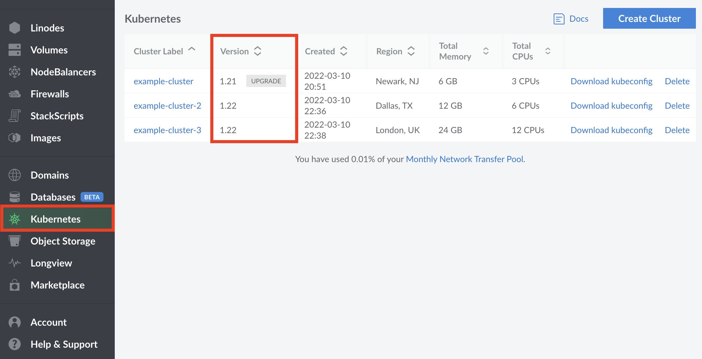
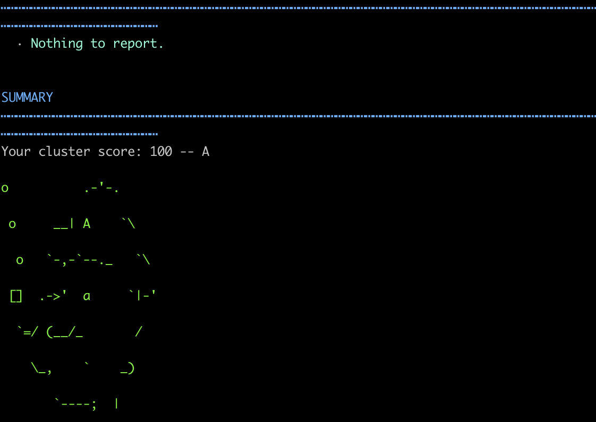

Upgrading a Kubernetes cluster is often an involved process in manual Kubernetes configurations, with special attention paid to control plane components and ensuring application uptime. LKE aims to make this upgrade process much more transparent, clear, and seamless to an end user by handling the more intricate details of these upgrades and the direct upgrade of Control Plane Components. That being said, there are still things users should be aware of to help ensure the upgrade process will complete without any issues.

When new features or bug fixes only stand to benefit Kubernetes as a whole, new capabilities will in most cases be applied by creating a new version of Kubernetes, applied to a cluster at a user's convenience. Minor version upgrades in particular regularly handle the deprecation of Kubernetes features that may no longer be needed, have an improved replacement feature in a newer version, or are otherwise removed. The removal of these deprecated Kubernetes features, specifically in the case of deprecated APIs, can in some cases cause issues when upgrading a cluster. LKE is no exception to this, and minor version updates are created on a regular cadence of approximately every four months to consistently improve on the LKE service.

Additionally, LKE will **deprecate** minor versions of Kubernetes in order to provide access to a service free from issues that an out of date Kubernetes configuration can result in. Deprecation of a minor version of Kubernetes on LKE will require a user upgrade within a specified window of time if the user is currently using a configuration set for deprecation. Within this window, and before any upgrade, Kubernetes version upgrades benefit from careful review by administrators to ensure an upgrade will complete successfully.

## In This Guide

This guide will go over the Kubernetes upgrade process, provide a brief introduction to the public Kubernetes changelog as it applies to LKE, and discuss tools like Popeye that can highlight incompatibilities or other issues within a cluster's configuration both before and after upgrading.

## Checking Cluster Version

The current version of Kubernetes being used for each of your cluster configurations can be found on your [LKE Cluster Page](https://cloud.linode.com/kubernetes/clusters) on the Cloud Manager in the `Version` column of the Kubernetes table. If an upgrade is available, the text `Upgrade` will appear next to the version number.


Alternatively, if you would like to get the current local version of Kubernetes on your cluster through kubectl, the following command can be entered:

        kubectl version | grep Server


## What Does an Upgrade Look Like

When upgrading a Kubernetes cluster on LKE, it is important to keep in mind that all nodes within the cluster will need to be [recycled](/docs/guides/deploy-and-manage-a-cluster-with-linode-kubernetes-engine-a-tutorial/#upgrade-a-cluster
) on a rolling basis. In other words, the nodes within your cluster are taken down and upgraded one at a time, to help ensure that the process completes without downtime.

In the highest level of detail, each node will be independently [drained and cordoned](https://kubernetes.io/docs/tasks/administer-cluster/safely-drain-node/) one at a time, while the High Availability features of Kubernetes ensure that all workloads are migrated to other nodes. Once a node is drained and cordoned, it is removed and a new node is created using the correct Kubernetes version in it's place, where it is synced, and then uncordoned, immediately putting it back live into the cluster with the `Ready` status.

While this process generally doesn't impact workloads in a significant way, it is strongly recommended that steps are taken to ensure that there is enough space on all nodes to accommodate for this temporary shift in resources. If a cluster of three nodes cannot briefly support the resources demands of an application using only two nodes, then the upgrade process may result in unintended application downtime. For the most comprehensive resource coverage possible, we recommend enabling the [Cluster Autoscaler](/docs/products/compute/kubernetes/guides/enable-cluster-autoscaling/), or [resizing your node pools](/docs/products/compute/kubernetes/guides/edit-remove-node-pools/) to something larger as needed.

## Reviewing the Kubernetes Changelog

The best method for ensuring uptime and a clean upgrade without issues is to carefully review the public changelog for the minor release your cluster will be upgrading to. All available information pertaining to Kubernetes version changes can be found on Kubernetes' public [Changelog Page](https://github.com/kubernetes/kubernetes/tree/master/CHANGELOG) for the Kubernetes project hosted on Github. In order to ensure that you'll be able to upgrade to the next minor version of Kubernetes without issue, find the changelog for the version of Kubernetes you will be upgrading to. For example, if your cluster is currently on version `v1.21`, select the changelog for `v1.22` or `CHANGELOG-1.22.md`. Minor version upgrades can only be performed one minor version ahead at a time, so this will always be one minor version ahead of your current Kubernetes version.


When reviewing the changelog, it is important to keep in mind that **patch releases** are deployed automatically to LKE Control Plane Components as needed, however this should not effect the intended behavior of your cluster. Only Major and Minor releases will have potentially breaking changes.


Once you've found the correct Changelog for the version of Kubernetes you'll be upgrading to, find the section in the changelog that fits the naming convention for the minor release of your current Kubernetes version for the changes of most consequence. If you are upgrading from Kubernetes version `1.21` for example, find the section labeled [Changelog Since v1.21.0](https://github.com/kubernetes/kubernetes/blob/master/CHANGELOG/CHANGELOG-1.20.md#changelog-since-v1190). Read through this section carefully for any new features and deprecations, paying close attention to the [What's New](https://github.com/kubernetes/kubernetes/blob/master/CHANGELOG/CHANGELOG-1.22.md#whats-new-major-themes) and [Urgent Upgrade Notes](https://github.com/kubernetes/kubernetes/blob/master/CHANGELOG/CHANGELOG-1.22.md#urgent-upgrade-notes) subsection for information on the most critical changes. Additional areas of special attention should include the [Known Issues](https://github.com/kubernetes/kubernetes/blob/master/CHANGELOG/CHANGELOG-1.22.md#known-issues), [Deprecation Changes](https://github.com/kubernetes/kubernetes/blob/master/CHANGELOG/CHANGELOG-1.22.md#deprecation), and [API Changes](https://github.com/kubernetes/kubernetes/blob/master/CHANGELOG/CHANGELOG-1.22.md#api-change-1) subsections. That being said, for the absolute best guarantee of a clean upgrade, we recommend reading through this full section to gain a full understanding of what you may need to know.

When upgrading from Kubernetes version 1.21 to [version 1.22](https://github.com/kubernetes/kubernetes/blob/master/CHANGELOG/CHANGELOG-1.22.md#whats-new-major-themes) for example, LKE users will want to pay especially close attention to the removal of several beta Kubernetes APIs they may be using in their clusters and adjust their configurations as needed by following Kubernetes' recommendations [linked from the changelog](https://kubernetes.io/docs/reference/using-api/deprecation-guide/#v1-22).

As API changes are an issue that can commonly go unnoticed when upgrading LKE, we additionally recommend checking Kubernetes' [API deprecation guide](https://kubernetes.io/docs/reference/using-api/deprecation-guide/#v1-22) for more information on API changes, and how they should be addressed in specific circumstances.


When investigating potential issues discovered by exploring the Kubernetes Changelog, you may need to search for specific strings containing potentially breaking configurations. Using the [grep command](/docs/guides/how-to-grep-for-text-in-files/) is generally a good way to do this quickly.

For example, if you need to find where you may be using the currently deprecated API `networking.k8s.io/v1beta1`, enter the following command from the root directory containing your Kubernetes configuration files:

    grep -r networking.k8s.io/v1beta1


## Searching for Compatibility Issues with Popeye

Popeye is an open-source read-only tool used from wherever a user has `kubectl` installed, using Kubernetes contexts defined in a `kubeconfig` file. It automatically scans live Kubernetes clusters, and provides an administrator with insight into issues that could arise from deployed resources and configurations. Once installed, Popeye will perform a comprehensive scan of your current configuration based on your active kubeconfig whenever entering the following command:

    popeye

Popeye can either be installed using the package manager [Homebrew](https://brew.sh/), by using the binary from a tarball hosted on [Popeye's github](https://github.com/derailed/popeye/releases) or by installing [via source](https://github.com/derailed/popeye#installation). While any option is possible, this guide will only focus on the installation process using Brew on both **Ubuntu 20.04** and **Mac OSx**, and through Linux binary tarballs. That being said, the installation process should be largely the same across Operating Systems and Distros, and steps can be adjusted as needed.

## Installing Popeye Using Homebrew:

### Ubuntu 20.04

Before proceeding with installation on **Ubuntu 20.04 LTS**, ensure that all of the following commands are entered as a [limited sudo user](/docs/guides/set-up-and-secure/#add-a-limited-user-account) with access to a fully configured [LKE](https://www.linode.com/products/kubernetes/) or [Kubernetes](/docs/guides/kubernetes/) cluster with [kubectl](/docs/products/compute/kubernetes/guides/install-kubectl/) fully installed and using your kubeconfig configuration file. A good way to test this is to ensure that you can see all nodes in your cluster when entering the following command:

    kubectl get nodes

The following steps will complete the installation of popeye on Ubuntu **20.04 LTS**:

1. Ensure that your system is up to date:

       sudo apt update && sudo apt upgrade

1.  Install all packages that Homebrew relies on:

        sudo apt install build-essential

1. Install Homebrew via the installation script, agreeing to all prompts:

        /bin/bash -c "$(curl -fsSL https://raw.githubusercontent.com/Homebrew/install/HEAD/install.sh)"

1. Once the installation script is complete, you will need to add Homebrew to your PATH. Enter the following commands, replacing `username` with your current username:

        echo 'eval "$(/home/linuxbrew/.linuxbrew/bin/brew shellenv)"' >> /home/username/.profile
        eval "$(/home/linuxbrew/.linuxbrew/bin/brew shellenv)"

1. Use Homebrew to install Popeye:

        brew install derailed/popeye/popeye

### Mac OSx

The following steps will complete the installation of Popeye on Ubuntu **Mac OSx**:

1. Ensure that you can see all nodes in your cluster when entering the following command:

        kubectl get nodes

1. Install Homebrew via the installation script if it has not been already, agreeing to all prompts:

        /bin/bash -c "$(curl -fsSL https://raw.githubusercontent.com/Homebrew/install/HEAD/install.sh)"

1. Install Popeye:

        brew install derailed/popeye/popeye

## Installing Popeye using Linux Binary Tarballs

Before proceeding with the installation of popeye, ensure that [wget](/docs/guides/how-to-use-wget/) is installed on your system. Once installed proceed with the following steps:

1. Determine the architecture of your system:

        uname -m

1. Using `wget`, download the Linux tarball for Popeye [matching the latest release and your architecture](https://github.com/derailed/popeye/releases), in this case `v0.9.8` as the latest release and `x86_64` as the architecture:

        wget https://github.com/derailed/popeye/releases/download/v0.9.8/popeye_Linux_x86_64.tar.gz

1. Unpack the tarball:

        tar -xzf popeye_Linux_x86_64.tar.gz

### Running Popeye

Once installed via brew, Popeye can perform a scan by entering the following command:

    popeye

If installed from the tarball, navigate to your home directory and enter the following command to allow the program to execute:

    ./popeye

Once entered, Popeye will begin scanning against your current cluster context immediately, outputting a list of information pertaining to your configuration, and a letter grade once the script completes. Review the information that's outputted, and remediate issues as they arise to help ensure the migration process can be completed successfully. In a near perfect configuration, you should receive a letter grade of `A`.

