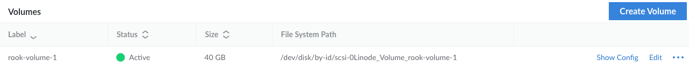

[Rook](https://rook.io/) provides cloud-native storage *orchestration* (i.e. automated configuration, coordination, and management) for the [Ceph](https://ceph.com/en/) distributed open source storage system. Ceph runs on Kubernetes, and is used to provide object, block, and file interfaces from a single cluster. Together, these three provide a method to automate and manage large blocks of storage, typical of immense data storage centers. This guide demonstrates how to use Rook to orchestrate open source storage.

## What Is Rook? What Problem Does It Solve?

Rook automates the deployment and management of Ceph to create self-managing, self-scaling, and self-healing storage services. This combination makes large storage management much easier than doing it manually.

Ceph provides file system, object, and block storage on a single cluster that is controlled using the [Controlled Replication Under Scalable Hashing (CRUSH)](https://access.redhat.com/documentation/en-us/red_hat_ceph_storage/3/html/storage_strategies_guide/crush_administration) algorithm. CRUSH ensures that the load placed on storage locations such as rows, racks, chassis, hosts, and devices remains consistent. A CRUSH map defines rules that specify how CRUSH stores and retrieves data.

[Object Storage Daemons (OSDs)](https://documentation.suse.com/ses/7/html/ses-all/admin-caasp-cephosd.html) each manage a single device. Rook simplifies device management and performs tasks such as verifying OSD health.

Rook can also create and customize storage clusters through Custom Resource Definitions (CRDs). There are four different modes in which to create a cluster:

-   **Host Storage Cluster** consumes storage from host paths and raw devices.
-   **Persistent Volume Claim (PVC) Storage Cluster** dynamically provisions storage underneath Rook by specifying the storage class for Rook to consume storage via PVCs.
-   **Stretched Storage Cluster** distributes Ceph Monitors (MONs) across three zones, while storage (i.e. OSDs) is only configured in two zones.
-   **External Ceph Cluster** connects your Kubernetes applications to an external Ceph cluster.

## Before You Begin

1.  Before you can work with Ceph and Rook, you need a basic Kubernetes setup. Follow the instructions in our [Linode Kubernetes Engine - Get Started](/docs/products/compute/kubernetes/get-started/) guide to create one. This article assumes you have Kubernetes version 1.28 or later installed. The recommended minimum Kubernetes setup for Rook includes three nodes with 4 GB memory and 2 CPUs each. Be aware that it can take a few minutes to provision and start the cluster. Also make sure that `kubectl` is set up on your local machine.


This guide is written for a non-root user. Commands that require elevated privileges are prefixed with `sudo`. If you’re not familiar with the `sudo` command, see the [Users and Groups](/docs/guides/linux-users-and-groups/) guide.


## Creating and Attaching Volumes

One the Kubernetes cluster is set up, use the steps below to create a volume for each node.

1.  Open the Akamai Cloud Manager and select **Linodes** from the left menu.

1.  Select one of the Kubernetes nodes with a name such as `lke116411-172761-649b48bf69f8`.

1.  Open the **Storage** tab.

1.  Click **Create Volume**.

1.  Enter a name for the volume such as `rook-volume-1` in the **Label** field.

1.  Set a volume size of at least `40 GB` in the **Size** field.

1.  Click **Create Volume**. After several minutes, the volume should show up as **Active**:

    

1.  Repeat Steps 1 through 7 for the remaining two nodes.

## Rook and Ceph Installation

With new volumes attached to each node in the Kubernetes cluster, it's time to install Rook and Ceph onto the Kubernetes cluster.

1.  Use the following commands to [install Rook](https://rook.io/docs/rook/v1.11/Getting-Started/quickstart/#tldr) and Ceph:

    ```command
    git clone --single-branch --branch v1.14.8 https://github.com/rook/rook.git
    cd rook/deploy/examples
    kubectl create -f crds.yaml -f common.yaml -f operator.yaml
    kubectl create -f cluster.yaml
    ```

    If everything works, you should see:

    ```output
    ...
    cephcluster.ceph.rook.io/rook-ceph created
    ```

1.  Verify the status of the Rook-Ceph cluster:

    ```command
    kubectl -n rook-ceph get pod
    ```

    ```output
    NAME                                                              READY   STATUS      RESTARTS        AGE
    csi-cephfsplugin-2rqlv                                            2/2     Running     0               2m57s
    csi-cephfsplugin-4dl9l                                            2/2     Running     0               2m57s
    csi-cephfsplugin-provisioner-868bf46b56-2kt4d                     5/5     Running     0               2m58s
    csi-cephfsplugin-provisioner-868bf46b56-sx7fj                     5/5     Running     1 (2m21s ago)   2m58s
    csi-cephfsplugin-wjmmw                                            2/2     Running     0               2m57s
    csi-rbdplugin-4bq8k                                               2/2     Running     0               2m57s
    csi-rbdplugin-58wvf                                               2/2     Running     0               2m57s
    csi-rbdplugin-gdvjk                                               2/2     Running     0               2m57s
    csi-rbdplugin-provisioner-d9b9d694c-bl94s                         5/5     Running     2 (2m ago)      2m58s
    csi-rbdplugin-provisioner-d9b9d694c-vmhw2                         5/5     Running     0               2m58s
    rook-ceph-crashcollector-lke199763-288009-0c458f4a0000-7fcwlc5s   1/1     Running     0               81s
    rook-ceph-crashcollector-lke199763-288009-1f9ed47e0000-85b788df   1/1     Running     0               84s
    rook-ceph-crashcollector-lke199763-288009-28c3e5450000-978tzmcx   1/1     Running     0               69s
    rook-ceph-exporter-lke199763-288009-0c458f4a0000-7ffb6fbc5kmlbn   1/1     Running     0               81s
    rook-ceph-exporter-lke199763-288009-1f9ed47e0000-6dc9d57cbwj8m6   1/1     Running     0               84s
    rook-ceph-exporter-lke199763-288009-28c3e5450000-78cd58d665667r   1/1     Running     0               69s
    rook-ceph-mgr-a-b75b4b47-xxs4p                                    3/3     Running     0               85s
    rook-ceph-mgr-b-d77c5f556-nxw4w                                   3/3     Running     0               83s
    rook-ceph-mon-a-6f5865b7f8-577jw                                  2/2     Running     0               2m37s
    rook-ceph-mon-b-75ff6d4875-qq9nb                                  2/2     Running     0               106s
    rook-ceph-mon-c-6c7d4864b4-blnr8                                  2/2     Running     0               96s
    rook-ceph-operator-7d8898f668-nfp8w                               1/1     Running     0               3m45s
    rook-ceph-osd-prepare-lke199763-288009-0c458f4a0000-l665b         0/1     Completed   0               28s
    rook-ceph-osd-prepare-lke199763-288009-1f9ed47e0000-qlv2s         0/1     Completed   0               25s
    rook-ceph-osd-prepare-lke199763-288009-28c3e5450000-lm8ds         0/1     Completed   0               22s
    ```

### Installing and Using the Rook-Ceph Toolbox

Once you have Rook and Ceph installed and configured, you can [install and use the Ceph Toolbox](https://rook.io/docs/rook/v1.11/Troubleshooting/ceph-toolbox/):

1.  Create the toolbox deployment:

    ```command
    kubectl create -f toolbox.yaml
    ```

    ```output
    deployment.apps/rook-ceph-tools created
    ```

1.  Check the deployment status:

    ```command
    kubectl -n rook-ceph rollout status deploy/rook-ceph-tools
    ```

    ```output
    deployment "rook-ceph-tools" successfully rolled out
    ```

1.  Access the toolbox pod:

    ```command
    kubectl -n rook-ceph exec -it deploy/rook-ceph-tools -- bash
    ```

1.  Check the Ceph status:

    ```command
    ceph status
    ```

    At this point, your Rook-Ceph cluster should be in the `HEALTH_OK` state:

    ```output
      cluster:
        id:     21676ecd-7f25-466d-9b90-a4ff13d2c0b5
        health: HEALTH_OK

      services:
        mon: 3 daemons, quorum a,b,c (age 103m)
        mgr: a(active, since 101m), standbys: b
        osd: 3 osds: 3 up (since 101m), 3 in (since 102m)

      data:
        pools:   1 pools, 1 pgs
        objects: 2 objects, 577 KiB
        usage:   26 MiB used, 120 GiB / 120 GiB avail
        pgs:     1 active+clean
    ```

    
    Alternatively, the `HEALTH_WARN` state indicates that the cluster has no storage objects. While this doesn’t mean it won’t work, all I/O stops if it goes into a `HEALTH_ERROR` state. Consult the [Ceph common issues troubleshooting guide](https://rook.io/docs/rook/v1.11/Troubleshooting/ceph-common-issues/) to run diagnostics.
    

1.  Check the Object Storage Daemon (OSD) status for Ceph's distributed file system:

    ```command
    ceph osd status
    ```

    ```output {title="NEW"}
    ID  HOST                            USED  AVAIL  WR OPS  WR DATA  RD OPS  RD DATA  STATE
     0  lke195367-280905-1caa0a3f0000  9004k  39.9G      0        0       0        0   exists,up
     1  lke195367-280905-1d23f6860000  9004k  39.9G      0        0       0        0   exists,up
     2  lke195367-280905-55236f3a0000  8940k  39.9G      0        0       0        0   exists,up
    ```

1.  Check the Ceph disk usage:

    ```command
    ceph df
    ```

    ```output
    --- RAW STORAGE ---
    CLASS     SIZE    AVAIL    USED  RAW USED  %RAW USED
    ssd    120 GiB  120 GiB  26 MiB    26 MiB       0.02
    TOTAL  120 GiB  120 GiB  26 MiB    26 MiB       0.02

    --- POOLS ---
    POOL  ID  PGS   STORED  OBJECTS     USED  %USED  MAX AVAIL
    .mgr   1    1  577 KiB        2  1.7 MiB      0     38 GiB
    ```

1.  You can also use RADOS, a utility used to interact with Ceph object storage clusters, to check disk usage:

    ```command
    rados df
    ```

    ```output
    POOL_NAME     USED  OBJECTS  CLONES  COPIES  MISSING_ON_PRIMARY  UNFOUND  DEGRADED  RD_OPS       RD  WR_OPS       WR  USED COMPR  UNDER COMPR
    .mgr       1.7 MiB        2       0       6                   0        0         0     222  315 KiB     201  2.9 MiB         0 B          0 B

    total_objects    2
    total_used       26 MiB
    total_avail      120 GiB
    total_space      120 GiB
    ```

1.  When done, exit the toolbox pod and return to the regular terminal prompt:

    ```command
    exit
    ```

1.  To remove the Rook-Ceph Toolbox, use the following command:

    ```command
    kubectl -n rook-ceph delete deploy/rook-ceph-tools
    ```

    ```output
    deployment.apps "rook-ceph-tools" deleted
    ```

## Example of Rook-Ceph in Use

With the Rook-Ceph cluster now set up, the links below offer some good options for testing your storage:

-   [Block Storage](https://rook.io/docs/rook/v1.11/Storage-Configuration/Block-Storage-RBD/block-storage/)
-   [Shared File System](https://rook.io/docs/rook/v1.11/Storage-Configuration/Shared-Filesystem-CephFS/filesystem-storage/)
-   [Object Stores](https://rook.io/docs/rook/v1.11/Storage-Configuration/Object-Storage-RGW/object-storage/)

The Block Storage walkthrough is a particularly good starting point for testing. It creates a storage class then starts `mysql` and `wordpress` in your Kubernetes cluster, which allows access to WordPress from a browser.


You may first need to expose the internal IP address of your service to one accessible to your local browser. Use the [`kubectl expose deployment`](https://kubernetes.io/docs/tutorials/stateless-application/expose-external-ip-address/) command to accomplish this.
