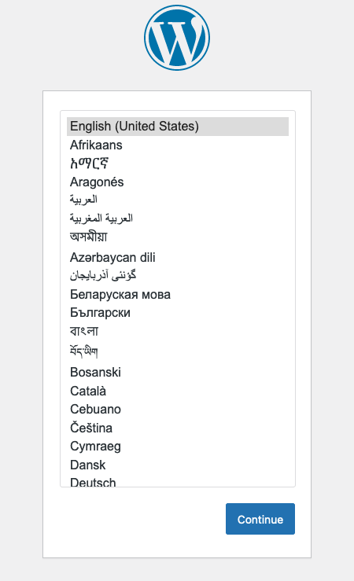

Kompose is a tool that makes it easier to convert Docker Compose files into Kubernetes resource deployments. You do the usual development with Docker Compose, then simply run Kompose to convert your work to a set of Kubernetes manifests. In this tutorial, learn more about Kompose, how to install it, and how to use it to build resources for your Kubernetes cluster.

## Before You Begin

1.  If you have not already done so, create a Linode account and Compute Instance. See our [Getting Started with Linode](/docs/products/platform/get-started/) and [Creating a Compute Instance](/docs/products/compute/compute-instances/guides/create/) guides.

1.  Follow our [Setting Up and Securing a Compute Instance](/docs/products/compute/compute-instances/guides/set-up-and-secure/) guide to update your system. You may also wish to set the timezone, configure your hostname, create a limited user account, and harden SSH access.

1.  Have an active Kubernetes cluster configured with `kubectl` or a similar tool. You can follow our [Linode Kubernetes Engine - Getting Started](/docs/products/compute/kubernetes/get-started/) guide to deploy an LKE cluster from the Linode Cloud Manager. The guide also includes steps for installing and configuring `kubectl` to manage the cluster.


This guide is written for a non-root user. Commands that require elevated privileges are prefixed with `sudo`. If you’re not familiar with the `sudo` command, see the [Users and Groups](/docs/guides/linux-users-and-groups/) guide.


## What Is Kompose?

[Kompose](https://kompose.io/) converts Docker Compose files to Kubernetes resources. It provides an easier and more accessible route for users familiar with Docker Compose to start working with Kubernetes resources.

Kompose works by reading a `docker-compose.yaml` file. It's able to parse out each part of the Compose deployment and create a corresponding Kubernetes YAML file. It outputs a set of Kubernetes resource definitions that are deployable to a Kubernetes cluster using `kubectl` or a similar tool.

## How to Install Kompose

Kompose has a straightforward installation process consisting of only a few steps.

1.  Download the Kompose binary. Replace the version (`v1.30.0`) in the command below with the latest version on the [Kompose releases page](https://github.com/kubernetes/kompose/releases) on GitHub.

    ```command
    curl -L https://github.com/kubernetes/kompose/releases/download/v1.30.0/kompose-linux-amd64 -o kompose
    ```

    If you are using macOS, replace `kompose-linux-amd64` in the command above with one of the following strings:

    - **Apple Silicon:** `kompose-darwin-arm64`
    - **Intel:** `kompose-darwin-amd64`

1.  Move the Kompose binary to a location on your shell path. Although optional, this step makes the Kompose binary significantly more convenient to access.

    ```command
    sudo chmod +x kompose
    sudo mv kompose /usr/local/bin/
    ```

1.  Verify that Kompose is installed and functioning:

    ``` command
    kompose version
    ```

    ```output
    1.30.0 (9d8dcb518)
    ```

## How to Convert Docker Compose to Kubernetes with Kompose

With Kompose installed, you can start converting Docker Compose files for use with Kubernetes deployments. The rest of this tutorial walks through a full example. It includes a simple Docker Compose file for running WordPress with a MariaDB backend. The example then shows how to convert that Docker Compose file into Kubernetes resource manifests using Kompose. The last step uses `kubectl` to deploy those resources to a Kubernetes cluster.

### Creating a Docker Compose YAML

Demonstrating Kompose requires an example Docker Compose setup. The best demonstration should use a Docker Compose that defines multiple interconnected containers, but one that also avoids being too complicated. WordPress provides a convenient example. It requires deployment of the WordPress image alongside a supported database, thus interconnection without too much configuration.

Below is a Docker Compose file for a basic WordPress instance backed by MariaDB. The model follows Docker's [official example](https://github.com/docker/awesome-compose/tree/master/official-documentation-samples/wordpress), which you can reference to learn more.

1.  Create and change into a project directory for the Docker Compose file. This directory later houses the Kubernetes manifests as well.

    ```command
    mkdir ~/wp-manifests/
    cd ~/wp-manifests/
    ```

1.  Create a `docker-compose.yaml` file within that directory:

    ```command
    nano docker-compose.yaml
    ```

1.  This file defines services for WordPress and its MariaDB database, as well as volumes for persisting the data needed by each service. Give it the contents shown here:

    ```file {title="docker-compose.yaml" lang="yaml"}
    version: '3'
    services:
      db:
        # Database version selected to work across CPU architectures
        image: mariadb:10.6.4-focal
        command: '--default-authentication-plugin=mysql_native_password'
        volumes:
          - db_data:/var/lib/mysql
        restart: always
        environment:
          - MYSQL_ROOT_PASSWORD=wpdbrootpass
          - MYSQL_DATABASE=wordpress
          - MYSQL_USER=wpdbuser
          - MYSQL_PASSWORD=wpdbpass
        expose:
          - 3306
          - 33060
      wordpress:
        image: wordpress:latest
        volumes:
          - wp_data:/var/www/html
        ports:
          - 80:80
        restart: always
        environment:
          # Points to the `db` service defined above
          - WORDPRESS_DB_HOST=db
          # Credentials must match the database credentials set above
          - WORDPRESS_DB_USER=wpdbuser
          - WORDPRESS_DB_PASSWORD=wpdbpass
          - WORDPRESS_DB_NAME=wordpress
    volumes:
      db_data:
      wp_data:
    ```

1.  When done, press <kbd>CTRL</kbd>+<kbd>X</kbd>, followed by <kbd>Y</kbd> then <kbd>Enter</kbd> to save the file and exit `nano`.

### Converting from Docker Compose to Kubernetes

Kompose can now be run with the `convert` command within the project directory. Kompose automatically finds and reads the `docker-compose.yaml` file within the current directory to create the necessary Kubernetes resources.

1.  Make sure you're still in the directory containing the `docker-compose.yaml` file, then run the Kompose conversion process:

    ```command
    kompose convert
    ```

    ```output
    INFO Kubernetes file "db-service.yaml" created
    INFO Kubernetes file "wordpress-service.yaml" created
    INFO Kubernetes file "db-deployment.yaml" created
    INFO Kubernetes file "db-data-persistentvolumeclaim.yaml" created
    INFO Kubernetes file "wordpress-deployment.yaml" created
    INFO Kubernetes file "wp-data-persistentvolumeclaim.yaml" created
    ```

    
    Alternatively, you can specify the location of the `docker-compose.yaml` file using the `-f` option with the command.

    ```command
    kompose convert -f /example/directory/tree/docker-compose.yaml
    ```
    

1.  Verify the Kubernetes manifests files output by the Kompose conversion process. The `-1` option lists the files vertically for easier reading.

    ```command
    ls -1
    ```

    ```output
    db-data-persistentvolumeclaim.yaml
    db-deployment.yaml
    db-service.yaml
    docker-compose.yaml
    wordpress-deployment.yaml
    wordpress-service.yaml
    wp-data-persistentvolumeclaim.yaml
    ```

### Deploying the Kubernetes Resource

You now have a set of Kubernetes manifests ready to deploy to a cluster. The steps below cover using `kubectl` to do that.

1.  Create a namespace for the WordPress deployment. While this is entirely optional, it makes it easier to review and manage the deployment later. If you choose not to complete this step, remove the `--namespace wordpress` option from the commands in the subsequent steps.

    ```command
    kubectl create namespace wordpress
    ```

1.  Move the `docker-compose.yaml` file out of the directory. The simplest way to deploy all of the manifests is by having `kubectl` deploy everything in the directory, and the `docker-compose.yaml` file might interfere with that.

    ```command
    mv docker-compose.yaml ../
    ```

1.  Deploy the resources to the Kubernetes cluster. You could provide a comma-separated list of the resource files output by Kompose with the `-f` option. However, since the directory is clear of any other files, use `.` to deploy all files.

    ```command
    kubectl apply -f . --namespace wordpress
    ```

    ```output
    persistentvolumeclaim/db-data created
    deployment.apps/db created
    service/db created
    deployment.apps/wordpress created
    service/wordpress created
    persistentvolumeclaim/wp-data created
    ```

1.  Verify successful deployment. It may take a short amount of time before the deployed pods show the `Running` status.

    ```command
    kubectl get pods --namespace wordpress
    ```

    ```output
    NAME                         READY   STATUS    RESTARTS   AGE
    db-84b85bb594-sbll2          1/1     Running   0          59s
    wordpress-785f8f7d4f-khqmd   1/1     Running   0          59s
    ```

### Viewing the Deployed Application

The resources have been deployed, meaning your Kubernetes cluster should be running a WordPress instance. Verify this by visiting the new WordPress site using the additional steps below.

1.  Open the required port in your system's firewall. The next step uses port `8080` to map the WordPress service to.

    
    
    Refer to our [How to Configure a Firewall with UFW](/docs/guides/configure-firewall-with-ufw/) guide, and use the following commands to open the HTTP port.

    ```command
    sudo ufw allow 8080/tcp
    sudo ufw reload
    ```
    
    
    Refer to our [Configure a Firewall with Firewalld](/docs/guides/introduction-to-firewalld-on-centos/) guide, and use the following commands to open the HTTP port:

    ```command
    sudo firewall-cmd --zone=public --add-port=8080/tcp --permanent
    sudo firewall-cmd --reload
    ```
    
    

1.  Initiate port forwarding from the WordPress service. This allows you to connect to the WordPress site using your current machine's single URL.

    ```command
    kubectl port-forward --address 0.0.0.0 svc/wordpress 8080:80 --namespace wordpress
    ```

1.  Open a web browser and navigate to port `8080` on your current machine's remote address. Typically, this is an IP address, so you would navigate to something like: `http://192.0.2.0:8080`.

    

## Conclusion

Kompose is a powerful tool. Whether you are a Docker Compose aficionado beginning with Kubernetes, or simply looking to use Docker Compose to streamline Kubernetes development, Kompose can help.

The links below are helpful resources for learning more about working with Kompose. Additionally, you may be interested in moving forward with more on Kubernetes and Docker Compose:

- Refer to our [Beginner's Guide to Kubernetes](/docs/guides/beginners-guide-to-kubernetes/) series to go deeper with Kubernetes, and see our [collection of Kubernetes guides](/docs/guides/kubernetes/) for a range of use cases to build on.

- Search our documentation for Docker Compose to see everything from getting started guides like [How to Use Docker Compose](/docs/guides/how-to-use-docker-compose/) to specific use cases like how to [Install a Mastodon Server](/docs/guides/install-mastodon-on-ubuntu-2004/).