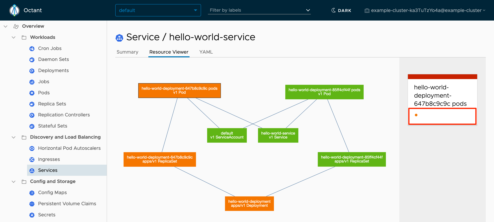

## What is Octant?

Octant is a web application that talks to your Kubernetes clusters and provides an easy-to-read dashboard for the objects in your clusters. A marquee feature of Octant is its ability to show your objects and their relations in a graph format:

Octant aims to be developer-centric. It is designed to help application developers (who may not be familiar with Kubernetes) better understand how their applications are deployed and troubleshoot issues when they arise.

### In This Guide

This guide will explore a few ways to use Octant with some example software deployments:

- You'll see how to [navigate Octant's main interfaces](#navigating-the-interface) after a Helm chart has been installed on a cluster.

- A [troubleshooting thought experiment](#troubleshooting-with-octant) will show how Octant can make discovering issues in your cluster easier.


This guide assumes familiarity with the Kubernetes concepts outlined in Linode's [Beginner's Guide to Kubernetes](/docs/kubernetes/beginners-guide-to-kubernetes). If you have never set up a Kubernetes cluster before, it's also recommended that you do so to get the most out of this guide. The [How to Deploy Kubernetes on Linode with the k8s-alpha CLI](/docs/guides/how-to-deploy-kubernetes-on-linode-with-k8s-alpha-cli/) guide describes a one-line command for generating a cluster.


## Before you Begin

The examples in this guide have been tested on a cluster running with Linode with Linode's [CCM](/docs/kubernetes/kubernetes-reference/#linode-cloud-controller-manager) and [CSI](/docs/kubernetes/kubernetes-reference/#container-storage-interface) plugins installed. If you would like to install these examples as well, a cluster made with [k8s-alpha CLI](/docs/guides/how-to-deploy-kubernetes-on-linode-with-k8s-alpha-cli/) will meet these criteria.


These examples will create billable services. To stop billing for these services after reading the guide, be sure to read the tear-down instructions at the end of each section. If you created a new cluster for this guide, you can remove the cluster's Nodes from the [Linode Cloud Manager](https://cloud.linode.com).

If you remove the resources afterward, you will only be billed for the hour(s) that the resources were present on your account. Consult the [Billing and Payments](/docs/guides/understanding-billing-and-payments/) guide for detailed information about how hourly billing works. [Linode's pricing page](https://www.linode.com/pricing/) lists the rate for each Linode service.


## Installing Octant

Octant does not run in your cluster. Instead, it connects to your cluster remotely and observes activity within the cluster. It also does not require special privileges to run--Octant will use the same context information that you use for kubectl. This also means that users with restricted access to a cluster can run Octant; Octant will just display the objects that are visible to that user.

Octant can be run as a local server process on your workstation. To install and run it:

1. Install from a package available on your operating system:

    - **Linux**: download a `.deb` or `.rpm` from the [releases page](https://github.com/vmware-tanzu/octant/releases) on GitHub, then install it with `dpkg -i` or `rpm -i`. For example:

            wget https://github.com/vmware-tanzu/octant/releases/download/v0.9.1/octant_0.9.1_Linux-64bit.deb
            dpkg -i octant_0.9.1_Linux-64bit.deb

    - **macOS**, with Homebrew:

            brew install octant

    - **Windows**, with Chocolatey:

            choco install octant

    
Alternative installation instructions are available in the project's [README](https://github.com/vmware-tanzu/octant#installation) on GitHub.


1. Then, start the server. In your terminal, run:

        octant

1. If it starts successfully, you should see a message similar to:

    
...

Dashboard is available at http://127.0.0.1:7777


    
If it does not start successfully, check that you can connect to your cluster with kubectl. For example, try running:

    kubectl get pods


1. The dashboard may load automatically in your browser, or you can load the dashboard address (e.g. `http://127.0.0.1:7777`) in your browser if it does not. You should see the Octant dashboard.

## Navigating the Interface

The interfaces that Octant provides are meant to be a complement, and not a replacement, for kubectl. When using Octant, you may find that you sometimes need to return to kubectl to perform certain actions. Still, the Octant dashboard will serve as a helpful overview when inspecting your cluster.


The cluster objects visible in the following screenshots were created by installing the [Helm chart](https://github.com/helm/charts/tree/master/stable/ghost) for the [Ghost](https://ghost.org) blogging software. The [How to Install Apps on Kubernetes with Helm 2](/docs/guides/how-to-install-apps-on-kubernetes-with-helm-2/) guide outlines how to install this software. Please note that this guide uses Helm 2 and not Helm 3 to install the software.


- When first viewing the dashboard, a list of all of your cluster objects will be shown:

    

    The left navigation will display a hierarchy of the objects that can be viewed, and the right column will display your objects. In the right corner of the top navigation, you can quickly switch between your workstation's cluster contexts. The top navigation also allows you to change between cluster namespaces, and to filter your objects by label.

- Consider the Services item in the left navigation. When clicked on, only your Services will appear in a table to the right:

    

- Important attributes of your Services will be listed in the columns of this table. In particular, the labels are buttons which can be clicked on:

    

    If you click on the **release:my-blog** button, all Services without this label will be hidden:

    

    This view shows that the Ghost Helm chart set up two Services: one for the Ghost front-end, and one for its database.

    
Multiple labels can be selected at the same time.


- This filter will persist across all other views. For example, if you navigate to the Pods view, only Pods with the `release:my-blog` label will be shown. To clear your filters, click the **clear filters** link under the filter dropdown in the top navigation:

    

### Inspecting an Object

Clicking on an object will show more detail for that object, including the visual graph view for that object's relationships.

- For example, the detail view for the Ghost front-end service shows a summary with **Configuration**, **Status**, **Metadata**, **Endpoints**, and **Events** panels:

    

    - The **Configuration** panel makes it easy to see which selector the Service uses to identify your Pods. This can also be directly edited (via the **Edit** link in the panel). Octant's development roadmap includes adding more direct-editing features like this.

    - The **Status** panel shows the external IP address for the Service, because it was implemented with type `LoadBalancer`. If you view this IP in your browser, you will see the Ghost blog.

    - The **Endpoints** tab shows the Service's Pods.

    - The **Events** tab shows the history of events for the Service. This information can be useful when troubleshooting.

    
Other panels will appear for different object types. For example, Pods will show container environment variables, Volume mounts, node resources requests and limits, and taints, among other information.


- The **Resource Viewer** tab will reveal the object relationship graph for this Service:

    

    This view will display color-coded cells for each object, indicating the object's status. The presence or absence of objects in this graph can be helpful when troubleshooting.  For example, if a Service's graph does not show connections to a Pod, then the Service may not be configured to use the right Pod selector.

- The third **YAML** tab shows the YAML representation for the object.

    
The detail view for Pods will also show a fourth **Logs** tab,which will follow and display the logs for a Pod in real-time:



### Navigation Example Tear-Down

To delete the objects created by the Helm chart used in this section, run:

    helm delete <release-name>

The Helm release name for can be determined by running:

    helm ls

## Troubleshooting with Octant

To get a better sense of how Octant can assist with troubleshooting software deployments on Kubernetes, consider this scenario:

Your colleague Nathan is learning Kubernetes, and he's deploying a "Hello World" Node.js application as a way of testing his knowledge. You offer to install the application on your cluster to follow along with his work.

### Install the Node.js Application

1. Nathan has uploaded a Docker image for the application to Docker Hub under the name `linodedocs/kubernetes_using-octant-with-kubernetes-a-tutorial_hello-world:v1`. He also tells you that the Kubernetes manifest for the application is hosted here: [release-1.0.yaml](release-1.0.yaml). Download the file and apply it to your cluster with kubectl:

        kubectl apply -f release-1.0.yaml

    Your terminal should respond with:

    
service/hello-world-service created
deployment.apps/hello-world-deployment created


    
The Dockerfile and other files used to create the Docker Hub image are located [here](hello-world-node-js-1.tar.gz). Inspecting these files is not necessary for the tutorial.


1. To learn about how the application is structured on your cluster, you view it in Octant. When visiting the Services tab, you find the new `hello-world-service` object:

    

1. The external IP address for the Service will also be shown in the new table entry (highlighted above). Visiting this address in your browser will return the "Hello World" message as expected.

1. If you click on the `hello-world-service` Service and then navigate to the **Resource Viewer** tab, the relationships for it will be shown. If you click on the Pods cell, a right-hand navigation will appear. The panel in this navigation will show three green dots:

    

    The three green dots indicate that three Pods were created that match the selector for the Service. Clicking on each will navigate to that Pod's detail view.

### Update the Node.js Application

1. Nathan tells you that he has updated the application to return "Hello Octant" instead of "Hello World", and he notes that the new Docker Hub image is named `linodedocs/kubernetes_using-octant-with-kubernetes-a-tutorial_hello-world:v2`. The new Kubernetes manifest is here: [release-2.0.yaml](release-2.0.yaml). Download the manifest and apply it to your cluster with kubectl:

        kubectl apply -f release-2.0.yaml

    Your terminal should respond with:

    
service/hello-world-service unchanged
deployment.apps/hello-world-deployment configured


    
The Dockerfile and other files used to create the Docker Hub image are located [here](hello-world-node-js-2.tar.gz). Inspecting these files is not necessary for the tutorial.


1. If you visit the external IP for the application in your browser again, it will still display the same "Hello World" message. If you return to the Resource Viewer graph for the `hello-world-service` Service in Octant, you'll see that it has been updated:

    

1. The Deployment has created a new ReplicaSet to run the updated application under. The orange color for the Deployment, ReplicaSet, and Pods indicates an issue with the update that will need further investigating.

    
The Deployment keeps the older ReplicaSet and Pods running in place until the new ReplicaSet is healthy.


1. To investigate why the new Pod is unhealthy, click on the orange Pod cell in the graph, and then click on the orange dot in the right-hand panel that appears (highlighted above).

1. The detail view for the Pod will appear. Scroll down to the **Events** table at the bottom. A `Failed to pull image "linodedocs/kubernetes_using-octant-with-kubernetes-a-tutorial_hello-world:v2a"` message should appear in the table:

    

1. The name for the Pod's image has a typo and should be corrected. On your workstation, open the release-2.0.yaml manifest and update **line 32** so that it refers to `linodedocs/kubernetes_using-octant-with-kubernetes-a-tutorial_hello-world:v2` instead of `linodedocs/kubernetes_using-octant-with-kubernetes-a-tutorial_hello-world:v2a`. Save the file, then apply the change to your cluster:

        kubectl apply -f release-2.0.yaml

1. If you visit the external IP for the application in your browser again, it will still display the same "Hello World" message. If you return to the Resource Viewer graph for the `hello-world-service` Service in Octant, you'll see that it has been updated again:

    

1. The new Pod is no longer colored orange, but the ReplicaSet still is, indicating that other problems also need to be fixed. Click on the orange ReplicaSet cell in the graph, and then click on the title of the right-hand panel that appears (highlighted above).

1. The detail view for the ReplicaSet will appear. The Pods panel on this page will show that the Pod has restarted several times:

    

1. Clicking on the Pod's name in this panel will take you to the detail view for it. This **Events** panel in this view will show the recent restarts. A good next step would be to investigate the logs for the Pod, but you may find that the **Logs** tab shows no content. In this case, it's worth switching out to kubectl to try and get logs from previous restarts:

        kubectl logs hello-world-deployment-7b69c98754-f4zk5 --previous=true

    
Replace the Pod name above with the name of yours.


    
/usr/src/app/server.js:7
  res.send('Hello Octant);
           ^^^^^^^^^^^^^^^

SyntaxError: Invalid or unexpected token
    at Module._compile (internal/modules/cjs/loader.js:723:23)
    at Object.Module._extensions..js (internal/modules/cjs/loader.js:789:10)
    at Module.load (internal/modules/cjs/loader.js:653:32)
    at tryModuleLoad (internal/modules/cjs/loader.js:593:12)
    at Function.Module._load (internal/modules/cjs/loader.js:585:3)
    at Function.Module.runMain (internal/modules/cjs/loader.js:831:12)
    at startup (internal/bootstrap/node.js:283:19)
    at bootstrapNodeJSCore (internal/bootstrap/node.js:623:3)


1. Nathan's code contains the missing quote syntax error reported in these logs, and you let him know what should be fixed. He responds that he's uploaded a `linodedocs/kubernetes_using-octant-with-kubernetes-a-tutorial_hello-world:v3` image to Docker Hub and tells you to apply his updated manifest here: [release-3.0.yaml](release-3.0.yaml). Download the file and apply it to your cluster with kubectl:

        kubectl apply -f release-3.0.yaml

    
The Dockerfile and other files used to create the Docker Hub image are located [here](hello-world-node-js-3.tar.gz). Inspecting these files is not necessary for the tutorial.


1. If you return to the external IP for the application in your browser, it should now display "Hello Octant". The cells in Octant's Resource Viewer graph should all be colored green as well.

### Troubleshooting Example Tear-Down

To delete the objects created by the troubleshooting example, run:

    kubectl delete -f release-3.0.yaml

## Next Steps

Octant also provides a robust plugin functionality. Plugins help Octant track cluster resources that are not part of Octant's core codebase, and Octant can show content from a plugin in-line in your dashboard alongside other standard interface elements. Review [Octant's documentation](https://octant.dev/docs/master/plugins/) for more information on plugins.