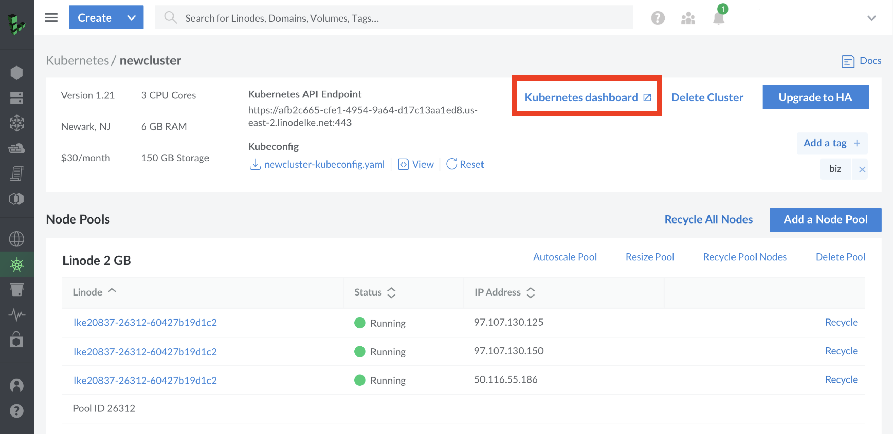
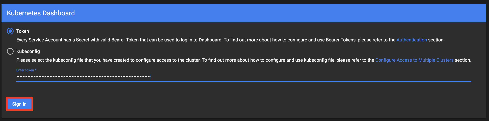
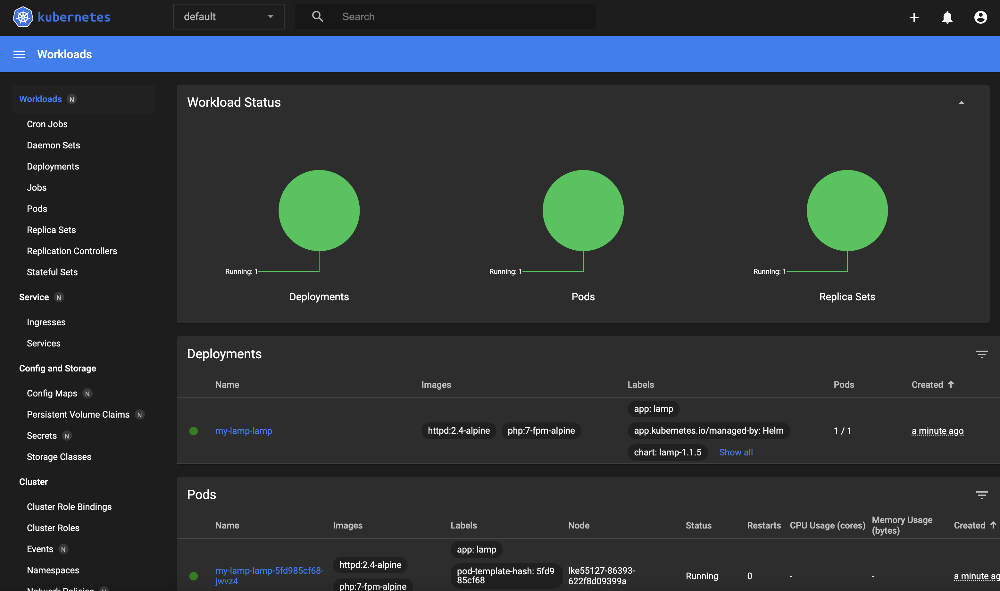
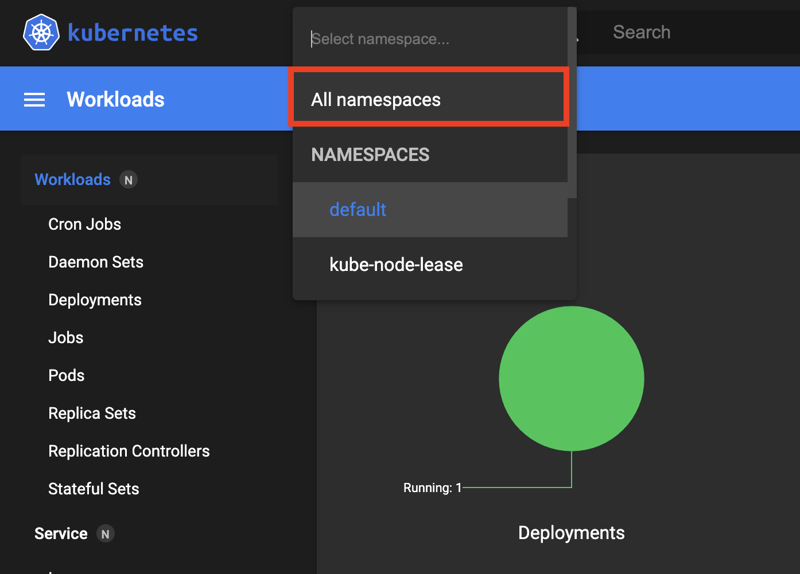
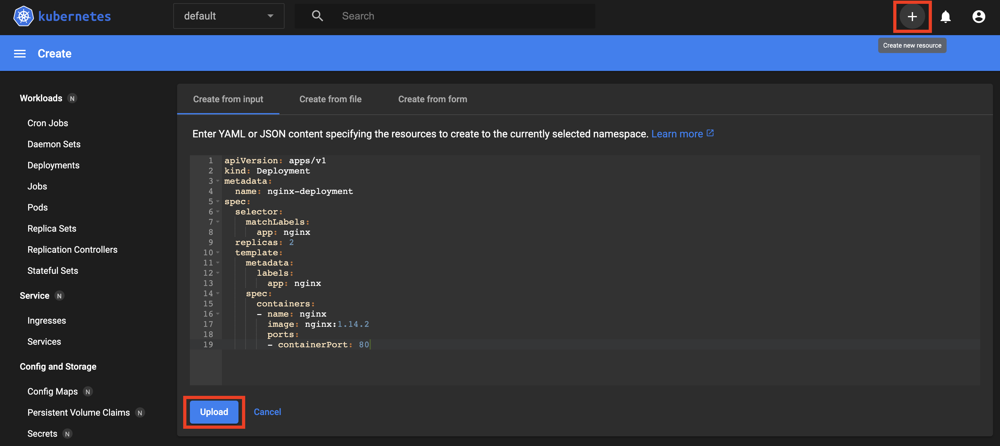

The [Kubernetes Dashboard](https://github.com/kubernetes/dashboard) is an industry standard open-source web-based user interface designed to be a visual hub for interacting with a Kubernetes cluster, allowing for a more intuitive interface for observing cluster objects, components, containers, applications, and more.
While providing an easy way to monitor a Kubernetes cluster and perform health checks, the Kubernetes dashboard additionally provides a means to perform administration tasks, similarly to how one would perform administration through the command line tool [kubectl](/docs/guides/beginners-guide-to-kubernetes-part-1-introduction/#kubectl).

The Linode Kubernetes Engine currently installs the Kubernetes Dashboard by default, and can be accessed through the [Kubernetes Dashboard Link](#accessing-the-cluster-dashboard) found for each cluster in the Linode Cloud Manager.

## In This Guide

This guide will be a step-by-step introduction to accessing the Kubernetes Dashboard on LKE through the unique link found in the Cloud Manager or the Linode API. Additionally information will provide basic insight into navigating the Kubernetes Dashboard, as well as provide an example for creating and editing resources directly through the dashboard.

## Accessing the Cluster Dashboard

The Cluster Dashboard can be found at the top of the Cluster's [details page](/docs/guides/deploy-and-manage-a-cluster-with-linode-kubernetes-engine-a-tutorial/#access-your-clusters-details-page). The steps for reaching the dashboard from the Cloud Manager are as follows:

1. Click the Kubernetes link in the Cloud Manager sidebar menu. The Kubernetes listing page appears and you see all of your clusters listed.

1. Select the cluster that you would like to reach the Kubernetes Dashboard for. The Kubernetes cluster’s details page appears.

1. Select the **Kubernetes Dashboard** option at the top of the page to open the link to your Kubernetes Dashboard.

   

1. Once the link has been selected, you will see a login prompt with the option to enter either a Secret valid Bearer **Token**, or a **Kubeconfig** file to authenticate.

   In any [default Kubeconfig file provided for access to LKE clusters](/docs/guides/deploy-and-manage-a-cluster-with-linode-kubernetes-engine-a-tutorial/#access-and-download-your-kubeconfig) an administrative user token can be found within the file itself, and entered in the `Enter token*` field to authenticate via a token.

   If you prefer to authenticate using a Kubeconfig file, the file can be entered by selecting the `Kubeconfig` option, the `Choose Kubeconfig file` field, and entering the file by using the file explorer menu that appears.

1. After a token or Kubeconfig file has been entered, select the **Sign in** button to access the dashboard.

## Navigating the Cluster Dashboard

Once logged into the Cluster dashboard, **Workloads** for the `default` namespace will appear. This page will include information on all [Workloads](https://kubernetes.io/docs/concepts/workloads/) as defined by Kubernetes, and provide a number of options to navigate the dashboard further.

### Selecting a Namespace

All namespaces the logged in user has access to are listed and selected from the top left of the page using the dropdown menu. Users who prefer not using a set namespace that would instead like to use every namespace at once can select the `All Namespaces` option. The active namespace can be changed at any time.

### Navigating Objects and Components

Towards the left of the page is a sidebar menu that includes access to similar categories for all other available objects and components, largely as defined by Kubernetes.

- [Workloads](https://kubernetes.io/docs/concepts/workloads/): Contains information on applications running on Kubernetes Pods, as well as the [controllers](https://kubernetes.io/docs/concepts/workloads/controllers/) that help to most directly manage them.
- [Service](https://kubernetes.io/docs/concepts/services-networking/): Contains information related to application networking on Kubernetes, primarily in the form of [Services](https://kubernetes.io/docs/concepts/services-networking/service/) and [Ingresses](https://kubernetes.io/docs/concepts/services-networking/ingress/).
- [Configuration](https://kubernetes.io/docs/concepts/configuration/configmap/) and [Storage](https://kubernetes.io/docs/concepts/storage/): This section includes information related to [ConfigMaps](https://kubernetes.io/docs/concepts/configuration/configmap/), stored Kubernetes [Secrets](https://kubernetes.io/docs/concepts/configuration/secret/), [Storage Classes](https://kubernetes.io/docs/concepts/storage/storage-classes/), and [Persistent Volume Claims](https://kubernetes.io/docs/concepts/storage/persistent-volumes/).
- **Cluster**: A more administrator focused look at the Kubernetes cluster, the cluster category contains configuration details related to [RBAC](https://kubernetes.io/docs/reference/access-authn-authz/rbac/), [Nodes](https://kubernetes.io/docs/concepts/architecture/nodes/), [Persistent Volumes](https://kubernetes.io/docs/concepts/storage/persistent-volumes/), [Network Policies](https://kubernetes.io/docs/concepts/services-networking/network-policies/), and [Service Accounts](https://kubernetes.io/docs/tasks/configure-pod-container/configure-service-account/).

By selecting categories and sub-categories within the sidebar menu, users can inspect the Kubernetes configuration similarly in most cases to using the `kubectl get` command. Selecting the `Pods` sub-category under the `Workloads` primary category, will show a table of all running pods by `name`, `namespace`, the `images` they're relying on, `Labels` applied, the hardware `node` or nodes they're currently active on, the current status, the `Date` the Pod was created, and any `restarts`. Individual Pods can then be selected further to see additional details as if entering the `kubectl describe` command against a single individual Pod. This same general ruleset applies to all forms of navigation when using the Kubernetes dashboard, though the equivalent `kubectl` command applied will vary depending on the resource being accessed.

### Creating Resources

The Kubernetes dashboard additionally allows for the creation of resources directly. This can be completed at any time by selecting the `plus` icon at the top right of the page. Once completed, users can input YAML or JSON formatted configuration content directly, upload a YAML or JSON file, or create a resource by filling out a form. Once completed, the resource can be created by selecting the `upload` or `deploy` option. This is similar to the `kubectl create` command when working with Kubernetes over the command line.

### Editing a Resource

After inspecting an object or resource in the highest level of detail, the pencil icon will appear at the top of the page if any edits can be made. Once the pencil icon has been selected, the configuration of the resource can be viewed in both `YAML` or `JSON` format, and edited as needed. Once all edits are made, the `Update` button can be selected to edit the resource as if using the `kubectl apply -f` command.

## Limitations

While the Kubernetes Dashboard is fully featured in all other regards, the CPU and Memory graphs and analytics provided in part by[metrics-server](https://github.com/kubernetes-sigs/metrics-server) on some Kubernetes Dashboard installations are not included.

As the LKE provided version of the Kubernetes dashboard is hosted and configured separately from cluster nodes, if users need access to CPU and Memory graphs, a separate Kubernetes dashboard installation including `metrics-server` must be performed, hosted directly on the cluster nodes themselves and configured for external access.
