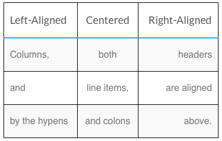

## Write Guides for Linode

This guide provides templates and guidelines to use when creating or updating a guide for [Linode Docs](/docs/).

Updates, improvements, and bug fixes to Linode documentation are always welcome through [GitHub](https://github.com/linode/docs) via pull requests (PRs) or issues.

Through our Write For Linode program, authors can contribute new guides and be paid for their work. We ask that interested authors apply to the program with one or more writing samples so that we can evaluate your work. To learn more about the program and to complete an application, please visit our Write For Linode [program page](https://www.linode.com/lp/write-for-linode/).

## General Layout

Linode Guides & Tutorials are written in [Markdown](https://en.wikipedia.org/wiki/Markdown). Our documentation site uses [Hugo](https://gohugo.io), a static site generator. Hugo-specific Markdown formatting notes are given [further below](#markdown-formatting).

### Header

Linode Guides & Tutorials store metadata and other information in a [YAML](http://yaml.org/) header at the top of every page. Use the template below for your own guide.


---
author:
  name: Linode Community
  email: docs@linode.com
description: 'Two to three sentences describing the purpose of the guide.'
keywords: ["list", "of", "keywords", "and key phrases"]
license: '[CC BY-ND 4.0](https://creativecommons.org/licenses/by-nd/4.0)'
published: 2017-11-29
modified_by:
  name: Linode
title: 'Guide Title'
contributor:
  name: Your Name
  link: Github/Twitter/LinkedIn URL
external_resources:
  - '[Link Title 1](http://www.example.com)'
  - '[Link Title 2](http://www.example.net)'
---



If you're updating an existing guide in our repository, you may also notice a `deprecated` field in the header. This defaults to false, and setting it to *true* inserts a pre-written message near the beginning stating that the guide is no longer maintained. Typically, this will be used on guides specific to applications or distributions that have reached End of Life (EOL).

### Introduction

Introductions should be concise; explain what the goal of the guide is and why. If you're introducing new software to the system, include a brief description and link to its official website whenever possible.

### Before You Begin

The *Before You Begin* section is an area for basic prerequisites a reader should know or have completed before proceeding further in your guide. Use the example below and edit as needed:


## Before You Begin

1.  If you have not already done so, create a Linode account and Compute Instance. See our [Getting Started with Linode](/docs/guides/getting-started/) and [Creating a Compute Instance](/docs/guides/creating-a-compute-instance/) guides.

1.  Follow our [Setting Up and Securing a Compute Instance](/docs/guides/set-up-and-secure/) guide to update your system. You may also wish to set the timezone, configure your hostname, create a limited user account, and harden SSH access.


### Describe Example Variables

If using example variables which should be changed throughout the guide, declare them in the Before You Begin section.

Variables that the reader will need to change for their system or preference should be formatted using backticks. This includes:

* [Example IPs](#example-ip-addresses)
* User names
* Passwords
* Port Numbers

Do not include any brackets or parentheses when using these temporary values in examples, as the reader may include them in their final version.

| Formatting | Example |
|:--------------|:------------|
| Change the \`password\` and \`username\` values. | Change the `password` and `username` values. |

### Include a Note about Root or Non-Root users



This guide is written for a non-root user. Commands that require elevated privileges are prefixed with `sudo`. If you’re not familiar with the `sudo` command, see the [Users and Groups](/docs/guides/linux-users-and-groups/) guide.






The steps in this guide require root privileges. Be sure to run the steps below as `root` or with the `sudo` prefix. For more information on privileges, see our [Users and Groups](/docs/guides/linux-users-and-groups/) guide.



## Paragraph Structure

Guides should be split into cohesive sections which flow from one sequence of events to the next. Each section title should be styled with an *H2* heading element, and each subsection with an *H3* heading so that scanning the *In This Guide* left sidebar should give the reader an overview of what will be done in the guide. Capitalize each noun, adjective, verb and adverb in the article title, H2 and H3 headers.

Each **subsection** should be split into numbered steps as shown below.

For example:


## Using MySQL

1.  Log in to MySQL as the root user:
        mysql -u root -p

2.  When prompted, enter the root password.

### Create a New MySQL User and Database

1.  In the example below, `testdb` is the name of the database, `testuser` is the user, and `password` is the user’s password.

        create database testdb;
        grant all on testdb.* to 'testuser' identified by 'password';

2.  Exit MySQL.

        exit

### Create a Sample Table

1.  Log back in as `testuser`:

        mysql -u testuser -p



The tab size is set to four, and **only** soft tabs should be used. This can be configured in the settings of most text editors.


## How to Use Markdown Formatting for Linode Style

### Abbreviations and Acronyms

Upon first mention of a new concept or software, use the full name or term, then note the abbreviation or acronym in parenthesis beside it. The abbreviation/acronym can then be used in the article from that point. For example: Lightweight Resource/Provider (LWRP).

Introduce new terms in italics with a `*` on either side of the term:

    In this guide, we'll install Git, a *version control system*.

### Bold and Italics

Use a **Bold** font weight for buttons, menu selections and anything that requires emphasis or that you want to stand out to the reader. *Italicize* new terms and concepts the first time they are used.

| Formatting | Example |
|:--------------|:------------|
| \*\*bold\*\* | **bold** |
| \*italics\* | *italics* |

### Commands

Commands that are not inline with paragraph text should be indented four spaces from the beginning of the copy.

For example:

    Update your system:

        yum update

> Update your system:
>
>     yum update

Inline commands should be denoted by backticks.

| Formatting | Example |
|:--------------|:------------|
| Update your system by running \`yum update\`. | Update your system by running `yum update`. |

### Example IP Addresses

Example IPs should use the documentation address blocks given in [IETF RFC 5737](https://tools.ietf.org/html/rfc5737). These are:

* 192.0.2.0/24
* 198.51.100.0/24
* 203.0.113.0/24

### External Resources/More Information

If you wish to provide links to external sites for the user to review after going through your guide, do so using the *external_resources* field in the [page header](#header). This will automatically appear as a text block with links at the bottom of the page.

> More Information
>
> You may wish to consult the following resources for additional information on this topic. While these are provided in the hope that they will be useful, please note that we cannot vouch for the accuracy or timeliness of externally hosted materials.
>
> - [Link Title 1](http://www.example.com)
> - [Link Title 2](http://www.example.net)

### Extend Markdown Using Shortguides

Using shortcodes, it is possible to extend a Markdown file with another. For common tasks such as basic software installation, consider using the `content` shortcode. This allows our library to maintain consistent and up to date installation instructions for frequently used tools such as Python, MySQL, and Docker.

Markdown files intended to be inserted into multiple guides are called shortguides. To create a shortguide, create a directory with the name of your shortguide anywhere within `docs/`, and then create an index.md within the directory for your content (e.g. `example-shortguide-name/index.md`).

Inserting `headless: true` in the front matter will hide the guide from the site navigation as well as the search index.

When using the `content` shortcode in a guide to embed a shortguide, the shortcode will take the name of your guide's directory (e.g. `example-shortguide-name`) as a parameter. A shortguide can be within a different part of the `docs` hierarchy from the guide that embeds it, so the guide directory name exists within a global namespace of all shortguides in the repository. In other words, two different shortguides can't use the same directory name.

To use an image in a shortguide, add the image to your shortguide's directory and then use the `image` shortcode to embed it:





#### Example Usage

The following shortguide describes how to install Python via Miniconda. Create a directory named `install_python_miniconda` and filed named `index.md` within it:


---
author:
  name: Linode
  email: docs@linode.com
description: 'A shortguide that shows how to install Python via Miniconda.'
keywords: []
license: '[CC BY-ND 4.0](https://creativecommons.org/licenses/by-nd/4.0)'
published: 2018-08-23
modified_by:
  name: Linode
title: "Install Python with Miniconda"
headless: true
show_on_rss_feed: false
---

<!-- Installation instructions for Python 3. -->

1.  Download and install Miniconda:

        curl -OL https://repo.continuum.io/miniconda/Miniconda3-latest-Linux-x86_64.sh
        bash Miniconda3-latest-Linux-x86.64.sh

2.  You will be prompted several times during the installation process. Review the terms and conditions and select "yes" for each prompt.

3.  Check your Python version:

        python --version


To use this shortguide in another guide, use the following syntax:





#### Hide Content Through Buttons

Adding `os: ["mac", "linux", "windows"]` to the front matter inserts a jQuery script that will hide and display content shortcodes.

The shortcode should contain two parameters: filepath and operating system.

For example, `` will insert a Markdown snippet that will only be visible when the Mac button is in the active state.

### Files and File Excerpts

Use the *file* shortcode to add the entire contents of a file to a guide. If only quoting a portion of the file, use the *file excerpt* shortcode. Exceptionally long files should be shown in parts and have the whole file linked, if needed.
For each file or file excerpt, a code language or syntax should be defined in the shortcode tag to set how the text is displayed. A list of supported languages can be found [on GitHub](https://github.com/alecthomas/chroma).

**Example**: File shortcode

    
        

            Sample file text
        

    



    Sample file text



**Example**: File Excerpt shortcode

    
    def some_function():
        print("This is a function.")
    


def some_function():
    print("This is a function.")


### File Paths and File Names

Inline file paths and file names should be unformatted text.

| Formatting | Example |
|:--------------|:------------|
| Navigate to \`/var/www/html\`. | Navigate to `/var/www/html`. |

### Headings

| Formatting | Example |
|:--------------------------|:----------------------------------------------|
| \#\# Section title (h2) | Section title (h2) |
| \#\#\# Subsection (h3)   | Subsection (h3) |

### Images

Images should be in *.png* or *.jpg* format. If an image is over 650 pixels wide, include both the original and one which is scaled down to 650 px. Image filenames cannot contain spaces and should use hyphens (-) to separate words instead of underscores (\_).

When adding an image, ensure that all identifying attributes such as names and IP addresses are removed, obfuscated, or replaced with dummy text, such as **example_user** or **192.0.2.0**. Be mindful of metadata in images taken with mobile devices.

| Up to 650 px wide. | Over 650 px wide. |
|:--------------------------|:----------------------------------------------|
| \!\[Description of the image\](filename.png "Description of the image.") | \[!\[Description of the image\](filename_small.png "Description of the image.")](filename.png) |

### Key Combinations

When instructing a reader to use a combination of keys, format the key combination in bold.

| Formatting | Example |
|:--------------|:------------|
| Press \*\*CTRL+N\*\* then \*\*X\*\* to exit the program.  | Press **CTRL+N** then **X** to exit the program. |

### Links

Internal links to other Linode guides should be relative, starting at `/docs/`, and external links should be formatted as shown below and use HTTPS URLs whenever possible.

| Internal | External |
|:--------------------------|:----------------------------------------------|
| \[Getting Started\](/docs/getting-started) | \[Apache HTTP Server Documentation\](https://httpd.apache.org/docs/)

### Lists

Be sure that lists have the proper horizontal spacing. This should be *two* spaces for ordered lists and *three* for unordered. This is to keep the lists aligned properly with the four-space soft tabs used in the guides.

| Ordered |  Unordered |
|:--------------------------|:----------------------------------------------|
| 1.&nbsp;&nbsp;Step 1.  2.&nbsp;&nbsp;Step 2.  3.&nbsp;&nbsp;Step 3. | \*&nbsp;&nbsp;&nbsp;Item 1.  \*&nbsp;&nbsp;&nbsp;Item 2.  \*&nbsp;&nbsp;&nbsp;Item 3. |

### Notes and Cautions

Notes should be important text that does not necessarily fit the narrative of the preceding step or paragraph. If a step in your guide can cause any major issues with the user's Linode or computer, a caution note should be included.

    
    This is a sample note.
    


This is a sample note.


    
    This is a sample caution.
    


This is a sample caution.


### Numerical Values

| 1-10 | Greater than 10 |
|:--------------|:------------|
| Use words (one, two, three, etc.)  | Use numerical digits (11, 22, 33). |

### Sentence Spacing

Use single spaces between sentences; do not double-space.

### Tables

<table class="table table-striped table-bordered">
  <thead><th>Formatting</th><th>Example</th></thead>
  <tr>
    <td>
 
| Left-Aligned | Centered     | Right-Aligned |
 
| ---------------- |:-------------:| -----------------:|
 
| Columns,&nbsp;&nbsp;&nbsp;&nbsp; | both&nbsp;&nbsp;&nbsp;&nbsp;&nbsp;&nbsp;&nbsp;&nbsp;&nbsp;&nbsp;| headers &nbsp;&nbsp;&nbsp;&nbsp;&nbsp;&nbsp;&nbsp;|
 
| and &nbsp;&nbsp;&nbsp;&nbsp;&nbsp;&nbsp;&nbsp;&nbsp;&nbsp;&nbsp;&nbsp;&nbsp; | line items, | are aligned &nbsp;&nbsp;|
 
| by the hyphens | and colons | above. &nbsp;&nbsp;&nbsp; |
    </td>
    <td>
    
    </td>
  </tr>
</table>

List definitions in a table with the definition-table shortcode:

&#123;&#123;&lt; definition-table &gt;&#125;&#125; 
Put your table data here. 
&#123;&#123;&lt; /definition-table &gt;&#125;&#125;

The definition-table shortcode was not ported over to the new UI and was only used here. Remove this section?

| Parameter | Data type/Status | Usage |
| --------- | -------- | ------|
| `access_token` | string, *required* | Your Linode API v4 access token. The token should have permission to read and write Linodes. The token can also be specified by exposing the `LINODE_ACCESS_TOKEN` environment variable. |
| `authorized_keys` | list | A list of SSH public keys or SSH public key file locations on your local system, for example, `['averylongstring','~/.ssh/id_rsa.pub']`. The public key will be stored in the `/root/.ssh/authorized_keys` file on your Linode. Ansible will use the public key to SSH into your Linodes as the root user and execute your Playbooks.|
| `label` | string, *required* | The Linode instance label. The label is used by the module as the main determiner for idempotence and must be a unique value.   Linode labels have the following constraints:   <ul><li>Must start with an alpha character.</li><li>May only consist of alphanumeric characters, dashes (-), underscores (_) or periods (.).</li><li>Cannot have two dashes (--), underscores (__) or periods (..) in a row.</li></ul>|


## Legal Information

COPYRIGHT OWNERSHIP. Writer agrees that the Work is being created by the writer for the Linode Guides & Tutorials repository and that each form of Work is being created by the writer as a “work made for hire” under the United States Copyright Act and, at all stages of development, the Work shall be and remain the sole and exclusive property of Linode. At Linode's sole, absolute and unfettered discretion, Linode may make any alterations to the Work.

CREDIT. Nothing contained in this Agreement shall be deeded to require Linode to use the Work, or any part thereof, in connection with Linode Guides & Tutorials or otherwise. Credit for the Work shall read, "Contributed by [writer's name]."

PAYMENT. Upon publication of a submission to the Linode Guides & Tutorials Repository, the writer will be paid the sum agreed to by email by both Linode and the author. Author may choose payment either in the form of a credit to their Linode account, a hardcopy check, or as an electronic payment via PayPal.
