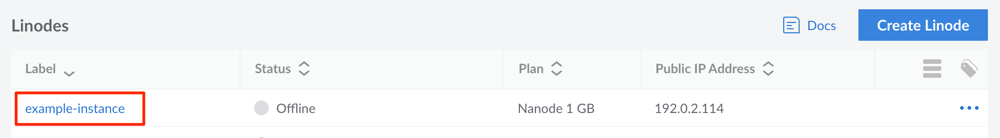
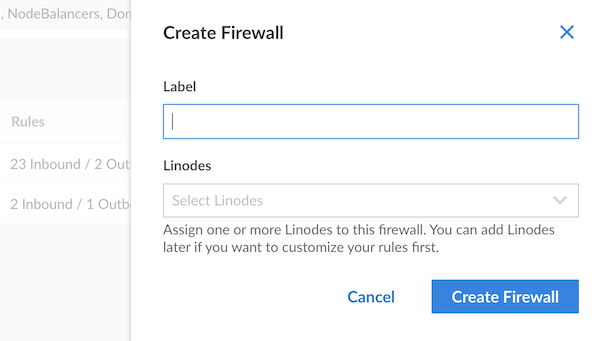

## Write Guides for Linode

This guide provides templates and guidelines to use when creating or updating a guide for [Linode Docs](/docs/).

Updates, improvements, and bug fixes to Linode documentation are always welcome through [GitHub](https://github.com/linode/docs) via pull requests (PRs) or issues.

Through our Write For Linode program, authors can contribute new guides and be paid for their work. We ask that interested authors apply to the program with one or more writing samples so that we can evaluate your work. To learn more about the program and to complete an application, please visit our Write For Linode [program page](https://www.linode.com/lp/write-for-linode/).

## General Layout

Linode Guides & Tutorials are written in [Markdown](https://en.wikipedia.org/wiki/Markdown). Our documentation site uses [Hugo](https://gohugo.io), a static site generator. Hugo-specific Markdown formatting notes are given [further below](#markdown-formatting).

Markdown files for guides are stored under the `docs/guides/` content directory. This content directory is then further subdivided into categories for different technical topics. New guides should be placed with a category that they most closely align with. For example, if you are writing a new guide on the Apache web server, it would be placed under `docs/guides/web-servers/apache/`.

A new subdirectory is created for each guide. This subdirectory should contain a file called `index.md`, which will be where the guide's Markdown is written to. For example, if your guide's title is `My Apache Guide`, then you would create its Markdown file at `docs/guides/web-servers/apache/my-apache-guide/index.md`.

A [Hugo archetype](https://gohugo.io/content-management/archetypes/) is available to create new Markdown files. For example, if you wanted to create the `My Apache Guide` example guide, you could run this command from inside your cloned docs repository:

```command
hugo new -k content docs/guides/web-servers/apache/my-apache-guide/index.md
```

### Header

Linode Guides & Tutorials store metadata and other information in a [YAML](http://yaml.org/) header at the top of every page. Use the template below for your own guide.


If you use the Hugo archetype command described in the previous section, the created Markdown file will be pre-populated with the frontmatter template below.


```file {title="Author Submission" lang="yaml"}
---
slug: {{ path.Base .File.Dir }}
title: "{{ replace (path.Base .File.Dir) "-" " " | title }}"
description: "Two to three sentences describing your guide."
og_description: "Optional two to three sentences describing your guide when shared on social media. If omitted, the `description` parameter is used within social links."
authors: ["Linode"]
contributors: ["Linode"]
published: {{ now.Format "2006-01-02" }}
keywords: ['list','of','keywords','and key phrases']
license: '[CC BY-ND 4.0](https://creativecommons.org/licenses/by-nd/4.0)'
external_resources:
- '[Link Title 1](http://www.example.com)'
- '[Link Title 2](http://www.example.net)'
---
```

If you're updating an existing guide in our repository, you may also notice a `deprecated` field in the header. This defaults to false, and setting it to *true* inserts a pre-written message near the beginning stating that the guide is no longer maintained. Typically, this will be used on guides specific to applications or distributions that have reached End of Life (EOL).

### Introduction

Introductions should be concise; explain what the goal of the guide is and why. If you're introducing new software to the system, include a brief description and link to its official website whenever possible.

### Before You Begin

The *Before You Begin* section is used to inform the reader of any prerequisites needed to successfully complete the guide. This may include the following:

- Specific Akamai services or features that are needed, like Compute Instances, LKE clusters, or Object Storage buckets. This should include any hardware or plan requirements (see [Pricing](https://www.linode.com/pricing/)).

- Setup tasks on Akamai services, such as securing a Compute Instance, creating a limited user, configuring a hostname. Only include tasks that are related to the guide and the guide's objective.

- External requirements, such as a registered domain name or specific local software (such as a PC running Windows 11).

- Software or applications that need to be installed or configured (i.e. LAMP stack, Docker, etc.), making sure to include links to instructions. Only include software that is directly used within the guide, but is not the focus of the guide. If the software needs additional configuration or usage information, it should likely be included in the guide's instructions and not in the *Before You Begin* section.

- Foundational knowledge, like an understanding of technology fundamentals (like container orchestration) or specific software or software stacks (like Kubernetes).

Below is an example *Before You Begin* section. You may copy the example and edit it as needed:

```file {title="Before You Begin"}
## Before You Begin

1.  If you do not already have a virtual machine to use, create a Compute Instance with at least 4 GB of memeory. See our [Getting Started with Linode](/docs/products/platform/get-started/) and [Creating a Compute Instance](/docs/products/compute/compute-instances/guides/create/) guides.

1.  Follow our [Setting Up and Securing a Compute Instance](/docs/products/compute/compute-instances/guides/set-up-and-secure/) guide to update your system. You may also wish to set the timezone, configure your hostname, create a limited user account, and harden SSH access.
```

### Include a Note about Root or Non-Root users

```file {title="Guides Written for a Non-Root User" lang="txt"}

This guide is written for a non-root user. Commands that require elevated privileges are prefixed with `sudo`. If you’re not familiar with the `sudo` command, see the [Users and Groups](/docs/guides/linux-users-and-groups/) guide.

```

```file {title="Guides Written for a Root User" lang="txt"}

The steps in this guide require root privileges. Be sure to run the steps below as `root` or with the `sudo` prefix. For more information on privileges, see our [Users and Groups](/docs/guides/linux-users-and-groups/) guide.

```

## Paragraph Structure

Guides should be split into cohesive sections which flow from one sequence of events to the next. Each section title should be styled with an *H2* heading element, and each subsection with an *H3* heading so that scanning the *In This Guide* left sidebar should give the reader an overview of what will be done in the guide. Capitalize each noun, adjective, verb and adverb in the article title, H2 and H3 headers.

Each **subsection** should be split into numbered steps as shown below.

For example:

```file {lang="md"}
## Using MySQL

1.  Log in to MySQL as the root user:

    ```command
    mysql -u root -p
    ```

1.  When prompted, enter the root password.

### Create a New MySQL User and Database

1.  In the example below, `testdb` is the name of the database, `testuser` is the user, and `password` is the user’s password.

    ```command
    create database testdb;
    grant all on testdb.* to 'testuser' identified by 'password';
    ```

1.  Exit MySQL.

    ```command
    exit
    ```

### Create a Sample Table

1.  Log back in as `testuser`:

    ```command
    mysql -u testuser -p
    ```
```


The tab size is set to four, and **only** soft tabs should be used. This can be configured in the settings of most text editors.


## How to Use Markdown Formatting for Linode Style

### Abbreviations and Acronyms

Upon first mention of a new concept or software, use the full name or term, then note the abbreviation or acronym in parenthesis beside it. The abbreviation/acronym can then be used in the article from that point. For example: Lightweight Resource/Provider (LWRP).

Introduce new terms in italics with a `*` on either side of the term:

```file {lang="md"}
This guide covers how to install Git, a *version control system*.
```

**Output:** This guide covers how to install Git, a *version control system*.

### Bold and Italics

Use a **Bold** font weight for buttons, menu selections and anything that requires emphasis or that you want to stand out to the reader. *Italicize* new terms and concepts the first time they are used.

| Syntax | Output |
| -- | -- |
| `**bold**` | **bold** |
| `*italics*` | *italics* |

### Commands

Commands that are not inline with paragraph text should be displayed with the *command shortcode*. This shortcode renders the command in a monospaced font with a light or dark background and a copy-to-clipboard button. Unlike other shortcodes (e.g. `content`, `note`, `caution`, etc), the command shortcode should be referenced with Markdown's *code fence* syntax.

-   **Command shortcode example**

    ````file
    ```command
    sudo systemctl restart apache2
    ```
    ````

    The above command shortcode is rendered with a light grey background by default:

    ```command
    sudo systemctl restart apache2
    ```

-   **Multiline commands**

    The command shortcode can accept multiple lines if more than one command needs to be displayed:

    ````file
    ```command
    sudo systemctl restart apache2
    sudo journalctl -u apache2
    ```
    ````

    The above command shortcode is rendered as:

    ```command
    sudo systemctl restart apache2
    sudo journalctl -u apache2
    ```

-   **Command with title**

    The `title` parameter can be used to specify a title that displayed above a command shortcode. This can be useful to label the server or workstation that a reader should execute the command on. For example, some guides instruct the reader to set up multiple servers. Specifying a title can disambiguate which server a given command should be run on.

    ````file
    ```command {title="Web server"}
    sudo systemctl restart apache2
    ```

    ```command {title="Database server"}
    sudo systemctl restart mysql
    ```
    ````

    The above command shortcodes are rendered as:

    ```command {title="Web server"}
    sudo systemctl restart apache2
    ```

    ```command {title="Database server"}
    sudo systemctl restart mysql
    ```

-   **Command with dark background**

    The `class` parameter can be used to specify that a command should be displayed with a dark background:

    ````file
    ```command {class="dark"}
    sudo systemctl restart apache2
    ```
    ````

    The above command shortcode is rendered as:

    ```command {class="dark"}
    sudo systemctl restart apache2
    ```

### Commands (Deprecated Syntax)

In some existing guides, you may see commands displayed without the command shortcode. In these instances, the commands are simply indented with a tab or four spaces in the Markdown source text. For example:

```file {lang="md"}
Run the following command to restart Apache:

    sudo systemctl restart apache2
```

*The older (tab or four space-indent) syntax should not be used for new content.* The code shortcode renders a copy-to-clipboard button for the reader's convenience, and the old syntax does not provide this feature.

### Inline Commands

Inline commands should be denoted by backticks.

```file {lang="md"}
Update your system by running `yum update`.
```

**Output:** Update your system by running `yum update`.

### Example IP Addresses

When referencing IP address in the documentation, any real address should be obscured unless it is intended for the user to access that IP address. When possible, use the documentation address blocks given in [IETF RFC 5737](https://tools.ietf.org/html/rfc5737) and [IETF RFC 3849](https://datatracker.ietf.org/doc/html/rfc3849).

-   **IPv4:** 192.0.2.0/24, 198.51.100.0/24, 203.0.113.0/24

    *Examples:* 192.0.2.84, 192.0.2.142, 198.51.100.65, 198.51.100.231, 203.0.113.2, 203.0.113.97

    In general, use these address blocks in order. Use the first block (`192.0.2.0/24`) for the first example IP address that is needed. If another IP address is needed, pull from the next block. If the example text is referencing the IPv4 address of a Compute Instance, do not use 0 or 1 as the last segment of the IP address as they are not used for Compute Instances. For instance, `192.0.2.17` is acceptable but `192.0.2.0` and `192.0.2.1` are not.

-   **IPv6:** 2001:DB8::/32

    *Examples:* 2001:db8:1:1:1:1:1:1, 2001:db8::f03c:485f:b84e:6534

### External Resources/More Information

If you wish to provide links to external sites for the user to review after going through your guide, do so using the `external_resources` parameter in the [page header](#header). This will automatically appear as a text block with links at the bottom of the page.

> More Information
>
> You may wish to consult the following resources for additional information on this topic. While these are provided in the hope that they will be useful, please note that we cannot vouch for the accuracy or timeliness of externally hosted materials.
>
> - [Link Title 1](http://www.example.com)
> - [Link Title 2](http://www.example.net)

### Extend Markdown Using Shortguides

Using shortcodes, it is possible to extend a Markdown file with another. For common tasks such as basic software installation, consider using the `content` shortcode. This allows our library to maintain consistent and up to date installation instructions for frequently used tools such as Python, MySQL, and Docker.

Markdown files intended to be inserted into multiple guides are called shortguides. To create a shortguide, create a directory with the name of your shortguide anywhere within `docs/`, and then create an index.md within the directory for your content (e.g. `example-shortguide-name/index.md`).

Inserting `headless: true` in the front matter will hide the guide from the site navigation as well as the search index.

When using the `content` shortcode in a guide to embed a shortguide, the shortcode will take the name of your guide's directory (e.g. `example-shortguide-name`) as a parameter. A shortguide can be within a different part of the `docs` hierarchy from the guide that embeds it, so the guide directory name exists within a global namespace of all shortguides in the repository. In other words, two different shortguides can't use the same directory name.

To use an image in a shortguide, add the image to your shortguide's directory and then use the `image` shortcode to embed it:

```file {title="sample_embedding_guide/index.md" lang="md"}

```

#### Example Usage

The following shortguide describes how to install Python via Miniconda. Create a directory named `install_python_miniconda` and filed named `index.md` within it:

```file {title="install_python_miniconda/index.md" lang="yaml"}
---
title: "Install Python with Miniconda"
description: 'A shortguide that shows how to install Python via Miniconda.'
keywords: []
license: '[CC BY-ND 4.0](https://creativecommons.org/licenses/by-nd/4.0)'
contributors: ["Author's FirstName LastName`"]
published: 2023-03-07
modified: 2023-03-07
headless: true
show_on_rss_feed: false
---

<!-- Installation instructions for Python 3. -->

1.  Download and install Miniconda:

    ```command
    curl -OL https://repo.continuum.io/miniconda/Miniconda3-latest-Linux-x86_64.sh
    bash Miniconda3-latest-Linux-x86.64.sh
    ```

1.  You will be prompted several times during the installation process. Review the terms and conditions and select "yes" for each prompt.

1.  Check your Python version:

    ```command
    python --version
    ```
```

To use this shortguide in another guide, use the following syntax:

```file {title="sample_embedding_guide/index.md"}
{}
```


Be sure to use the `%` delimiter inside the surrounding `{{ }}` braces for `content` shortcodes.


### Files

Use the *file shortcode* to present code examples, code snippets, and other text file contents in a guide. This shortcode renders the file content with line numbering, a specified filepath, syntax highlighting, and line highlighting. Unlike other shortcodes (e.g. `content`, `note`, `caution`, etc), the file shortcode should be referenced with Markdown's *code fence* syntax.


Exceptionally long files should be shown in parts, if needed. In these cases, you can add the entire file to the same directory as your guide and link to it from within the guide.


-   **File with filepath**

    ````file
    ```file {title="/path/to/file.html"}
    <div>
        Sample file text
    </div>
    ```
    ````

    The above file shortcode is rendered as:

    ```file {title="/path/to/file.html"}
    <div>
        Sample file text
    </div>
    ```

-   **File with language/syntax highlighting**

    A code language or syntax can be defined with the `lang` parameter to set how the text is displayed. A list of supported languages can be found [on GitHub](https://github.com/alecthomas/chroma).

    ````file
    ```file {title="/path/to/file.html" lang="html"}
    <div>
        Sample file text
    </div>
    ```
    ````

    The above file shortcode is rendered as:

    ```file {title="/path/to/file.html" lang="html"}
    <div>
        Sample file text
    </div>
    ```

-   **File with starting line specified**

    If your file snippet represents the middle of a file, you can use the `linenostart` to specify that the line numbering to the left of the snippet should start at a number other than 1:

    ````file
    ```file {title="/path/to/file.html" lang="html" linenostart="11"}
    <div>
        Sample file text
    </div>
    ```
    ````

    The above file shortcode is rendered with line numbers 11, 12, and 13 instead of 1, 2, and 3:

    ```file {title="/path/to/file.html" lang="html" linenostart="11"}
    <div>
        Sample file text
    </div>
    ```

-   **File with highlighted lines**

    The `hl_lines` parameter can be used to highlight certain lines within the file. The parameter is a space-separated list of strings. Ranges of lines can also be specified:

    ````file
    ```file {title="client/src/Header.js" lang="react" linenostart="11" hl_lines="4-6 9"}
    import React from 'react';
    function Header() {
        return (
            <header>
                Example header text
            </header>
        );
    }
    export default Header;
    ```
    ````

    The above file shortcode highlights lines 4 through 6 and line 9:

    ```file {title="client/src/Header.js" lang="react" linenostart="11" hl_lines="4-6 9"}
    import React from 'react';
    function Header() {
        return (
            <header>
                Example header text
            </header>
        );
    }
    export default Header;
    ```

-   **Using file shortcodes within lists**

    If using a file shortcode in a list, each line of the shortcode should start at the indentation level of the list. For example:

    ```file
    1. List item 1

    1. List item 2

        ```file {title="/path/to/file.html" lang="html"}
        <div>
            Sample file text
        </div>
        ```
    ```

### Files (Deprecated Syntax)

In some existing guides, you may see this older shortcode syntax for displaying a file:

```file

<div>
    Sample file text
</div>

```

This is equivalent to:

````file
```file {title="/path/to/file.html" lang="html"}
<div>
    Sample file text
</div>
```
````

*The older syntax should not be used for new content.* While they are rendered with the same presentation by Hugo, they are not displayed the same in the GitHub.com UI. When viewing a Markdown file in the library on GitHub, the newer code fence shortcode syntax will have enhanced styling, compared with the older shortcode syntax.

### File Paths and File Names

Inline file paths and file names should be formatted as inline code blocks.

| Syntax | Output |
| -- | -- |
| ``Navigate to `/var/www/html`.`` | Navigate to `/var/www/html`. |

### Headings

Headings should be written in title case and can be up to 3 levels deep.

| Syntax | Output |
| -- | -- |
| `## Section title (h2)` | <font size="5"><strong>Section title (h2)</strong></font> |
| `### Subsection (h3)` | <font size="4"><strong>Subsection (h3)</strong></font> |
| `#### Subsection (h4)` | <strong>Subsection (h4)</strong> |

### Images

Images can add value to the surrounding text by providing context or additional meaning. In most cases, images within documentation take the form of screenshots or diagrams, though occasionally other types of images may be necessary.

-   **Image format:** All images should a PNG (*.png*) or a JPEG (*.jpg* or *.jpeg*).

-   **Image size:** Images are displayed in their original size, up to the maximum width of the content area. If an image's width is larger than the width of the content area, the image is scaled down to fit within the content area and a user can click on the image to view it in a modal.

To add an image to a guide, first move it the same directory as the guide or shortguide. Then, enter the following Markdown syntax at the location you wish the image to appear:

```file {lang="md"}

```

- **Alt text:** This should be a description of the image and is rendered within the image's `alt` tag. It is used for screen readers and other accessibility features.
- **Filename:** The name of the file. Filenames cannot contain spaces and should use hyphens (-) and underscores (\_) instead.
- **Title text:** This is the text that appears as a tooltip when a user hovers over the image. If no title is entered, the alt text is used in the `title` tag. In most cases, a specific title tag is not needed.

#### Image Recommendations

- **Image sizing:** The height of our images, especially screenshots, should be as minimal as possible. This is to avoid screenshots taking up a lot of vertical space within our documentation, which often results in visually breaking up content that otherwise should appear together. Our Cloud Manager favors vertically stacked fields and options, which can make it difficult to minimize the height of our screenshots. Use your best judgement when determining what part of the UI is needed to convey the required information.

- **Favor light mode over dark mode:** When an application (such as the Cloud Manager) has different themes or appearances, favor the default theme. If the theme automatically adjusts to your system's light or dark mode setting, verify that your system is using light mode or adjust the application setting to light mode.

- **Image composition:** Avoid including too much detail or information within an image. Many images are used to either show a result of an action (like displaying a web page) or are used to supplement instructions asking the reader to perform an action (like click a button). Images that show too much may confuse the reader or otherwise call attention to details that aren't important to the task at hand. In practice, this means not taking a screenshot of the entire application or browser window and instead focusing only on the UI elements related to the instructions or text.

- **Remove personal information:** Ensure that all identifying attributes such as names and IP addresses are removed, obfuscated, or replaced with example text, such as **example_user** or an IP address from the **192.0.2.0/24** range. This aligns with a previous recommendation of only providing necessary detail and it keeps the writer's personal information from being shown to readers. This may involve using the browser's built-in development tools to manually replace values or delete information.

#### Example Wide Image

Since this image is larger than the width of the content, the image is scaled to fit. When the image is clicked, a modal appears that displays the image at a larger size.

This example image might be used to supplement instructions asking the reader to select a Compute Instance. Instead of taking a screenshot of the entire page in the Cloud Manager, the area has been cropped to just include relevant information. In addition, a red outline has been used to highlight the UI element that corresponds with the action the reader should perform.

```file {lang="md"}

```


#### Example Narrow Image

Smaller images should be displayed using their true pixel size. When taking screenshots within some software on some operating systems, the pixel size is increased (likely to account for the operating system's scaling). For instance, taking a screenshot with the Skitch tool on macOS doubles the pixel count. In these cases, use another image editing tool (like macOS's built in preview) to scale down the image to match the intended pixel width.

```file {lang="md"}

```


### Key Combinations

When instructing a reader to press hotkeys or other combinations of keys, enclose each individual key within a [kbd](https://developer.mozilla.org/en-US/docs/Web/HTML/Element/kbd) html element as shown in the example below.

```file {lang=html}
Use <kbd>Ctrl</kbd> + <kbd>C</kbd> to copy text.
```

**Output:** Use <kbd>Ctrl</kbd> + <kbd>C</kbd> to copy text.

### Links

Internal links to other Linode guides should be relative, starting at `/docs/`, and external links should be formatted as shown below and use HTTPS URLs whenever possible.

- **Internal link example:** `[Getting Started](/docs/products/platform/get-started/)`
- **External link example:** `[Apache HTTP Server Documentation](https://httpd.apache.org/docs/)`

### Lists

#### Ordered Lists

Ordered lists are numbered and should be used to denote a series of steps or sequential items. Use the following guidance when creating ordered lists:

-   **Longer lists that may change and where nested content is possible:**

    These lists should use *lazy* numbering (by appending a `1.` to each step regardless of the actual step number). There should also be *two* spaces between the numbering and the text (see [Nested Content Within Lists](#nested-content-within-lists)).

    ```command
    1.  Step 1
    1.  Step 2
    1.  Step 3
    ```

-   **Short lists that remain static with no nested content:**

    Optionally, you can use *true* numbering when a list is likely to remain short and static during its lifecycle. Provided there is no nested content, use a single space between the number and the text.

    ```command
    1. Step 1
    2. Step 2
    3. Step 3
    ```

#### Unordered Lists

Unordered lists are bulleted and should be used for any collection of items that do not necessarily need to be ordered. These lists should be formatted by appending a `- ` to the beginning of each step.

-   **Lists where nested content is possible:**

    Use *three* spaces between the bullet character (`-`) and the text. (see [Nested Content Within Lists](#nested-content-within-lists)).

    ```command
    -   Item A
    -   Item B
    -   Item C
    ```

-   **Lists with no nested content:**

    Provided there is no nested content, you can use a single space between the bullet character and the text.

    ```command
    - Item A
    - Item B
    - Item C
    ```

#### Nested Content Within Lists

To remain consistent across all of our guides, nested content should be indented *four* spaces and a blank line should be used above and below the content. Our Markdown processor assumes nested content starts directly below the *first* character in the text of the list item above it. With this in mind, it's important to indent the text portion of the list item to match that four space indent. In practice, there should be *two* spaces after the number (for ordered lists) and *three* spaces after the bullet for unordered lists. If this spacing is not respected, the nested content may not render properly.

- **Ordered list** (`1.`): Use *two* spaces after the number.
- **Unordered list** (`-`): Use *three* spaces after the bullet.

````command
-   Item A

    This sentence is nested under *Item A*.

-   Item B

    ```command
    This command is nested under *Item B*.
    ```

-   Item C
````

### Note Shortcode

The **note** shortcode is used to display a note to the reader. Notes can be used to share relevant information that does not fit with the primary content. Example use cases include alternative methodologies, non-critical information, alerts, developer recommendations, and more. **Content included in a note must not be required for the reader to successfully understand or complete a task**.

Below is the **default** (primary) note shortcode with default [parameters](#parameters):

```file

This is an example note.

```


This is an example note.


**Best practices:**
- **Be concise.** The shorter the better. Notes can lose their impact when they become too long.
- **Keep things relevant.** The note should pertain directly to the surrounding paragraph, step, or list item. If the note is an unnecessary interruption to the reader, consider removing the note, moving it to a different section, or placing its contents directly in the surrounding content.
- **Use notes sparingly.** Notes draw attention away from the surrounding content. Too many notes can distract the reader, result in important information getting lost, and are often unnecessary. Consider the impact too many notes or multiple consecutive notes may have to the reader. Often, some information can be omitted and some information is better suited to be included as part of the surrounding text.
- **Use descriptive titles.** Customize the title of each note so that the reader can quickly assess if the note is relevant to them.
- **Can be used for short-lived (nonpermanent) content** *(with some caution)*: In many cases, short-lived content is better suited to notes than being hidden within paragraphs or list items. When adding temporary content to a note, always include the date when the content will be out-of-date (if available) as well as information the reader may need to know after that date. An example of this is beta notices. When a new product comes out, the documentation should mention that the product is available as a beta (and, as such, may not be feature complete or production ready). While a note at the top of the related product pages may be warranted, a note within all of our other guides that reference the product is likely not necessary and may create more complications when we need to remove this information.

**What to avoid:**
- Lengthy notes.
- Notes not relevant to the surrounding content.
- Too many notes relative to surrounding content.
- Stacking notes (multiple consecutive notes).
- Generic or non-descriptive titles.

#### Parameters

When creating a new note, there are multiple parameters to consider pertaining to the type of note, its title, and if it can be expanded/collapsed. While not all parameters are always necessary, all should be taken into account during the note creation process.

| Parameter | Values | Description |
| -- | -- | -- |
| `type` | `"primary"`, `"secondary"`, `"warning"`, `"alert"` | Identifies the note as one of 4 types: primary, secondary, warning, or alert. See: [Note Types](#note-types) |
| `title` | String | Sets the title of the note. See: [Titles](#titles) for titling guidelines. |
| `noTitle` | boolean | Does not apply a default title to the note. Defaults to false. |
| `isCollapsible` | boolean | Sets the note as collapsible. The note must have a title defined. Defaults to false. See: [Collapsible](#collapsible) |
| `respectIndent` | boolean | Only used for older note shortcodes (``) that have been converted to the newer shortcode. See: [Indentation](#indentation) |

#### Note Types

There are four unique types of notes: **primary**, **secondary**, **warning**, and **alert**. Each type has specific use cases and varying levels of urgency that should determine the type of note you choose to make. Below are examples of each note type and their use cases:

-   **Primary** (type is unset or `type="primary"`, title defaults to "Note"): Used for additional related information that does not fit with the rest of the document. Can include alternative suggestions or solutions, developer tips, or general best practices that are not critical to the success of the task at hand.

    
    When creating root, user, or other passwords, you can increase security by using a password generator such as [1Password](https://www.1password.com) to create and save complex, encrypted passwords.
    

-   **Secondary** (`type="secondary"`, title defaults to "Note"): Most commonly used in tandem with the [collapsible parameter](#collapsible). **Secondary** notes can include non-critical information, commands, code, or output that may take up too much room or does not require visibility for the success of an action.

    
    ```command
    RSA 3072 SHA256:/y+83+sA3JdDGkv/KLnIAIXqfgqWfgp5RZ+DCx1T4yU lish-nl-ams.linode.com
    ECDSA 256 SHA256:iR/He+teo+c7jqr8LzaTikbTlMDdIkIERhJBXdIjO8w lish-nl-ams.linode.com
    ED25519 256 SHA256:vxF9arB2lYBVP45ZA7t1JEE9w/vthPmzU3a2oOR8O7Y lish-nl-ams.linode.com
    ```
    

-   **Warning** (`type="warning"`, title defaults to "Warning"): Notices that warn the reader to proceed with caution, including notices for beta programs, warnings of limited resource availability, etc. Not as urgent as alert notes.

    
    VPCs are now publicly available in beta, providing customers with another method of isolating network traffic between Compute Instances (in addition to the [VLANs](/docs/products/networking/vlans/) feature). Not all data centers are currently supported. For more information, review the [Availability](/docs/products/networking/vpc/#availability) section.
    

-   **Alert** (`type="alert"`, title defaults to "Important"): The most urgent of all note types. **Alert** notes should be used to notify of potential *destructive* actions such as situations resulting in data loss or where there is no undoing what has been done. Anything critical to the success of a task should still be included in the primary content and not solely live in the note.

    
    Formatting a Block Storage Volume will delete all data stored on that Volume. To prevent data loss, verify that any files you wish to retain have been successfully backed up to another storage device.
    

#### Titles

Each note can also have a custom title, which is set using the `title` parameter. Titles can specify or summarize the purpose of the note, as well as help define the authority and urgency of the note in the form of tips, best practices, or calls to attention. **Default titles may also be used, but custom titles are preferred for their additional context.**
- Example summary titles: "Use a strong password", "The token is valid for 24 hours", "A valid payment method is required"
- Example tip or best practice titles: "Developer Tip", "Common Practice"
- Example calls to attention: "Before moving forward", "This may result in data loss"

**Title casing:**
- If using a single word or phrase, use title casing. *Preferred.*
- If using a sentence as your title, use sentence casing. Otherwise, use title casing.

```file {lang="text"}

This is an example note with a helfpful custom title.

```


This is an example note with a helpful custom title.


Additionally, you can specify that the note should have no title by using `noTitle=true`. This causes the default title to not display.

```file {lang="text"}

This is an example note with no title.

```


This is an example note with no title.


#### Collapsible

Notes can also be made collapsible by setting `isCollapsible=true` (defaults to false). This hides the body of the note and displays a collapse/expand icon. **Secondary notes** are often used for collapsible notes.

```file {lang="text"}

This content is hidden until the user expands the note.

```


This content is hidden until the user expands the note.


#### Indentation

Content within the opening and closing note shortcode tags must respect the expected indentation of any parent elements, such as list items. Since content within a list is indented (using 4 spaces), the content of a note shortcode must be indented by the same number of spaces.

By default, content between the shortcode tags is rendered using `.InnerDeindent`, which allows the shortcode to respect the indentation of any parent elements (such as lists). When set to `false`, `.Inner` is used instead, which does not de-indent the content and does not respect the indentation of parent elements. Defaults to true.

```file
-   First list item.

    
    This content appears within the first list item and, as such, respects its indentation.
    

-   Second list item.
```

If this indentation is not respected, which should only be the case for older note shortcodes made before this change, the following option is set: `respectIndent=false`. If one of these is encountered when editing an existing guide, remove `respectIndent=false` and properly indent the shortcode.

```file
-   First list item.

    
This content appears within the first list item but does not respect its indentation.


- Second list item.
```

### Numerical Values

| 1-10 | Greater than 10 |
| -- | -- |
| Use words (one, two, three, etc.)  | Use numerical digits (11, 22, 33). |

### Placeholders

The placeholder shortcode applies special formatting to highlight the user-replaceable portion of a command or file. It can also be used within a paragraph as a way to reference what the user should replace.

- **Syntax:** ``</br>
- **Output:** 

When creating a placeholder, you can either use a descriptive variable name (as shown above) or example text.

- **Placeholder example text:** A generic example that represents the expected user input. For instance, example IP addresses (`192.0.2.17`) and example domain names (`example.com`). This should be in the same case as the surrounding text, using whatever formatting is appropriate for the example text. For IP addresses, review the [Example IP Addresses](#example-ip-addresses) section.
- **Placeholder variable:** A short descriptive variable name. This should be formatted in uppercase with an underscore (`_`) used instead of spaces. For instance, `REGION_ID` and `FILE_NAME`.

The following example demonstrates a common use case for the placeholder shortcode.

-   **Markdown syntax:**

    ````
    Within the default NGINX configuration file, replace  with your website's domain.

    ```file {title="/etc/nginx/sites-available/default"}
    server {
        listen  80;
        listen [::]:80;
        server_name ;
    }
    ```
    ````

-   **Output:**

    Within the default NGINX configuration file, replace  with your website's domain.

    ```file {title="/etc/nginx/sites-available/default"}
    server {
        listen  80;
        listen [::]:80;
        server_name ;
    }
    ```

### Sentence Spacing

Use single spaces between sentences; do not double-space.

### Tables

You can create tables using standard Markdown syntax. Additionally, you can embed a Markdown table within the [table shortcode](#table-shortcode) for additional functionality.

```file {lang="md"}
| Column Header 1 | Column Header 2 |
| -- | -- |
| **Example** | This is an example of text in the second column. |
```

| Column Header 1 | Column Header 2 |
| -- | -- |
| **Example** | This is an example of text in the second column. |

#### Column Text Alignment

To align text within a table, modify the second row. This row separates the header from the body of the table and can be used for additional metadata, like text alignment.

- Left aligned: Default behavior (if there is a need to be explicit, use `| :-- |`)
- Center aligned: `| :--: |`
- Right aligned: `| --: |`


```file {lang="md"}
| Left-Aligned Text | Center-Aligned Text | Right-Aligned Text |
| -- | :--: | --: |
| Example | Example | Example |
```

| Left-Aligned Text | Center-Aligned Text | Right-Aligned Text |
| -- | :--: | --: |
| Example | Example | Example |

#### Table Shortcode

The table shortcode can be used to add additional functionality to Markdown tables. By default, it adds a scrollbar when the table width is larger than the content area. This means that it can accommodate wide tables with lots of columns. It also adds alternating row background colors so that tables are easier to parse.

```file {lang="md"}

| Column Header | Column Header | Column Header |
| -- | -- | -- |
| **Row 1** | Example | Example |
| **Row 2** | Example | Example |
| **Row 3** | Example | Example |

```


| Column Header | Column Header | Column Header |
| -- | -- | -- |
| **Row 1** | Example | Example |
| **Row 2** | Example | Example |
| **Row 3** | Example | Example |


#### Fixed First Column

If you are creating a wide table and need the first column to be fixed when scrolling, use the **"first-sticky"** class.

```file {lang="text"}

| Column Header | Column Header | Column Header | Column Header | Column Header | Column Header | Column Header | Column Header | Column Header | Column Header | Column Header | Column Header |
| -- | -- | -- | -- | -- | -- | -- | -- | -- | -- | -- | -- |
| **Row1**| Example | Example | Example | Example | Example | Example | Example | Example | Example | Example | Example |
| **Row2**| Example | Example | Example | Example | Example | Example | Example | Example | Example | Example | Example |
| **Row3**| Example | Example | Example | Example | Example | Example | Example | Example | Example | Example | Example |

```


| Column Header | Column Header | Column Header | Column Header | Column Header | Column Header | Column Header | Column Header | Column Header | Column Header | Column Header | Column Header |
| -- | -- | -- | -- | -- | -- | -- | -- | -- | -- | -- | -- |
| **Row1**| Example | Example | Example | Example | Example | Example | Example | Example | Example | Example | Example |
| **Row2**| Example | Example | Example | Example | Example | Example | Example | Example | Example | Example | Example |
| **Row3**| Example | Example | Example | Example | Example | Example | Example | Example | Example | Example | Example |


### Tabs

Using a tabbed interface allows you to separate content into user-selectable tabs. This can be used to provide specific instructions for different versions of a software application (like MySQL 5.7 or 8), different operating systems (like macOS, Windows, or a Linux distribution), or different user tools (like the Cloud Manager, Linode CLI, or Linode API).

````file


The content only appears when *Tab 1* is selected.


When *Tab 2* is selected, this content appears.


````



The content only appears when *Tab 1* is selected.


When *Tab 2* is selected, this content appears.



When a user selects a tab, the first item in each tab set that has a matching title is also selected. This means that if multiple tab sets are on a page, each with the same items, the user only needs to select an item within one tab set and all tab sets will show that item.



This is *Tab 1* in the second tab set. When *Tab 1* is selected on any tab set, this content is visible.


And here is *Tab 2* in the second tab set. When *Tab 2* is selected on any tab set, this content is visible.



When a tab is selected, a `tab` parameter string appears in the URL along with the title of all selected tabs. For instance, if *Tab 2* is selected in the tab sets above, `?tabs=tab-2` is appended to the URL. This allows the URL to be saved or shared, keeping the same tabs selected on the page.

### Terminal Output

Output from terminal commands should be displayed with the *output shortcode*:

````file
```output
Hello world!
```
````

The above shortcode is rendered as:

```output
Hello world!
```

Here's an example of a command (using the code shortcode) and its output (using the output shortcode) displayed together:

````file
```command
echo "Hello world!"
```

```output
Hello world!
```
````

The above shortcodes are rendered as:

```command
echo "Hello world!"
```

```output
Hello world!
```

### Terminal Output (Deprecated Syntax)

In some existing guides, you may see this older shortcode syntax for displaying terminal output:

```file

Hello world!

```

This is equivalent to:

````file
```output
Hello world!
```
````

*The older syntax should not be used for new content.* While they are rendered with the same presentation by Hugo, they are not displayed the same in the GitHub.com UI. When viewing a Markdown file in the library on GitHub, the newer code fence shortcode syntax will have enhanced styling, compared with the older shortcode syntax.

## Author Pages

Profile pages for authors are listed at https://www.linode.com/docs/authors/. These are automatically generated from the `authors` frontmatter of the guides in the library. These pages list all of the guides that an author has published in the docs library.

Docs contributors can create author pages by following these steps:


The second step is optional. If you do not follow this step, a profile page is still automatically generated from the `authors` frontmatter of the guides you have written. The second step shows you how to add custom biographical information to the profile page.


1.  On the guides you have written, update the `authors` frontmatter to reference your name. This should be formatted like:

    ```file
    contributors: ["FirstName LastName"]
    ```

1.  (Optional) Create a new directory and Markdown file for your author page under the `docs/authors` directory in the docs repository. The new directory should named after you, with uppercase letters replaced by lower case, and spaces replaced by a dash. For example, an author with the name `Nathan Smith` would have a new profile page created at `docs/authors/nathan-smith/_index.md`.

    
    Note that the Markdown file is named `_index.md`, not `index.md`
    

    A [Hugo archetype](https://gohugo.io/content-management/archetypes/) is available to create new author pages. For the example author `Nathan Smith`, you would run this command to create the Markdown file for their profile page:

    ```command
    hugo new -k authorpage docs/authors/nathan-smith/_index.md
    ```

    The template that will be created looks like:

    ```file
    ---
    title: "Nathan Smith"
    link: ""
    email: ""
    description: "The Linode documentation library's profile page and submission listing for Nathan Smith"
    ---

    A short biography of the docs author/contributor. This biography text is displayed above a listing of their published docs/content.
    ```

    You can set an email, website link, and short meta description in the frontmatter of this file. You can also update the body of the file with a biography of the author. This biography will be displayed above the author's published guides listing.

## Legal Information

COPYRIGHT OWNERSHIP. Writer agrees that the Work is being created by the writer for the Linode Guides & Tutorials repository and that each form of Work is being created by the writer as a “work made for hire” under the United States Copyright Act and, at all stages of development, the Work shall be and remain the sole and exclusive property of Linode. At Linode's sole, absolute and unfettered discretion, Linode may make any alterations to the Work.

CREDIT. Nothing contained in this Agreement shall be deeded to require Linode to use the Work, or any part thereof, in connection with Linode Guides & Tutorials or otherwise. Credit for the Work shall read, "Contributed by [writer's name]."

PAYMENT. Upon publication of a submission to the Linode Guides & Tutorials Repository, the writer will be paid the sum agreed to by email by both Linode and the author. Author may choose payment either in the form of a credit to their Linode account, a hardcopy check, or as an electronic payment via PayPal.