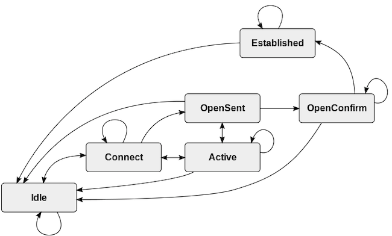

Routing protocols are crucial for proper network engineering and design. They allow traffic to be quickly routed across a network from source to destination. The [*Border Gateway Protocol*](https://en.wikipedia.org/wiki/Border_Gateway_Protocol) (BGP) is the universally-accepted routing protocol for the internet backbone. Although BGP is incredibly powerful and has many advantages, it is also complex and has some drawbacks. This guide explains what BGP is and how BGP routing works. It also discusses the advantages and disadvantages of BGP and its role in many recent major network outages.

## What is the BGP Protocol?

BGP is designed to quickly route traffic from source to destination across the entire internet. It enforces the use of standardized routing messages and practices that are shared between each *internet service provider* (ISP). For each packet, BGP determines the best route to the final destination. It then transmits the message using the appropriate interface. This process is repeated at every node along the route until the packet arrives at its destination. BGP routing information is exchanged between connected neighbor interfaces, which are called *peers*. Large ISPs must use BGP to connect to the internet backbone, but smaller networks might also choose to deploy it internally.

BGP was first roughly sketched out in 1989 and initially deployed in 1994. It quickly became the de facto standard for routing traffic across domains. The current version of BGP is version 4 (BGP4), and its specification is described in [RFC 4271](https://www.rfc-editor.org/rfc/rfc4271). The current implementation corrects some errors and ambiguities, and introduces support for *Classless Inter-Domain Routing* (CIDR) and *route aggregation*. There is also a BGP implementation for *IPv6* as first described in [RFC 2545](https://www.rfc-editor.org/rfc/rfc2545.html), along with several extensions and optimizations.

BGP is an example of an *exterior gateway protocol*, as opposed to an *interior gateway protocol*. Exterior gateway protocols connect large *autonomous systems* (AS), which might represent an *internet service provider* (ISP) or an application provider like Netflix. Interior gateway protocols, including *Open Shortest Path First* (OSPF) and *Intermediate System to Intermediate System* (ISIS), can only be used inside a single AS. BGP is said to create a "network of networks" out of the different autonomous systems.

Each AS is allowed to choose its own interior gateway protocol but requires a shared mechanism for sending traffic to another system. BGP provides a successful solution, and virtually all providers now use it to reduce interoperability problems. Consequently, BGP is the only remaining exterior gateway protocol in widespread use.

BGP constructs routing tables describing the next hop and interface for each external network. The networks are defined based on their IP address and network mask. For instance, the network `192.0.2.0/24` might have its own entry in the BGP routing table. Any traffic to any address in this subnet is routed the same way. BGP is considered a vector protocol. It considers each route to be a sequence of autonomous systems to transit and not a series of hops. BGP also provides a mechanism to add, delete, and change information from the routing table.

BGP uses the *Transmission Control Protocol* (TCP) as its transport mechanism. It is officially assigned TCP port 179. TCP provides a reliable connection, packet retransmission, and fragmentation/reassembly services. This eliminates any requirement for BGP to implement these features. Each BGP message contains a header consisting of a marker field of all ones, the message length, and the BGP message type.

## How does a BGP Session Work?

BGP is responsible for receiving and transmitting network updates and constructing a routing table from these updates. A BGP interface establishes a point-to-point connection with its BGP peer, which is a neighboring interface. Peering information for each BGP interface is configured manually and used when negotiating the connection. The configuration must include the expected AS and IP address of the BGP peer. The following example demonstrates how to configure a BGP session on a Nokia 7750 router.

```file
group "To_AS_30000"
    connect-retry 20
    hold-time 90
    keepalive 30
    local-preference 100
    remove-private
    peer-as 30000
    neighbor 10.0.3.10
        description "To_Router C - EBGP Peer"
        connect-retry 20
        hold-time 90
        keepalive 30
        peer-as 30000
    exit
exit
```

To establish, monitor, and maintain these connections, BGP implements a *finite state machine* (FSM). The BGP FSM changes the state of the connection based on a combination of internal and external events. Connections are established and unicast messages are sent using TCP port 179. When the connection is established, BGP sends keep-alive messages at a configurable rate.

There are two types of BGP connections. The type of connection depends on whether the peers are in the same AS or not.

-   **Exterior Border Gateway Protocol (eBGP):**  eBGP connects interfaces in different autonomous systems. Routes learned from an eBGP peer are advertised to both iBGP and eBGP peers. eBGP can also run between two peers that are not directly connected using a *virtual private network* (VPN) tunnel.
-   **Interior Border Gateway Protocol (iBGP):** This runs between two peers within the same AS. Routes learned from an iBGP peer are only advertised outside the AS through eBGP peers. As a result, all routes within iBGP are required to be connected in a full mesh. However, several optimizations and extensions can somewhat relieve this demand.

Each AS is assigned an *autonomous system number* (ASN) to identify it on the network. This designates it as an independent network with its own routing policies and helps BGP decide whether to use iBGP or eBGP. An AS controls a set of IP addresses and is allowed to advertise and aggregate these addresses.

### How Does the BGP State Machine Operate?

BGP uses a finite state machine to establish and maintain connections. The connection state changes in response to incoming messages, errors, lack of responses from the peer, and internal timers. There are four types of BGP messages, and the FSM has six states. Here are the BGP message types.

-   **Open**: These messages are sent after the TCP session is established. They communicate information about the local BGP configuration and negotiate shared parameters.
-   **Keepalive**: A keepalive message tells the peer the session is still active. The frequency of the keepalive messages is typically configurable on a per-peer basis.
-   **Update**: An update communicates new routing information to the peer. When a BGP session is initially established, local routing information is sent to the peer. In an ongoing session, information about new and withdrawn routes is also sent using this message type.
-   **Notification**: A notification advises the peer about errors or connectivity problems. When a peer receives the message, it terminates the BGP connection.

The BGP finite state machine includes the following six states.

-   **Idle**: A BGP connection begins in this state and returns to this state if errors occur or the connection times out. While in this state, BGP initiates a connection and listens for a response or request for connection from the peer. After the connection establishment phase begins, the FSM moves the session to the *Connect* state. It is not possible to move from Idle to any other state other than Connect.
-   **Connect**: This is a transitional state that occurs during TCP negotiation after a message is received from the peer. The Connect state attempts to complete a three-way TCP handshake with the peer and establish a TCP session. After a successful handshake, BGP sends an Open message and moves to *OpenSent*. If the TCP session is not immediately established, the state changes to *Active*. Any errors cause the state machine to transition back to Idle.
-   **Active**: This confusingly named state allows for another attempt at establishing a TCP session. If the new attempt is successful, the session sends an Open message and proceeds to the OpenSent state. If it is unsuccessful and the timer expires, it returns to either the Connect or Idle state. In the case of network issues, congestion, or unstable links, a connection can wind up cycling between Idle, Connect, and Active.
-   **OpenSent**: When the TCP session is established, the BGP FSM enters the OpenSent state and listens for an Open message from the peer. When it receives this message, it validates the message. If the validation is successful, the FSM sets the hold time and moves to the *OpenConfirm* state. If there are errors, it notifies the peer and resets the connection back to Idle.
-   **OpenConfirm**: In this short-lived state, BGP listens for a keepalive message from the peer. If it receives one before the keepalive timer expires, the session transitions to *Established*. If a keepalive is not received or another error occurs, the session moves back to Idle.
-   **Established**: When a BGP session reaches this final state, it becomes fully operational. When the Established state is reached, the peers send *Update* messages to advertise information about the routes in their database. If any errors occur, the session moves back to the Idle state.

Here is a state diagram illustrating all possible states and transitions, courtesy of Wikipedia.



When BGP detects an error, it sends a *Notification* message. This message causes the interface to close and moves the BGP session back to the Idle state. Here are some examples of errors that can return the connection to the Idle state.

-   TCP port 179 is closed or fails to open. This can occur if the underlying physical interface is not operational or if the BGP interface is disabled or not fully configured.
-   A dynamic TCP port with an ID greater than 1023 is not available for the second ephemeral TCP port.
-   The BGP peer address and ASN are not configured correctly.
-   Network congestion or high latency.
-   A flapping network interface or connection.
-   A session times out due to a lack of keepalive messages.

## How Does BGP Build its Routing Information Base?

BGP routing is extremely complex and some aspects are vendor specific. A complete discussion of the full intricacies of BGP routing is beyond the scope of this introductory guide. However, certain basic principles apply in all cases.

Each BGP interface receives *Update* messages from its peer indicating reachable destinations for a specific BGP path. The reachable networks are communicated in the form of *Network-layer Reachability Information* (NLRI) updates. Each NLRI contains a length and prefix for each network on the path. Only one NLRI is advertised in each update message. For instance, an NLRI might contain the entry `/24, 192.0.2`.

The Update also contains path attributes, including the inter-AS path to the network. A BGP route contains a list of the autonomous systems a packet must transit to reach the destination. This information helps detect and avoid routing loops. The path attributes must also include the next hop information, and a legacy attribute for the route origin.

BGP receives a number of NLRI updates from each peer. In return, it also sends out its list of known networks to each of its peers. This strategy allows each peer to effectively calculate the best route to each network.

For each peer, BGP maintains a conceptual base of routing information. This includes an *adjacent routing information base, incoming* (Adj-RIB-In) for NLRI updates received from the neighbor. Only one route to a given destination is stored in the Adj-RIB-In. The complementary Adj-RIB-Out is an outgoing information base containing NLRIs to send to the peer. The adj-RIB-Out is also influenced by routing policy and other factors, but only viable routes are allowed.

BGP collates the information received from all peers into its *local routing information base* (Loc-RIB). The Loc-RIB is the master BGP routing table. It includes the best BGP route to each advertised network, independent of other routing protocols. The BGP protocol specification lists some factors to consider when selecting routes. However, individual vendors can also incorporate other information.

Each route in the Loc-RIB must be resolvable and reachable. Additionally, the Loc-RIB chooses routes learned from external peers over any routes learned from iBGP. Other factors might include the cost/throughput of the route, the number of autonomous systems to traverse, community membership, route preferences, and system routing policies. The values of the AS and the IP address can potentially be used as tiebreakers.

BGP is only one source of routing information for a system. BGP submits the candidate routes from the Loc-RIB to the main routing table, which combines routes from all routing sources. The BGP route is not necessarily selected. For example, in a local network an OSPF route or a static route might be chosen instead. Routing policies also dictate which route is used. For instance, all outgoing packets of a certain type might have to be sent to a traffic management system first. Each router is responsible for its own routing decisions, and the algorithms might vary from vendor to vendor.

The routing topology is never static. New networks are always being built and removed, and interfaces can fail. New information from a peer forces BGP to recalculate the Adj-RIB-In. In many cases, this might cause a new best route to be installed in the Loc-RIB. This can consequently result in changes to the system routing table. In the event of a failure, traffic can quickly switch over to a less efficient secondary route. If there are no longer any routes to a destination, it is withdrawn from the BGP routing table.

## BGP Extensions and Optimizations

Over the years, several enhancements and optimizations have been proposed to improve BGP performance and reduce memory requirements. BGP does not require any of these extensions, and system administrators can choose whether to use them or not. Here is a list of some of the most significant BGP options.

-   **BGP Communities**: Communities allow common policies to be applied to a set of prefixes. A community is indicated through the use of a common attribute tag. There are official well-known communities that should not be advertised or exported. Communities also allow geographic restrictions and help defend against denial-of-service attacks.
-   **BGP Confederations**: A BGP confederation contains more than one AS. The AS networks within the confederation exchange information as if they were all part of the same iBGP network. Only the ID of the confederation is advertised to the rest of the internet. A confederation makes it easier for an ISP to administer large networks.
-   **Multi-exit Discriminators (MED)**: The MED is sent to peers to advertise the preferred interface for inbound traffic within an AS.
-   **Multiprotocol BGP (MBGP/MP-BGP)**: MBGP can simultaneously carry information for multiple routing protocols and address families, including IPv6 and L3VPN. It supports both unicast and multicast addresses and permits separate routing tables for multicast addresses. MBGP is defined in [RFC 4760](https://www.rfc-editor.org/rfc/rfc4760).
-   **Route Reflectors (RR)**: Route reflectors reduce the number of connections inside an AS and eliminates the requirement for a full mesh. An RR acts as the central point for a cluster of routers within the AS. All the route reflectors peer with each other, but the remaining routers only peer with the RR in their cluster. The net effect is to increase scalability and reduce the number of iBGP routes within the network.

Unfortunately both route reflectors and confederations can increase convergence time and introduce inefficient routes, especially when used together.

## The Advantages and Disadvantages of BGP

BGP has become the default exterior routing protocol due its many advantages. Here are some of the main benefits of BGP:

-   It provides a comprehensive and unified standard for the entire internet. BGP enables routers in different ISPs to communicate, thus reducing interoperability and compliance issues.
-   BGP is highly scalable and is able to store hundreds of thousands of routes.
-   The protocol does an efficient job of computing the best next hop for a given destination. Its internal algorithms and route selection process are highly optimized.
-   Several optimizations and extensions are available to maximize the performance of BGP and reduce its memory demands.
-   BGP conserves network bandwidth by minimizing the amount of updates and network traffic. The BGP finite state machine is clear and simple and most sessions are negotiated quickly.
-   It is able to quickly handle network failures and reroute traffic.

Unfortunately, BGP has several drawbacks. Some of these problems are inherent in the original RFC, while others have developed due to the rapid growth of internet networks. Here are some of the most serious disadvantages of BGP:

-   BGP relies on manual configuration, which has the potential to introduce problems. Incorrect BGP configuration has been the root cause of several large-scale internet outages.
-   Sometimes the BGP route and the best route differ. This can be due to factors such as congestion and cost. So BGP is prone to suboptimal routing, particularly when extensions are used.
-   BGP is prone to stability problems in the presence of rapidly flapping interfaces or continually rebooting routers. This can lead to cascading failures that spread out to other networks and cause instability in the rest of the AS or across the internet backbone. BGP instability can be partially alleviated by *route flap damping*. Damping ignores a problematic interface for a predefined interval of time. Unfortunately, this can also increase convergence times for updates.
-   The global BGP routing tables are very large and continue to grow rapidly. iBGP requires a full mesh of connections, which is memory intensive to store. Efforts have been made to reduce the number of routes through aggregation and routing policies. The CPU demands of a large network can also be very large, especially when the router has many iBGP peers. Smaller and older routers might not be able to keep up with the large volume of updates.
-   BGP cannot detect congestion. This can result in the selection of suboptimal routes.
-   BGP is subject to security issues like *BGP Hijacking*. This occurs when attackers distribute false routing information to misdirect traffic. BGP hijacking takes advantage of the trust-based system between the autonomous systems. This problem has been reduced through the use of a *Resource Public Key Infrastructure* (RPKI). RPKI ensures only the official owner of an AS can distribute route updates for the addresses it owns.

## How Can BGP Cause Network Outages?

BGP problems are commonly the root cause of major network outages, due to the complexity and challenges of the protocol. DNS problems can also cause network outages, but routing issues tend to be more complex and more difficult to debug and resolve. Some extensions and optimizations can interact to produce negative results.

Problems can occur during configuration or when updating routers. A large number of route flaps can overwhelm a network with updates, leading to router failures. These failures intensify the original problem, and can subsequently spread to the wider internet. Several major outages at *Tier 1* ISPs and services have been caused by cascading failures that eventually took down the entire network.

Certain misconfiguration problems can be particularly severe. One ISP configured its network so all inbound and outbound traffic had to pass through one particular node, which soon failed under the pressure. It is also possible to accidentally drop all traffic destined for another AS. This could, for example, result in all users of the ISP being unable to access Google. In some cases, these failures can spread outside the AS and affect other networks. On more than one occasion, an organization has wiped all traces of its BGP interfaces off the internet with a bad configuration change.

BGP problems can be very difficult to fix, whether the problem is a routing update from a telecom vendor or an internal configuration change. Only a certain number of highly skilled and trained people typically understand BGP and know how to debug and fix problems. In most cases, the only reasonable response is to roll back the router software or BGP configuration to an earlier version. Engineers can then investigate the problem offline while the network recovers. Unfortunately, it can still take a while for the network to come back online because BGP updates take some time to propagate. Networks that are already unstable or in flux are especially prone to this type of problem.

BGP errors can also cause DNS failures, so the two major risk factors in a network can combine to amplify problems. A large number of BGP updates can cause DNS requests to fail and overload the DNS servers. This can potentially affect other services and lead to a network storm that decreases performance across the entire internet.

## Conclusion

The Border Gateway Protocol (BGP) is the main routing system for the internet backbone and is used by every major service provider. BGP provides a map for routers to funnel packets from their original source to their final destination. A BGP session is established with a peer interface through the use of a finite state machine and standard message types. The peer can be in the same autonomous system or part of a different vendor's network.

BGP sends information about the reachable networks it knows to all of its peers. Based on the routes it receives in return, it constructs a local routing information base consisting of the best route to each network. In turn, BGP sends its selected routes to the main system routing base, where they can potentially be selected as the best route. BGP is a scalable and efficient standard, but suffers from high memory requirements and security issues, and is prone to serious misconfiguration problems. For full details about BGP, including state machine details and messaging formats, consult the IETF [RFC 4271](https://www.rfc-editor.org/rfc/rfc4271).