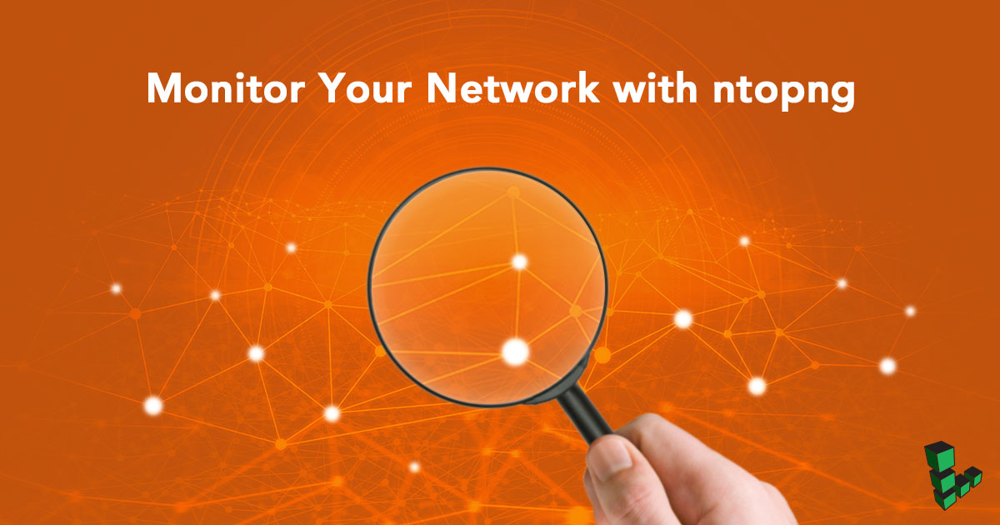
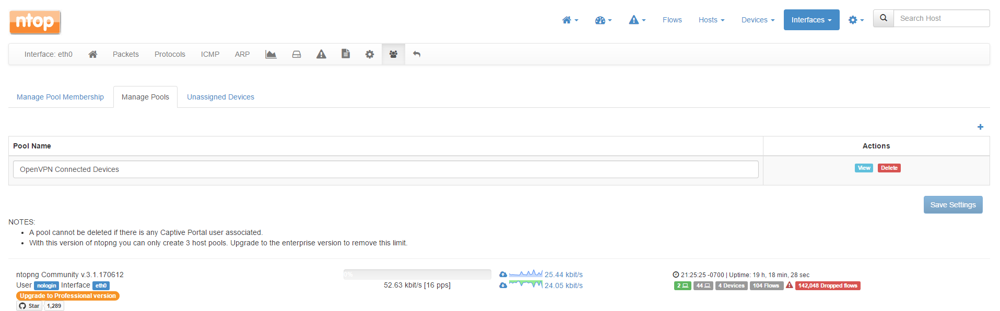
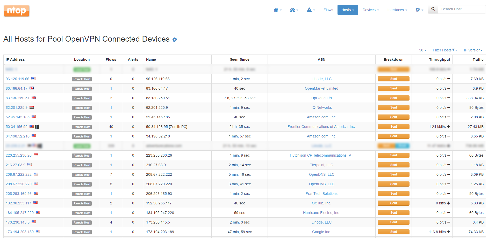

## Overview of ntopng Network Monitoring System

In this tutorial you will configure and install [ntopng](https://www.ntop.org/products/traffic-analysis/ntop/) on your Linode. The tutorial will also cover configuration examples and suggestions for the web administration interface. After you complete the tutorial and have the network monitor deployed, you'll be able to:

-   Monitor and analyze traffic from your Linode, including security threats.
-   Create Host Pools to group connected devices together based on your own criteria.
-   Work with the user interface and view statistics, as well as make your own configurations.

### Before You Begin

You will need root access to your Linode, or a user account with `sudo` privilege.

Update your system and install `ethtool`:

    sudo apt update && sudo apt upgrade
    sudo apt install ethtool

### Install ntopng

1.  Go to http://packages.ntop.org/ and click the link for the operating system you want to install ntopng on. We recommend you choose the stable build over nightly.

2.  Follow the instructions to download the `.deb` or `.rpm` file and install it into your system. The install command provided also installs *[nbox](https://www.ntop.org/products/netflow/nbox/)*, a netflow application. Nbox brings requires a large amount of dependencies but is not necessary to use ntopng so you can exclude it.

### Add a System User for ntopng

Ntopng runs as the user `nobody` by default. This is a good choice for daemons requiring minimal access to the system. However, ntopng installs files in directories which the user `nobody` may not have access to. The easiest solution is to create a new user for ntop:

1.  Add user `ntopng`:

        useradd -r -s /bin/false ntopng

2.  Set permissions for user `ntopng` and installation files/directories as shown:

        mkdir /var/tmp/ntopng
        chown -R ntopng:ntopng /usr/share/ntopng /var/tmp/ntopng
        chmod 1770 -R /var/tmp/ntopng
        find /usr/share/ntopng -type d -print0 | xargs -0 chmod 744
        find /usr/share/ntopng -type f -print0 | xargs -0 chmod 755

### Disable TCP Segmentation Offload

1.  Replace `eth0` with your primary connection interface:

        ethtool -K eth0 gro off gso off tso off

2.  Verify that TCP segmentation is disabled:

        ethtool -k eth0 | grep segmentation

    Each line of the `tcp-segmentation-offload` section should be set to `off` as shown below:

        tcp-segmentation-offload: off
        tx-tcp-segmentation: off
        tx-tcp-ecn-segmentation: off
        tx-tcp-mangleid-segmentation: off
        tx-tcp6-segmentation: off

## Configure ntopng

Configuration options can be defined in a file or set from the command line. If you specify options in both the command line and the file, ntopng will prioritize settings in the configuration file.

Create a configuration file for ntopng using the example below. Replace `192.0.2.0` with your Linode’s domain or public IP address. If needed, replace `eth0` with your primary network interface. Run `man ntopng` from the terminal to see all available configuration parameters.


--user=ntopng
--interface=eth0
-w=192.0.2.0:3005
--community
--daemon
--dump-flows=logstash # optional
--disable-autologout # optional
--disable-login=1 # optional



The option flags commented with `# optional` are not mandatory. All flags requiring input must be followed by an `=` and a value.


**Configuration File Breakdown**

| Flags      |  Features  |
|:----------:|:----------:|
| --user | Designates the user `ntopng` will run under. Leaving this flag out of the configuration file will default to `nobody`.  |
| --interface | The network interface ntopng will monitor.  |
| -w | HTTP address and port used to connect to the admin interface. While port `3005` is the default, you may define any.  |
| --community | The license ntopng will run under. |
| --daemon | ntopng can be used as a forward service or as a background daemon. |
| --dump-flows | Logged traffic can be shared with other services |
| --disable-autologout | Forces ntopng to allow users to remain logged into the web interface without being deactivated for inactivity.|
| --disable-login | 1 to disable password authentication, 0 to require authentication. |

## Firewall Rules For ntopng

Ntopng requires ports `3005` and `3006` opened in your firewall.

### UFW

    ufw allow 3005:3006/tcp

### iptables

    iptables -A INPUT -p tcp --match multiport --dports 3005:3006 -j ACCEPT

## Access ntopng's Web Interface

1.  Start ntopng:

        ntopng /etc/ntopng/ntopng.conf

2.  Navigate to `192.0.2.0:3005` in a web browser, replacing `192.0.2.0` with your domain or IP. If you enabled autologin, you’ll be routed to the *Welcome* page. If you did not enable autologin, enter `username:admin` and `password:admin` in the pop-up window. You'll then be prompted to set a new password.

## Create a Host Pool

If you want to group devices over the same network or host a home media server, you can use a *host pool*. This example uses OpenVPN to group connected devices together (you do not need to be running OpenVPN).

1.  In the **Interfaces** dropdown menu, select your main connection interface. In this case, it’s `eth0`. In the menu directly below the **ntop** logo, select the icon that resembles a group of 3 people. Select **Manage Pools**.

2.  Click on the `+` icon on the far right of the screen. Give your pool a descriptive name and save.

    

3.  Click on the **Unassigned Devices** tab. This is a list of devices currently transmitting data through the Linode (you should at least see the device you’re connecting from listed here). Determine which devices you’ll add to your pool and add them. Click **Save Settings** when you’re finished.

4.  To view data from your host pool, you’ll need to mouse over the **Hosts** dropdown and select **Host Pools**. You’ll find the pool name you created listed on this page. Click on it. Here you’ll see all currently open connections from each host in your pool:

    

    
If you want to see all host connections on a single page, set the number of rows to display per page next to the filtering options above the table.


## Enable Alerts and Domain Blocking

Ntopng provides a simple and convenient method for monitoring threats.


Ntopng does not replace core security features such as a properly configured firewall. It is meant to run in addition to an existing setup.


1.  Near the top of the web interface, scroll over **Settings** and select **Preferences**. Click on **Alerts** in the menu to the left. Click on **Enable Alerts** and choose which alerts you’d like to enable.

2.  Scroll over the alert icon with the exclamation point in the top menu bar. Click on **Alerts**. All network alerts are recorded and displayed here. This page fills up quickly due to internet traffic and bot probes. If you locked down all ports on your machine excluding those needed for connections, ntopng will log all attempts to bypass those ports.

    In addition, ntopng receives nightly updates to a blacklisted hosts file, supplied by [spamhaus.org](https://spamhaus.org) and [dshield.org](https://dshield.org). Connections made to and from these blacklisted hosts will be blocked outright by ntopng. While this should not be considered a full security solution, this is a good start to counteract malware and spam from infecting systems on your network.

### Next Steps

Now that you have some basic knowledge of how ntopng is used and some idea of its capabilities, you may want to further explore configurations for your specific situation. You can find detailed information at the [ntopng product page](https://www.ntop.org/products/traffic-analysis/ntop/) of ntop's website.

Also see *[Network Security Using ntopng](http://www.ntop.org/wp-content/uploads/2017/04/NetworkSecurityUsingntopng.pdf)* for a thorough guide on using ntopng to enhance the security of your network.
