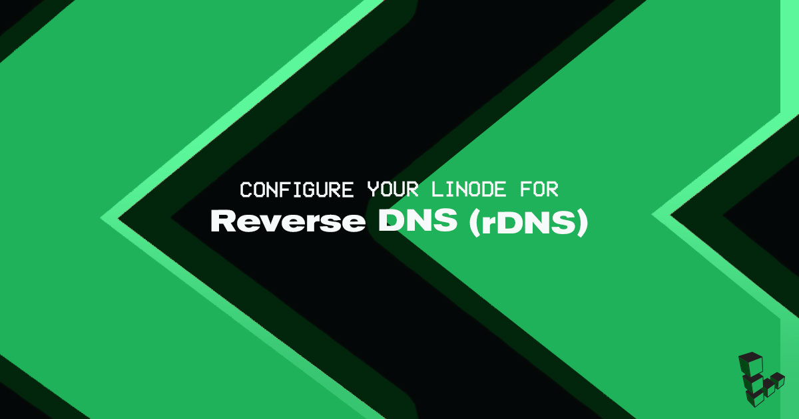
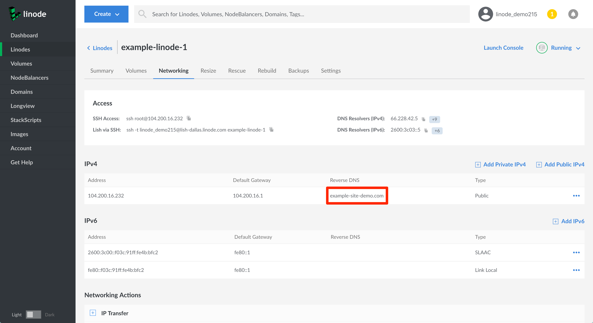

Computers use DNS to determine the IP address associated with a domain name. *Reverse* DNS lookup does the opposite by resolving an IP address to a designated domain name. You should always set the reverse DNS, even if your Linode hosts more than one domain.

Reverse DNS uses a *pointer record* (*PTR*) to match an IP address with a domain or subdomain. PTR records are generally set with a hosting provider, so reverse DNS is set in the Linode Cloud Manager.

## Before You Begin

Before setting the reverse DNS for your Linode, configure your domain zone and DNS records through Linode's [DNS Manager](/docs/platform/manager/dns-manager-new-manager/). See our [Introduction to DNS Records](/docs/networking/dns/dns-records-an-introduction/) and [Common DNS Configurations](/docs/networking/dns/common-dns-configurations/) guides for more information about PTR and DNS.

Specifically, you will need to create an *A record* for the domain name (or subdomain) that you want to assign your reverse DNS to. The value of this A record should be the IP address that you're setting up reverse DNS on.

## Setting Reverse DNS

1. Click on the **Linodes** link in the sidebar to access a list of all your Linodes.

1. Select the Linode whose reverse DNS you would like to set up and click on its **Networking** tab.

1. Find the IP address whose reverse DNS you would like to set up and click on its **more options ellipsis**. Then, select **Edit RDNS** from the dropdown menu.

    

1. In the **Edit Reverse DNS** field, add your Linode's fully qualified domain name and click on the **Save** button.

    
If you did not previously set up an A record for your domain that matches your Linode's IP address, you will see an error like the following:


We were unable to perform a lookup for 'example.com' at this time.


You may also see this error if you very recently created your A record, as it can take some time for your DNS changes to propagate.


1. You should now see the domain name you entered listed under the **Reverse DNS** column.

    

    
If you want to set up reverse DNS for both the IPv4 and IPv6 addresses, you can perform the same steps for the IPv6 address.


### Ipv6 Pools

While single IPv6 addresses will be configured following the same process as IPv4 addresses, IPv6 pools will be configured a little differently.

1. To begin, follow the steps for [Setting Reverse DNS](#setting-reverse-dns) using your pool instead of an individual IP address. Once you finish with step 3, you will notice that a new field has appeared which asks you to enter an IPv6 address for your pool.

2. Enter the IPv6 address you'd like to use, your fully qualified domain name, and click on the `save` button.

    

3. If you want to add more IPv6 addresses from your pool, you can repeat the process. Once more than one rDNS entry is created for a single pool, the **Reverse DNS** column of the IPv6 table will show you exactly how many IP addresses have been given rDNS entries from your pool.

    

4. To see each rDNS entry in more detail, click on the addresses entry in the rDNS column for your IPv6 range. A new window will appear listing the IPv6 addresses you've configured, along with their associated domain names.