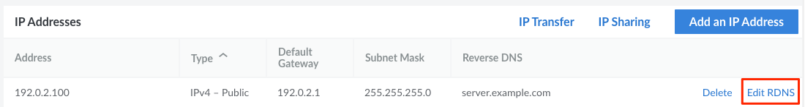
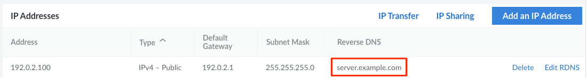
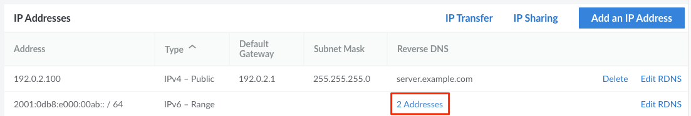

Computers use DNS to determine the IP address associated with a domain name. *Reverse* DNS lookup does the opposite by resolving an IP address to a designated domain name. You should always set the reverse DNS, even if your Linode hosts more than one domain.

Reverse DNS uses a *pointer record* (*PTR*) to match an IP address with a domain or subdomain. PTR records are generally set with a hosting provider, so reverse DNS is set in the Linode Cloud Manager.

## Determine the Domain Name to Use for rDNS

First, you need to decide what FQDN (full qualified domain name) to use as your rDNS value. The structure of an FQDN is `[subdomain].[domain].[tld]`. For instance, this could be `web-01-prod.example.com` if you're hosting a website or `mail.example.com` for a mail server. Commonly, your rDNS domain should match the FQDN hostname of your Linode. If you haven't yet configured your hostname, see [Configure a Custom Hostname](/docs/guides/set-up-and-secure/#configure-a-custom-hostname) for example hostnames and instructions.

## Configure DNS Records

Before setting the rDNS value for your Linode's IP addresses, you must first add DNS records that map your domain to the public IPv4 address and IPv6 address belonging to your Linode. To do this, log in to whichever service you use to manage your domain's DNS records. This may be the Linode [DNS Manager](/docs/guides/dns-manager/), your domain's registrar, or a third-party DNS service. The instructions below assume you are using Linode's DNS Manager, though most DNS services work in a similar fashion.

1. Log in to the [Cloud Manager](https://cloud.linode.com/) and select **Domains** from the main navigation menu.

1. Within the list of domains that appears, click the **Edit** link corresponding with the domain you wish to use for rDNS. If your domain is not listed, you may be using a different DNS service.

1. Add the following two records by following the instructions within the [Add DNS Records](/docs/guides/dns-manager/#add-dns-records) guide.

    - *A Record*: Enter the subdomain you wish to use in the **Hostname** field and the public IPv4 address of your Linode in the **IP Address** field.
    - *AAAA Record*: Enter the subdomain you wish to use in the **Hostname** field and the public IPv6 address of your Linode in the **IP Address** field.

See our [Introduction to DNS Records](/docs/guides/dns-records-an-introduction/) and [Common DNS Configurations](/docs/guides/common-dns-configurations/) guides for more information about PTR and DNS records.

## Setting Reverse DNS

1. Log in to the [Cloud Manager](https://cloud.linode.com/) and click on the **Linodes** link in the sidebar to access a list of all your Linodes.

1. Select the Linode whose reverse DNS you would like to set up and navigate to the **Network** tab.

1. Find the IP address whose reverse DNS you would like to configure and click on the **Edit rDNS** button, which may be available within the **more options** ellipsis menu on smaller screen sizes.

    

1. In the **Edit Reverse DNS** form, enter the FQDN you've configured in a previous step and click on the **Save** button. The default value of `x.ip.linodeusercontent.com` can be safely removed or replaced. Leave the field blank if you wish to remove the previously configured rDNS value without setting a new value.

    
If you did not previously set up an A record for your domain that matches your Linode's IP address, you will see an error like the following:


We were unable to perform a lookup for 'example.com' at this time.


You may also see this error if you very recently created your A record, as it can take some time for your DNS changes to propagate.


1. You should now see the domain name you entered listed under the **Reverse DNS** column.

    

1. If you want to set up reverse DNS for both the IPv4 and IPv6 addresses, you can perform the same steps for the IPv6 address.

### IPv6 Pools and Routed Ranges

While single IPv6 addresses can be configured following the same process as IPv4 addresses, reverse DNS for IPv6 pools (/116) and routed ranges (/64, /56) are configured a little differently.

1. Follow the steps for [Setting Reverse DNS](#setting-reverse-dns), clicking the **Edit rDNS** button next to an IPv6 pool or range (instead of an individual address).

2. In the **Edit Reverse DNS** form, enter the IPv6 address you'd like to use as well as the fully qualified domain name for that address. The IPv6 address needs to be a valid address within the selected IPv6 pool or range. Click on the **Save** button.

3. You can add or edit the rDNS values for other IPv6 addresses within that IPv6 pool or range by repeating this process. Once more than one rDNS entry is added, the **Reverse DNS** column of the IPv6 table will show you exactly how many IP addresses have been given rDNS entries.

    

4. To see each rDNS entry in more detail, click on the addresses entry in the rDNS column for your IPv6 pool or range. A new window will appear listing the IPv6 addresses you've configured along with their associated domain names.