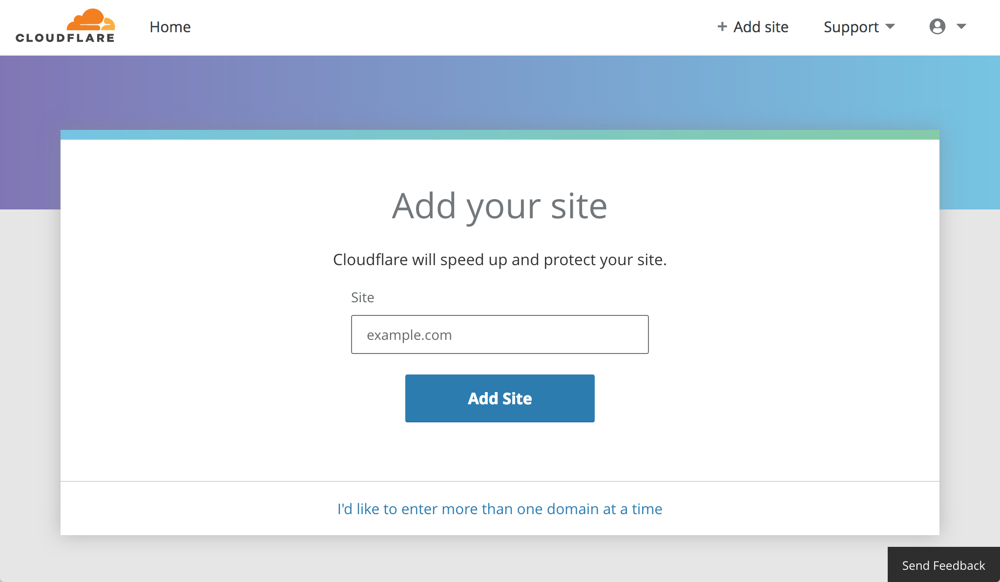
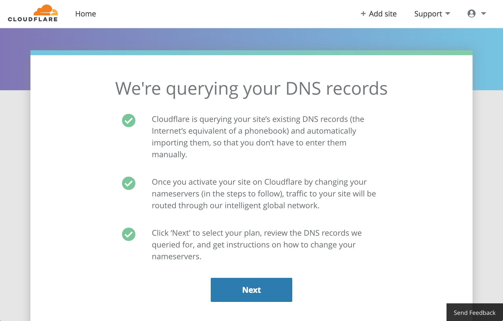
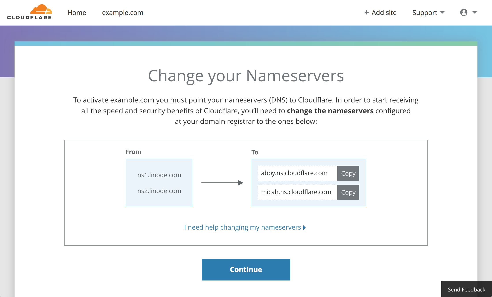
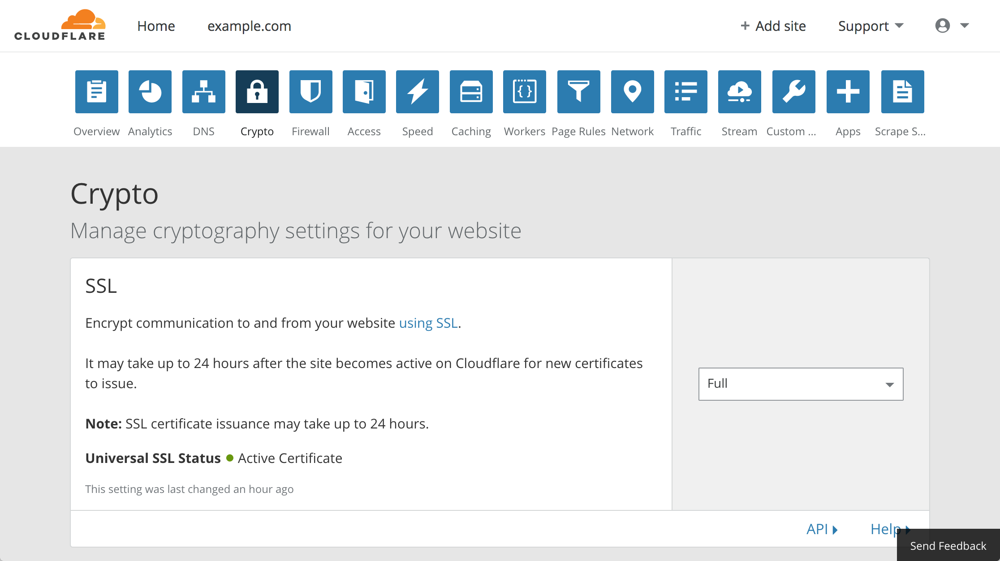
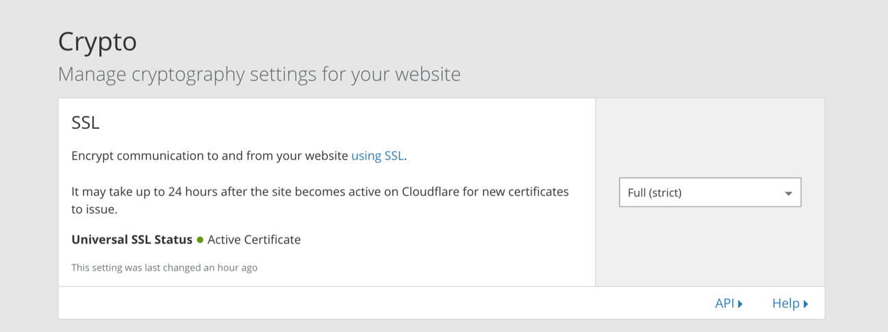
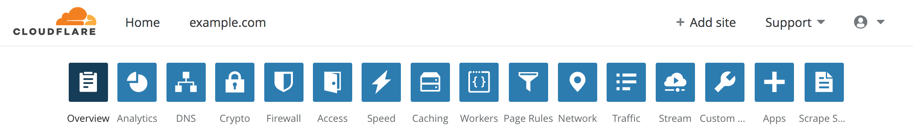

[Cloudflare](https://www.cloudflare.com) provides a *content delivery network* (CDN) for websites, APIs, and other applications hosted on the web. The Linode platform is compatible with Cloudflare. If you run a web application on a Linode, you can enroll it in Cloudflare's CDN. Using the Cloudflare network can speed up your application's response time and protect your Linode from denial-of-service attacks (DoS).

## How Cloudflare Works

Cloudflare operates a network of servers around the world, and when you sign up for Cloudflare, those servers will cache the content from your application. These caching servers are referred to as [*edge servers*](https://www.cloudflare.com/learning/cdn/glossary/edge-server/).

In this arrangement, the Linode running your web application is referred to as the [*origin server*](https://www.cloudflare.com/learning/cdn/glossary/origin-server/), as it is the origin of all content that will be served by Cloudflare.

After you sign up for Cloudflare, your site's visitors will no longer directly open connections on your Linode. Instead, they will open connections on the edge servers in Cloudflare's network, and those edge servers will open connections on your Linode to retrieve the content for each request.

To enable this network flow, Cloudflare will take control over the DNS records for your domain. You will no longer use Linode's DNS servers or any other DNS services for that domain. Cloudflare assigns their edge servers' IP addresses to your DNS records.

## Benefits of Using Cloudflare

Because the edge servers will receive your visitors' requests and can cache your content, using Cloudflare offers these core benefits:

-   **Downtime protection:** If your web server experiences unexpected downtime, Cloudflare can continue to serve a cached version of your site while your system administrators investigate the issue on your origin server.
-   **Lower server load:** If an edge server responds to your visitor's request with a cached version of that request's content, your origin server does not need to generate that content and does less work over time.
-   **Faster response time:** The edge servers in Cloudflare's network will often be geographically closer to your visitors, so the cached content that they serve will be returned to your visitors faster. For example, if your origin server is located in Linode's Dallas region, but one of your visitors is located in Argentina, a round trip between Argentina and Dallas would feature a higher latency than a round trip between Argentina and Cloudflare's edge servers in South America. This will be true all around the world, which means that you can keep your origin server in one location and still have fast service everywhere.

The Cloudflare dashboard allows you to configure settings for what content should be cached and the duration for which that cache should be valid.

### DDoS Protection

In addition to caching content, Cloudflare's network is engineered to absorb and deflect Distributed Denial of Service (DDoS) attacks. While your Linode may be able to deflect smaller attacks by specifying firewall rules, Cloudflare's network is able to handle much larger attacks that would overwhelm your firewall.

### Keeping Your Linode's IP a Secret

When you set up Cloudflare, you should keep your Linode's IP address secret from everyone except for Cloudflare. This is because if an attacker were able to discover the IP, they could direct a DDoS towards it. To keep the address hidden, make sure that none of your domains and DNS records reference it.

If you were previously attacked and are setting up Cloudflare to protect yourself from continued attacks, [contact Linode Support](/docs/platform/support/#contacting-linode-support) and request a new IP address for your Linode for use with Cloudflare.

If you're not sure if your Linode's IP is still directly referenced by any of your DNS records, you can run `nmap` with [the following options](https://nmap.org/nsedoc/scripts/dns-brute.html) to check for possible references. `nmap` will try to resolve a set of common subdomains on your domain:

    nmap --script dns-brute example.com

A frequent source of accidental IP exposure is when [your MX records directly reference your Linode](https://support.cloudflare.com/hc/en-us/articles/115001325507-Your-MX-record-exposes-your-origin-IP-What-does-this-mean-). [Other reasons](https://www.ericzhang.me/resolve-cloudflare-ip-leakage/) for IP leakage include web crawler caching of older DNS records and the accidental broadcast of your IP from your services' request responses.

## Set Up Cloudflare

Cloudflare offers a free tier of service which enables the benefits described in this guide. This free tier is used to explore how to sign up for the service. You will need a registered domain and [DNS record](/docs/networking/dns/dns-manager-overview/#dns-set-up-checklist) set up on your Linode before proceeding with these steps.

1.  Create an account on [Cloudflare.com](https://dash.cloudflare.com/sign-up).

1.  After creating your account, you are presented with a form that asks for your domain name:

    

1.  The Cloudflare site presents a screen explaining that the service is scanning your current DNS records:

    

1.  The *Select a Plan* screen will ask you to choose a plan. Select the free tier. You can upgrade your plan later if you'd like:

    

1.  The Cloudflare site will present the DNS query results for your domain. The query scans the current DNS records for the apex of your domain (e.g. `example.com`) and common subdomains (e.g. `www.example.com`). This scan will likely not detect custom subdomains (e.g. `mysubdomain.example.com`). You can manually add any of your current records that were missed by the scan using the provided form:

    

    The table displays an *orange cloud* icon for hostnames that will be routed through Cloudflare's network. A *gray cloud* denotes hostnames which bypass Cloudflare's network. You can toggle between these two options. Consult [Cloudflare's documentation](https://support.cloudflare.com/hc/en-us/articles/200169626-What-subdomains-are-appropriate-for-orange-gray-clouds-) to determine which services you should route through their network.

1.  Change the [name servers](/docs/guides/dns-records-an-introduction/#name-servers) configured with your domain registrar to the ones listed under the *To* heading. This sets Cloudflare's nameservers as the [*authoritative name servers*](https://en.wikipedia.org/wiki/Name_server#Authoritative_name_server) for your domain:

    

    Check your domain registrar information using a `whois` website like [whois.net](https://whois.net). The steps for changing your authoritative name servers vary slightly depending on which registrar you use. Cloudflare provides a [list of instructions](https://support.cloudflare.com/hc/en-us/articles/205195708-Step-3-Change-your-domain-name-servers-to-Cloudflare#step3) for common registrars.

1.  Cloudflare will present a dashboard for your new site. If you haven't changed the nameserver values with the registrar or if the changes haven't propagated, a `Status: Website not active (DNS modification pending)` message will display:

    

    Otherwise, you will see a `Status: Active` message:

    

## Set up SSL with Cloudflare

Cloudflare's SSL settings can be controlled from the *Crypto* section of the dashboard:

### How SSL Works with Cloudflare

Prior to joining Cloudflare, your web server directly responded to your visitors' requests. If you had previously enabled HTTPS, your web server provided your SSL certificate. When using Cloudflare, your visitors will connect to Cloudflare's edge servers, which do not host your SSL certificate by default.

On the free plan, Cloudflare's edge servers serve a *Universal SSL* certificate, and this option is enabled by default. The free Universal SSL certificate also features the domains of other Cloudflare customers. Their edge servers will decrypt HTTPS requests they receive from your visitors using this certificate in order to cache and filter the content.

This arrangement means that a secure connection symbol will be displayed by your web browser when visiting your site, even if you had not set up SSL at all on your Linode before. **If you do not have SSL set up on your origin server, then the traffic between the edge servers and your origin server will still be unencrypted.**

In total, there are four different SSL modes:

-   **Off**: Cloudflare will serve content over HTTP from its edge servers to site visitors. HTTPS requests will be redirected to HTTP by the edge servers. The edge servers will only open HTTP connections to your origin server.

-   **Flexible SSL**: Edge servers will respond to HTTPS requests. Edge servers will make connections to your origin server over HTTP. This option is not recommended by Cloudflare and should only be used if you are unable to set up SSL on your origin server.

    
If your web server is configured to redirect all HTTP requests to HTTPS while using Cloudflare's Flexible SSL mode, visitors may encounter a redirect loop when attempting to view your site.


-   **Full SSL**: All connections between your site visitors and the edge servers will be redirected to HTTPS, and the edge servers will open HTTPS connections to your origin server. This option requires that you set up SSL on your origin web server with, at minimum, a [self-signed certificate](/docs/guides/create-a-self-signed-tls-certificate/). The certificate you use on the origin server will not be validated by Cloudflare.

-   **Full SSL (strict)**: All connections between your site visitors and the edge servers will be redirected to HTTPS, and the edge servers will open HTTPS connections to your origin server. This option requires that you set up SSL on your origin web server with a certificate authority that Cloudflare can validate. A valid certificate can be obtained through [Let's Encrypt](https://letsencrypt.org), or directly from [Cloudflare](https://blog.cloudflare.com/cloudflare-ca-encryption-origin/).

### Set Up SSL on the Origin Server

Setting up SSL on your origin server will enable you to use Cloudflare's *Full SSL* mode or *Full SSL (strict)* modes. If you already have SSL set up on the origin server, skip to Step 8 of this section.

If you do not have a certificate for your origin server, Cloudflare provides an easy way of getting one via their own [*Origin CA*](https://blog.cloudflare.com/cloudflare-ca-encryption-origin/) (Certificate Authority). This certificate can be used with *Full SSL (strict)* mode.


Certificates from Cloudflare's Origin CA are only trusted within the Cloudflare network. You will need to obtain and install a new certificate if you stop using Cloudflare and have one of their certificate's installed on your origin server.


1.  From the Crypto tab of the Cloudflare dashboard, scroll to the *Origin Certificates* panel and click the *Create Certificate* button:

    

1.  In the Origin Certificate Installation panel, leave the default values for private key/CSR generation, hostname, and certificate validity duration. Scroll to the bottom of this panel and click **Next**.

1. The origin certificate and the private key will appear in PEM format:

    

    Copy the contents of each into two separate files on your computer: name the certificate file `example.com.pem`, and the private key file `example.com.key`. Substitute your domain name for `example.com` in those filenames.

1.  Upload these files to your Linode. You can upload files by using an SFTP client like [FileZilla](/docs/guides/filezilla/) or you can use the command line tool [rsync](/docs/guides/introduction-to-rsync/).

1.  Configure your Linode's web server software to listen on port `443` (HTTPS) to use the new certificate and private key. Instructions for doing this can vary depending on which web server software you use:

    - Cloudflare has a number of guides for installing the Origin CA certificate with different software packages. Consult their [documentation](https://support.cloudflare.com/hc/en-us/sections/207182687-Origin-CA) for instructions.

    - You can also adapt instructions from Linode's various [SSL Certificate guides](/docs/security/ssl/).

1.  Be sure to restrict the file permissions of your certificate and private key files on your Linode so that only your web server process can read them. For example, if your files are stored in the directory `/etc/ssl/certs/example.com/`, run:

        sudo chown -R root:root /etc/ssl/certs/example.com/
        sudo chmod -R 400 /etc/ssl/certs/example.com/

    These commands change ownership of that directory and its files to `root:root` and give read access only to the `root` user.

1.  After you've finished updating the configuration of the web server, restart or reload the web server process.

1.  From the Crypto tab of the Cloudflare dashboard, set your SSL mode to **Full (Strict)**.

If you see an error from Cloudflare when visiting your site, your web server's SSL configuration may be incorrect. To troubleshoot this, review your web server's error logs.

### Set Up Dedicated SSL on the Edge Servers

The Universal SSL certificate that is provided for free by Cloudflare is shared with other customers. This certificate will have a *common name* (CN) that looks similar to `sni170707.cloudflaressl.com`. This certificate uses SNI (Server Name Indication) technology to function. SNI is incompatible with [some much older browsers](https://en.wikipedia.org/wiki/Server_Name_Indication#Implementation).

You can order a [dedicated SSL certificate](https://support.cloudflare.com/hc/en-us/articles/228009108-Dedicated-SSL-Certificates) from Cloudflare which will use your domain name as the CN and will not be shared with other customers. This is a fully managed solution from Cloudflare, which provides certificate auto-renewal.

These certificates can be entirely administered through the Cloudflare website. To purchase this service from Cloudflare:

1. Scroll to the *Edge Certificates* panel of the *Crypto* section on Cloudflare's dashboard and click **Order SSL Certificate**:

    

1. Select the certificate type and click **Next**. There are two options for dedicated SSL certificates: a $5/month plan will cover your domain and a wildcard representing one-level subdomains, and a $10/month plan will cover your domain and up to 50 specific subdomains. These certificates require SNI compatibility in web browsers. You can purchase these certificates while otherwise remaining on the free Cloudflare tier.

1. Provide the certificate hostnames. If ordering the $5/month plan, you can leave the generated values unchanged. Click **Next**.

1. Cloudflare will validate the domain before ordering the certificate for your domain. When the validation is complete, click **Next** and provide a payment type to complete the purchase.


If you would like to upload your own SSL certificate from another authority, click the **Upload Custom SSL Certificate** button in the Edge Certificates panel. This functionality requires that you subscribe to the Business Website Cloudflare tier.


## Next Steps

The Cloudflare dashboard offers a wide array of settings and features that you can explore:

For more information on the features in each section, click the **Help** link in the bottom-right corner of the selected feature's panel.
