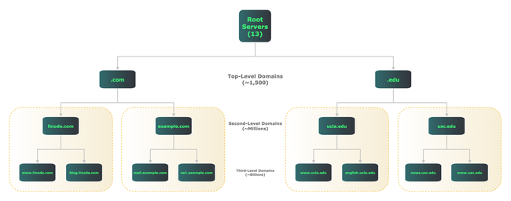

The Domain Name System (DNS) is a worldwide directory that maps names to addresses and vice versa. It also provides many other types of information about computing resources. Although the DNS operates largely hidden from view, the global Internet would not work without it.

This guide explains what DNS is, how it works, and how to build your own authoritative name server.

This is the first in a series of four DNS guides. Future guides cover primary and secondary name server setup, securing DNS with DNSSEC, and other security measures to address user privacy concerns.

## What Is DNS?

DNS is a global directory of computing resources. It can locate servers, PCs, phones, IoT devices, routers, switches, and essentially anything with an IP address. DNS also holds information linking computers to security keys, services such as instant messaging, GPS coordinates, and much more.

DNS design is *hierarchical* and *distributed*. The diagram below illustrates both points. It shows how DNS divides all resources into domains, and delegates different levels of name servers to provide information within each domain.

[](DNS-Hierarchy.png)

At the top of the DNS tree are the root servers, usually referred to by a single dot ("."). The root servers are actually comprised of 13 different sets of servers, each operated by a different organization. They act as a starting point for all other parts of the hierarchy.

Below the root servers are top-level domains (TLDs). Common TLDs include `.com`, `.edu`, and `.org`, but there are currently around 1,500 TLDs.

Further down in the hierarchy are second- and third-level domains, and so on, referring to their distance from the root. The domain `example.com` is an example of a second-level domain, while `engineering.example.com` is a third-level domain.

Regardless of level, all DNS name servers provide information about items within their domains. For example, `linode.com` name servers provide information about hostnames, addresses, mail servers, and name servers within that domain.

## How Does DNS Work?

DNS clients use recursion, the concept of repeating a process multiple times using information gleaned from the previous step, to learn how to locate resources.

For example, when visiting [www.linode.com](https://www.linode.com), your system first conducts a series of recursive DNS exchanges to learn the server’s IP address before it can connect with the Linode web server.

First, your client checks to see if it has an IP address for the Linode webserver in its local cache. If not, it asks your local DNS server.

If the local DNS server doesn’t have an IP address in its cache, it then asks one of the root servers how to reach [www.linode.com](https://www.linode.com). The root server replies, essentially saying "I don’t know, but I see you’re asking about something in the `.com` domain. Here are some IP addresses for `.com` name servers".

Your local DNS server then repeats its query, this time to a `.com` name server. The `.com` name server replies, "I don’t know, but I can tell you the IP addresses of name servers for [linode.com](https://linode.com)".

The local DNS server then asks, for the third time, what IP addresses correspond to the hostname [www.linode.com](https://www.linode.com). This time, the [linode.com](https://linode.com) name servers are authorized to provide a direct answer to your question.

A Linode name server responds with IP addresses for the Linode web server. Your local DNS server passes along that information to your client, and caches it for future use.

Finally, your system has an IP address for the Linode web server. It can now set up a TCP connection and make an HTTP request.

Before you could retrieve the web page, your client and the local DNS server had multiple conversations with three outside sets of DNS servers, plus your local DNS server, just to get an IP address.

Believe it or not, that's a relatively simple example. A popular commercial site, such as a news site, has advertising and other embedded third-party content. This could require having these sets of DNS conversations several dozen times, or more, just to load a single page.

While all this occurs in milliseconds, it underscores how critical DNS is to a functional Internet. Everything begins with a series of DNS queries.

## Types of DNS Servers

There are several types of DNS servers: *authoritative* (both primary and secondary), *forwarding*, and *recursive*. All three types may reside on a single server, or may be assigned to separate dedicated servers for each type. Regardless of location, these servers work cooperatively to serve DNS information.

An authoritative server provides definitive responses for a given zone, which is a set of computing resources under common administrative control. While non-authoritative DNS servers may also store and forward answers about a zone’s contents, only an authoritative server can provide definitive answers.

A zone may be a domain such as [linode.com](https://linode.com), but there isn’t always a 1:1 relationship between domains and zones. Authoritative servers may delegate authority to subdomains. For example, the `.com` authoritative servers delegate responsibility for `linode.com` to Linode’s name servers. In this case, `linode.com` is part of the `.com` domain, but `.com` and `linode.com` represent different zones.

Each zone should have at least two authoritative name servers, for both redundancy and load-balancing of user queries. This guide covers setup of a primary name server.

Both primary and secondary name servers are authoritative, and appear nearly identical to the outside world. However, secondary name servers automatically receive all zone updates from the primary name server. After initial setup, zone configuration changes only need to be made once, on the primary name server. It then automatically pushes out all updates to any secondary name servers.

A forwarding server is one that makes external DNS requests on behalf of clients or other DNS servers. Your local DNS server, while not authoritative for most zones, is most likely either a forwarding server itself, or configured to send requests to one. When you ask for a DNS resource outside your zone, a forwarding server finds that resource.

A recursive resolver makes DNS queries, either for itself or on behalf of other clients, and optionally caches the replies. As with any type of caching, it’s best to store information as close as possible to your client. While your local client may perform recursion, your local DNS server almost certainly does.

By far the most common DNS server software is [Bind 9](https://www.isc.org/bind/), the open source package maintained by the Internet Systems Consortium. Bind can function as any type of DNS server. It also supports many DNS extensions that go well beyond it's original design goals.

Because of Bind’s age and size, some users prefer smaller, more modern DNS implementations. Two of the more popular are [NSD](https://www.nlnetlabs.nl/projects/nsd/about/), an authoritative-only name server, and [Unbound](https://nlnetlabs.nl/projects/unbound/about/), a resolver that also does forwarding and caching. This guide covers authoritative name server setup using NSD.

## Resource Records

Before diving into setup details, familiarize yourself with the different types of information DNS can provide within a given zone. Think of DNS as a distributed database, and zones as tables within the database. *Resource records* (RR) are entries within each table.

Each record describes a different type of information. For example, "A" records associate one hostname with one IPv4 address, while "AAAA" records do the same for IPv6.

There are dozens of RR types; [this Linode guide](/docs/products/networking/dns-manager/get-started/#add-dns-records) covers some of the most common and important ones. Most authoritative name servers need at least the following RR types:

-   [**A**](/docs/products/networking/dns-manager/guides/a-record/): Maps a hostname to an IPv4 address.
-   [**AAAA**](/docs/products/networking/dns-manager/guides/a-record/): Maps a hostname to an IPv6 address (pronounced "quad-A").
-   [**MX**](/docs/products/networking/dns-manager/guides/mx-record/): Identifies a mail server for a given zone, and gives its priority.
-   [**NS**](/docs/products/networking/dns-manager/guides/ns-record/): Identifies a name server for a given zone.
-   [**SOA**](/docs/products/networking/dns-manager/guides/soa-record/): (Start of Authority) lists primary name server, administrative email contact, serial number, and default timers for a given zone.

The above list is enough for a bare-bones setup, but other common RR types include:

-   [**CNAME**](/docs/products/networking/dns-manager/guides/cname-record/): Maps a hostname alias to a hostname defined in an A or AAAA record.
-   [**PTR**](https://www.linode.com/community/questions/126/how-do-i-add-a-ptr-record): Maps an IP address to a hostname (sometimes referred to as "reverse DNS" or "rDNS").
-   [**TXT**](/docs/products/networking/dns-manager/guides/txt-record/): Provides information in text form and often aids in email security through use of [SPF, DKIM, and DMARC records](https://dmarcly.com/blog/how-to-implement-dmarc-dkim-spf-to-stop-email-spoofing-phishing-the-definitive-guide).

## Before You Begin

1.  If you have not already done so, create a Linode account and Compute Instance. See our [Getting Started with Linode](/docs/guides/getting-started/) and [Creating a Compute Instance](/docs/guides/creating-a-compute-instance/) guides. This guide is for Ubuntu 22.04 LTS instances.

1.  Follow our [Setting Up and Securing a Compute Instance](/docs/guides/set-up-and-secure/) guide to update your system. Set the timezone, configure your hostname, and create a limited user account. To follow along with this guide, give your server the hostname `ns1` and configure the hosts file as follows:

    ```file {title="/etc/hosts"}
    127.0.0.1 localhost
    203.0.113.10 ns1.yourdomainhere.com ns1
    2600:3c01::a123:b456:c789:d012 ns1.yourdomainhere.com ns1
    ```

    Replace the example IP addresses with your Linode instance's external IPv4 and IPv6 addresses, and `yourdomainhere.com` with your domain name.


This guide is written for a non-root user. Commands that require elevated privileges are prefixed with `sudo`. If you’re not familiar with the `sudo` command, see the [Users and Groups](/docs/guides/linux-users-and-groups/) guide.


## Building an Authoritative Server

After completing the prerequisite steps above, it’s time to build a primary authoritative name server using NSD.


It is far easier to have Linode do DNS hosting for you. Linode provides DNS service via the **Domains** item in its dashboard. The Linode graphical interface offers quick, simple setup. In contrast, running your own DNS server takes some time and regular maintenance. The benefits are more control over your DNS information, and a better understanding of the DNS protocol.


### Install NSD

1.  Open an SSH session to your instance and install NSD:

    ```command
    sudo apt install nsd
    ```

1.  Configure the NSD control utility, `nsd-config`:

    ```command
    sudo nsd-control-setup
    ```

    The output should appear as follows:

    ```output
    setup in directory /etc/nsd
    removing artifacts
    Setup success. Certificates created.
    ```

    If not, check `/var/log/syslog` for errors.

### The nsd.conf File

As packaged for Ubuntu 22.04 LTS, NSD’s main configuration file (`nsd.conf`) points to other files in `/etc/nsd/nsd.conf.d`, but that directory is empty by default.

Since the NSD documentation already includes a fully annotated sample configuration file, copy that file and work from there. The sample file lists many options with plenty of comments, making it a useful learning tool.

1.  First, gather your Linode's external IPv4 and IPv6 addresses. Follow this guide to [Find Your Linode's IP Address](/docs/guides/find-your-linodes-ip-address) or use the following command:

    ```command
    ip a
    ```

    Identify all configured IP addresses except those on loopback interfaces or those with local-link (`fe80::`) addresses.

    ```output
    1: lo: <LOOPBACK,UP,LOWER_UP> mtu 65536 qdisc noqueue state UNKNOWN group default qlen 1000
        link/loopback 00:00:00:00:00:00 brd 00:00:00:00:00:00
        inet 127.0.0.1/8 scope host lo
           valid_lft forever preferred_lft forever
        inet6 ::1/128 scope host
           valid_lft forever preferred_lft forever
    2: eth0: <BROADCAST,MULTICAST,UP,LOWER_UP> mtu 1500 qdisc mq state UP group default qlen 1000
        link/ether f2:3c:93:c7:0c:d5 brd ff:ff:ff:ff:ff:ff
        inet 45.79.218.211/24 brd 45.79.218.255 scope global eth0
           valid_lft forever preferred_lft forever
        inet6 2600:3c02::f03c:93ff:fec7:cd5/64 scope global dynamic mngtmpaddr noprefixroute
           valid_lft 60sec preferred_lft 20sec
        inet6 fe80::f03c:93ff:fec7:cd5/64 scope link
           valid_lft forever preferred_lft forever
    ```

    In the example output above, the pertinent IP addresses are `45.79.218.211` (IPv4) and `2600:3c02::f03c:93ff:fec7:0cd5` (IPv6).

1.  Change into the `/etc/nsd/` directory and preserve the original file by creating a copy with the `.orig` extension:

    ```command
    cd /etc/nsd
    sudo mv nsd.conf nsd.conf.orig
    ```

1.  Now copy the original file to `/usr/share/doc/nsd/examples` and open it:

    ```command
    sudo cp /usr/share/doc/nsd/examples/nsd.conf.sample nsd.conf
    sudo nano /etc/nsd/nsd.conf
    ```

    Note that `nsd.conf` comments out all `ip-address` statements, meaning NSD attempts to listen on all addresses by default.

    NSD does *not* start unless you explicitly configure your system’s external IP addresses. That’s because Ubuntu’s `systemd-resolved` process already binds to TCP and UDP ports `53` on the `localhost` address.

    Since the `localhost` address is already in use, simply binding to all addresses won’t work. Because NSD is an authoritative-only name server serving external clients, it can bind to external addresses without affecting the system’s ability to resolve addresses on the `localhost` address.

1.  Uncomment two `ip-address` statements in the `server:` section of the `nsd.conf` file, substituting your system’s addresses for these examples:

    ```file {title="/etc/nsd/nsd.conf" hl_lines="26-27"}
    server:
            # Number of NSD servers to fork.  Put the number of CPUs to use here.
            # server-count: 1

            # Set overall CPU affinity for NSD processes on Linux and FreeBSD.
            # Any server/xfrd CPU affinity value will be masked by this value.
            # cpu-affinity: 0 1 2 3

            # Bind NSD server(s), configured by server-count (1-based), to a
            # dedicated core. Single core affinity improves L1/L2 cache hits and
            # reduces pipeline stalls/flushes.
            #
            # server-1-cpu-affinity: 0
            # server-2-cpu-affinity: 1
            # ...
            # server-<N>-cpu-affinity: 2

            # Bind xfrd to a dedicated core.
            # xfrd-cpu-affinity: 3

            # Specify specific interfaces to bind (default are the wildcard
            # interfaces 0.0.0.0 and ::0).
            # For servers with multiple IP addresses, list them one by one,
            # or the source address of replies could be wrong.
            # Use ip-transparent to be able to list addresses that turn on later.
            ip-address: 45.79.218.211
            ip-address: 2600:3c02::f03c:93ff:fec7:0cd5
    ```

1.  Next, move down to the file’s `remote-control:` section. Find the `control-enable` line, uncomment it, and change `no` to `yes`:

    ```file {title="/etc/nsd/nsd.conf" hl_lines="1,4"}
    remote-control:
            # Enable remote control with nsd-control(8) here.
            # set up the keys and certificates with nsd-control-setup.
            control-enable: yes
    ```

    This allows you to add, remove, and edit DNS entries using the `nsd-control` utility without having to restart the NSD server every time.

    When done, press <kbd>CTRL</kbd>+<kbd>X</kbd> then <kbd>Y</kbd> and <kbd>Enter</kbd> to save and close the file.

1.  Verify that the configuration is valid with the `nsd-checkconf` utility (you don’t need `sudo` for this):

    ```command
    nsd-checkconf /etc/nsd/nsd.conf
    ```

1.  If there are no errors, restart the NSD daemon:

    ```command
    sudo systemctl restart nsd
    ```

### Creating a Zone File

A functional authoritative name server is now set up, but it’s not yet serving any zones. This example creates a zone file for the domain `yourdomainhere.com`, substitute your domain name as appropriate.

1.  Although this guide only creates an authoritative (master) zone, create directories for master and secondary zone files anyway:

    ```command
    sudo mkdir -p /etc/nsd/zones/master
    sudo mkdir -p /etc/nsd/zones/secondary
    ```

1.  Now create a zone file. This zone handles all forward queries (those seeking to translate hostnames to IP addresses).

    ```command
    sudo nano /etc/nsd/zones/master/yourdomainhere.com.zone
    ```

1.  Add these contents to the file, substituting your domain name and IP addresses as appropriate:

    ```file{title="/etc/nsd/zones/master/yourdomainhere.com.zone" hl_lines="1,4,12-18,20-26,28,30-31"}
    $ORIGIN yourdomainhere.com.
    $TTL 3600
    ;; SOA Record
    @   	IN  	SOA ns1.yourdomainhere.com. hostmaster.yourdomainhere.com. (
                              2023030701 ; serial
                              3600   	; refresh (1 hour)
                              900    	; retry (15 minutes)
                              2419200	; expire (4 weeks)
                              3600   	; minimum (1 hour)
                              )
    ;; A Records
    ns1        A     96.126.102.178
    ns2        A     96.126.102.178
    john       A     96.126.102.179
    paul       A     96.126.102.180
    george     A     96.126.102.181
    ringo      A     96.126.102.182
    stu        A     96.126.102.180
    ;; AAAA Records
    ns1        AAAA  2600:3c01:0:0:f03c:93ff:fe01:4070
    ns2        AAAA  2600:3c01:0:0:f03c:93ff:fe01:4070
    john       AAAA  2600:3c01:0:1:f03c:93ff:fe01:4071
    paul       AAAA  2600:3c01:0:2:f03c:93ff:fe01:4072
    george     AAAA  2600:3c01:0:3:f03c:93ff:fe01:4073
    ringo      AAAA  2600:3c01:0:4:f03c:93ff:fe01:4074
    stu        AAAA  2600:3c01:0:2:f03c:93ff:fe01:4072
    ;; MX Records
    @   MX   10   stu.yourdomainhere.com.
    ;; NS Records
    @   IN NS   ns1.yourdomainhere.com.
    @   IN NS   ns2.yourdomainhere.com.
    ```

    There are a couple of things to note in the zone file:

    -   First is the zone file syntax. Comments always begin with one or more semicolons (";"). Using a hash mark ("#") or any other character for comments results in a syntax error when the `nsd-checkzone` utility is run. It also causes the zone not to load.

    -   Second, notice that the records for `paul` and `stu` point to the same IP addresses, as do `ns1` and `ns2`. This underscores an important aspect of DNS: one hostname can refer to many addresses, and vice-versa. It is this capability that makes virtual hosting possible.

        While `paul` and `stu` only share the same IP address for demonstration purposes, `ns1` and `ns2` sharing an IP address has actual utility. Many domain registrars require a minimum of two name servers to utilize custom DNS. Since this guide only sets up a single primary name server, having records for two name servers allows you to proceed with domain delegation. The second part of our series on DNS covers how to [set up a secondary name server on a separate Linode instance](/docs/guides/dns-primary-and-secondary-server-setup).

    -   Third, note that fully qualified hostnames always have a period appended, representing the parent zone:

        ```
        @  	MX  	10  	stu.yourdomainhere.com.
        ```

        Omitting that final period, causes the NSD daemon to append the entire domain name, creating a pointer to a nonexistent resource (e.g. `stu.yourdomainhere.com.yourdomainhere.com`). Omitting the final period in zone files is the single most common DNS configuration error.

        Avoid this issue with the `$ORIGIN yourdomainhere.com.` macro that begins this zone file. This tells the NSD daemon to append "`yourdomainhere.com.`" to any host or domain name not ending with a period. For example, with `$ORIGIN yourdomainhere.com.` applied, these two A records are functionally identical:

        ```
        john                          A   	96.126.102.179
        john.yourdomainhere.com.      A   	96.126.102.179
        ```

        Again, note the final period when using the full form.

    When done, save and close the file.

1.  Use the `nsd-checkzone` utility to verify the zone file’s syntax:

    ```command
    nsd-checkzone yourdomainhere.com /etc/nsd/zones/master/yourdomainhere.com.zone
    ```

    The NSD server should return:

    ```output
    zone yourdomainhere.com is ok
    ```

    If not, the command outputs the syntax errors causing the error.

1.  Next, configure the NSD server so that it responds to queries for the newly created zone. Open the NSD configuration file again:

    ```command
    sudo nano /etc/nsd/nsd.conf
    ```

1.  Towards the end of the file, uncomment the `zone:` section along with the `name:` and `zonefile:` entries. Add your domain name and zone file as shown below:

    ```file{title="/etc/nsd/nsd.conf" hl_lines="1,2,7"}
    zone:
        name: "yourdomainhere.com""
        # you can give a pattern here, all the settings from that pattern
        # are then inserted at this point
        # include-pattern: "master"
        # You can also specify (additional) options directly for this zone.
        zonefile: "zones/master/yourdomainhere.com.zone"
    ```

    For any additional zones you create in the future, simply repeat this step, starting with a `zone:` statement. Note that the zone file locations are relative to `/etc/nsd`, so the full pathname is not necessary.

    When done, save and close the file.

1.  Validate the configuration file’s syntax:

    ```command
    nsd-checkconf /etc/nsd/nsd.conf
    ```

1.  If the server returns no errors, restart the NSD service:

    ```command
    sudo systemctl restart nsd
    ```

### Delegation at Your Registrar

The final step is to delegate name service to the new server at your domain registrar.


Linode is not a registrar. This step is performed at a third-party registrar such as [Dynadot](https://www.dynadot.com/account/signin.html), [GoDaddy](https://www.godaddy.com/), or [Hover](https://www.hover.com/domains). You must use the registrar where your domain is registered.


Every registrar’s management tool allows you to delegate DNS to one or more name servers for your domain. Usually, the registrar needs the hostname and IP addresses for each name server. Be sure to point to the new name server's hostname and IP address.


Many domain registrars require a minimum of two name servers for custom DNS. If this is the case, simply add `ns2.yourdomainhere.com` alongside `ns1.yourdomainhere.com`, and provide the same IP address for both.


In theory, delegation changes can take 24-48 hours to propagate through the global Internet. However, in practice propagation usually happens much faster, often in 5 minutes or less.

### Test Your Setup

Test the new setup with queries for DNS resource records. One popular command line tool for this is `dig`, which is already included with Linode’s Ubuntu 22.04 LTS instances.

Use the `-t` switch to specify which RR type you want to query. The following example asks for NS records for `yourdomainhere.com`, replace `yourdomainhere.com` with your own domain name:

```command
dig -t NS yourdomainhere.com
```

The server should respond (in the "ANSWER SECTION") with the hostname of your new name server:

```output
; <<>> DiG 9.18.1-1ubuntu1.3-Ubuntu <<>> -t NS yourdomainhere.com @ns1.yourdomainhere.com
;; global options: +cmd
;; Got answer:
;; ->>HEADER<<- opcode: QUERY, status: NOERROR, id: 18821
;; flags: qr aa rd; QUERY: 1, ANSWER: 1, AUTHORITY: 0, ADDITIONAL: 2

;; OPT PSEUDOSECTION:
; EDNS: version: 0, flags:; udp: 1232
;; QUESTION SECTION:
;yourdomainhere.com.    	IN   NS

;; ANSWER SECTION:
yourdomainhere.com.	3600 IN   NS   ns1.yourdomainhere.com.
yourdomainhere.com.	3600 IN   NS   ns2.yourdomainhere.com.

;; Query time: 0 msec
;; SERVER: 2600:3c01::f03c:93ff:fe01:4070#53(ns1.yourdomainhere.com) (UDP)
;; WHEN: Wed Mar 08 05:53:39 UTC 2023
;; MSG SIZE  rcvd: 168
```

Verbose output can be extremely useful in troubleshooting. However, if you don’t need all that detail, just add the `+short` flag to the query. Here’s the same query again with just the response:

```command
dig +short -t NS yourdomainhere.com
```

```output
ns1.yourdomainhere.com.
ns2.yourdomainhere.com.
```

## Conclusion

You now have a working authoritative name server. Other DNS guides cover redundancy with primary and secondary name servers, securing DNS with DNSSEC, and user privacy issues.

DNS is the essential glue that ties together the global Internet. You can opt to use Linode’s free DNS service for cloud operations, or set up your own name server as described here. Either way, a solid understanding of the protocol puts you in ultimate charge of your domain and all resources within it.