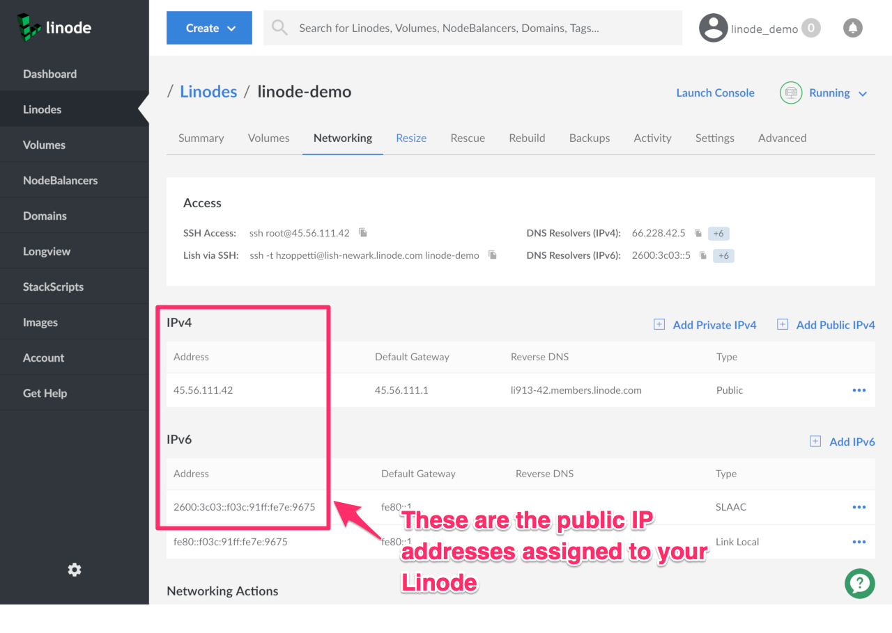
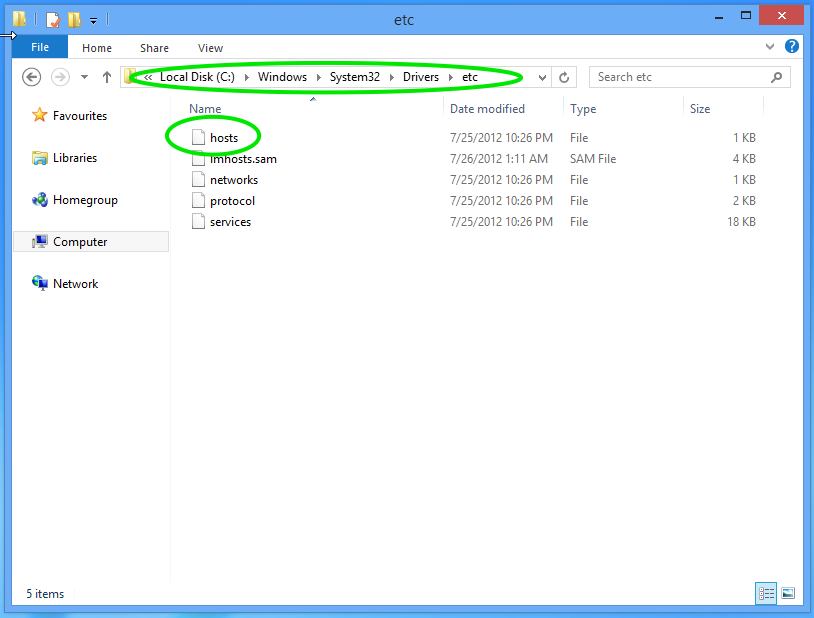
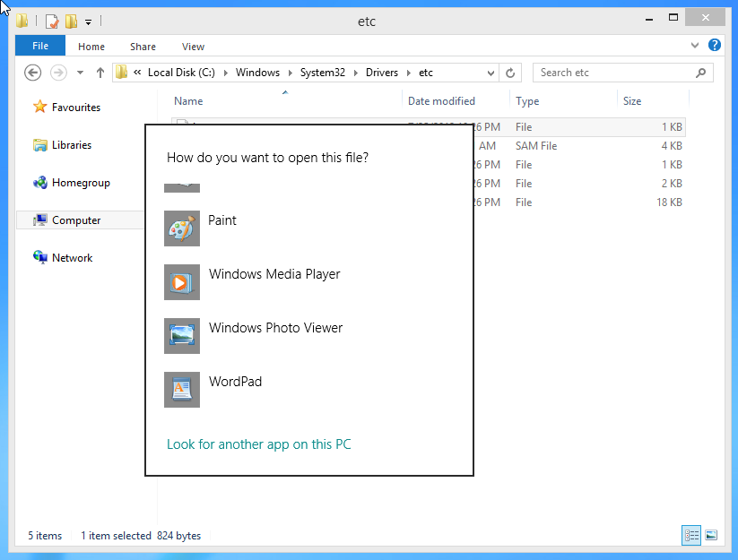
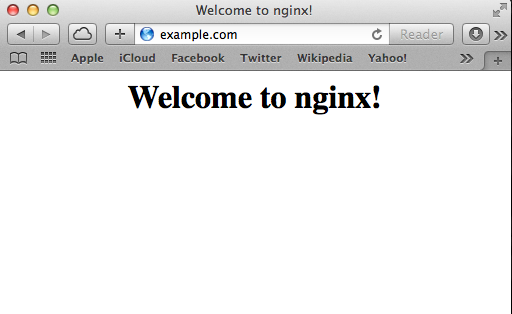

Previewing your website before updating your domain's nameservers allows you to stage and test your setup without redirecting viewers from your live site running on your old host. This is done with an entry to your local system's hosts file.

A hosts file is used to map specific hostnames to IP addresses, and takes precedence over name resolution provided by DNS queries. By manually specifying an IP/hostname pair, web traffic sent to the given domain is directed to the given IP address, regardless of the domain's actual A records. If these terms are unfamiliar, see our [DNS](/docs/guides/dns-records-an-introduction/) guide for more information.

## Find Your Linode's IP Address

1.  Log in to the [Cloud Manager](https://cloud.linode.com).
2.  Click the **Linodes** tab.
3.  Select your Linode.
4.  Click the **Networking** tab. The webpage shown below appears.

    

5.  Copy the addresses in the Public IP sections. In this example, the Linode's IPv4 address is `45.56.111.42` and its IPv6 address is `2600:3c03::f03c:91ff:fe7e:9675`.

## Edit Your Hosts File

You will need root access on Linux and macOS to edit the system's hosts file, or administrative privileges for Windows.

### Windows

1.  Navigate to `C:\Windows\System32\Drivers\etc` in Windows Explorer.

    

2.  Open the `hosts` file. Unless you've opened it before and created a file type association, Windows will ask you what program to open it in. Any text editor will work. WordPad is included in Windows by default, and was selected in the image below.

    

3.  Add the IPv4 or IPv6 address of your Linode, depending on which you'll be testing with (if not both), followed by the domain you want to test. For example:

        203.0.113.4    example.com
        2001:DB8::/3    example.com

### Mac OS X and Linux

1.  Open `/etc/hosts` in your preferred text editor.

2.  Add the IPv4 or IPv6 address of your Linode, depending on which you'll be testing with (if not both), followed by the domain you want to test. For example:

        203.0.113.4    example.com
        2001:DB8::/3    example.com

## Flush the System's DNS Cache

### Windows

1.  Click the **Start Menu**.
2.  Type **Command Prompt**.
4.  Right click on the menu entry and choose **Run as Administrator**. Run the command:

        ipconfig /flushdns

### macOS / OS X

See [Reset the DNS cache in OS X](https://support.apple.com/en-us/HT202516) on support.apple.com.

### Linux with systemd

    sudo systemctl restart network.service

## Testing

Navigate to your domain in a web browser:

Once testing is complete or you no longer need the redirect, you should comment out the new line in your hosts file by adding a `#` in front of it, or delete the line entirely.
