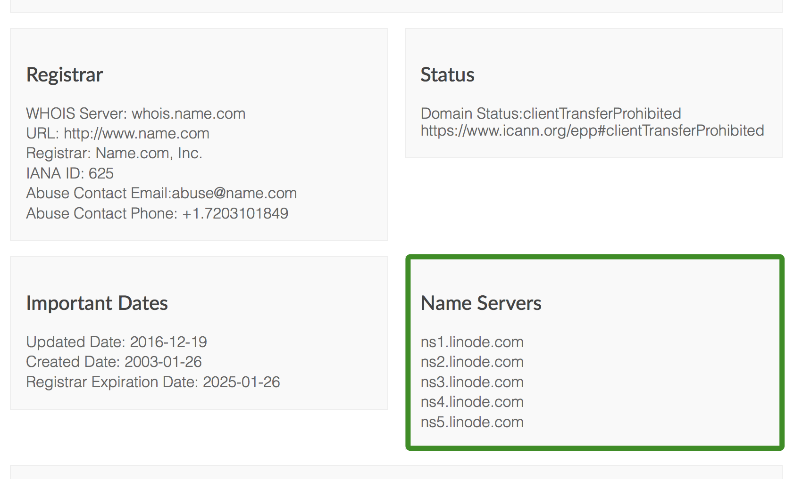
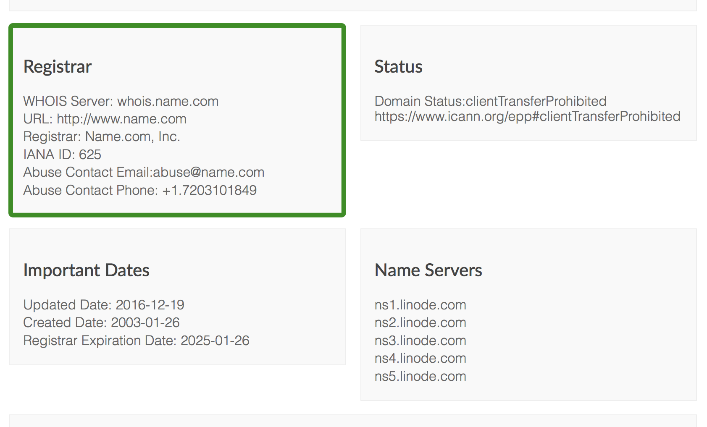

### (Optional) Prepare Your Domain Name to Move

A recommended first step is to lower the *Time to Live* (TTL) setting for your domain so that the migration won't have a negative impact on your site's visitors. TTL tells DNS caching servers how long to save information about your domain. Because DNS addresses don't often change server IP addresses, default TTL is typically about 24 hours.

When changing servers, however, make the TTL shorter to make sure that when you update your domain information, it takes effect quickly. Otherwise, your domain could resolve to your old server's IP address for up to 24 hours.

1.  Locate your current *nameservers*. If you're not sure what your nameservers are, use a [Whois Search tool](https://whois.icann.org/). You will see several nameservers listed, probably all at the same company.

    

    You can usually derive the website of your nameserver authority (the organization that manages your DNS) from the nameservers you find in the Whois report (e.g. `ns1.linode.com` corresponds with `linode.com`). Sometimes the labeling for the nameservers is not directly related to the organization's website, and in those cases you can often find the website by plugging the nameserver into a Google search.

1.  Contact your nameserver authority for details on how to shorten the TTL for your domain. Every provider is a little different, so you may have to ask for instructions.

    

Most nameserver authorities will allow you to set the TTL on your domain or on individual records, but some do not allow this setting to be edited. Here are support documents from some common authorities that mention how they manage TTL:

-   [GoDaddy](https://www.godaddy.com/help/change-the-ttl-value-for-your-dns-records-20238)
-   [DreamHost](https://help.dreamhost.com/hc/en-us/articles/215840248-DNS-propagation-overview)
-   [Gandi](http://wiki.gandi.net/en/dns/zone/expert)
-   [1&1](https://www.1and1.com/help/domains/general-information-about-dns-settings/time-required-for-dns-changes/)
-   [Network Solutions](http://www.networksolutions.com/support/how-to-manage-advanced-dns-records/)
-   [Bluehost](https://my.bluehost.com/hosting/help/559)
-   [HostGator](https://support.hostgator.com/articles/when-will-my-domain-start-working-propagation#ttl)
-   [Namecheap](https://www.namecheap.com/support/knowledgebase/article.aspx/434/2237/how-do-i-set-up-host-records-for-a-domain)
-   [Hover](https://help.hover.com/hc/en-us/articles/217282457-How-to-Edit-DNS-records-A-AAAA-CNAME-MX-TXT-SRV)



1.  Make a note of your current TTL. It will be listed in seconds, so you need to divide by 3600 to get the number of hours (e.g. 86,400 seconds = 24 hours). This is the amount of time that you need to wait between now and when you actually move your domain.

1.  Adjust your TTL to its shortest setting. For example, 300 seconds is equal to 5 minutes, so that's a good choice if it's available.

1.  Wait out the original TTL from Step 3 before actually moving your domain--otherwise, DNS caching servers will not know of the new, lower TTL yet. For more information on domain TTL, see our [DNS guide](/docs/networking/dns/dns-manager-overview/#set-the-time-to-live-or-ttl).

### Use Linode's Nameservers

1.  Follow Linode's instructions on [adding a domain zone](/docs/networking/dns/dns-manager-overview/#add-a-domain-zone) to create DNS records at Linode for your domain. Recreate the DNS records listed in your current nameserver authority's website, but change the IP addresses to reflect your Linode IPs where appropriate.

1.  Locate your domain's registrar, which is the company you purchased your domain from. If you're not sure who your registrar is, you can find out with a [Whois Search tool](https://whois.icann.org/).

    

    Your registrar may not be the same organization as your current nameserver authority, though they often are, as registrars generally offer free DNS services.

1.  Log in to your domain registrar's control panel and update the authoritative nameservers to be Linode's nameservers:

    *  `ns1.linode.com`
    *  `ns2.linode.com`
    *  `ns3.linode.com`
    *  `ns4.linode.com`
    *  `ns5.linode.com`

    

The following support documents describe how to update the authoritative nameservers of common registrars:

-   [GoDaddy](https://support.hostgator.com/articles/how-to-change-godaddy-name-servers)
-   [DreamHost](https://help.dreamhost.com/hc/en-us/articles/216385417-How-do-I-change-my-nameservers-at-DreamHost)
-   [Gandi](https://doc.gandi.net/en/dns/change/)
-   [1&1](https://www.1and1.com/help/domains/using-your-own-name-servers/using-your-own-name-servers-for-a-domain/)
-   [Network Solutions](http://www.networksolutions.com/support/move-dns-to-a-new-server/)
-   [Bluehost](https://my.bluehost.com/hosting/help/transfer_client_start)
-   [HostGator](https://support.hostgator.com/articles/how-do-i-manage-the-domain-i-bought-from-hostgator)
-   [Namecheap](https://www.namecheap.com/support/knowledgebase/article.aspx/767/10/how-can-i-change-the-nameservers-for-my-domain)
-   [Hover](https://help.hover.com/hc/en-us/articles/217282477-How-to-Change-your-domain-nameservers-DNS-servers-)



1.  Wait the amount of time you set for your TTL for the domain to propagate. If you did not shorten your TTL, this may take up to 48 hours.

1.  Navigate to your domain in a web browser. It should now show the website from Linode, rather than your old host. If you can't tell the difference, use the [DIG utility](http://www.kloth.net/services/dig.php). It should show the IP address for your Linode.

1.  [Set reverse DNS](/docs/guides/configure-your-linode-for-reverse-dns/) for your domain. This is especially important if you are running a mail server.

    
If you're having trouble seeing your site at the new IP address, try visiting it in a different browser or in a private browsing session. Sometimes your browser will cache old DNS data, even if it has updated everywhere else.

