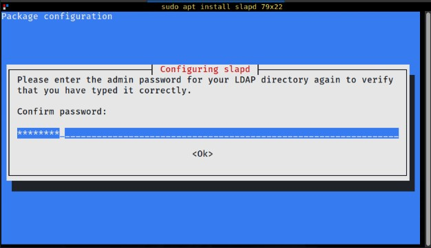

[*OpenLDAP*](https://www.openldap.org/) is an open-source implementation of the *Lightweight Directory Access Protocol* or **LDAP**, a lightweight client-server protocol typically accessed through a TCP/IP connection.  LDAP is primarily used for file and information storage across an intricate system of directories, as well as managing access to its contents through authentication.  Many organizations also use LDAP to provide a directory service of information about their employees, clients, departments and more.  

## LDAP Basics

LDAP directories are similar to databases, albeit the data is supplemented with descriptive, attribute-based information that is viewed more often than it is written.  Therefore, the LDAP protocol is attuned to provide quick responses to high-volume queries, sometimes through replication, in order to increase availability.  LDAP directories also provide a variety of different data and services, each with their own methods and requirements regarding how it is referenced, stored, queried, accessed and updated.  

LDAP data is accessed through a client-server model, where an LDAP client connects to an LDAP server to query information.  LDAP servers store and navigate a heirarchical LDAP directory tree, pointing the client to the location of the data object they requested.  Though an LDAP network may consist of many servers, they all possess an identical, shared and centralized view of the directory tree and everything within it.  The informational infrastructure consists of *entries*, each possessing a unique, global identifier, called a *Distinguished Name* or **DN**.  Each entry consists of attributes and values, such as *cn* for common name and *mail* for e-mail address.  

## Before You Begin

1.  If you have not already done so, create a Linode account and Compute Instance. See our [Getting Started with Linode](/docs/guides/getting-started/) and [Creating a Compute Instance](/docs/guides/creating-a-compute-instance/) guides.

1.  Follow our [Setting Up and Securing a Compute Instance](/docs/guides/set-up-and-secure/) guide to update your system. You may also wish to set the timezone, configure your hostname, create a limited user account, and harden SSH access.


This guide is written for a non-root user. Commands that require elevated privileges are prefixed with `sudo`. If you’re not familiar with the `sudo` command, see the [Linux Users and Groups](/docs/guides/linux-users-and-groups/) guide.


## Installing OpenLDAP 

### Debian and Ubuntu Instructions 

- Before proceeding to installation, update your Linux system.

        sudo apt update
        sudo apt upgrade -y

- Install the `slapd` and `ldap-utils` packages.

        sudo apt-get install slapd ldap-utils -y

- During the installation, OpenLDAP will prompt you to set your LDAP administrative password.  Enter your preferred password and press `Ok` to continue.

     

- The OpenLDAP service should be auto-started under `systemd`, you can check its status for confirmation.

        sudo systemctl status slapd

- If `slapd` is not enabled, enter the following.

        sudo systemctl enable slapd
        sudo systemctl start slapd

### CentOS and RedHat Instructions

- Install OpenLDAP by entering the following commands into your terminal.
 
        yum install openldap openldap-servers

- If using CentOS 7, use `dnf` instead.

        dnf -y install openldap openldap-servers

- Start the `openldap` server daemon, enable it to auto-start at boot time and check whether the installation was successful.

        sudo systemctl start slapd
        sudo systemctl enable slapd
        sudo systemctl status slapd

- After succesful installation, create a password for the OpenLDAP administrator via:

        ldappasswd



If you have a firewall configured, the LDAP server must be granted access in order to receive requests and be accessible through a network.

- On Debian and CentOS systems:
        
        sudo ufw allow ldap

- On CentOS and RedHat

        firewall-cmd --add-service=ldap



## Configuring OpenLDAP

Configuration files can be found at `/etc/openldap/slapd.d`.

Though they can be modified manually, it is strongly recommended to use the configuration wizard instead.

        ldapmodify

If you receive authentication errors, you can try an alternative configuration option.  This will also give you an option to change your *Directory Information Tree* or **DIT** suffix, which is a single root entry or naming context for your database.

        sudo dpkg-reconfigure slapd

To set your LDAP server's domain (or DIT suffix) to `secretserver.com` at port 6677, edit the configuration file at `/etc/ldap/ldap.conf` to the following at lines 8 and 9.  Make sure to uncomment the `#` symbols at the beginning of the line 

 
BASE   dc=secretserver,dc=com
URI    ldap://ldap.secretserver.com ldap://ldap.secretserver.com:6677


To see an overview of your configuration options and verify any changes you made, enter:

    sudo slapcat

After your configuration changes, verify that you ldap server is working as expected with the following command.

        ldapsearch -x

If the output reflects your expectations, then congratulations, you have succesfully installed an OpenLDAP server.  The next steps are deciding on a database backend, creating or important data entries and objects and configuring authentication settings for your LDAP network.

## Further Information

There is a wealth of information about the many configuration options available at OpenLDAP's documentation available [here](https://www.openldap.org/doc/admin26/slapdconf2.html).

The main page for OpenLDAP documentation can be found [here](https://www.openldap.org/doc/)

Various Linux distributions have their own help pages for setting up OpenLDAP.  These may provide additional assistance to any distro-specific and nuanced problems encountered.
- [RedHat OpenLDAP Docs](https://access.redhat.com/documentation/en-us/red_hat_enterprise_linux/7/html/system-level_authentication_guide/openldap)
- [Fedora Docs on Directory Servers - OpenLDAP](https://docs.fedoraproject.org/en-US/fedora/latest/system-administrators-guide/servers/Directory_Servers/)
- [OpenSUSE LDAP Docs](https://documentation.suse.com/sles/15-SP4/html/SLES-all/cha-security-ldap.html)
- [Debian OpenLDAP Setup](https://wiki.debian.org/LDAP/OpenLDAPSetup)

