Placing sensitive computing resources inside a [*Virtual Private Cloud* (VPC)](https://en.wikipedia.org/wiki/Virtual_private_cloud) helps to secure them. However, this also means it is impossible for these servers to directly access the internet without additional infrastructure. This limitation can be resolved through the use of a forward proxy, which acts as a gateway between the VPC and the public internet. This guide explains how to use a forward proxy to enable public internet access for devices within a VPC. It also demonstrates how to secure the VPC using an Akamai Cloud Firewall and how to provide applications with proxy access.

## An Introduction to VPCs

A VPC is a private network of resources that is partially or fully isolated from the public internet. When used in a cloud environment, a VPC is also isolated from other public users and VPCs in the same cloud. This isolation is enforced through the use of a private IP subnet with its own address space, which defines a range of unique discrete addresses. Privacy can be enhanced through additional security measures, such as a cloud-based firewall.

A VPC contains one or more subnets consisting of private IP addresses. The IP addresses for each subnet are drawn from designated blocks of addresses reserved for this purpose. Some examples of VPC-compliant addresses include `10.0.0.0/8` and `192.168.0.0/16`. Each node within the VPC is assigned a private address from one of these subnets. This type of address is only unique to the VPC. It is not unique across the global IP address space and is therefore not accessible from outside the VPC. For instance, many VPC resources can have the address `10.0.10.10` in their own private address space. A VPC server can also, in many cases, have a public IP address. This allows it to participate in both the VPC and the wider internet.

Using a VPC enhances security, making it difficult for potential hackers to understand and access the network. Most of the nodes are only configured with private addresses. Even if a node with an additional public IP address is compromised, the attacker does not gain visibility to the rest of the network.

Another way to increase security is to use a cloud or server-based firewall. However, a VPC is considered more secure. A critical difference is a server with a public IP address is open and insecure in the absence of additional configuration. The network administrator must add firewall rules to further secure the system, but this method is error-prone and can be easily overlooked. In contrast, nodes within a VPC are not initially connected to other networks. A public IP address must be configured to enable internet access, as discussed in the following section. In most cases, a firewall is used in conjunction with a VPC for extra security.


All forward proxy servers must be secured using a firewall or other security measures. An insecure and open proxy creates a security hazard for the associated VPC and potentially for other users of the data center. Follow all security recommendations in this guide.


## Methods of Enabling Internet Access for VPC Resources

A server within a VPC cannot access other networks, or the internet, without additional configuration. To use the public internet, a server must either enable *Network Address Translation* (NAT) or send traffic to a forward proxy.

A *One-to-one NAT* (1:1 NAT), also known as a *Basic NAT*, grants full internet access to the device. It connects two IP networks with different addressing schemes at the network layer. A 1:1 NAT maps an internal address and port to an external address and port. This technique allows the device to present a public IP address to the wider network while using a VPC-based address inside the private network.

NAT modifies the source and destination addresses in the IP header to correspond to the next address space. When sending a packet from the VPC to a different network, it swaps out the internal address for the public address. It reverses this process in the opposite direction. There are many variations of NAT, but the 1:1 type is the simplest and most common. It recalculates the IP address and any associated checksums, while leaving the rest of the packet intact. For more detailed information about 1:1 NAT, see the [NAT page on Wikipedia](https://en.wikipedia.org/wiki/Network_address_translation).


The network layer uses network addresses to route and receive packets. The application layer used by a proxy resides at a higher level of the networking stack, closer to the end user. It often implements communications between a client and a server. For more information, see the [Wikipedia page on the OSI Model](https://en.wikipedia.org/wiki/OSI_model).


### What Is a Forward Proxy?

A proxy is a general term for any intermediate device or application lying between a client and the target server. A forward proxy is a boundary point between the internet and a private network. It is used to retrieve resources for clients from the wider network. In addition to validating client requests, it processes packets and routes them towards their destinations. A forward proxy often changes the source or destination address, but it can also modify other fields. It keeps track of the active requests, responses, destinations, and sources, allowing it to match responses to the original client.

A proxy greatly enhances security by hiding some or all of the original addressing information. To the destination server, the request appears to come from the forward proxy. All details about the originating VPC remain hidden. Proxies can also be configured with traffic management policies. These policies can drop or filter unwanted packets, and limit the rate of incoming and outgoing packets. Some forward proxies also inspect packets to implement data protection and threat prevention. A forward proxy is typically used with a cloud or server-based firewall for extra security.

As opposed to NAT, a forward proxy works at the application layer. The proxy information is configured as part of the web server configuration, similar to a website. While NAT is self-contained, a forward proxy is part of a networking solution. A device on the VPC first transmits an outbound packet to a forward proxy. The proxy analyzes the packet and redirects it towards its ultimate destination. A common architecture is to use a 1:1 NAT and a forward proxy together. The forward proxy uses NAT to bridge multiple address spaces.

## How to Deploy a VPC and VPC Resources

This guide includes steps for creating the VPC and VPC resources, including a forward proxy, using the [Akamai Cloud Manager](https://cloud.linode.com). These instructions are designed for Ubuntu 22.04 LTS users. However, they are generally applicable to all similar distributions and software releases.

To create a VPC with forward proxy services, first create the VPC and VPC resources, then add the forward proxy. These instructions differ slightly depending on whether cloud-init is used or not due to limitations with cloud-init. Adding a public IP address to a compute instance in a VPC automatically configures 1:1 NAT. Additional NAT-specific configuration is not required. After configuring the VPC and forward proxy, add a cloud firewall to protect the network.


This guide is written for a non-root user. Commands that require elevated privileges are prefixed with `sudo`. See the [Users and Groups](/docs/tools-reference/linux-users-and-groups/) guide for information about the `sudo` command.

The [Getting Started](/docs/guides/getting-started/), [Creating a Compute Instance](/docs/guides/creating-a-compute-instance/), and [Setting Up and Securing a Compute Instance](/docs/guides/set-up-and-secure/) guides contain additional information. However, not all instructions are relevant for servers within a VPC.


To deploy a virtual private cloud and resources, follow these steps.

1.  In the [Akamai Cloud Manager](https://cloud.linode.com), select the **VPC** option from the left menu:

    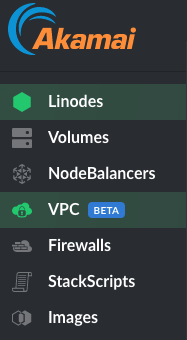

1.  To create a new VPC, click the **Create VPC** button:

    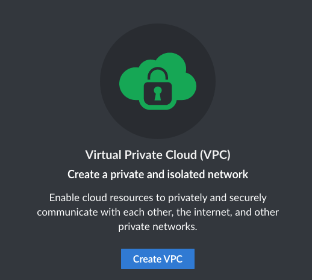

1.  The **Virtual Private Cloud/Create** interface appears. Add the following information to the **VPC** section of the form:

    - **Region**: Select a region for the VPC. All VPC resources and the forward proxy must be added to the same region as the VPC.
    - **VPC Label**: Supply a label to identify the VPC. The name of each VPC must be unique within an account.
    - **Description**: Add an *optional* description for the VPC.

    A subnet provides a cluster of related IP addresses for use inside the VPC. In the **Subnets** section of the interface, add the following information for each subnet:

    - **Subnet Label**: Add a unique label for each subnet in the VPC.
    - **Subnet IP Address Range**: Use the pre-selected IP Address Range, or provide a new subnet, for example `10.0.7.0/24`. The address range must fall within one of the blocks of valid IP addresses designated for private networks. See the [list of reserved IP addresses](https://en.wikipedia.org/wiki/Reserved_IP_addresses) for information about private addresses.
    - To add another subnet, select the **Add Another Subnet** button.

    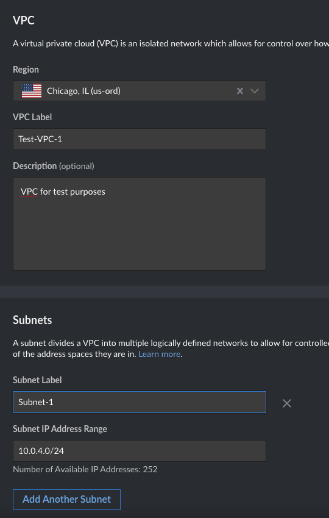

1.  Click the **Create VPC** button on the lower right of the interface to create the VPC.

1.  The summary page for the VPC displays information about the VPC and the subnets it contains:

    

    From this page, it is possible to edit the VPC and any existing subnets, or create a new VPC.

1.  Create any compute instances for use within the VPC. Do not create the forward proxy yet. Click **Linodes** from the left menu, then select **Create Linode**.

1.  Fill in the details for the new computing instance. Choose the relevant distribution and plan. The **Region** for the server must match the region where the VPC is hosted. Optionally, provision a firewall specific to the requirements of the internal network, but do not configure the cloud-based firewall used for the proxy server.

    In the **VPC** section, enter the following values:

    - For **Assign VPC**, choose a VPC for the resource.
    - For **Subnet**, select a subnet for the new server.
    - Select the **Auto-assign a VPC IPv4 address for this Linode in the VPC** option.
    - *Do not* select the **Assign a public IPv4 address for this Linode** option. With the exception of the forward proxy, the VPC servers are not part of the public internet.
    - *Do not* enable the **Private IP** option under **Add-ons**. This is for an unrelated feature.

    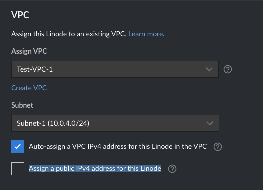

1.  Select **Create Linode** to complete the configuration. The new resource now appears on the VPC summary page inside its corresponding subnet:

    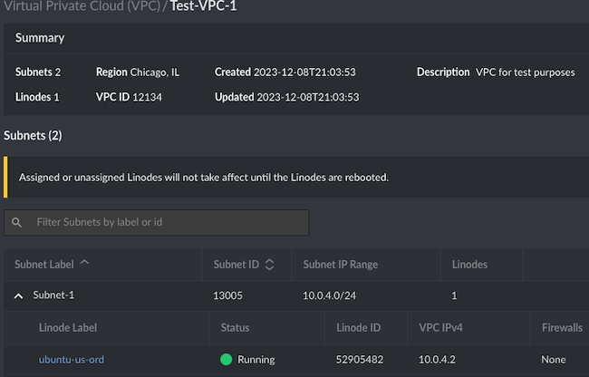

## How to Deploy the Forward Proxy Compute Instance

After creating the VPC servers, add another compute instance to serve as a forward proxy. This server resides on the boundary of the VPC and the public internet, possessing both a public IP and private VPC address.

A forward proxy can either be created manually or by using cloud-init. Although the final configuration is the same in both cases, the steps differ significantly between methods. To manually configure a forward proxy, add the forward proxy to the VPC and configure a public IP address at creation time. When cloud-init is used, the server is created as a stand-alone entity and added to the VPC afterwards.

Before proceeding with the configuration, reserve a specific address for the proxy on one of the subnets. This address is required at later stages of the configuration process. For instance, if the network proxy is destined for the `10.0.4.0/24` subnet, the address `10.0.4.51` might be used.

To create a forward proxy for the VPC, use one of the following two methods below.

### Manual Configuration of an Apache Forward Proxy

To manually configure a forward proxy on the Apache web server, follow these steps.

1.  Create a new cloud compute instance using the Akamai Cloud Manager. Specify the operating system, region, and plan. However, the **Region** must match the datacenter hosting the VPC. Inside the **VPC** section, assign the server properties as follows:

    - For the **Assign VPC** field, choose the relevant VPC.
    - For **Subnet**, choose a subnet for the forward proxy.
    - Disable the **Auto-assign a VPC IPv4 address for this Linode in the VPC** option.
    - Enter the chosen IP address for the proxy server in the **VPC Ipv4** field. This example uses the address `10.0.4.51`.
    - Select the **Assign a public IPv4 address for this Linode** option. This option automatically configures a 1:1 NAT for the server.
    - *Do not* enable the **Private IP** option under **Add-ons**. This is an unrelated option.

    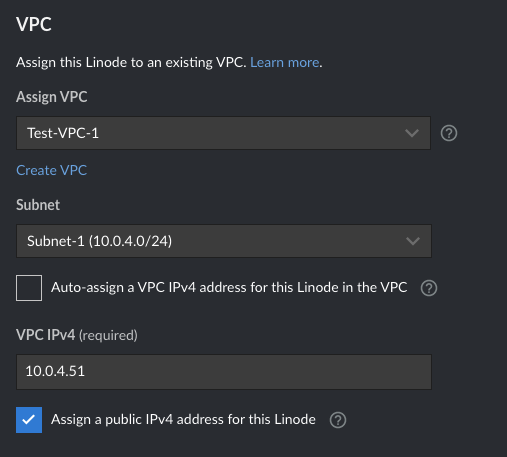

1.  Click **Create Linode** to create the forward proxy.

1.  Log in to the forward proxy using the public IP address. To determine the public IP address, select the compute instance from the list and locate the address under **IP Addresses**.

1.  Update the Ubuntu packages using `apt` and reboot the system if necessary:

    ```command
    sudo apt update -y && sudo apt upgrade -y
    ```

1.  Install Apache using `apt`:

    ```command
    sudo apt install apache2 -y
    ```

    
    The proxy server should have only one role, which is to act as a forward proxy. Other than the web server and proxy information, it should have minimal additional configuration. Do not install other applications, such as databases. This reduces the possible attack surface of the proxy.
    

1.  Create the `fwd-proxy.conf` file in the `/etc/apache2/sites-available` directory.

    ```command
    sudo nano /etc/apache2/sites-available/fwd-proxy.conf
    ```

    Add the following details to the file:

    - For the `Listen` directive, specify the private VPC address of the forward proxy, using the format `IP_ADDRESS:8080`, for example `10.0.4.51:8080`. *Do not* use the public IP address.
    - For the `Require ip` statement, list all the VPC subnets. Use the format `NETWORK_ADDR/MASK` and separate the subnets with a space. For example, to permit proxy service for the `192.168.9.x` subnet, include the line `Require ip 192.168.9.0/24`.

    In the following code sample, replace `<PROXY_IP_ADDR>` with the internal VPC address of the forward proxy. Replace `<SUBNET_1>` and `<SUBNET_2>` with the actual VPC subnets.

    ```file {title="/etc/apache2/sites-available/fwd-proxy.conf" lang="aconf"}
    Listen <PROXY_IP_ADDR>:8080
    <VirtualHost *:8080>
        ServerAdmin webmaster@localhost
        DocumentRoot /var/www/html
        ErrorLog ${APACHE_LOG_DIR}/fwd-proxy-error.log
        CustomLog ${APACHE_LOG_DIR}/fwd-proxy-access.log combined
        ProxyRequests On
        ProxyVia On
        <Proxy "*">
            Require ip <SUBNET_1>/24 <SUBNET_2>/24
        </Proxy>
    </VirtualHost>
    ```

    When done, press <kbd>CTRL</kbd>+<kbd>X</kbd>, followed by <kbd>Y</kbd> then <kbd>Enter</kbd> to save the file and exit `nano`.

1.  Set the owner of the file to `root:root` and set the correct file permissions:

    ```command
    sudo chown root:root /etc/apache2/sites-available/fwd-proxy.conf
    sudo chmod 0644 /etc/apache2/sites-available/fwd-proxy.conf
    ```

1.  Enable some additional proxy-related Apache modules:

    ```command
    sudo a2enmod proxy proxy_http proxy_connect
    ```

1.  Enable the proxy:

    ```command
    sudo a2ensite fwd-proxy
    ```

1.  Restart the Apache server to activate the new configuration:

    ```command
    sudo systemctl restart apache2
    ```

1.  Verify that the status of the Apache service is `active`:

    ```command
    sudo systemctl status apache2
    ```

    ```output
    apache2.service - The Apache HTTP Server
    Loaded: loaded (/lib/systemd/system/apache2.service; enabled; vendor preset: enabled)
    Active: active (running) since Mon 2023-12-11 20:22:00 UTC; 7s ago
    ```

### Using Cloud-init to Configure a Forward Proxy

It is also possible to use [cloud-init](https://cloud-init.io/) to set up the forward proxy. This automates most of the manual steps in the previous section. However, due to some cloud-init limitations, additional steps are required. The forward proxy must initially be configured as a stand-alone server outside of any VPC. After the server is provisioned, it must be moved to the VPC so that a 1:1 NAT can be configured.

To use cloud-init to initialize the forward proxy follow these steps. See our [guide to cloud-init](/docs/products/compute/compute-instances/guides/metadata-cloud-config/) for more information about using cloud-init.

1.  Create a new compute instance using the Akamai Cloud Manager, specifying the operating system, region, and plan. The **Region** field must match the datacenter hosting the VPC. However, do not place the new resource inside the VPC.

    - Leave the **Assign VPC** and **Assign Firewall** fields blank.
    - *Do not* enable the **Private IP** option under **Add-ons**. This is for an unrelated configuration.
    - *Do not* click **Create Linode** yet.

1.  Expand the **Add User Data** section and add the following cloud-init script to the **User Data** text box, but make the following changes:

    - Change `<PROXY_IP_ADDR>` to the intended internal VPC address of the server. This address has not been added yet. It is configured at a later point in the process.
    - Replace `<SUBNET_1>` and `<SUBNET_2>` with the actual subnets inside the VPC. Separate each subnet with a space.

    ```command
    #cloud-config
    package_update: true
    package_upgrade: true
    packages:
      - apache2
    write_files:
      - path: /etc/apache2/sites-available/fwd-proxy.conf
        owner: root:root
        permissions: '0644'
        content: |
          Listen <PROXY_IP_ADDR>:8080
          <VirtualHost *:8080>
            ServerAdmin webmaster@localhost
            DocumentRoot /var/www/html
            ErrorLog ${APACHE_LOG_DIR}/fwd-proxy-error.log
            CustomLog ${APACHE_LOG_DIR}/fwd-proxy-access.log combined
            ProxyRequests On
            ProxyVia On
            <Proxy "*">
              Require ip <SUBNET_1>/24 <SUBNET_2>/24
            </Proxy>
          </VirtualHost>
    runcmd:
      - a2enmod proxy proxy_http proxy_connect
      - a2ensite fwd-proxy
      - systemctl restart apache2
    ```

    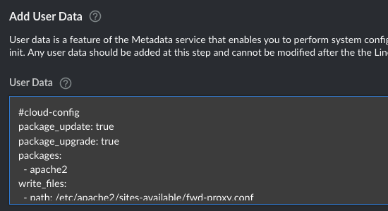

1.  Click **Create Linode** to create the compute instance. Allow the configuration and boot process to complete. This can take about five minutes.

    
    When the script is executed, some Apache errors relating to static address binding are displayed in the console. This results in the Apache service being marked as `failed`. This happens because the server does not have an internal IP address for the 1:1 NAT binding yet. Ignore these errors for the time being.
    

1.  Power off the forward proxy server using the **Power Off** option in the Akamai Cloud Manager interface.

1.  Use the **Configurations** interface in the Akamai Cloud Manger to locate the configuration for the proxy server. Click **Edit** to edit the configuration.

    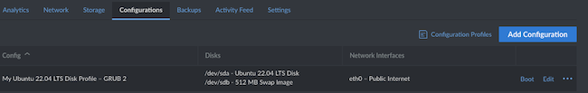

1.  Ensure the **Primary Interface** is `eth0` and enter the following settings for the **eth0** interface:

    - set **eth0** to `VPC`.
    - Set the **VPC** to the VPC where the forward proxy is required.
    - Set **Subnet** to the subnet matching the internal VPC IP address of the forward proxy.
    - Disable **Auto-assign a VPC IPv4 address for this Linode in the VPC**.
    - Enter the internal VPC address for the proxy server in the **VPC Ipv4** field. This example uses the address `10.0.4.51`.
    - Select the **Assign a public IPv4 address for this Linode** option. This option automatically configures a 1:1 NAT for the server.
    - *Do not* enable the **Private IP** option under **Add-ons**. This is for an unrelated configuration.

    Click **Save Changes** to continue.

    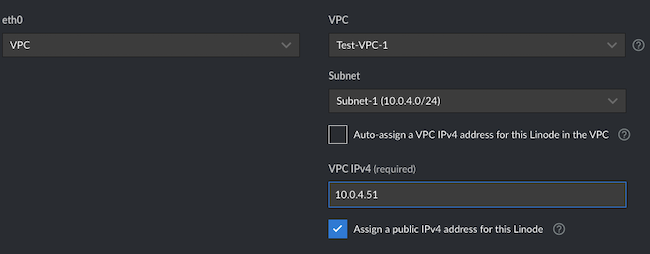

1.  Locate the proxy server in the list of Akamai compute instances. Select the **Power On** option to restart the instance. After the server completes its boot process, it is ready to act as a forward proxy.

## How to Configure a Cloud Firewall

It is important to configure a firewall to restrict access to the proxy. An insecure and open proxy can expose the network inside the VPC to security threats and misuse. In some cases, it can degrade the performance of the data center and the wider internet.

1.  Click the **Firewalls** link in the left menu of the Akamai Cloud Manager. Then select **Create Firewall**.

1.  In the **Create Firewall** interface, assign a **Label** for the Firewall. Under **Linodes**, select the node identifier of the forward proxy. Then click **Create Firewall**.

    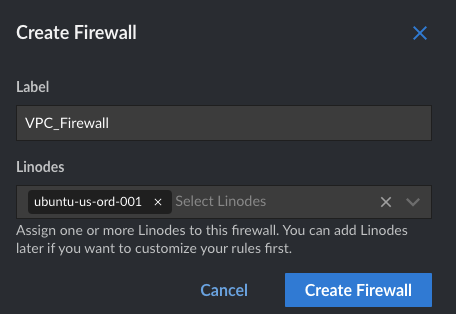

1.  Select the firewall from the list of firewalls.

    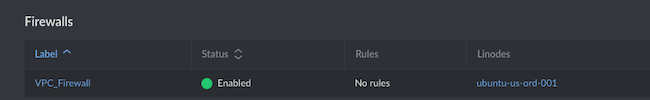

1.  Create an inbound rule using the **Add An Inbound Rule** button. The first rule accepts proxy traffic from anywhere inside the VPC. Set the following values:

    - **Label**: Set this to `VPC`.
    - **Protocol**: Use `TCP`.
    - **Ports**: Choose `Custom`, then set the **Custom Port Range** to `8080`.
    - **Sources**: Select `IP / Netmask`. List all subnets within the VPC under **IP / Netmask**.
    - **Action**: Set to `Accept`.
    - Click **Add Rule** to save the configuration.

    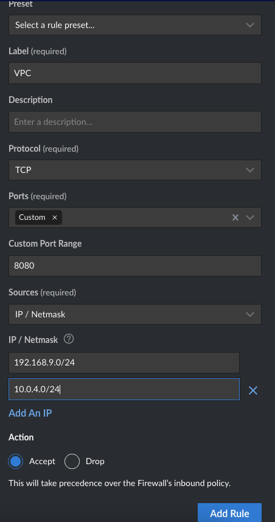

1.  Create a second inbound rule for ICMP traffic within the VPC:

    - **Label**: Choose `VPC-ICMP`.
    - **Protocol**: Use `ICMP`.
    - **Ports**: Leave this field blank.
    - **Sources**: Select `IP/Netmask` and enter all VPC subnets using the **IP / Netmask** field.
    - **Action**: Set to `Accept`.
    - Click the **Add Rule** button.

    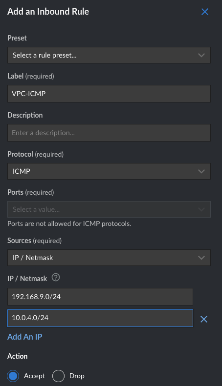

1.  Create a final inbound firewall rule for SSH connections:

    - **Label**: Set this to `ssh`.
    - **Protocol**: Use `TCP`.
    - **Ports**: Use `SSH (22)`.
    - **Sources**: select `IP/Netmask`, entering all VPC subnets in the **IP / Netmask** field. Also include the IP addresses of any administrative servers used to connect to the forward proxy. Ensure these addresses are as specific as possible, for example, `Admin_Addr/32`.
    - **Action**: Set to `Accept`.
    - Click the **Add Rule** button.

    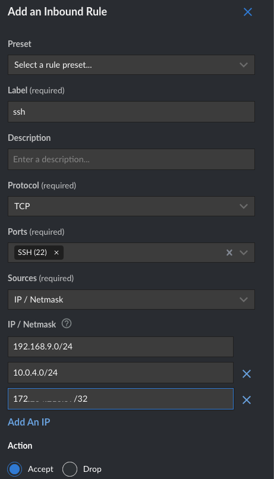

1.  Set the **Default inbound policy** to `Drop`. Do not add any outbound rules. All outbound traffic must be allowed to pass freely, with the **Default outbound policy** set to `Accept`. The final configuration should be similar to the following screenshot:

    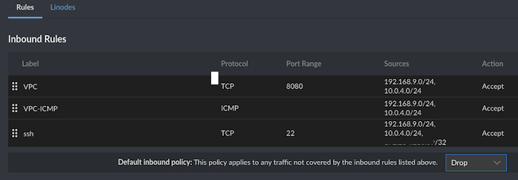

1.  Click **Save Changes** to apply the new firewall rules.

1.  Test the new firewall restrictions. It should be possible to initiate an SSH connection to the forward proxy from one of the designated administrative addresses. However, all attempts from other addresses should be silently blocked.

## How to Configure Applications to Use the Forward Proxy and Test Internet Access

All servers in the VPC potentially have access to the internet through the forward proxy. However, the individual nodes still have to be told to use the proxy. This directive is configured on an application-by-application basis.

A common use case is to enable internet access for the `apt` package manager. This allows administrators to install updates on the nodes inside the VPC. Follow the steps below to enable `apt` connectivity on the VPC nodes and use `curl`.

1.  Log in to one of the servers in the VPC. To access the node, use the LISH console. Alternatively, log in to the forward proxy from one of the designated administrative addresses, then establish a new SSH connection to the target node.

1.  Add the following line to the `apt` proxy configuration, but replace `<PROXY_IP_ADDR>` with the internal VPC IP address of the forward proxy:

    ```command
    echo 'Acquire::http::proxy "http://<PROXY_IP_ADDR>:8080";' > /etc/apt/apt.conf.d/proxy.conf
    ```

1.  Attempt to update the local packages using `apt update`:

    ```command
    sudo apt update
    ```

    The command should now function correctly, using the proxy as a forwarding agent.

1.  To transmit `curl` requests, append the parameter `--proxy <PROXY_IP_ADDR>:8080` to the request, but substitute the internal VPC IP address of the forward proxy for `<PROXY_IP_ADDR>`:

    ```command
    curl --proxy <PROXY_IP_ADDR>:8080 http://example.com
    ```

## Conclusion

For additional security, protect your computing resources within a VPC. Servers within the VPC use private IP addresses that are not accessible from the public internet, enhancing security. To permit internet access from within the VPC, configure a forward proxy on a new VPC node. The proxy includes both a private and a public IP address, using 1:1 NAT translation to map requests between the different address spaces. The remaining nodes in the VPC can access the public internet through the proxy. The forward proxy can either be configured manually or by using cloud-init.