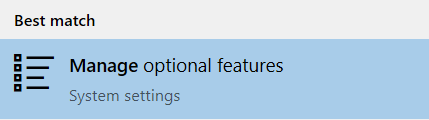
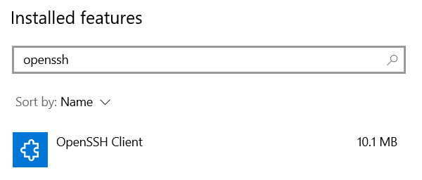
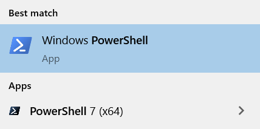

A *secure shell* (SSH) is used for secure communication between devices. When most people refer to SSH, it is within the context of a connecting from a local computer to a remote server, commonly for administration tasks related to website hosting.

This article walks you through how to use SSH from Windows, covering the basics of installing a Windows SSH command-line tool and connecting to a remote server (such as a Linode) over SSH on a local Windows system.

## Before You Begin

1.  Ensure you have a Linux server with an SSH server (like OpenSSH) installed. Most Linux distributions have an SSH server preinstalled. If you wish to deploy a new server, follow the [Creating a Compute Instance](/docs/guides/creating-a-compute-instance/) guide to create a Linode.

1.  If using Windows 10 or Windows 11, install any pending updates to ensure you are running the latest version of Windows before you enable SSH.

## Open the Terminal

On your local Windows computer, open the terminal application you wish to use. The terminal allows you to access your operating system's shell environment and run programs through the command line, such as the SSH command.

- [Command Prompt (or PowerShell) - Windows 10 or 11](#command-prompt-or-powershell---windows-10-or-11): This is the easiest method for most people using Windows 10 or later.
- [Windows Subsystem for Linux - Windows 10 or 11](#windows-subsystem-for-linux-wsl---windows-10-or-11): This requires quite a few more installation and configuration steps, but may be a better option for those who prefer working within a Linux command-line.
- [PuTTY - Windows 8, 7, Vista, and XP](#putty---windows-8-7-vista-and-xp): For earlier versions of Windows, you need to use PuTTY or any other third-party terminal emulator.

### Command Prompt (or PowerShell) - Windows 10 or 11

There are two terminals on Windows 10 and 11, the Command Prompt (also called CMD) and PowerShell. To connect to a server using SSH on Windows 10 within one of these tools, the OpenSSH client needs to be installed. OpenSSH is a Windows SSH client and available on newer versions of Windows 10 (April 2018 update and later), though it may need to be manually enabled.

#### Install the OpenSSH Client

1.  Open up **Windows Search** by selecting the search area (or search button) on the taskbar or by pressing **Windows** + **S** on the keyboard.

1.  Start typing "Manage optional features" and select *Manage optional features* (System settings) from the search results.

    

1.  The **Optional features** page of the Settings application launches. Under the **Installed features** list, look for the *OpenSSH Client* feature.

    

1.  If the *OpenSSH Client* feature is not installed, click the **Add a feature** button at the top of the page. A dropdown menu appears. Select **OpenSSH Client** and press the **Install** button to install the ssh on Windows.

#### Open the Command Prompt or PowerShell

To run the SSH command, you first need to open your preferred command line utility. Open **Windows Search** through the **Windows** + **S** hotkey, type "Command Prompt" or "PowerShell" into the search area, and select the corresponding application from the results. [PowerShell 7](https://github.com/PowerShell/PowerShell) or later, the newer cross-platform PowerShell application, can also be used if installed.

### Windows Subsystem for Linux (WSL) - Windows 10 or 11

Instead of using the Command Prompt or PowerShell environment (which is significantly different than both the macOS and Linux command-line environments), you can run Linux directly within Windows through WSL (Windows Subsystem for Linux). This may be preferred if you are more comfortable working within a Linux shell environment.

1.  Install WSL by following the instructions within Microsoft's [Install WSL](https://docs.microsoft.com/en-us/windows/wsl/install-win10) guide. If you already have WSL1 installed, it's recommended to update to WSL2.

1.  Install your preferred Linux distribution, such as [Ubuntu](https://www.microsoft.com/store/apps/9nblggh4msv6), directly from the Microsoft Store. A full list of available distributions can be found under [Step 6 - Install your Linux distribution of choice](https://docs.microsoft.com/en-us/windows/wsl/install-win10#step-6---install-your-linux-distribution-of-choice) of the previously mentioned guide.

Once everything has been configured, you can use the WSL environment by opening your installed Linux distribution through the Start Menu or Windows Search. By default, WSL uses a fairly basic terminal emulator. You can also use a more customizable terminal, such as [Windows Terminal](https://aka.ms/terminal) or [Hyper](https://hyper.is/).

### PuTTY - Windows 8, 7, Vista, and XP

There is no native SSH client in Windows 8 and earlier. Instead, you'll need to use a third party application, such as [PuTTY](/docs/guides/connect-to-server-over-ssh-using-putty/), [Cygwin](https://www.cygwin.com/), the [Secure Shell extension for Google Chrome](/docs/guides/connect-to-server-over-ssh-on-chrome/), or any other SSH-enabled terminal emulator:

- [Connecting to a Remote Server Over SSH using PuTTY](/docs/guides/connect-to-server-over-ssh-using-putty/)
- [Connecting to a Remote Server Over SSH on Chrome](/docs/guides/connect-to-server-over-ssh-on-chrome/)

## Connecting to the Remote Server Over SSH from Windows

Once you've opened your preferred Windows SSH client (Command Prompt, PowerShell, or WSL), you can run the `ssh` command to connect to your server.

1. Within the terminal, enter the following command, replacing *[username]* with the username of the remote user and *[ip-address]* with the IP address or domain name of the remote server.

       ssh [username]@[ip-address]

     The SSH client attempts to connect to the remote server over port 22 (the default SSH port).

    
If the server's SSH port is something other than 22, it needs to be specified in the SSH command. To do this, use the `-p` option as shown in the command below. Replace [port-number] with the port number that the remote SSH server is using.

    ssh [username]@[ip-address] -p [port-number]


1.  When you connect with a server for the first time, the SSH client on Windows 10 prompts you to check and verify the host key's fingerprint. This is normal, and results in output similar to:

    
The authenticity of host ‘example.com (93.184.216.34)’ can't be established.
ECDSA key fingerprint is SHA256:d029f87e3d80f8fd9b1be67c7426b4cc1ff47b4a9d0a84.
Are you sure you want to continue connecting (yes/no)?


    You can verify the fingerprint by following the instructions on the [Verifying the Authenticity of a Remote Server](/docs/guides/verifying-the-authenticity-of-remote-host/) guide.

1. Accept the prompt by entering `y` or `yes`, which results in a one-time warning that is similar to:

    
Warning: Permanently added 'example' (ECDSA) to the list of known hosts.


Once you have successfully connected, your terminal should be using the remote shell environment for the server. Your command prompt should now show the username and hostname configured for the server. You can now run any commands that you have available on that server. This includes many of the basic Linux commands, such as `ls`, `cd`, `rm`, and those covered in [Using the Terminal](/docs/guides/using-the-terminal/) guide. Getting to know these commands will help you navigate around your server.

## Ending the SSH Session

After you are done, log out of the session by typing `exit`. The terminal then shows something similar to:


logout
Connection to 93.184.216.34 closed.


At this point, the shell prompt returns to the one for the local workstation and the terminal application can be closed if it's no longer needed.

## Sending Commands Over SSH

Instead of using SSH to open your remote server's console, you can run commands on your server without leaving your local shell environment. This can enable you to quickly run commands both locally and remotely in the same terminal window.

### Sending a Single Command

To run a single command on your remote server, use the following command. Replace *[username]* with the username of the remote user,  *[ip-address]* with the IP address or domain name of the remote server, and *[command]* with the command you wish to run.

    ssh [username]@[ip-address] [command]

As an example, running `ssh me@192.0.2.0 ls` lists all the files in the home directory of the user called `me`. This can be useful to find the uptime of the server (`ssh me@192.0.2.0 uptime`) or maybe determine its Linux distribution and version (`ssh me@192.0.2.0 lsb_release -a`).

### Sending Multiple Commands

To run multiple commands on your remote server (one after the other), use the following command. Replace *[command-1]*, *[command-2]*, and *[command-3]* with the commands you wish to run.

    ssh [username]@[ip-address] "[command-1]; [command-2]; [command-3]"

The commands should be separated by a semi-colon (`;`) and all of the commands together should be surrounded by double quotation marks (`"`). For example, if you wanted to create a file named *bar.txt* in a directory called *foo* within the user **me**'s home directory, run: `ssh me@192.0.2.0 "mkdir foo; cd foo; touch bar.txt"`.

### Using sudo

It's recommended to disable root access over SSH and only log in to your remote server through a limited user account. However, some commands require elevated privileges, which can usually be accomplished by prepending the command with `sudo`. If you attempt to do this while running commands directly through the SSH command, you may receive an error such as "no tty present" or there isn't a "stable CLI interface". To run the `sudo` command in these instances, use the `-t` option, which forces a psuedo-terminal allocation. For example, to update your packages on a Debian-based system, run `ssh linode@example.com -t "sudo apt update"`.

## Going Further

### Troubleshooting SSH Connection Issues

If SSH isn't connecting you to your Linode, you may need to investigate the state of your server. See the guide [Troubleshooting SSH](/docs/guides/troubleshooting-ssh/) for assistance.

### Increasing Security

- Now that you can connect from your Linux machine to the Linode over SSH, save not only time but also make the connection even more secure by using SSH public key authentication. For more information, see [SSH add keys](/docs/guides/use-public-key-authentication-with-ssh/).

- See the "Harden SSH Access" section of [Setting Up and Securing a Compute Instance](/docs/guides/set-up-and-secure/) guide to review how to secure SSH on the server's side, and the [Advanced SSH Server Security](/docs/guides/advanced-ssh-server-security/) for more information on making it even more secure.
