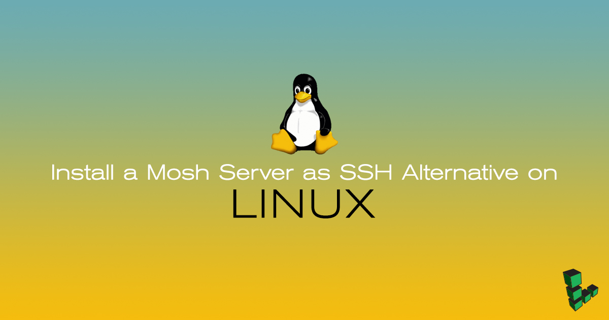

[Mosh](http://mosh.mit.edu/) is a free replacement for SSH that allows roaming and supports intermittent connectivity. Unlike regular SSH connections, Mosh continuously syncs your local and remote sessions to ensure that your client automatically reconnects to the server when you switch between wireless networks or wake your computer from sleep. This guide explains how to install Mosh on your Linode and your personal computer.

 
Mosh does not support port forwarding or proxying, and you cannot use mosh to copy files or mount remote directories. You'll still need to use SSH for these tasks.


## Mosh SSH Benefits

There are several benefits of using Mosh to connect to your Linode:

-   **Continuous Connection:** If your network connectivity is interrupted, Mosh will try to reconnect using any available Internet connection.
-   **Reduced Network Lag:** Unlike SSH, which waits for the server's response before displaying what you typed, Mosh provides instant responses to typing, deleting, and line editing.
-   **Like SSH, Only Better:** Mosh runs inside regular terminal applications and logs in to the server via SSH.

Ready to get started? Let's go!

## Preparing Your Firewall

Before installing Mosh, you should verify that your Linode's firewall will allow the Mosh client and server to communicate. If you [followed our instructions](/docs/securing-your-server#configure-a-firewall) to create a firewall with `iptables`, you'll need to edit `/etc/iptables.firewall.rules` and add another rule to allow the Mosh client to connect to your Linode over UDP ports 60000–61000.


-A INPUT -p udp --dport 60000:61000 -j ACCEPT



Activate the new firewall rule by entering the following command:

    sudo iptables-restore < /etc/iptables.firewall.rules

Mosh can now communicate with your Linode.

## Install Mosh on Your Linode

First, you need to install Mosh on your Linode. Find the instructions for your Linux distribution below.

### Ubuntu

Install mosh from the developer's PPA repository by entering the following commands, one by one:

    sudo apt-get install python-software-properties
    sudo add-apt-repository ppa:keithw/mosh
    sudo apt-get update
    sudo apt-get install mosh

Mosh is now installed on your Linode.

### Debian

Mosh is available in Debian's backports repositories. You'll need to add squeeze-backports to your sources.list, update your package information, then install from the backports repository. Here's how:

1.  Edit `/etc/apt/sources.list` and add the following line:

    
deb <http://backports.debian.org/debian-backports> squeeze-backports main



2.  Run `apt-get update`.
3.  Install mosh from squeeze-backports by entering the following command:

        apt-get -t squeeze-backports install "mosh"

Mosh is now installed on your Linode.

### Arch Linux

Mosh is available in the Arch Linux repositories. Enter the following command to install it:

    pacman -S mosh

Mosh is now installed on your Linode.

### Other Distributions

If you have another Linux distribution installed on your Linode, see the [Mosh website](http://mosh.mit.edu/) for installation instructions.

## Install Mosh on Your Desktop Computer

Now you need to install Mosh on your desktop computer. Find the instructions for your computer's operating system below.

### Linux

Follow the instructions for your distribution listed in the [Installing Mosh on Your Linode](/docs/guides/install-mosh-server-as-ssh-alternative-on-linux/#install-mosh-on-your-linode) section, or see the [Mosh website](http://mosh.mit.edu/).

### Mac OS X

The easiest way to install Mosh in OS X is to download the installation package from the [Mosh website](http://mosh.mit.edu/).

Or, if you prefer, you can automate the process of downloading, compiling, and installing Mosh with Homebrew. Note that you must already have [Homebrew](http://mxcl.github.com/homebrew/) installed.

    brew install mobile-shell

Mosh is now installed on your computer.

### Windows

There is not currently a native Mosh client available for the Windows operating system. Please see [this issue](https://github.com/keithw/mosh/issues/293) for additional information.

## Connecting with Mosh

The syntax for connecting to a remote server with Mosh is similar to ssh:

    mosh yourusername@host.yourdomain.com

Mosh will log in to the server via SSH and then connect on a UDP port between 60000 and 61000.

You can also connect to an SSH daemon that is running on an alternate port:

    mosh yourusername@host --ssh="ssh -p 2222"

Congratulations! You've just connected to your server with Mosh!
