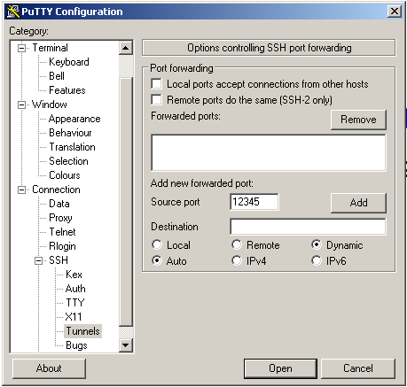
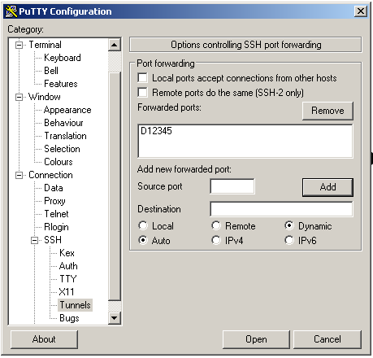
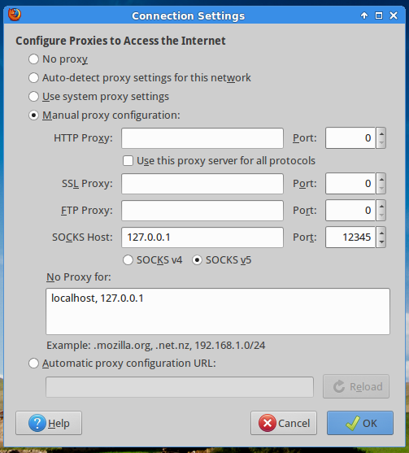
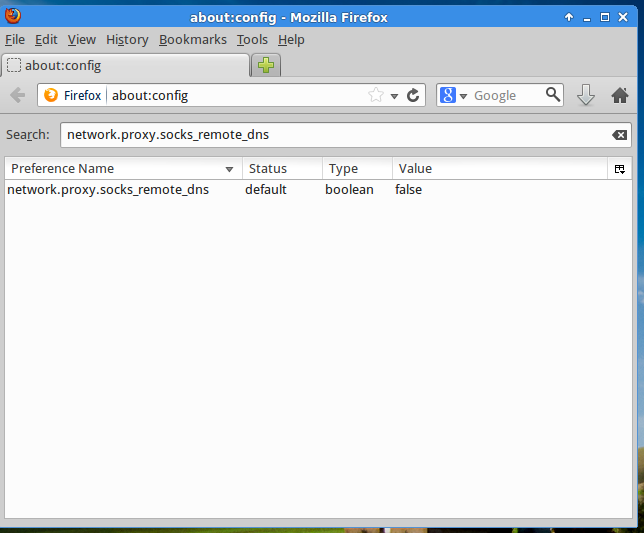
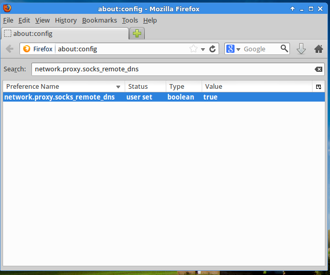

Often you may need to browse the web from a public WiFi access point, such as a coffee shop or library, where you do not know the security measures taken by the administrator. Your communications could be snooped on by a malicious user or even by the network owner.

This guide will show you how to establish a secure connection for browsing the web through a tunnel between your computer and your Linode. With this method, you will set up a tunnel between your computer and your Linode. All your web traffic will be encrypted and forwarded from your Linode on to its final destination.

It works by launching a SOCKS proxy server on your computer using SSH. It will listen on a local port and your browser will connect to the web using that service.

## Prerequisites

-   A Linode running your favorite GNU/Linux flavor.
-   The SSH service running in your Linode, with the forwarding option enabled (it is enabled by default).

    
If it is disabled, look for the parameter `AllowTcpForwarding no` in your server's **/etc/ssh/sshd\_config file**, and change it to **yes** before restarting the service.


-   The ability to remotely access your server using SSH (by its host name or IP address).
-   SSH client software on the computer you will use for browsing: a favorite SSH client for Linux or Mac OS X, PuTTY for Windows.

## Launching the SOCKS Server

The first step is to launch the SOCKS server and establish a connection to your Linode.

### Linux and Mac OS X

1.  From a command line run:

        ssh -D 12345 user@host.domain

    
**-D 12345** tells SSH to run the SOCKS server on port 12345.

You can choose any port number greater than 1024. Lower numbers could be used but you will need to log in as root, and make sure the port is not in use by another service.


2.  You will be prompted for your password. After entering it, you will be logged in to your Linode. Minimize the terminal because you will not need it until you are finished with your browsing session.

### Windows

To establish a tunnel in Windows, you can use the free SSH client PuTTY. It can be downloaded from [this link](http://www.chiark.greenend.org.uk/~sgtatham/putty/download.html).

1.  Launch PuTTY. On the first screen you will need to type your login information in the **Host Name (or IP address)** box. The **SSH protocol** and **Port** are checked by default.

    

2.  Under the **Connection** menu, under **SSH** select **Tunnels**. There you must enter the port you want (**12345**, for example) in **Source Port**, and check **Dynamic**.

    

3.  Then press the **Add** button. In the **Forwarded ports** text area, you will now see **D12345**.

    

4.  Click the **Open** button. A new window asking for your password will appear. After you type your password you will be logged in to your Linode and the tunnel will be launched. Now you can minimize this window and go to the browser.

## Setting Up Your Browser

The last step is to configure your preferred browser to use the SOCKS server you just created. Here the example is for Firefox, but it is similar for all the major browsers.

Before making any changes, a good idea is to take note of the current IP address you are using to connect to the web. Use a website like [WhatIsMyIp.com](http://www.whatismyip.com/) or [ifconfig.me](http://ifconfig.me/), and write down the IP that is shown.

To set up the browser:

1.  In Firefox, go to the **Edit** menu and select **Preferences**.
2.  Go to **Advanced** and from there to the **Network** tab.
3.  In the **Connection** area click on **Settings**.

    

4.  The window **Connection Settings** will open. Check **Manual Proxy Configuration**, and in **SOCKS Host** write your local host address (127.0.0.1) and the port you choose when you created the tunnel (**12345**, in this example). Make sure **SOCKS v5** is selected (it will be by default).

    

5.  Click **OK** to accept the changes.

Now you can check your IP again. If all is working correctly, you will see that the website will report a new IP address, the one of your Linode.

From this point you can browse the web using your tunnel. When you finish, turn off the tunnel by logging off from your remote server (the Linux or Mac OS X console or PuTTY session you opened before). Note that you will need to set Firefox back to the `No proxy` setting as well. There are several plugins that can perform this task quickly for you, including [this one](https://addons.mozilla.org/en-US/firefox/addon/quickproxy/).

## Some Considerations

Keep these considerations in mind when you use SSH tunneling.

-   Although your web traffic will be encrypted and forwarded, your DNS requests will not. The DNS queries will be done on the public network, and then the web request will be forwarded to the secure tunnel. You can fix that in Firefox, and make it send the DNS traffic to your tunnel as well.

    1.  Open Firefox. Type **<about:config>** in the Location Bar to display the browser's preferences.
    2.  To be able to edit these settings, click the button **I'll be careful, I promise**.

        

    3.  In the Search bar type **network.proxy.socks\_remote\_dns** and press `Return`.
    4.  You will see that the default value for that preference is **false**.

        

    5.  Double click **network.proxy.socks\_remote\_dns** to change its value to **true**. The whole line will change to bold text, and the status column to **user select**, indicating you modified its default value.

        

    6.  Leave the `about:config window` by typing any URL in the location bar or closing Firefox.

-   If the access to SSH is blocked in the public network you are using, it will not be possible to establish the tunnel. A workaround for this is to run your SSH server on a different port, more likely to be open; for example port 80 (HTTP).
-   If you are already in a public network that blocks your access to SSH, to edit the server settings you can use the [Linode Shell from the web](/docs/networking/using-the-linode-shell-lish/#using-a-web-browser).
-   Sometimes, the traffic through the tunnel could be a bit slower than browsing the web without it; but remember, it's a small price to pay when your privacy is at risk.
-   This is a simple and quick way to establish a secure connection for web browsing, a kind of “poor man's VPN” solution.
-   If you often access the web using untrusted public networks or if you need to secure other applications and not just the browser, then this method will fall short and you will need to set up a VPN on your server. Take a look at one of our [OpenVPN](/docs/networking/vpn/) guides for instructions about that topic.
