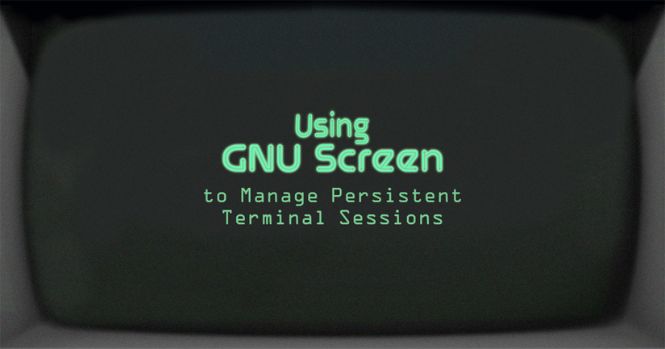
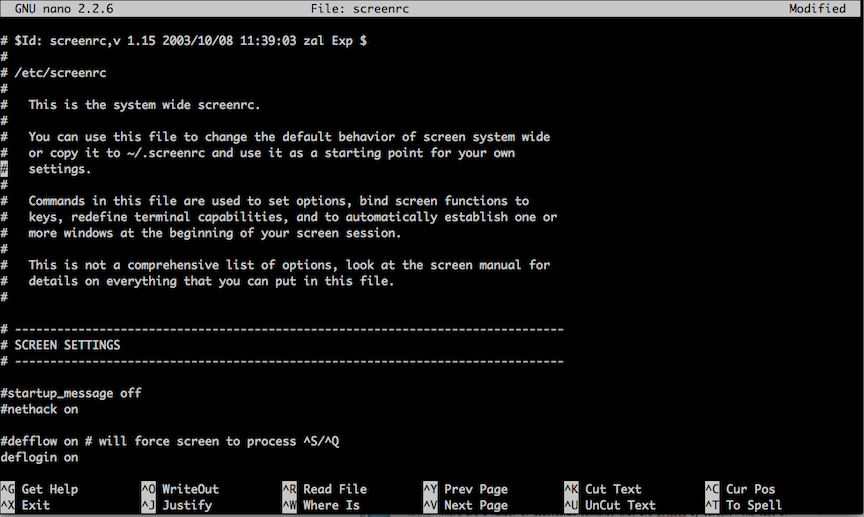

GNU Screen is a tool which works with a terminal session to allow users to resume a session after they have disconnected. Screen prevents a session from "timing out" or disconnecting SSH connections or local terminal emulators. A single Screen session has the ability to host multiple sessions or "windows." Screen may be used for a variety of tasks such as maintaining persistent IRC sessions and multitasking in a terminal environment.

Screen runs on any Unix/Linux environment (such as your Linode) and Mac OS X. Before installing and using Screen, it is recommended that you review the [Setting Up and Securing a Compute Instance](/docs/guides/set-up-and-secure/). In addition, if you are unfamiliar with using a terminal environment, you will want to review the [Using the Terminal Guide](/docs/using-linux/using-the-terminal).

## Installing GNU Screen

The section covers installing Screen on a number of different systems. Examples have been provided to simplify the installation process.

When installing Screen you will need root privileges. The examples provided do not use the root account. If you are using your root login then the sudo before the commands is not necessary. If you need more information regarding sudo, you can review the [Linux Users and Groups Guide](/docs/tools-reference/linux-users-and-groups).

For a Debian or Ubuntu system use the following commands to update, upgrade, and install Screen:

    sudo apt-get update
    sudo apt-get upgrade
    sudo apt-get install screen

For a CentOS or Fedora system use the following commands to update the system and install Screen:

    sudo yum update
    sudo yum install screen

For an Arch Linux system, the following commands are used to update and install Screen:

    sudo pacman -Sy
    sudo pacman -S screen

For a Gentoo system, the following commands are used to update and install Screen:

    sudo emerge --sync
    sudo emerge screen

By default, Screen is installed on Mac OS X systems and may be used without any other prerequisites.

## Screen Basics

In order to use an application with a Screen session do the following:

1.  Enter the command `screen` at a terminal prompt.
2.  Once Screen is running, enter an application or program command, such as `irssi` or `mutt`.

Your terminal session will function as usual. To end your current session without impacting any running processes, enter `Ctrl+a+d` or quit the Terminal application. Once you quit a session, you will be returned to the pre-Screen prompt. The Screen session and applications will continue to run. You may reattach to your session at any time by using the command `screen -r`.

## Managing Screen Attachment

Once you issue the `screen -r` command you will reattach to your last detached session. It is possible to have multiple Screen sessions as well as several detached sessions. A list of detached Screens may appear when you try to reattach to a session. Each session will have a process id or **PID**. So to determine which session to reattach to use the `screen -ls` command to display all the Screen sessions and their PIDs. Below is a sample of the screen -ls command:

    user:~$ screen -r
    There are several suitable screens on:
    25028.pts-19.XXX-serv8  (01/06/2014 08:15:34 PM)    (Attached)
    24658.pts-19.XXX-serv8  (01/06/2014 08:11:38 PM)    (Detached)
    24509.pts-19.XXX-serv8  (01/06/2014 08:10:00 PM)    (Detached)
    18676.pts-5.XXX-serv8   (01/05/2014 08:55:33 PM)    (Attached)

To reattach to a Screen session using the PID, use the following syntax:

    screen -r <24658>

If the Screen you want is already attached but you cannot see it, there are a number of command line arguments for invoking your Screen. Below are the different options:

-   `screen -dr` - detaches a running Screen from its current session and reattaches the session on the local machine.
-   `screen -x` - attaches to a running session without detaching from its current attachment. This argument is especially useful when you and another user are trying to access the same session at the same time.
-   `screen -DDR` - detaches a running session from its current attachment and performs a force reattachment. This is useful when the `-dr` option is unsuccessful.
-   `screen -A` - forces a Screen to resize all of its windows to the current window when it attaches.
-   `screen -X [command]` - starts a Screen session but instead of loading a shell it will load an arbitrary command. If you create additional Screen windows they will also run this command.

## Manipulating Screen Sessions

Once you attach or reattach to a Screen session, all commands are performed by using `Ctrl`, the letter `a`, and another letter or number. (Note the `Ctrl` and `a` keys are pressed at the same time.) Below is a list of the Screen commands:

-   `Ctrl+a c` - Creates a new Screen window. The default Screen number is zero.
-   `Ctrl+a 0-9` - Switches between windows 0 through 9.
-   `Ctrl+a x` - Locks your terminal window. You will have to enter your password to unlock your terminal session.
-   `Ctrl+a n` - Switches to the next window.
-   `Ctrl+a k` - Kills the current window. When the command is issued, you will be asked to confirm by entering a `y` or `n`.
-   `Ctrl+a A` - Will allow you to enter a title for the window.
-   `Ctrl+a d` - Detaches from a Screen.
-   `Ctrl+a ?` - Will display a list of all the command options available for Screen.

It is important to note that the command options listed above are only a small portion of the available options.

## Screen Commands and Customization

There are a number of additional commands that are utilized by Screen. The list of commands is quite extensive, so it is important to note that not all commands will be covered. In addition, Screen may be customized by editing the `screenrc` file.

### Using Screen with SSH

When connecting to a remote session via SSH it is best to connect with Screen at the same time. The syntax is as follows:

    ssh -t <user>@<server> screen -r

The user name would be the user you connect with and the server is either the IP address or name of your server.

### Changing Default Screen Behavior

To change the default settings of Screen, edit the `screenrc` file located in `/etc/screenrc`. The `screenrc` file may be edited using any text editor. This file is used to set options, bind Screen functions to keys, set terminal capabilities, and to automatically connect to one or more windows at the start of your Screen session. It is strongly recommended that you make a backup copy of the `screenrc` file before you make any changes.

There are two configuration files contained within your Screen distribution: `/etc/screenrc` and `/etc/etcscreenrc`. They contain several useful examples on how to customize Screen. Open the file using your favorite text editor. The command for editing one of these files is:

    nano screenrc

(Note that you may only have one of these files.) Below is a sample of the `screenrc` file:

