It is common for software developers to work on multiple projects that require them to access different systems. Using SSH on Windows allows developers to connect to multiple machines remotely right from their terminal. 

In this tutorial, let’s show you how to use SSH on Windows 10 and older versions. 

## Using SSH On Windows 10
To install SSH client on Windows 10, “Go to settings,” then “open Manage optional features” that you can find under “Apps & features.” 

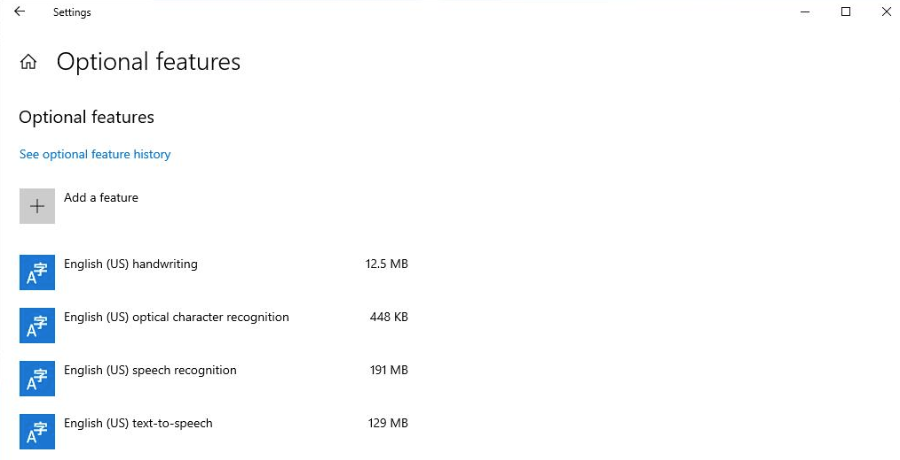

Under the **Apps & features**, “click” on **Manage optional features**.

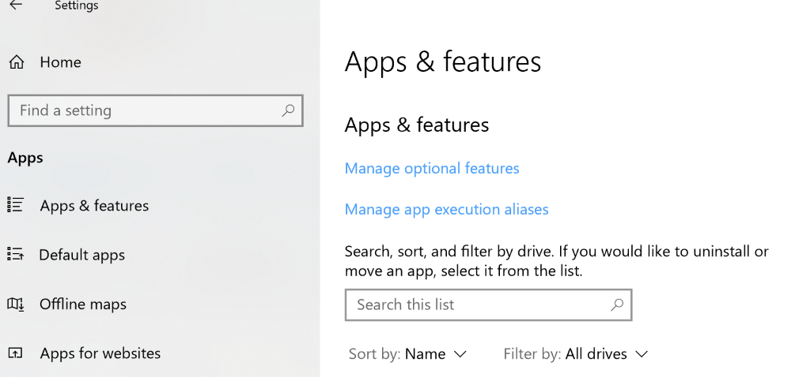

Next, “click” on **Add a feature**. A dropdown menu will open, “select” OpenSSH client and “install” it.  

	PS C:\Users\linode> ssh

	usage: ssh [-46AaCfGgKkMNnqsTtVvXxYy] [-B bind_interface]

           [-b bind_address] [-c cipher_spec] [-D [bind_address:]port]

           [-E log_file] [-e escape_char] [-F configfile] [-I pkcs11]

           [-i identity_file] [-J [user@]host[:port]] [-L address]

           [-l login_name] [-m mac_spec] [-O ctl_cmd] [-o option] [-p port]

           [-Q query_option] [-R address] [-S ctl_path] [-W host:port]

           [-w local_tun[:remote_tun]] destination [command]

Using SSH on Windows 10 is similar to using it on other operating systems like Linux or Mac OSX.

### Using SSH on Windows 10 To Connect To A Server

To connect with a SSH server, use the following syntax ssh &lt;username>@&lt;ssh domain>.

Let’s say we want to connect with an SSH server at ssh.linode.com with a username linode.  We can do that by running the following command: 

	ssh linode@ssh.linode.com

When we run this command, our SSH client will try to connect ssh.linode.com on the standard TCP port 22 by default. However, your SSH server may or may not be running on the same port. You can modify our previous command and define the TCP port you prefer to connect with. 

To specify a specific port, use the following syntax instead: 
	ssh &lt;username>@&lt;ssh domain> -p &lt;port number>

Let’s say, the TCP port we want to connect with is 2222, we can modify our previous command to:

	ssh linode@ssh.linode.com -p 2222

When you connect with a server for the first time, SSH client will prompt you to check and verify the host's keys. So, when you execute ssh command, you get a prompt like this 

	PS C:\Users\linode> ssh linode@ssh.linode.com -p 2222

	The authenticity of host ‘linode.com (29.217.172.207)’ can't be established.

	ECDSA key fingerprint is    SHA256:T2RssD0dEslggzS/BROmiE/s70WqcYy6bk52fs+MLTIptM.

	Are you sure you want to continue connecting (yes/no)? yes

	Warning: Permanently added 'pc' (ECDSA) to the list of known hosts.

When you get this prompt, accept it and your connection will be established. 

### Using SSH On  Windows 10 With Secure Shell App On Chrome

Secure shell is a Chrome application that allows you to execute ssh commands on the Chrome browser. This HTML based SSH client runs on Javascript. To use it, “go” to the [Secure Shell Extension](https://chrome.google.com/webstore/detail/secure-shell-app/pnhechapfaindjhompbnflcldabbghjo?hl=en) page on Google chrome store and “click” on Add to install. Google Chrome prompts you for permission, “select” adds the app, and the extension gets installed.

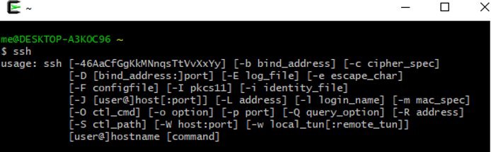

Once installed, you are automatically taken to your homepage on Google Chrome. If for some reason Google Chrome fails to redirect you, “enter” the following link in your chrome chrome://apps/ and “press” enter. 

You should see **Secure Shell App** as shown in the image below

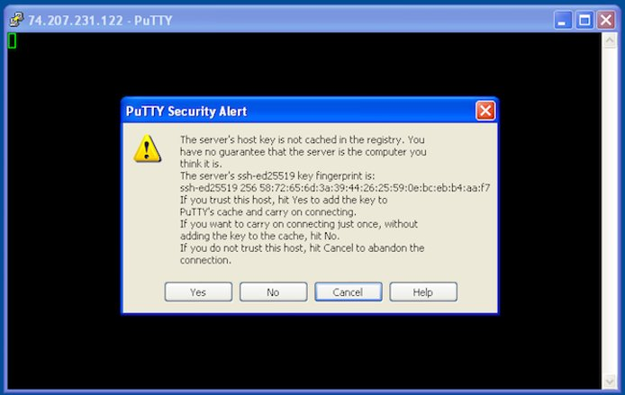

“Click” on **Secure Shell App** and it launches a new terminal directly on your Chrome as shown in the image below

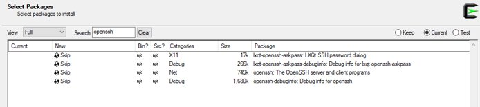

To improve security with Secure Shell App, we can add an SSH key to increase the level of security with this browser-based client. You can also remotely disable this key if needed. 

To use Secure Shell App without having to use chrome://apps/, you can simply start typing ssh in your chrome tab’s URL section and it will dynamically start taking your command. You can then write your user and hostname to connect as well.

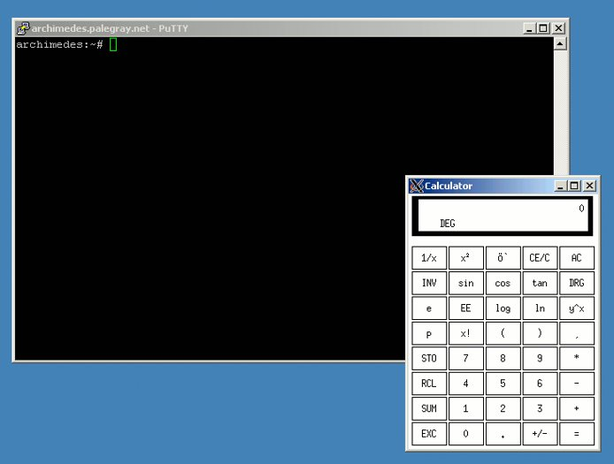

Once you enter your user and hostname(linode@ssh.linode.com, default port) with port, you can see the following output in your chrome terminal

	Welcome to Secure Shell App version 0.37.

	Answers to frequently asked questions: https://goo.gl/muppJj (Ctrl+Click on links to open)

	[Pro Tip] Use 'Open as window' or 'Fullscreen' to prevent Ctrl+W from closing your terminal!

	[Pro Tip] See https://goo.gl/muppJj for more information.

	ChangeLog/release notes: /html/changelog.html

	Major changes since 0.34:

	 ¤ Enable connection resume for Google corp-relay-v4 users.

	 ¤ OpenSSH upgraded to 8.4p1.

	Random pro tip #3: Connect from the omnibox by typing 'ssh &lt;profile name>': https://goo.gl/V7o8ki

	Notice: Please migrate to the new Secure Shell extension (link).

	Chrome Apps are deprecated, so this version will stop receiving updates.

	Please see the migration guide (link) for more details.

	Loading NaCl plug-in… done.

	Connecting to linode@ssh.linode.com…

	ssh: connect to host hostname port 22

	The authenticity of host ‘linode.com (29.217.172.207)’ can't be established.

	ECDSA key fingerprint is    SHA256:T2RssD0dEslggzS/BROmiE/s70WqcYy6bk52fs+MLTIptM.

	Are you sure you want to continue connecting (yes/no)? yes

	Warning: Permanently added 'pc' (ECDSA) to the list of known hosts.

Similar to how we did it earlier with Windows 10 SSH Client, enter yes. Then enter your password to establish a connection. Once a connection is established you will see the following output in your Secure Shell App Terminal:

<output>
Warning: Permanently added ‘linode.com (29.217.172.207)’ (ECDSA) to the list of known hosts.


linode@29.217.172.207’s password: 

Welcome to Ubuntu 18.04.1 LTS (GNU/Linux 4.15.0-33-generic x86_64)

 * Documentation:  https://help.ubuntu.com

 * Management:     https://landscape.canonical.com

 * Support:        https://ubuntu.com/advantage

45 packages can be updated. 

0 updates are security updates. 

New releases ‘20.01 LTS’ available. 

Run ‘do-release-upgrade’ to upgrade it. 


There are other Windows SSH Clients that you can use on Windows 10 too. But these are third party clients like PuTTy, ZOC, SecureCRT, Tera Term, Windows Terminal, xterm, etc. But since we have an SSH client available on Windows 10, we can get most of our work done without having to use these 3rd party clients. In the next section, we are going to look into how to use SSH on Windows for old OS versions where some of these SSH clients will be used as these operating systems don’t have a built-in SSH client from Microsoft. 

## OpenSSH
As of late 2018, [OpenSSH](https://docs.microsoft.com/en-us/windows-server/administration/openssh/openssh_overview) is included with some versions of Windows.

## Cygwin

Cygwin is a utility for running popular Linux and BSD tools on Windows. It's often used as an SSH client and/or server solution on Windows systems.

1.  Download and install [Cygwin](https://www.cygwin.com/).

1.  Search for the OpenSSH package and install it.

    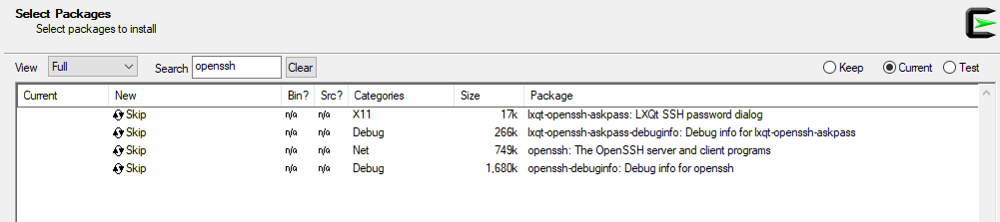

1. You should then have SSH capability.

    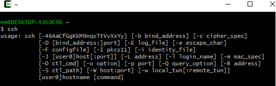

## PuTTY

PuTTY is a free and open source SSH client for Windows and UNIX systems. It provides easy connectivity to any server running an SSH daemon, so you can work as if you were logged into a console session on the remote system.

1.  Download and run the PuTTY installer from [here](http://www.chiark.greenend.org.uk/~sgtatham/putty/download.html).

1.  When you open PuTTY, you'll be shown the configuration menu. Enter the hostname or IP address of your Linode. PuTTY's default TCP port is `22`, the [IANA](https://en.wikipedia.org/wiki/Internet_Assigned_Numbers_Authority) assigned port for for SSH traffic. Change it if your server is listening on a different port. Name the session in the **Saved Sessions** text bar if you choose, and click **Save**:

    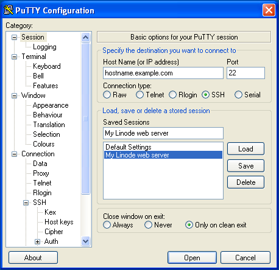

1.  Click **Open** to start an SSH session. If you have never previously logged into this system with PuTTY, you will see a message alerting you that the server's SSH key fingerprint is new, and asking if you want to proceed.

    **Do not click anything yet! Verify the fingerprint first.**

    

1.  Use [Lish](/docs/networking/using-the-linode-shell-lish/) to log in to your Linode. Use the command below to query OpenSSH for your Linode's SSH fingerprint:

        ssh-keygen -E md5 -lf /etc/ssh/ssh_host_ed25519_key.pub

    The output will look similar to:

    
256 MD5:58:72:65:6d:3a:39:44:26:25:59:0e:bc:eb:b4:aa:f7  root@localhost (ED25519)


    
For the fingerprint of an RSA key instead of elliptical curve, use: `ssh-keygen -lf /etc/ssh/ssh_host_rsa_key.pub`.


1.  Compare the output from Step 4 above to what PuTTY is showing in the alert message in Step 3. **The two fingerprints should match.**

1.  If the fingerprints match, then click **Yes** on the PuTTY message to connect to your Linode and cache the host fingerprint.

    **If the fingerprints do not match, do not connect to the server!** You won't receive further warnings unless the key presented to PuTTY changes for some reason. Typically, this should only happen if you reinstall the remote server's operating system. If you receive this warning again from a system you already have the host key cached on, you should not trust the connection and investigate matters further.

### SSH Tunneling/Port Forwarding

SSH tunnels allow you to access network services running on a remote server though a secure channel. This is useful in cases where the service you wish to access doesn't run over SSL, or you do not wish to allow public access to it. As an example, you can use tunneling to securely access a MySQL server running on a remote server.

To do so:

1.  In PuTTY's configuration window, go to the **Connection** category.
1.  Go to **SSH**, then **Tunnels**.
1.  Enter `3306` in the **Source port** field.
1.  Enter `127.0.0.1:3306` in the **Destination** field.
1.  Click **Add**, then click **Open** to log in:

    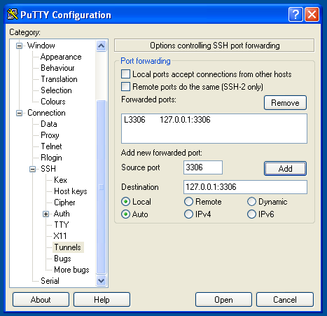

Once you've connected to the remote server with this tunnel configuration, you'll be able to direct your local MySQL client to `localhost:3306`. Your connection to the remote MySQL server will be encrypted through SSH, allowing you to access your databases without running MySQL on a public IP.

### Remote Graphical Applications over SSH

PuTTY can securely run graphical applications hosted on a remote Linux server. You can run virtually any X11 application in this manner, and the connection will be encrypted through SSH, providing a safe means of interacting with remote graphical systems.

1.  You wll need an X11 server for Windows. Download and install [Xming](http://sourceforge.net/projects/xming/), a free X server for Windows. Accept the defaults presented by the installer and you'll be running an X11 server when the install process completes.

    
You will need the `xauth` package installed on your Linode for X11 forwarding to work correctly. It is installed by default on Debian and RedHat based systems, but may not be for other Linux distributions.


1.  Tell PuTTY to forward X11 connections to your desktop:

    1. In PuTTY's configuration window, make sure the remote server's hostname or IP, and the correct port, are entered on the **Session** category.
    1. In the **Connection** category, go to **SSH**, then **X11**.
    1. Check the box for **Enable X11 forwarding**.
    1. Enter `localhost:0` in the **X display location** field.
    1. Click **Open** to log in.

    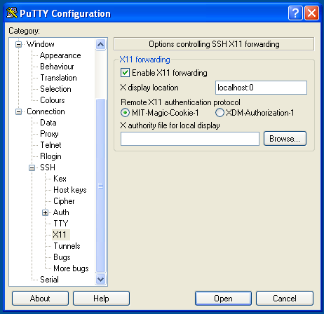

1.  Once you're logged into the remote server, you may start any graphical application hosted there. The application will be projected onto your local desktop. Here's the `xcalc` application running on a Windows desktop from a remote server:

    
