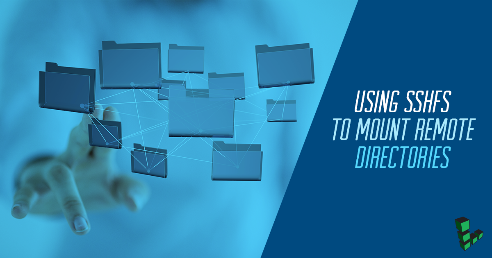

[SSHFS](https://github.com/libfuse/sshfs) (Secure Shell FileSystem), is a tool that allows users to securely access remote filesystems over the SSH protocol. This guide will get you started with SSHFS on your Linode. SSHFS can eliminate the need to use FTP/SFTP to transfer files to and from a remote server.

## Before You Begin

This guide will assume you have two systems set up:

-   A remote system running Ubuntu 18.04 which will serve your files over SSH.

-   A client system which will connect to the remote server using SSHFS. This system also runs Ubuntu 18.04.

Limited Linux users (non-`root`) with the same username should also exist on both systems. If you have not already set up a limited user, review the [How to Secure your Server](/docs/guides/set-up-and-secure/#add-a-limited-user-account) guide.

The username for this limited user is assumed to be `example_user`. Replace all instances of `example_user` in this guide with your limited user's name. As well, the IP address of the remote system is assumed to be `192.0.2.4`, so replace all instances of this IP with your remote system's address.


`sshfs` can be installed on any Linode distribution, so you can adapt this guide if you are not using Ubuntu.


## Install SSHFS

1. Log in to your client system and update your packages:

        apt-get update && apt-get upgrade

1. Install SSHFS:

        apt-get install sshfs

    
The `sshfs` package is available with every Linux package manager. Use the commands specific to your distribution if you are not using Debian or Ubuntu.


## Setting Up your Linux Client

In order to mount file systems using SSHFS from a normal user account, you'll need to add the user to the `fuse` group first.


If you are unfamiliar with users, groups, and file permissions, visit the [Users and Groups](/docs/tools-reference/linux-users-and-groups) guide for a brief introduction.


1. To check if the `fuse` group exists run:

        cat /etc/group | grep 'fuse'

1. If the group exists, execute the following command with `sudo`, substituting your user account name in place of `example_user`:

        sudo usermod -a -G fuse example_user

1. If the group does not exist it has to be created and the user added to the `fuse` group:

        sudo groupadd fuse
        sudo usermod -a -G fuse example_user

1. Log out from the client system and log back in to activate the group membership.

## Mounting the Remote File System

You can use the command `sshfs` to mount a remote filesystem. The syntax for mounting a filesystem with `sshfs` is:

    sshfs [user@]host:[directory] mountpoint [options]


You can read more about `sshfs` in the [sshfs manual](https://linux.die.net/man/1/sshfs).


1. Create a directory as a destination for the mounted folder.

        mkdir sshfs-dir

1. Mount the home directory of the remote system's user to the new directory on your client system:

        sshfs example_user@192.0.2.4:/home/example_user sshfs-dir

1. List the contents of the mounted directory. You should see the content of the folder that was mounted on the remote system:

        ls -al sshfs-dir

1. To unmount the filesystem, use the `umount` command:

        umount sshfs-dir

## Persistent Mounts

To keep your server's directory mounted on your system through reboots, create a persistent mount. This is accomplished by updating your system's [`/etc/fstab` file](https://wiki.archlinux.org/index.php/fstab).

### Set Up Key-Based Authentication for SSH

When setting up a mount listed in `/etc/fstab`, your client system will not be able to accept a password for the SSH connection. Instead, you can use [public/private keypairs](/docs/guides/use-public-key-authentication-with-ssh/) to authenticate with the remote server. This section describes how to create a keypair if you do not already have one.


This command will overwrite an existing RSA key pair, potentially locking you out of other systems.

If you’ve already created a key pair, skip this step. To check for existing keys, run ls ~/.ssh/id_rsa*.

If you accidentally lock yourself out of your Linode, use Lish to update your authorized_keys file and regain SSH access.


1. Generate a keypair with the `ssh-keygen` command; accept the default values for the options it presents:

        ssh-keygen -t rsa

1. From the client system, copy your new public SSH key to the remote user's `authorized_keys` file:

        ssh-copy-id -i ~/.ssh/id_rsa.pub example_user@192.0.2.4

    
If your system is older, this file may be named `authorized_keys2`. [Consult](https://www.ssh.com/ssh/sshd_config/#sec-AuthorizedKeysFile-location) your Linode's `/etc/ssh/sshd_config` if you are unsure:

    grep authorized_keys /etc/ssh/sshd_config


1. At this point, you should be able to log into the remote server as `example_user` without entering a password. Confirm this:

        ssh example_user@192.0.2.4

### Update fstab

1. On a new line, add a mount directive to your `/etc/fstab` file which matches the following syntax:

    
example_user@192.0.2.4:/home/example_user /home/example_user/sshfs-dir  fuse.sshfs noauto,x-systemd.automount,_netdev,follow_symlinks,identityfile=/home/example_user/.ssh/id_rsa,allow_other,default_permissions,reconnect 0 0


    
You will need to use `sudo` privileges to edit this file from your limited user.


1. Reboot your system. Then, list the contents of the mounted directory. You should see the content of the folder that was mounted on the remote system:

        ls -al /home/example_user/sshfs-dir

## Next Steps

After completing this guide you will be able to transfer files to a remote server from your client machine without using an FTP client. If you still want to learn how to use an FTP client, check out our guide: [Transfer Files with FileZilla](/docs/tools-reference/file-transfer/filezilla).
