This guide is the third of a three-part series on setting up a hardened OpenVPN environment. Though it's recommended that you first complete Parts [One](/docs/guides/set-up-a-hardened-openvpn-server/) and [Two](/docs/guides/tunnel-your-internet-traffic-through-an-openvpn-server/), this guide stands on its own as a general tutorial for configuring OpenVPN clients on various operating systems.

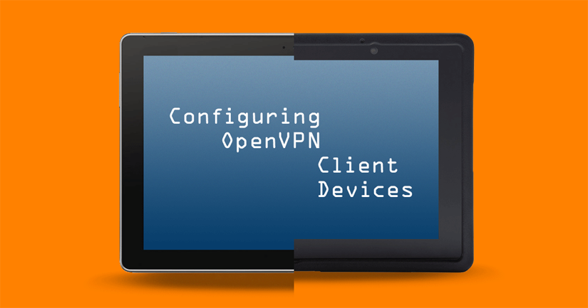

## Before You Begin

You must already have the client files listed below ready to transfer to the device. **Each client** will need its own copies. If you need client credentials, see the [VPN Certificate Authority](/docs/guides/set-up-a-hardened-openvpn-server/#vpn-certificate-authority) area of part one of this series.

  *  `client1.key`: Exclusive to this device.
  *  `client1.cert`: Exclusive to this device.
  *  `CA.pem`: Shared among server and client devices.
  *  `ta.key`: Shared among server and client devices.
  *  `client.ovpn`: Shared among client devices.

## Transfer Client Credentials
If you will be transferring client credentials to their respective devices over a network, you must use an encrypted transfer protocol such as [SCP or SFTP](/docs/guides/linux-system-administration-basics/#how-to-upload-files-to-a-remote-server). FTP or telnet should **not** be used because these protocols transfer data in plaintext. Windows has no native SCP or SFTP support. See [our Filezilla guide](/docs/guides/filezilla/) for transferring the VPN credentials from a Windows computer.

Local transfer options are Bluetooth, USB or some other external media. macOS can use iTunes to connect with iOS devices, and a Linux computer needs the package `gvfs-backends` installed to mount Android and iOS devices as external storage.

## Client-Side Configurations

### Android

There are two main options for an Android OpenVPN client. The first is *OpenVPN Connect* on [Google Play](https://play.google.com/store/apps/details?id=net.openvpn.openvpn), the official client from OpenVPN Technologies, Inc., the parent company behind OpenVPN. The second option is *OpenVPN for Android* on both [Google Play](https://play.google.com/store/apps/details?id=de.blinkt.openvpn) and [F-droid](https://f-droid.org/packages/de.blinkt.openvpn/). The two clients are similar but OpenVPN for Android is open source, more feature-rich, and usually updated more often so we'll use it for this guide.


If you have a Windows computer or a Linux computer with the package `gvfs-backends` installed, you can connect the device by USB and it will be visible in the system's file manager as an external USB device. If you have macOS, you need to first install [Android File Transfer](https://android.com/filetransfer/).


1.  Ensure that your Android device is fully updated, then install OpenVPN for Android from whichever source you prefer.

    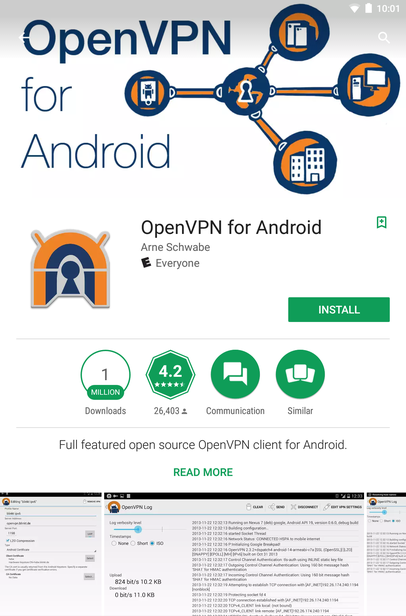

2.  Connect your Android device to your computer by USB. Tap the USB settings notification and put the device into file transfer mode. See [here](https://support.google.com/nexus/answer/2840804) for more information. Copy the VPN client credentials from the local computer to the Android device. You can put them into a folder in the `../Internal storage/` directory.

3.  Disconnect the device from USB and launch OpenVPN for Android. To import the VPN profile, tap the Import icon at the top right.

    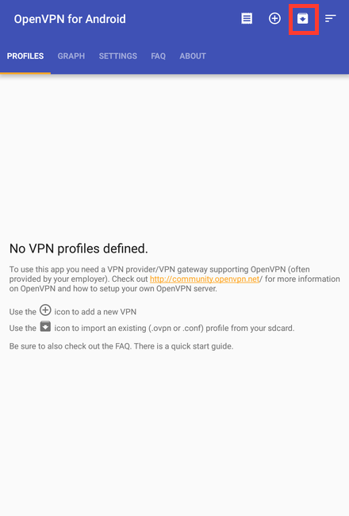

    You'll then be shown the file browser. Navigate to the folder you copied to the device in the previous step and tap the `client.ovpn` file to import it as a VPN profile.

    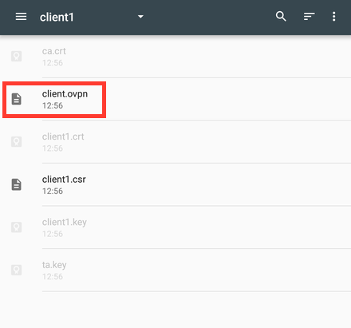

4.  At the *Convert Config File* screen, verify the certificate and key file names are correct. Then tap the check mark at the top right of the screen to complete the import process.

    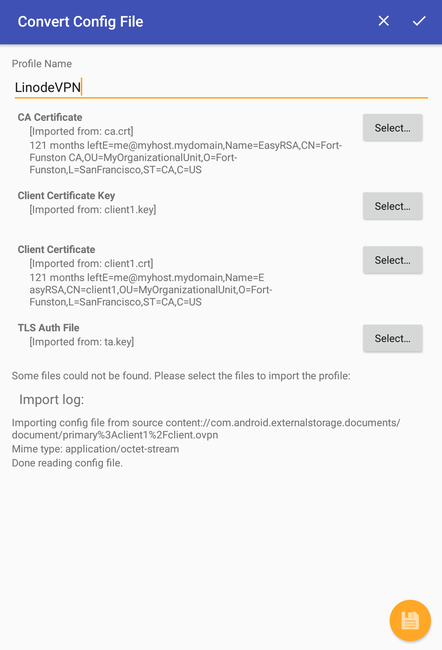

5.  To connect to the VPN server, tap the profile you just created and confirm the connection request. The log screen will show the connection status and shortly after, Android will be connected. You can further customize the profile in the app's Settings tab.

    

    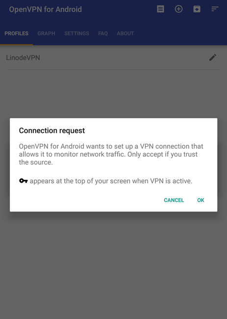

    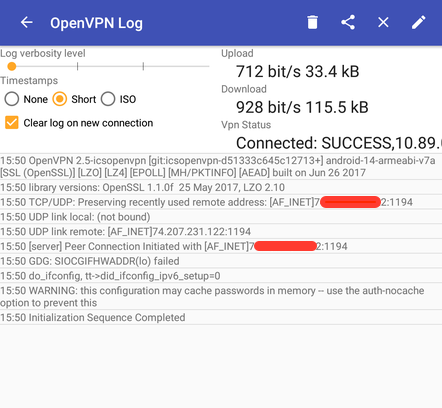

6.  After the profile is imported and you confirm everything works properly, back up the client credential files to external storage and delete the key and certificate files from the device. Once imported, they'll reside in the client's VPN profile and no longer need to remain on its internal storage, which is readable by other applications.

### iOS

*OpenVPN Connect* is used to manage OpenVPN connections in Apple's iOS for iPhones and iPads. We'll use iTunes to transfer the file to the iOS device from a computer running macOS or Windows. A Linux computer with the package `gvfs-backends` can mount the iOS device as external storage.


The following example was performed on iOS 9.0.2 and macOS 10.10 using iTunes 12 and OpenVPN Connect 1.0.5.


1.  Ensure that your iOS device is fully updated, then install [OpenVPN Connect](https://itunes.apple.com/us/app/openvpn-connect/id590379981) from the iTunes App Store.

    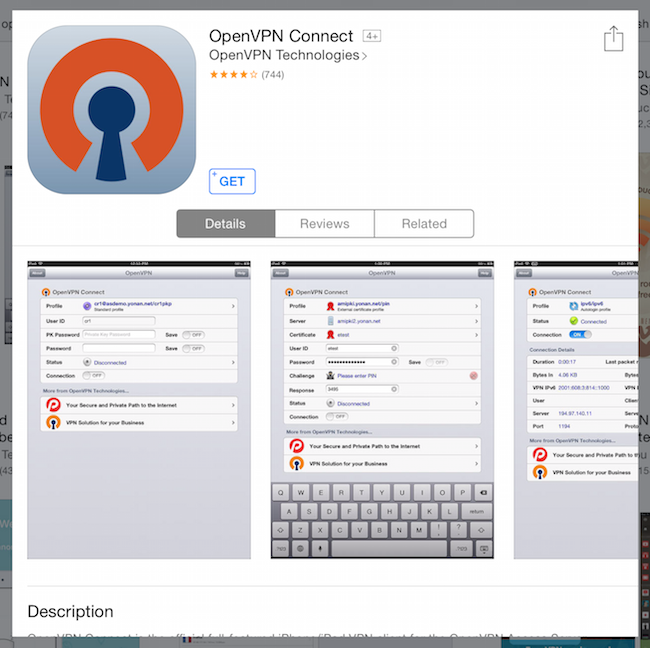

2.  Connect your iOS device to your computer running macOS or Windows. Open iTunes.

3.  Select the iPad or iPhone icon near the top-left of the menu bar.

    
If this is the first time connecting your iOS device to iTunes, you'll need to click the overflow menu (the three horizontal dots) and choose **Apps**, then click **Get Started**.


    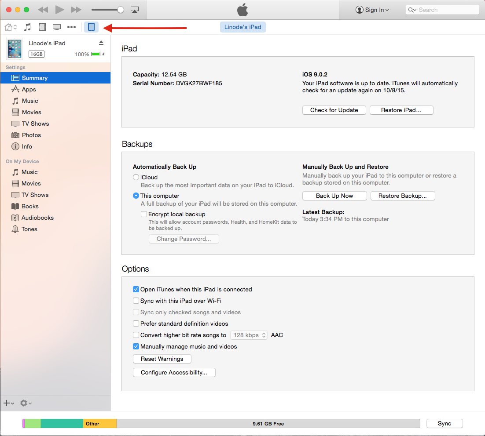

4.  In the left sidebar, choose **Apps** and scroll down to the **File Sharing** category in the main window. You will see the OpenVPN Connect icon. Click it, and then click **Add** in the **OpenVPN Documents** box. Navigate to your `ta.key` file and `.opvn` client profile in Finder and drag them into the iTunes window. If you add them individually, add the key before the client profile or OpenVPN Connect will fail to find the key.

    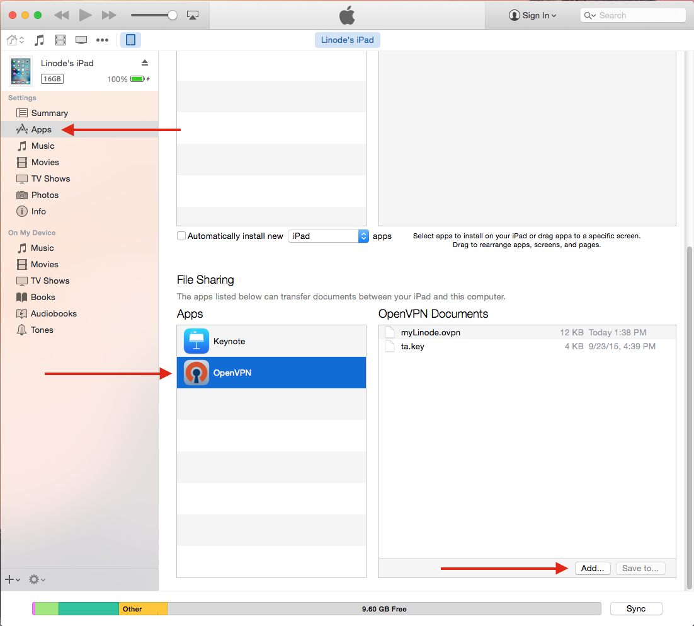

5.  Open the OpenVPN Connect app on the iOS device. You'll see an area saying that a new OpenVPN profile is available for import. Tap it to highlight the profile, then tap the green button to add it.

    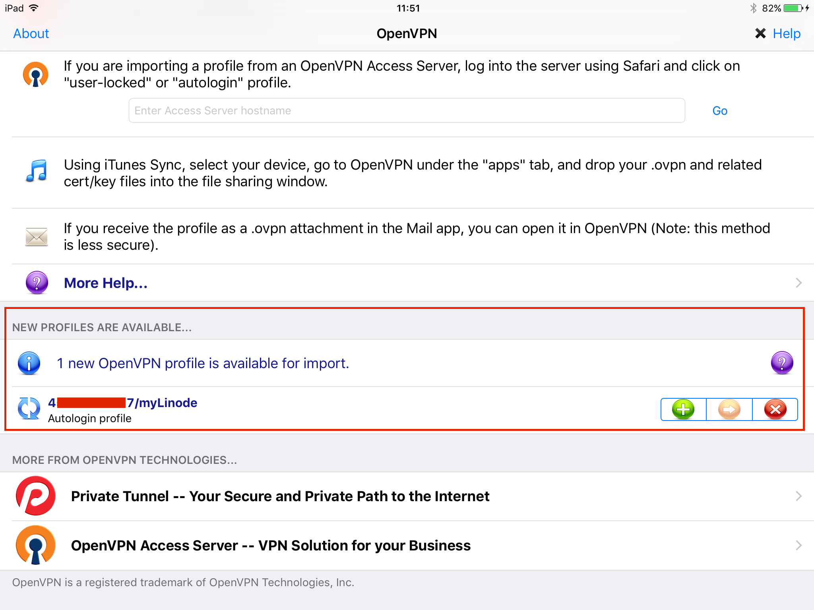

6.  In the next screen, tap the **Connection** slider to connect to your VPN server.

    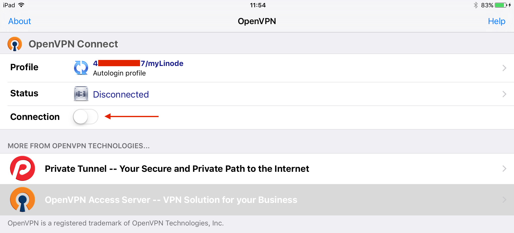

7.  You'll see a notification prompt asking to allow OpenVPN to enable the connection. Choose **Yes**. iOS will be connected shortly after.

    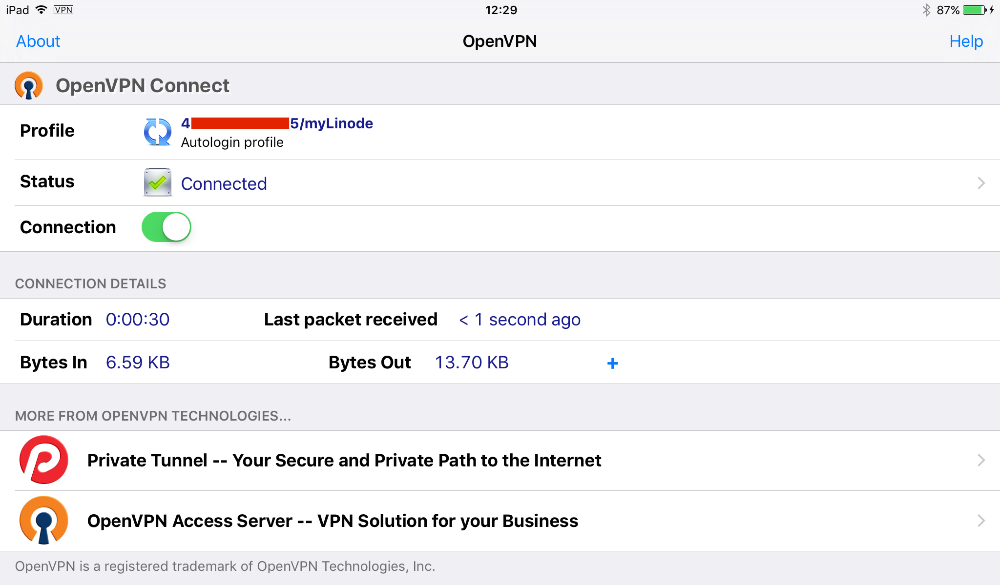

8.  OpenVPN Connect's app settings can be used to further tweak the connection. For example, you can specify whether the VPN is to be used over WiFi connections, cellular, or both. See the [OpenVPN Connect iOS FAQ](https://docs.openvpn.net/docs/openvpn-connect/openvpn-connect-ios-faq.html) for an explanation of each option.

    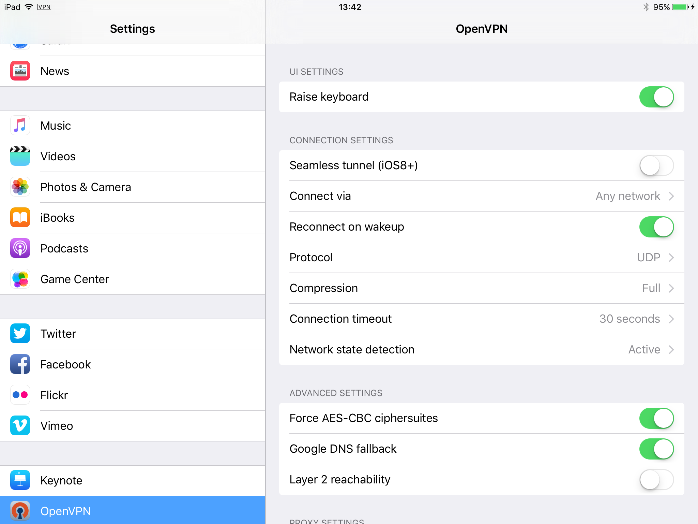

9.  After the profile is imported and you confirm it works properly, back up the client credential files to external storage and delete the key and certificate files from the device. Once imported, they'll reside in the client's VPN profile and no longer need to remain on its internal storage, which is readable by other applications.

### Linux

These steps assume a distribution which uses NetworkManager. Depending on the NetworkManager version your distribution provides, the windows and prompts may look slightly different than the screenshots below.

1.  Install the package `network-manager-openvpn` or `networkmanager-openvpn`, depending on your distribution. This will bring in the necessary dependencies with it, including the `openvpn` package.

2.  Some Linux distributions start and enable services automatically after installation. If yours does not, start and enable the OpenVPN Service.

    For distros with systemd:

        sudo systemctl enable openvpn*.service
        sudo systemctl start openvpn*.service

    For distros which do not use systemd:

        sudo service openvpn start

3.  Go to the **System Settings** menu and open the **Network** settings to add a new connection to NetworkManager. In the network connections window, select the plus sign at the bottom of the window to add a new connection.

    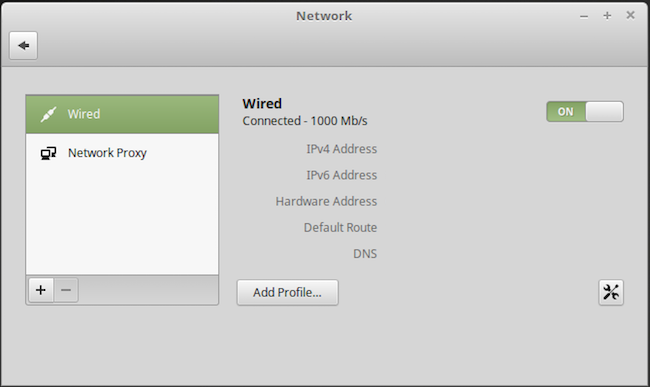

4.  In the popup window that appears, choose **VPN**, then **Import from file**.

    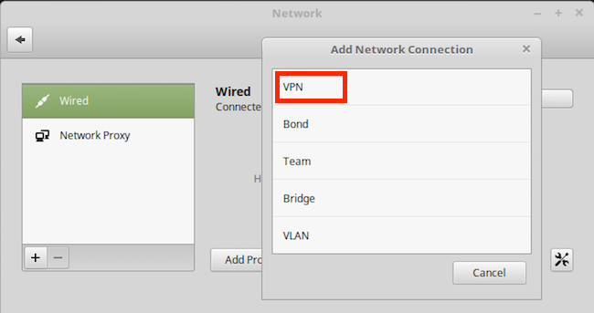

    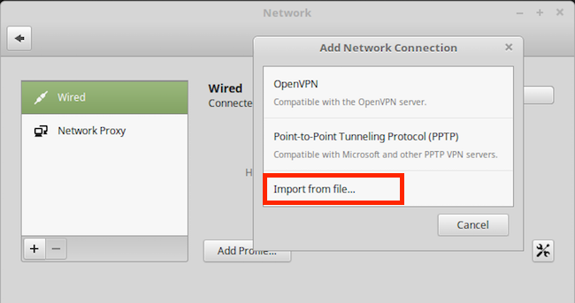

5.  Choosing **Import from file** above will open the file browser. Navigate to the computer's `client.ovpn` file and click **Open** to import it.

6.  In the new **Add Network Connection** window, verify the information was auto-filled correctly from the VPN profile. Then select IPv6 in the left column. Switch IPv6 **Off** and click **Add**.

    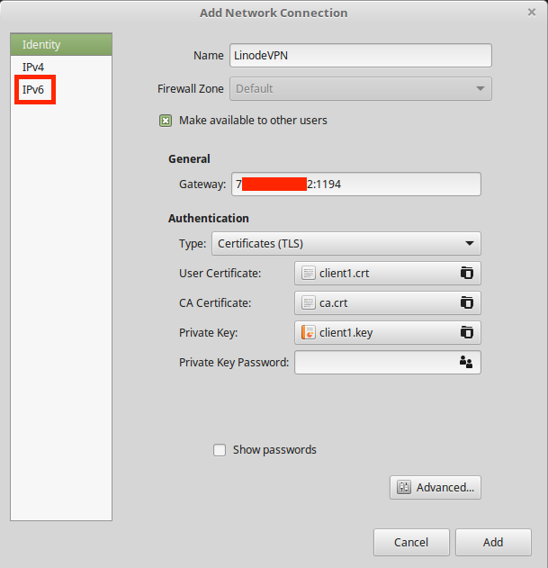

7.  The VPN client is now configured and ready to connect. How you do this will differ slightly by NetworkManager version, but after configuring the VPN, an entry for it will appear in the desktop environment's network menu.

    
Before connecting for the first time, it's a good idea to run `sudo journalctl -f | grep vpn` or `sudo tail -f /var/log/syslog | grep vpn` in a terminal on your client. The command gives you a realtime output of OpenVPN's logging. If you experience connection problems, any errors will be visible in the journal or syslog.


8.  After the profile is imported and you confirm it works properly, back up the client credential files to external storage and delete the key and certificate files from the device. Once imported, they'll reside in the client's VPN profile and no longer need to remain on its storage, which is readable by other applications.

### macOS

[Tunnelblick](https://tunnelblick.net/) is a free and open source application that lets you connect OS X and macOS to OpenVPN servers. Tunnelblick's website has an excellent [installation guide](https://www.tunnelblick.net/cInstall.html) so we won't repeat it here.

### Windows

1.  Download [OpenVPN's installer](https://openvpn.net/index.php/open-source/downloads.html) and install it using the default settings. When prompted about the TAP network adapter, be sure to install it too.

    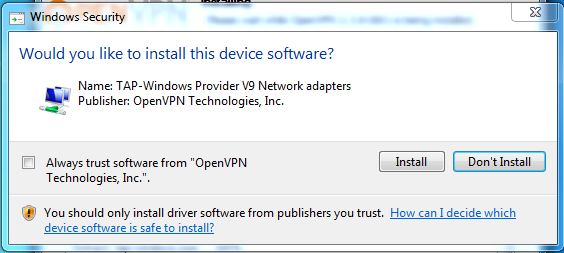

    
OpenVPN provides a GPG signature file to verify the installer's integrity and authenticity. You will additionally need to install [GnuPG](https://gnupg.org/) but verifying the installer is highly recommended.


2.  Move the client credential files to `C:\Program Files\OpenVPN\config`.

3.  OpenVPN must be run as an administrator to function properly. There are two ways to do this:

    **Option 1**: Right-click on the OpenVPN desktop shortcut and select **Run as administrator**. This must be done each time you to connect to your VPN.

    **Option 2**: Configure the shortcut to automatically run with admin privileges. *This will apply to all users on the system.* Right-click on the OpenVPN GUI shortcut, select **Properties**. Go to the **Compatibility** tab and select **Change settings for all users**. Select **Run this program as an administrator**, then **OK**.

4.  When you launch the OpenVPN application, its icon will appear in the taskbar. Right-click on it and select **Connect**. The OpenVPN taskbar icon will turn yellow and a dialog box will appear showing a verbose output of the connection process. The icon will turn green when successfully connected and show a confirmation bubble.

    

    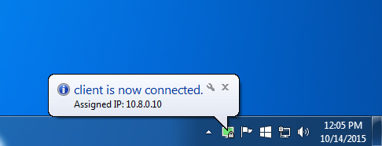

## Connection Testing

1.  With your VPN connection enabled, go to [https://dnsleaktest.com/](https://dnsleaktest.com/) in a web browser from your VPN client. The IP address shown should be that of your Linode's public IPv4 address.

2.  Choose **Extended test**. The resulting IP addresses should be for either: The DNS resolvers used in your `server.conf` file, or the DNS resolvers you chose for your client device (if applicable).

    If the client device you're testing is using OpenVPN Connect with Google DNS fallback enabled, you may see Google in the results as well.

3.  To ensure that no IPv6 traffic is coming from the VPN server, run the test at [http://test-ipv6.com/](http://test-ipv6.com/). Your public IP address should again be that of your Linode VPN, and the results should show that no IPv6 address was detected.


If the test results show you any IP addresses other than those of your Linode and intended DNS servers, your VPN is not properly tunneling traffic. Review the logs on both server and client to determine how to troubleshoot the connection.


##  Revoke a VPN Client Certificate

To revoke a client device's access to the VPN, SSH into your VPN server and go back to the EasyRSA root directory. The folder `~/ca` was used in the [VPN Certificate Authority](/docs/guides/set-up-a-hardened-openvpn-server/#vpn-certificate-authority) section of part one of this series so we'll continue with that location here.

1.  Change to the `easy-rsa` folder and source `vars`:

        cd ~/ca
        source ./vars

2.  Run the `revoke-full` script, substituting *client1* with the name of the client whose certificate you want to revoke:

        ./revoke-full client1
