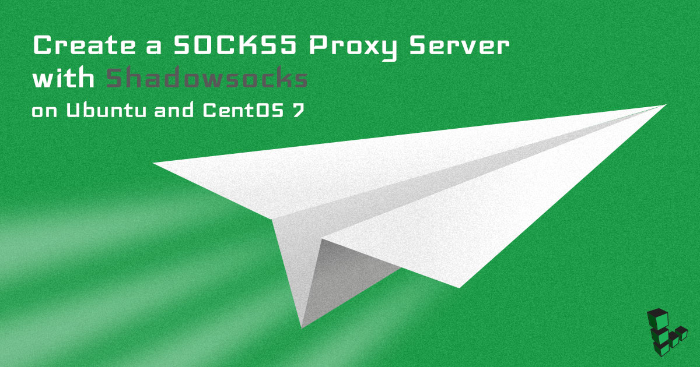
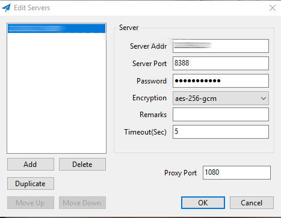

This guide shows you how to create a SOCKS5 proxy server with Shadowsocks on Ubuntu and CentOS. Shadowsocks is a lightweight SOCKS5 web proxy tool primarily utilized to bypass network censorship and block certain websites and web protocols. A full setup requires a Linode server to host the Shadowsocks daemon, and a client installed on PC, Mac, Linux, or a mobile device.

Unlike other proxy software, Shadowsocks traffic is designed to be both indiscernible from other traffic to third-party monitoring tools, and also able to disguise as a normal direct connection. Data passing through Shadowsocks is encrypted for additional security and privacy.

Because currently, there is no Shadowsocks package available for Ubuntu or CentOS, this guide shows how to build Shadowsocks from the source.

## Before You Begin

1.  The commands in this guide require root privileges. To run the steps as an elevated user with sudo privileges, prepend each command with `sudo`. If two commands are presented in the same instance (separated by `&&`), remember to use `sudo` after the `&&` (ex. `sudo [command] && sudo [command]`). To create a standard user account with `sudo` privileges, complete the [Add a Limited User Account](/docs/guides/set-up-and-secure/#add-a-limited-user-account) section of our Securing your Server guide.

1.  A working firewall is a necessary security measure. Firewall instructions [are provided](#open-firewall-port-for-shadowsocks-client) for UFW, FirewallD, and Iptables. To configure a firewall on a Linode, visit one of the following guides:

    *  [How to Configure a Firewall with UFW](/docs/guides/configure-firewall-with-ufw/)
    *  [Introduction to FirewallD on CentOS](/docs/guides/introduction-to-firewalld-on-centos/)

## What Is SOCKS5 Proxy Service?
SOCKS5 is an internet protocol of SOCKS that helps to route packets through a proxy between a client and a server. To carry out a secure communication, SOCKS5 uses three different modes of authentication: Null authentication, GSS-API based authentication, and a username-password based authentication.

When SOCKS5 uses a NULL authentication, any request between client and server connects to the set proxy without requiring any authentication. With GSS API authentication, a client's or server's identity is verified at the OS level to authenticate.

A username and password-based authentication uses credentials to connect to the proxy.

## What Is Shadowsocks?
Shadowsocks is an open source, free encryption protocol client designed to securely transmit information between clients and servers. It uses asynchronous input-output and is event-driven to deliver speed. Shadowsocks isn’t a proxy, but it enables connecting to 3rd party SOCKS5 proxy connections. It also supports UDP traffic.

## Install the Shadowsocks Server

### How Do You Run ShadowSocks On Ubuntu?

To run and install Shadowsocks on Ubuntu Server follow these steps:
1. Download and update the packages to the newest versions on Ubuntu

        apt update && apt upgrade -yuf

2. Install dependencies on the Ubuntu server by running the following command:

        apt install -y --no-install-recommends gettext build-essential autoconf libtool libpcre3-dev \
        asciidoc xmlto libev-dev libudns-dev automake libmbedtls-dev \
        libsodium-dev git python-m2crypto libc-ares-dev

3. Navigate to the `/opt` directory on Ubuntu and download the Shadowsocks Git module:

        cd /opt
        git clone https://github.com/shadowsocks/shadowsocks-libev.git
        cd shadowsocks-libev
        git submodule update --init --recursive \

4. Install Shadowsocks-libev:

        ./autogen.sh
        ./configure
        make && make install

### How Do You Run ShadowSocks On CentOS 7?

To run and install Shadowsocks on CentOS7 follow these steps:

1. Download and update the packages to the newest versions

        yum update && yum upgrade -y
        yum install epel-release -y

2. Install dependencies on CentOS7

        yum install -y gcc gettext autoconf libtool automake make pcre-devel asciidoc xmlto udns-devel \
        libev-devel libsodium-devel mbedtls-devel git m2crypto c-ares-devel

3. Navigate to the /opt directory on CentOS7 and download the Shadowsocks Git module:

        cd /opt
        git clone https://github.com/shadowsocks/shadowsocks-libev.git
        cd shadowsocks-libev
        git submodule update --init --recursive

4. Install Shadowsocks-libev:

        ./autogen.sh
        ./configure
        make && make install

### How Do You Use Shadowsocks Libev?

Shadowsocks libev is a lightweight, purely C-based proxy implementation for embedded devices. To use Shadowsocks libev after its installation, simply add a system user to Shadowsocks, create a directory with its configuration file.

## Configure the Shadowsocks Server

1. Create a new system user for Shadowsocks:

    **Ubuntu 16.04**

        adduser --system --no-create-home --group shadowsocks

    **CentOS 7**

        adduser --system --no-create-home -s /bin/false shadowsocks

1. Create a new directory for the configuration file:

        mkdir -m 755 /etc/shadowsocks

1. Create the Shadowsocks configuration file located at `/etc/shadowsocks/shadowsocks.json`. Paste the contents listed below into the file, noting the instructions in the [shadowsocks.json Breakdown](#shadowsocks-json-breakdown) table for each property. Follow these instructions to determine the value you should set for each property.

    
{
    "server":"your_public_IP_address",
    "server_port":8388,
    "password":"your_password",
    "timeout":300,
    "method":"aes-256-gcm",
    "fast_open": true
}


### shadowsocks.json Breakdown

|  **Property**  | **Description** | **Possible Values** |
|:--------------:|:---------------:|:-------------------:|
| server | Enter the server's public IP address. | User determined |
| server_port | Shadowsocks listens on this port. Use the default value of `8388`. | User determined |
| password | Connection password. Set a strong password. | User determined |
| timeout | Connection timeout in seconds. The default value should be sufficient here. | User determined |
| method | Encryption method. Using AEAD algorithms is recommended. | See [Stream Ciphers](https://shadowsocks.org/en/spec/Stream-Ciphers.html) and [AEAD Ciphers](https://shadowsocks.org/en/spec/AEAD-Ciphers.html) |
| fast_open | Reduces latency when turned on. Can only be used with kernel versions 3.7.1 or higher. Check the kernel version with `uname -r`. | true, false |
| nameserver | Name servers for internal DNS resolver. | User determined |

## Optimize Shadowsocks

Apply the following optimizations to the system kernel to provide for a smooth running Shadowsocks installation.

1. Create the `/etc/sysctl.d/local.conf` system optimization file and paste the contents shown below into the file:

    
These settings provide the optimal kernel configuration for Shadowsocks. If you have previously configured the system kernel settings for any reason, make sure no conflicts exist.


    
# max open files
fs.file-max = 51200
# max read buffer
net.core.rmem_max = 67108864
# max write buffer
net.core.wmem_max = 67108864
# default read buffer
net.core.rmem_default = 65536
# default write buffer
net.core.wmem_default = 65536
# max processor input queue
net.core.netdev_max_backlog = 4096
# max backlog
net.core.somaxconn = 4096
# resist SYN flood attacks
net.ipv4.tcp_syncookies = 1
# reuse timewait sockets when safe
net.ipv4.tcp_tw_reuse = 1
# turn off fast timewait sockets recycling
net.ipv4.tcp_tw_recycle = 0
# short FIN timeout
net.ipv4.tcp_fin_timeout = 30
# short keepalive time
net.ipv4.tcp_keepalive_time = 1200
# outbound port range
net.ipv4.ip_local_port_range = 10000 65000
# max SYN backlog
net.ipv4.tcp_max_syn_backlog = 4096
# max timewait sockets held by system simultaneously
net.ipv4.tcp_max_tw_buckets = 5000
# turn on TCP Fast Open on both client and server side
net.ipv4.tcp_fastopen = 3
# TCP receive buffer
net.ipv4.tcp_rmem = 4096 87380 67108864
# TCP write buffer
net.ipv4.tcp_wmem = 4096 65536 67108864
# turn on path MTU discovery
net.ipv4.tcp_mtu_probing = 1
# for high-latency network
net.ipv4.tcp_congestion_control = hybla
# for low-latency network, use cubic instead
net.ipv4.tcp_congestion_control = cubic



1.  Apply optimizations:

        sysctl --system

### Create a Shadowsocks Systemd Service

The Shadowsocks systemd service allows the daemon to automatically start on system boot and run in the background.

1. Create a systemd file with the following content:

    
[Unit]
Description=Shadowsocks proxy server

[Service]
User=root
Group=root
Type=simple
ExecStart=/usr/local/bin/ss-server -c /etc/shadowsocks/shadowsocks.json -a shadowsocks -v start
ExecStop=/usr/local/bin/ss-server -c /etc/shadowsocks/shadowsocks.json -a shadowsocks -v stop

[Install]
WantedBy=multi-user.target



1.  Enable and start `shadowsocks.service`:

        systemctl daemon-reload
        systemctl enable shadowsocks
        systemctl start shadowsocks

## Open Firewall Port for Shadowsocks Client

Depending on your preference, you may use either the iptables, UFW, or firewalld (CentOS 7 only) commands to complete this section.

Open port `8388` for the Shadowsocks Client:

**Iptables**

    iptables -4 -A INPUT -p tcp --dport 8388 -m comment --comment "Shadowsocks server listen port" -j ACCEPT

**UFW**

    ufw allow proto tcp to 0.0.0.0/0 port 8388 comment "Shadowsocks server listen port"

**FirewallD**

    firewall-cmd --permanent --zone=public --add-rich-rule='
        rule family="ipv4"
        port protocol="tcp" port="8388" accept'

    firewall-cmd --reload

## Install a Shadowsocks Client

The second stage to a Shadowsocks setup is to install a client on the user's device. This could include a computer, mobile device, tablet, and even home network router. Supported operating systems include Windows, macOS, iOS, Linux, Android, and OpenWRT.

### macOS Shadowsocks Client

1.  Download the [ShadowsocksX-NG GUI Client for macOS](https://shadowsocks.org/en/download/clients.html):

    

1.  Launch the application on your Mac. The app preferences is available from a new status menu bar icon. Select the *Server Preferences* menu item:

    

1.  In the *Server Preferences* window, click the **+** (plus-sign) button in the lower left. Enter the details for your Shadowsocks Linode. Be sure to select the same port and encryption scheme that you listed in your Linode's `shadowsocks.json` file. Afterwards, close the window:

    

1.  In the Shadowsocks menu, make sure that Shadowsocks is turned on and that the *Global Mode* item is selected:

    

1.  Verify that the Shadowsocks connection is active by visiting an IP address lookup website like [ifconfig.co](https://ifconfig.co/). When the connection is working as expected, the website lists the Shadowsocks Linode's public IP.

### Windows Shadowsocks Client

1.  Navigate to the [Windows Shadowsocks](https://github.com/shadowsocks/shadowsocks-windows/releases) page. Click on **Shadowsocks-4.0.4.zip** under **Downloads**.

1.  Extract the contents of the .zip file into any folder and run `Shadowsocks.exe`. Shadowsocks runs as a background process. Locate the Shadowsocks icon in the taskbar (it may be in the *Hidden Icons* taskbar menu), right-click on the Shadowsocks icon, then click on **Edit Servers**. Enter the information that you saved in the `shadowsocks.json` file:

    

1.  Right-click on the Shadowsocks icon again. Mouse over **PAC** and select both **Local PAC** and **Secure Local PAC**.

    To confirm that the Linode's IP address is selected, mouse over **Servers**.

1.  Verify that the Shadowsocks connection is active by visiting an IP address lookup website like [ifconfig.co](https://ifconfig.co/). When the connection is working as expected, the website lists the Shadowsocks Linode's public IP.

### How Do You Know If SOCKS5 Proxy Is Working?

To check if the SOCKS5 proxy is working, open the terminal and run the `netstat` command to see if there is an open port:

    netstat -tlnp

If the SOCKS5 proxy is working, you should see an output similar to below in the terminal:

    tcp        0      0 232.222.333.414:8888          0.0.0.0:*               LISTEN

Another way to test whether SOCKS5 proxy is working is by using the curl command on the right port of the proxy. For a SOCKS5 proxy hosted at `232.222.333.414` listening at `port 8080`, run the following command in the terminal:

    timeout 5 curl -x socks5://232.222.333.414:8080 https://linode.com/

If the SOCKS5 proxy isn’t working properly on a proxy hosted at `232.222.333.414`, it returns a timeout on our terminal.

## Where to Go from Here

After the Shadowsocks server is online, configure a client on your mobile phone, tablet, or any other devices you use. The [Shadowsocks client download](https://shadowsocks.org/en/download/clients.html) page supports all mainstream platforms.
