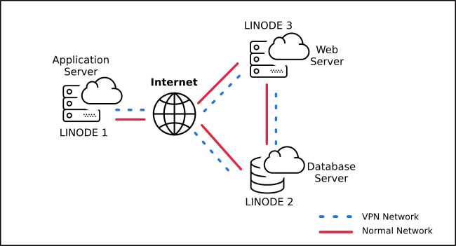
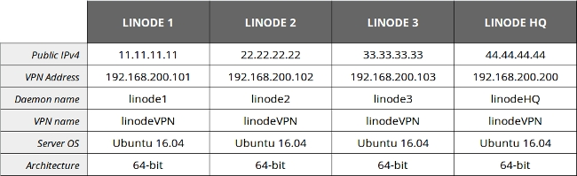

Virtual Private Networks (VPN) are an essential part of any serious network security deployment plan. There are many open-source VPN options but one of them shines above the others: tinc. All VPNs behave as a secure tunnel between two points, but [tinc](https://www.tinc-vpn.org/) stands out for its "Peer-to-Peer" design. The design allows tinc users a great deal of flexibility, especially when planning a mesh-type network.

From a clear two-server connection to complex mesh private network, this guide will show you how to configure tinc VPN in three different use-case scenarios.

## Before You Begin

You will need at least two Linodes for this guide. Complete the following steps for each one:

1.  Complete the [Getting Started](/docs/products/platform/get-started/) guide.

2.  Follow the [Setting Up and Securing a Compute Instance](/docs/products/compute/compute-instances/guides/set-up-and-secure/) guide to create a standard user account, harden SSH access and remove unnecessary network services.

    This guide will use `sudo` wherever possible. Please ensure you have access to privileged user rights.

3.  Update your packages:

        sudo apt update && sudo apt upgrade


In order to focus on tinc configuration, three assumptions are made:

- There are no active firewalls on any server.

- Each server is connected directly to the Internet (no router or proxy is involved).

- Each server is running the same version of tinc.


## Basic Setup: Two Node tinc VPN

A typical use case for a two-node tinc is web-based invoicing software, where the database should be on a separate server (for security and disaster recovery), and needs to communicate sensitive data to the application server through the internet.
This is a straightforward setup involving only two instances, an application server (which we'll call *appserver*) and a database server (*dbserver*). Each instance will run on a separate Linode:

### Gather Network Information

Before getting started, it's a good idea to make a cheat sheet for yourself listing each node's public IPv4 address, desired VPN address, VPN network name designation, and tinc-daemon name. The VPN address can be an arbitrary private network IPv4 address, the only rule to follow (if you want to avoid extra routing work) is that they must have the **same network prefix**, just like a typical LAN. VPN and daemon names must be unique and can't contain any spaces or special symbols. For the current use case, the following information will be used for tinc configuration:


Throughout this guide, replace the IP address for each server with the public IP address of the corresponding Linode.


### Install tinc VPN on Ubuntu 16.04

Ubuntu 16.04 will be used for all of the Linodes in this guide. At the time of this writing, the latest stable version of tinc is 1.0.33. Ubuntu's repositories use an older version, so you will have to build from source:

1.  Install the necessary dependencies for building tinc:

        sudo apt install build-essential automake libssl-dev liblzo2-dev libbz2-dev zlib1g-dev

2.  Get the latest version of tinc from the developer's site:

        wget https://tinc-vpn.org/packages/tinc-1.0.33.tar.gz

3.  Extract the archive in a temporary folder:

        tar -xf tinc-1.0.33.tar.gz

4.  Compile tinc on your system:

        cd tinc-1.0.33
        ./configure --prefix=
        make
        sudo make install

### Create VPN Working Directory

You can implement as many tinc networks as you need as long as you create a unique working directory for each one (gaming VPN, backups VPN, etc). The name of the folder must match the designated name for your VPN, in this case: *linodeVPN*. You also need to use the same structure across the servers, which means you need to create the working directory on both:

    sudo mkdir -p /etc/tinc/linodeVPN/hosts

### Create Configuration Files

You will be required to set up a **main** configuration file titled `tinc.conf` on each server. The default location for this file is the root of the working directory.

1.  Let's start with the application server's file:

    
Name = appserver
Device = /dev/net/tun
AddressFamily = ipv4



    * `Name` - This is a daemon-specific name within the VPN. It should be unique.
    * `Device` - Determines the virtual network to use. Tinc will automatically detect what kind of device you are using.
    * `AddressFamily` - Tell tinc which type of address to use.

2.  Now you need to generate the database server's configuration file:

    
Name = dbserver
Device = /dev/net/tun
AddressFamily = ipv4
ConnectTo = appserver



    `ConnectTo` - This value points to the tinc daemon you want to connect. When it's not present (like in the previous file), tinc enters listening mode and waits for connections.

    
You can customize tinc behavior with many other parameters in the configuration file, for more information visit the [tinc documentation](https://www.tinc-vpn.org/documentation/tinc.conf.5).


3.  Create the **hosts** configuration file. Because tinc is built using a peer-to-peer model each node needs to communicate with the others. The basic host file for the application server is:

    
Address = 11.11.11.11
Subnet = 192.168.100.209



4.  Similarly, create a host file for Database Server:

    
Address = 22.22.22.22
Subnet = 192.168.100.130



5.  Add the public key of each node. tinc can create the key pair using the following command:

        sudo tincd -n linodeVPN -K 4096

    For this example we're using 4096-bit encryption, you can choose a higher level if necessary. Save both `rsa_key.pub` and `rsa_key.priv` to the root of your working directory, `/etc/tinc/linodeVPN`.

6.  Next, append the `rsa_key.pub` at the end of each host file. From the application server:

        sudo bash -c "cat /etc/tinc/linodeVPN/rsa_key.pub >> /etc/tinc/linodeVPN/hosts/appserver"

    From the database server run a similar command:

        sudo bash -c "cat /etc/tinc/linodeVPN/rsa_key.pub >> /etc/tinc/linodeVPN/hosts/dbserver"

### Create VPN Control Scripts

Control scripts are responsible for setting up virtual interfaces on each server. They're needed on both servers.

1.  From the application server, create the following file to enable the tinc interface:

    
#!/bin/sh
ip link set $INTERFACE up
ip addr add 192.168.100.209 dev $INTERFACE
ip route add 192.168.100.0/24 dev $INTERFACE



    Create a script to disable the interface:

    
#!/bin/sh
ip route del 192.168.100.0/24 dev $INTERFACE
ip addr del 192.168.100.209 dev $INTERFACE
ip link set $INTERFACE down



2.  Create a similar set of scripts on the database server:

    
#!/bin/sh
ip link set $INTERFACE up
ip addr add 192.168.100.130 dev $INTERFACE
ip route add 192.168.100.0/24 dev $INTERFACE



    Add a shutdown script:

    
#!/bin/sh
ip route del 192.168.100.0/24 dev $INTERFACE
ip addr del 192.168.100.130 dev $INTERFACE
ip link set $INTERFACE down



3.  After creating the control scripts, you will need to change the permissions on both servers:

        sudo chmod -v +x /etc/tinc/linodeVPN/tinc-{up,down}

### Create tinc Unit File

In order to run tinc as a service on startup, you'll need to set up a systemd unit file for each server. Edit the following file on both the application and database servers.


[Unit]
Description=Tinc net linodeVPN
After=network.target

[Service]
Type=simple
WorkingDirectory=/etc/tinc/linodeVPN
ExecStart=/sbin/tincd -n linodeVPN -D -d3
ExecReload=/sbin/tincd -n linodeVPN -kHUP
TimeoutStopSec=5
Restart=always
RestartSec=60

[Install]
WantedBy=multi-user.target




A debug level of `3` was chosen in the `tincd` command. This will log all requests from other daemons and include an authentication chain between them. See the [tincd documentation](https://www.tinc-vpn.org/documentation/tincd.8) for more information about debug levels.


### Host Files Interchange

At this point, you have configuration files created on each server. Because of tinc's P2P nature, the last thing you need to do is interchange host files between nodes. There are many ways to accomplish this, but we'll use `scp` here.

From the application server:

    scp /etc/tinc/linodeVPN/hosts/appserver <user>@<dbserver>:/tmp/
    ssh -t <user>@<dbserver> sudo mv -v /tmp/appserver /etc/tinc/linodeVPN/hosts/

From the database server:

    scp /etc/tinc/linodeVPN/hosts/dbserver <user>@<appserver>:/tmp/
    ssh -t <user>@<appserver> sudo mv -v /tmp/dbserver /etc/tinc/linodeVPN/hosts/

### Test tinc

1.  It's time to test your newly configured VPN. Start the `tincd` daemon on the application server:

        sudo tincd -n linodeVPN -D -d3

2.  Do the same on database server:

        sudo tincd -n linodeVPN -D -d3

    If everything was configured successfully, you should see an output similar to this:

    

3.  You can open another terminal (i.e., from `appserver`) and check the active interfaces:

        sudo ip a

    You should have at least three interfaces, one of them your `linodeVPN`.

    Another quick test you can do is to `ping` the database server from the application server using its VPN address:

        ping 192.168.100.130

    If you encounter errors during your testing, you can add this flag to your daemon command:

        sudo tincd -n --logfile[=FILE] linodeVPN -D -d5

### Complete Your tinc Configuration

Once you have your tinc VPN ready you can enable the service on startup:

    sudo systemctl enable tinc.service

Now you can start, stop, restart, and check the service using common `systemd` syntax.

    sudo systemctl status tinc.service

## How to Deploy a Three-Node tinc mesh

This topology can be considered a variant of the single-node where a high traffic application requires separate instances to scale, resource optimization and faster response (asynchronous processing).

In the interest of showcasing tinc's easy expandability, we'll assume that **LINODE1** and **LINODE2** are the same application server and database server from the previous section.

The cheat sheet for this topology is:

1.  Configure the new webserver (Linode 3). Follow the previously explained steps to install the tinc VPN and create the working directory.

2.  The main configuration file for this instance would be:

    
Name = webserver
Device = /dev/net/tun
AddressFamily = ipv4
ConnectTo = appserver
ConnectTo = dbserver



3.  Edit the host file:

    
Address = 33.33.33.33
Subnet = 192.168.100.140



4.  This time increase the security level on the encryption keys:

        sudo tincd -n linodeVPN -K 8192

5.  Once again, you need to append the public key to the host file:

        sudo bash -c "cat /etc/tinc/linodeVPN/rsa_key.pub >> /etc/tinc/linodeVPN/hosts/webserver"

6.  Add control scripts:

    
#!/bin/sh
ip link set $INTERFACE up
ip addr add 192.168.100.140 dev $INTERFACE
ip route add 192.168.100.0/24 dev $INTERFACE



    
#!/bin/sh
ip route del 192.168.100.0/24 dev $INTERFACE
ip addr del 192.168.100.140 dev $INTERFACE
ip link set $INTERFACE down



7.  Change permissions:

        sudo chmod -v +x /etc/tinc/linodeVPN/tinc-{up,down}

8.  The systemd unit file on this server will be identical to the previous servers:

    
[Unit]
Description=Tinc net linodeVPN
After=network.target

[Service]
Type=simple
WorkingDirectory=/etc/tinc/linodeVPN
ExecStart=/sbin/tincd -n linodeVPN -D -d3
ExecReload=/sbin/tincd -n linodeVPN -kHUP
TimeoutStopSec=5
Restart=always
RestartSec=60

[Install]
WantedBy=multi-user.target



9.  The last step is to interchange host files between all nodes. You will need to copy the application and database server's host files to the web server, and web server's host file to the application and database servers.

    From `webserver`:

        scp /etc/tinc/linodeVPN/hosts/webserver <user>@<appserver>:/tmp/
        ssh -t <user>@<appserver> sudo mv -v /tmp/webserver /etc/tinc/linodeVPN/hosts/

        scp /etc/tinc/linodeVPN/hosts/webserver <user>@<dbserver>:/tmp/
        ssh -t <user>@<dbserver> sudo mv -v /tmp/webserver /etc/tinc/linodeVPN/hosts/

    From `appserver`:

        scp /etc/tinc/linodeVPN/hosts/appserver <user>@<webserver>:/tmp/
        ssh -t <user>@<webserver> sudo mv -v /tmp/appserver /etc/tinc/linodeVPN/hosts/

    From `dbserver`:

        scp /etc/tinc/linodeVPN/hosts/dbserver <user>@<webserver>:/tmp/
        ssh -t <user>@<webserver> sudo mv -v /tmp/dbserver /etc/tinc/linodeVPN/hosts/

10.  Finally, modify the `tinc.conf` file on `appserver` and `dbserver`. The new configuration files need to tell tinc to look for other nodes:

    
Name = appserver
Device = /dev/net/tun
AddressFamily = ipv4
ConnectTo = dbserver
ConnectTo = webserver



    
Name = dbserver
Device = /dev/net/tun
AddressFamily = ipv4
ConnectTo = appserver
ConnectTo = webserver



11.  Now you can start the tinc service on the webserver:

         sudo systemctl enable tinc.service
         sudo systemctl start tinc.service

## Use tinc for Centralized Cloud Interconnection

This setup illustrates a use-case where regional branches need to interact with a centralized application such as inventory management software. In the last use case, you will configure a VPN with four Linode servers. Each server should be in a different geographic location.

The cheat-sheet in this case is:

After the previous two sections, you should be familiar with the configuration procedure:

1.  Install tinc VPN on each node.
2.  Create the VPN's working directory on each node.
3.  Create `tinc.conf` and host files on every node.
4.  Create VPN control scripts for all tinc instances.
5.  Create systemd unit files.
6.  Exchange host files amongst all nodes.
7.  Enable tinc systemd unit(s).

The configuration file `tinc.conf` on Linodes 1, 2, and 3 should point only to Linode HQ (`ConnectTo`). The configuration file on Linode HQ should define connections with all nodes using the same directive. The corresponding configuration files are:

**Linode1:**


Name = linode1
Device = /dev/net/tun
AddressFamily = ipv4
ConnectTo = linodeHQ



**Linode2:**


Name = linode2
Device = /dev/net/tun
AddressFamily = ipv4
ConnectTo = linodeHQ



**Linode3:**


Name = linode3
Device = /dev/net/tun
AddressFamily = ipv4
ConnectTo = linodeHQ



**The central server:**


Name = linodeHQ
Device = /dev/net/tun
AddressFamily = ipv4
ConnectTo = linode1
ConnectTo = linode2
ConnectTo = linode3



