## What is OpenVPN?

OpenVPN is a popular software package which creates encrypted tunnels for secure data transfer. In this guide, you will learn to configure your Linode as a VPN gateway using the OpenVPN Access Server software, and connect your Windows, macOS, or Linux computer to it.

OpenVPN Access Server requires a paid license to use more than two connected devices.

## Before You Begin

- Ensure that you have not already installed OpenVPN before starting this guide.
- Ensure that you have root access to your Linode or a user account with `sudo` privilege. For information about creating a user account with `sudo` privilege, see [Add a Limited User Account](/docs/guides/set-up-and-secure/#add-a-limited-user-account).
- Update your system. For more information, see [Install Software Updates](/docs/guides/set-up-and-secure/#perform-system-updates).
- Allow TCP traffic through port `943` and UDP through port `1194` on your firewall. For more information, see [Add Rules](/docs/security/firewalls/configure-firewall-with-ufw/#add-rules).

## Install OpenVPN Access Server

1.  Install the `net-tools` package if you don't already have it. This includes `ifcfg` which is needed for OpenVPN Access Server to start.

    **CentOS**

        sudo yum install net-tools

    **Debian / Ubuntu**

        sudo apt install net-tools

1.  Download [OpenVPN Access Server](https://openvpn.net/index.php/access-server/download-openvpn-as-sw.html) for your distribution of choice. Copy the link and use `cURL` to download the binary file. For example:

        curl -O http://swupdate.openvpn.org/as/openvpn-as-2.5.2-Debian9.amd_64.deb

1.  Print the binary installer's SHA256 checksum:

        sha256sum openvpn-as-*

    
bf98f0cacacb2e3e914e1bc559e780e5f5a689bed2008b91ea4e5698955fe58f  openvpn-as-2.5.2-Debian9.amd_64.deb


1.  Compare your binary's checksum to the [checksum provided](https://openvpn.net/index.php/component/content/article/47-access-server-paid/support-toolbox/546-sha256sum.html) on openvpn.net. If they match, install the binary.

    **CentOS**

        sudo rpm --install openvpn-as-*.rpm

    **Debian / Ubuntu**

        sudo dpkg -i openvpn-as-*.deb

1.  Once the installation completes, the Admin and Client UI access information will be displayed as shown below. The Admin UI is where you configure the OpenVPN access server, while the Client UI is used to download credential packages to connect client devices.

    
The Access Server has been successfully installed in /usr/local/openvpn_as
Configuration log file has been written to /usr/local/openvpn_as/init.log

Please enter "passwd openvpn" to set the initial
administrative password, then login as "openvpn" to continue
configuration here: https://192.0.2.0:943/admin

To reconfigure manually, use the /usr/local/openvpn_as/bin/ovpn-init tool.

+++++++++++++++++++++++++++++++++++++++++++++++
Access Server Web UIs are available here:
Admin  UI: https://192.0.2.0:943/admin
Client UI: https://192.0.2.0:943/
+++++++++++++++++++++++++++++++++++++++++++++++


1.  An `openvpn` user was created as part of the installation process. Set a password for this user.

        sudo passwd openvpn

1.  Log in to the Admin UI using the address shown at the end of the install process, the `openvpn` user and the password you just assigned that user.

1.  Accept the End User License Agreement and you'll be taken to the Status Overview page. The page should say the server is started and currently on.

    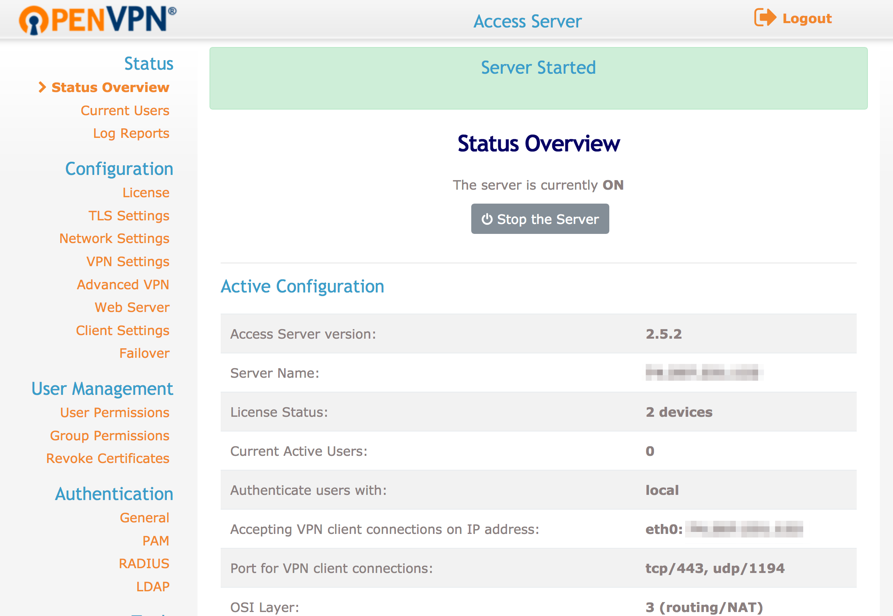

    The default settings are sufficient and allow for client devices using Android, iOS, Linux, macOS, and Windows. If you do change any settings, make sure you click **Apply** at the bottom of the page, and then also **Update Running Server** at the top of the page once it reloads.

    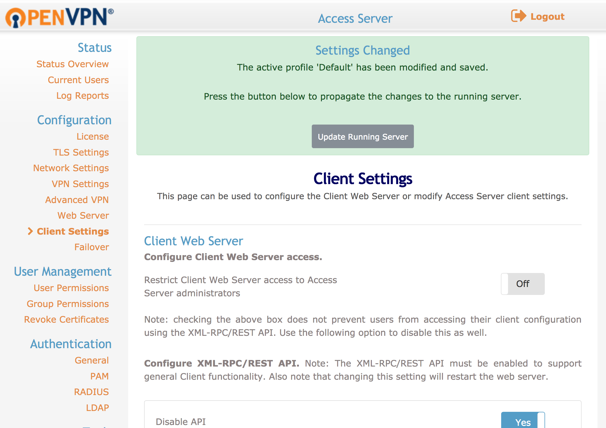

## Set Up OpenVPN Access Server for Tunneling

1.  SSH into your Linode and enable IP Forwarding in your kernel. The first command enables traffic forwarding over IPv4 and the second command applies the change.

        echo 'net.ipv4.ip_forward=1' | sudo tee -a /etc/sysctl.d/99-sysctl.conf
        sudo sysctl -p

1.  OpenVPN does not support simultaneous tunnels over IPv4 and IPv6. Follow these steps to [disable IPv6](/docs/networking/vpn/set-up-a-hardened-openvpn-server#disable-ipv6) on your Linode.

1.  Log in to the Access Server Admin UI and go to **VPN Settings**. In the **Routing** section:

    - The option *"Should VPN clients have access to private subnets
(non-public networks on the server side)?"* should be set to **No**.

        
If you wish to give VPN users access to services listening on your Linode's local network, set this option to **Yes, using NAT** and specify the subnet.


    - The option *"Should client Internet traffic be routed through the VPN?"* should be set to **Yes**.

1. To avoid [DNS leaking](https://www.dnsleaktest.com/what-is-a-dns-leak.html), modify the DNS resolver settings. Go to **VPN Settings** and in the **DNS Settings** section:

    - The option *"Have clients use the same DNS servers as the Access Server host"* should be set to **Yes**.

    
Alternatively, you can manually set DNS resolvers of your choice which are pushed to VPN clients. Set the option *"Have clients use these DNS servers"*  to **Yes** and add a primary and secondary server.


    Once you've applied your changes, click **Save Settings** at the bottom of the page. You will be prompted to **Update Running Server** to push your new configuration to the OpenVPN server.

1.  When you've finished making changes to the VPN server, restart OpenVPN through the Admin UI **Status Overview** page. Clicking **Stop the Server** to stop OpenVPN, then click **Start the Server** to start it again with the new configuration.

## Client Software Installation

### Windows

1.  Connect to the OpenVPN Access Server Client UI. Click the link to download the OpenVPN Connect software to your computer.

    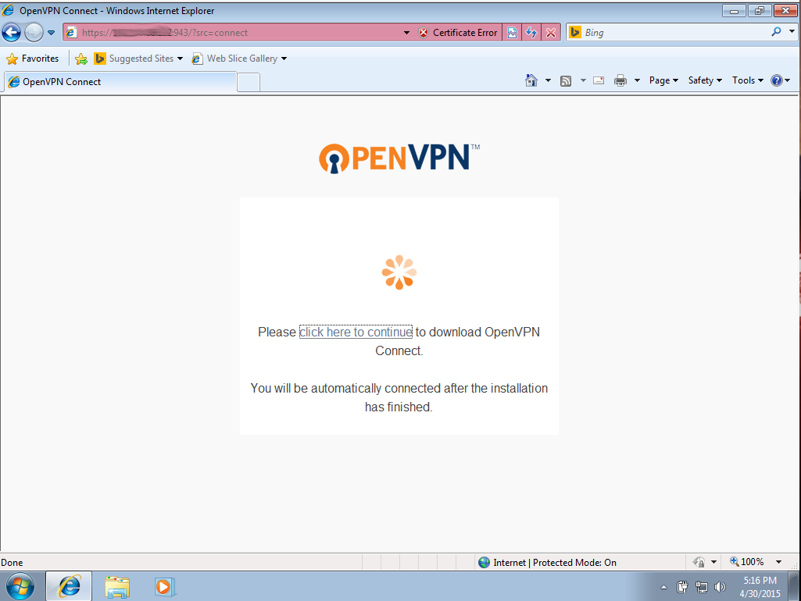

1.  Click **Run** to start the installation process.

    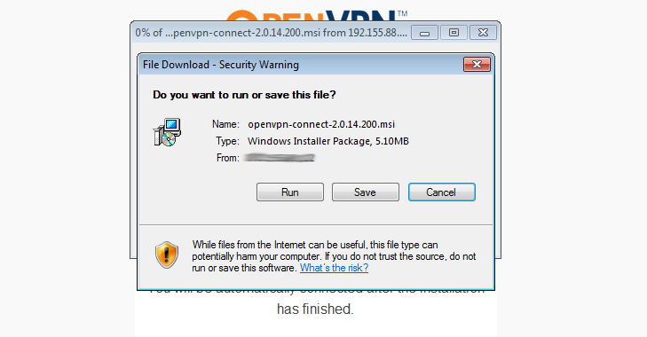

1.  Once the installation has completed, you should be presented with the OpenVPN login window. Your server's IP address should be auto-filled in.  You'll then need to enter the username and password of your OpenVPN user.

1.  Use the OpenVPN icon in the Windows taskbar to view your connection status, disconnect, or reconnect to the VPN.

    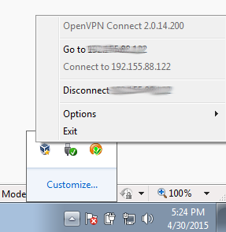

### macOS

1.  Connect to the OpenVPN Access Server Client UI and click the link to download the OpenVPN Connect Software.

1.  Once the DMG package has downloaded, a Finder window will open with the Installer package icon.

    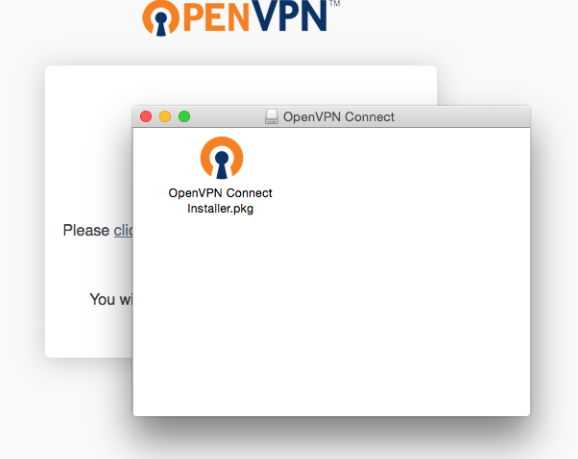

1.  Double click the OpenVPN Connect installer package and click **Open** at the prompt to allow it to run.

    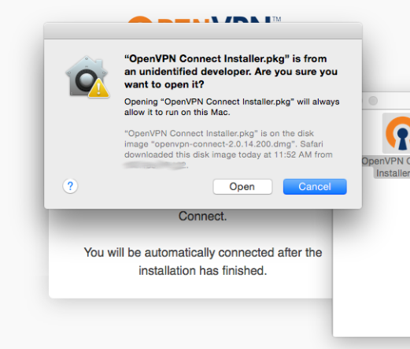

1.  Once the installation has completed, you will see an OpenVPN icon in your macOS taskbar. Right click on this icon to bring up the context menu for starting your OpenVPN connection.

    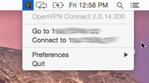

1.  Click **Connect to ... ** to bring up a window prompting for the OpenVPN username and password. Enter the credentials for your OpenVPN user and click **Connect** to establish a VPN tunnel.

    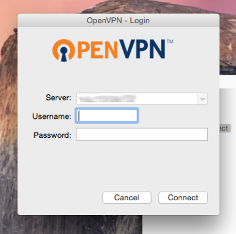

### OpenVPN for Linux

1.  Download and install the OpenVPN client software.

    CentOS:

        sudo yum install OpenVPN

    Debian/Ubuntu:

        sudo apt-get install openvpn

1.  Connect to the OpenVPN Access Server Client UI and download the appropriate profile for your operating system.

    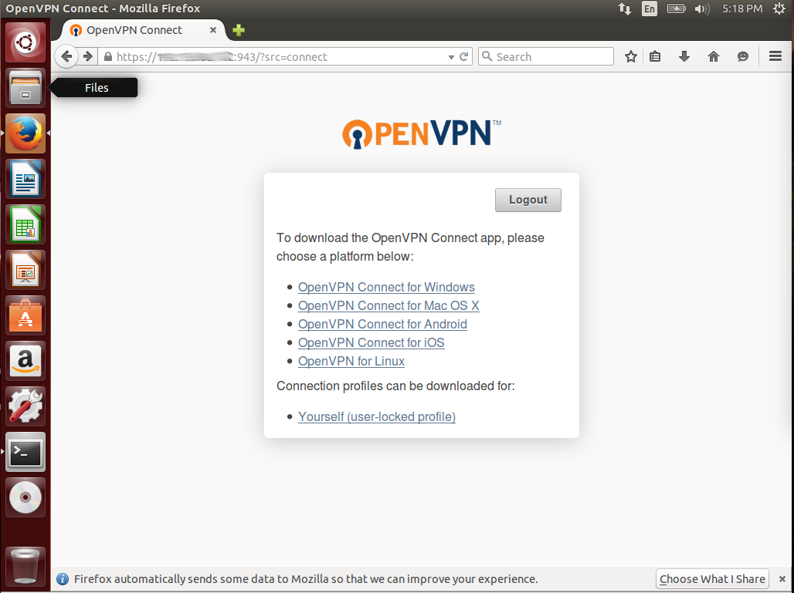

    
If you are connecting a headless machine to your OpenVPN server, such as another Linode, you will need to use `cURL` or `wget` tool to download the appropriate profile. You can do so by copying the link from the OpenVPN Access Server client page for your required profile, and then pasting it at the end of a `cURL` or [wget](/docs/tools-reference/tools/download-resources-from-the-command-line-with-wget) command.


1.  Copy the downloaded profile to your `/etc/openvpn` folder and rename it to `client.conf`. Replace `~/Downloads/client.ovpn` with the location of your download folder, if necessary.

        sudo cp ~/Downloads/client.ovpn /etc/openvpn/client.conf

1.  Start the OpenVPN Tunnel service and you will be prompted for your OpenVPN user's username and password. If you configured an autologin profile, you'll automatically be authenticated.

        sudo service openvpn start

1.  Run the ifconfig command to view your network connections. Once the VPN interface has come online, a `tun0` interface will be added to the list.

        ip addr

## Test and Troubleshoot

1.  Enable the VPN connection and go to [https://dnsleaktest.com/](https://dnsleaktest.com/) in a web browser from your VPN client. The IP address shown should be that of your Linode's public IPv4 address.

1.  Choose **Extended test**. The resulting IP addresses should be for the DNS resolvers you chose for your client device.

1.  To ensure that no IPv6 traffic is coming from the VPN server, run the test at [http://test-ipv6.com/](http://test-ipv6.com/). Your public IP address should again be that of your Linode VPN, and the results should show that no IPv6 address was detected.


If the test results show you any IP addresses other than those of your Linode and intended DNS servers, your VPN is not properly tunneling traffic. Review the logs on both server and client to determine how to troubleshoot the connection.


### Compression

If you are connected to the VPN but unable to browse the Internet, check the OpenVPN log located at `/var/log/openvpnas.log`. Entries similar to the following are likely an issue related to client compression.

    2016-03-28 16:59:05+0800 [-] OVPN 11 OUT: 'Mon Mar 28 08:59:05 2016 guest/123.45.67.89:55385 Bad compression stub decompression header byte: 251'

Resolve this by disabling compression. Go to the Admin UI and click **Advanced VPN** in the left sidebar. Go to **Default Compression Settings** and click the slider for **Support compression on client VPN connections** so it's shows the setting is **Off**.

### OpenVPN User Management

You can add additional users to your OpenVPN Access Server to enable auditing of connections to your VPN tunnel, and user level access control.


OpenVPN Access Server's free edition is limited to two users. If you require additional users for your VPN, you can view pricing details and purchase licenses at [OpenVPN's Website](https://openvpn.net/index.php/access-server/pricing.html)


1.  From the admin web interface, click the **User Permissions** link under User Management.

1.  Enter the new username that you wish to add in the `New Username` field at the bottom of the list.

    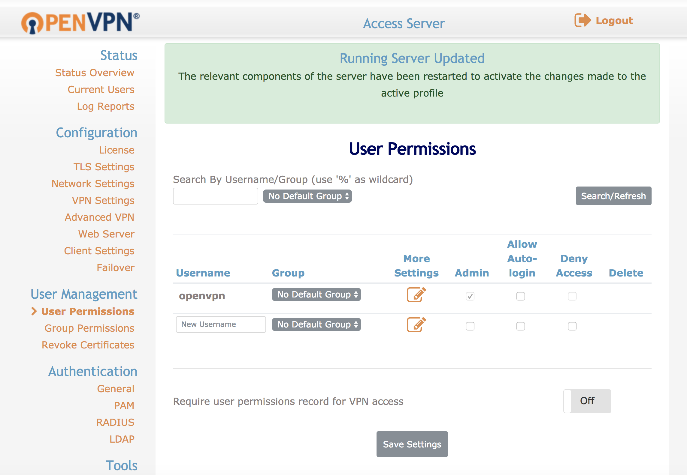

1.  View and configure additional settings for the new user by clicking the **Show** link in the **More Settings** column.

    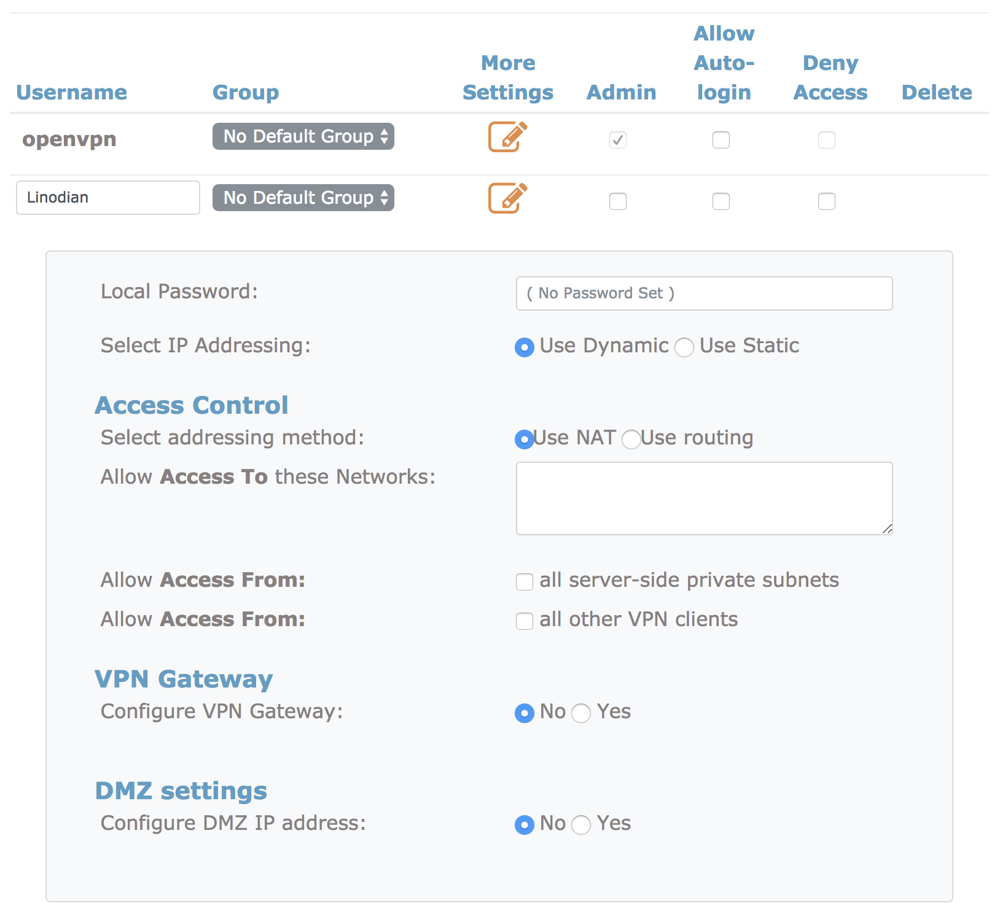

1.  Click the **Save Settings** option at the bottom of the page to complete the creation of the new user account.

### Permit Autologin Profiles

If you wish to configure autologin profiles, you will need to modify your user settings to allow autologin profiles to be displayed on the connections page.


This configuration type can be useful for connecting other servers to your VPN on startup, or for configuring a system that will always route all of its traffic over the VPN automatically.  Utilizing this type of profile will cause all of your non-local traffic to be routed over the VPN automatically.  If you wish to enable and disable your VPN at will, you will want to utilize User or Server locked profiles instead.


1.  From the OpenVPN Access Server admin web interface, visit the User Permissions link.

2.  Select the checkbox for **Allow Auto Login** for the required user to enable this profile.

    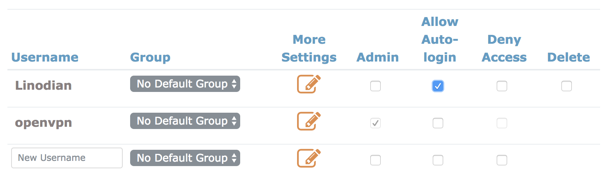
