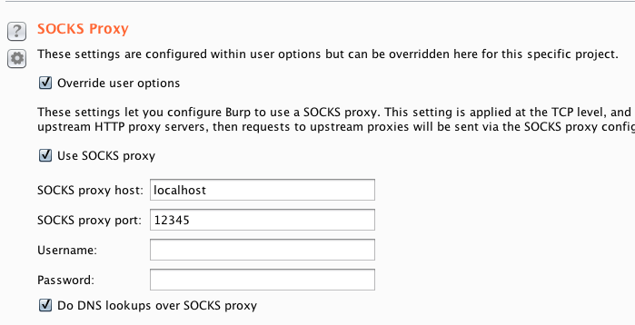

When testing with [Burp Suite](https://portswigger.net/burp), you may find yourself working in an environment with specific network restrictions. For example, a firewall appliance can interfere with your testing by dropping or modifying packets, resulting in false positives or false negatives.

One workaround is to proxy Burp's traffic through a Linode. Doing this will bypass local network restrictions and pipe everything directly to the internet via Linode's network.

1. [Configure your browser](https://support.portswigger.net/customer/portal/articles/1783055-configuring-your-browser-to-work-with-burp) to work with Burp.

1.  If you haven't already, [install Burp's CA certificate in your browser](https://support.portswigger.net/customer/portal/articles/1783075-Installing_Installing%20CA%20Certificate.html).

1.  Open an SSH connection to your Linode through port `12345`. This will be used to pass local traffic to your Linode, so keep this terminal window running in the background during testing.

        ssh -D 12345 root@your_linode_ip_address

1.  In Burp Suite, go to the **Project Options** tab, then the **Connections** tab.

1.  Under **SOCKS Proxy**, enable the **Override user options** toggle. You'll see form field options appear.

1.  Make the following changes:

 - Enable **Use SOCKS proxy**.

 - In the text field labeled **SOCKS proxy host**, enter **localhost**.

 - In the text field labeled **SOCKS proxy port**, enter the port number you started the SSH connection with above.

 - Enable **Do DNS lookups over SOCKS proxy**.

    

1.  All browser traffic will now be forwarded from Burp to your Linode over the SSH connection, then out to the internet. Confirm this by visiting [https://whatsmyip.com/](https://whatsmyip.com/) with the browser you configured for Burp. The result should show your Linode's public IP address.

This guide was written with permission from and in collaboration with [Jesse Kinser](https://ihackthings.online/author/randomdeduction/).
