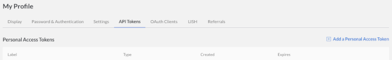
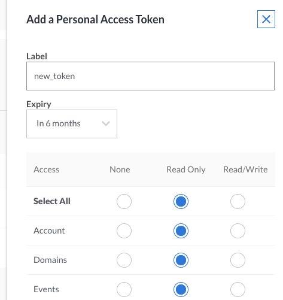

## Why Use a VPN

Setting up a personal Virtual Private Network (VPN) server is a great way to avoid internet censorship, surveillance, or geolocation. Using your own server allows you to choose any protocol you want, and to have full control over the security and privacy of your connection.

However, the configuration process is time-consuming, especially for those with little experience working with remote servers. For example, Linode's guide on setting up a hardened OpenVPN server and client is a [three](/docs/guides/set-up-a-hardened-openvpn-server/) [part](/docs/guides/tunnel-your-internet-traffic-through-an-openvpn-server/) [series](/docs/guides/configuring-openvpn-client-devices/).

[Streisand](https://github.com/jlund/streisand) attempts to simplify this process and offer painless, high-quality security. The Streisand script creates a Linode and automatically configures OpenVPN, Shadowsocks, OpenConnect, L2TP/IPSec, Wireguard &#174;, a Tor bridge, and SSH. Once the server is set up, users can connect to a gateway containing detailed, personalized instructions for connecting to each of these services.

## Before You Begin

Streisand uses open-source platform [Ansible](https://www.ansible.com/) to automate much of the process that creates and configures a Linode. This means, unlike normal VPN setup, you should **not** create a Linode before beginning this guide, or go through the usual steps of connecting to and securing your server. All of the commands will be run from your local machine. You will, however, need the API key from your Linode account.

### Create an API Token

1.  Log in to the Cloud Manager.

2.  Click on your username at the top of the screen and select **My Profile**.

    

3.  Select the **API Tokens** tab:

    

4.  Click on **Add a Personal Access Token** and choose the access rights you want users authenticated with the new token to have.

**Read/Write** access for Linodes and IPs is sufficient to set up a Streisand gateway because you will be creating a new Streisand Linode server.


    

    When you have finished, click **Submit** to generate an API token string. Copy the token and save it in a secure location. **You will not be able to view the token through the Cloud Manager after closing the popup.**

## Install Ansible and its Dependencies


As of this writing, it is not possible to run Streisand on a Windows computer. If you do not have access to a Mac or Linux machine, you can connect to an existing Linode and complete the steps in this guide from your remote server. This will create an additional Linode.


1.  Open a terminal window on your local machine. Check to see if you have any ssh keys:

        ls ~/.ssh/id_rsa.pub

    If no key is present, create one with `ssh-keygen`:

        ssh-keygen -t rsa -b 4096

2.  Make sure Python 2.7 is installed on your machine:

        python --version

    If Python is not installed, or is Version 3, you will need to install 2.7.

3.  Install `git`. If you are using Linux, use the default package manager for your distro. For example, on Ubuntu:

        sudo apt-get install git

    On macOS, simply typing `git` at the command line will prompt XCode to install `git` if it is not already present.

4.  Install `pip`, a package manager for Python.
    *  On Debian or Ubuntu:

            sudo apt-get install python-pip

    *  On Fedora:

            sudo yum install python-pip

    *  On macOS:

            sudo python2.7 -m ensurepip

## Install and Run Streisand

You are now ready to run Streisand.

1.  Clone the repository from Github:

        git clone https://github.com/StreisandEffect/streisand.git && cd streisand

2.  Run the installer for Ansible and its dependencies. The installer will detect missing packages, and print the commands needed to install them. (Ignore the Python 2.7 DEPRECATION warning; ignore the warning from python-novaclient that pbr 5.1.3 is incompatible.)

        ./util/venv-dependencies.sh ./venv

3.  Activate the Ansible packages that were installed.

        source ./venv/bin/activate

3.  Run Streisand:

        ./streisand

3.  When prompted, choose Linode as your hosting provider. Choose a location for your gateway, then enter the API key you created earlier.

    


Choosing a server location near your home will help to reduce latency. However, if you intend to use your VPN to evade geolocation or avoid local internet restrictions, consider choosing a location in an appropriate country.


Streisand will now execute a series of Ansible rules to create and configure a new Linode. This process can take a long time. (The [Streisand docs](https://github.com/jlund/streisand) say about ten minutes, but in some cases it can be longer). You may be prompted for confirmation or to provide additional information during the process.


Streisand will create a new Linode under your account early in the configuration process. If the script fails for any reason, or if you cancel it, check the [Linode Manager](https://cloud.linode.com/) and remove the new Linode if necessary.



You should not receive any errors during the install. If you receive an error related to `Alert_cpu_threshold must be between 0 and 2000`, visit this [link](https://github.com/jlund/streisand/issues/626#issuecomment-319812261) to address the issue.


## Connect to Your Streisand Gateway

You now have a Linode with multiple VPNs and protocols fully configured for use; the next step is to connect to it. Streisand should automatically open the `streisand.html` file that was generated during the configuration process. If not, you can find the file in `streisand/generated-docs/streisand.html` and open it in any browser.

1.  Click on "Download Certificate" to download an SSL certificate so that you can verify the secure connection to your new gateway. The `streisand.html` file includes instructions on how to mark the certificate as trusted on different systems and devices.

2.  There are two possible ways to connect to your gateway, but for most users the easiest way will be through SSL. Scroll down to "Connecting to your Streisand Gateway" in `streisand.html` and copy the `https://` address into your web browser. Enter the provided username and password when prompted.

### Next Steps

You are now connected to your gateway. From here, you can choose from any of the eight pre-configured connection options, then use the provided links to download an appropriate client. Each connection option has detailed instructions on how to connect your client devices.

These instructions are personalized to your gateway, and so contain the exact IP addresses, passwords, and other information you will need. Where possible, links are provided to download pre-made configuration files to make the setup process even easier. This also makes it simple to share connection information, so that you can easily share your new VPN with family and friends.

"WireGuard" is a registered trademark of Jason A. Donenfeld.
