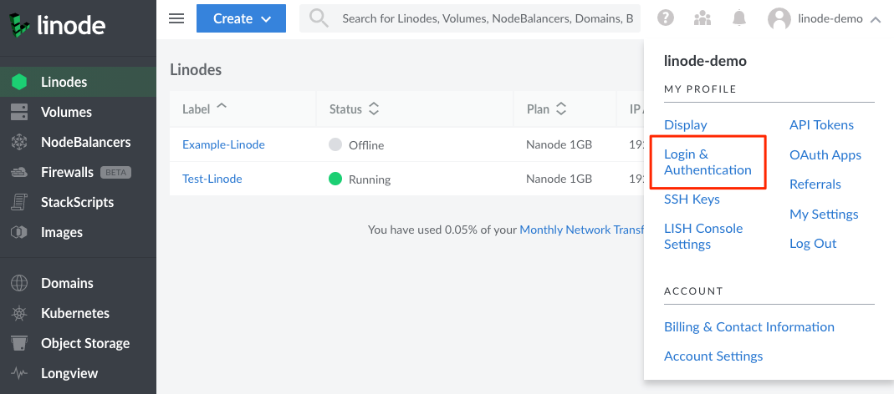

2FA (*two-factor authentication*) increases the security of your Linode account by requiring two forms of authentication: your password and an expiring token, also called an OTP (one-time passcode) or 2FA code. This follows the security principle of authenticating with something you *know* (a password) and something you *have* (the device used to generate the token). This additional layer of security reduces the risk that an unauthorized individual can gain access to your Linode account. **Linode highly recommends enabling 2FA**.


Managing 2FA through Linode is only available if *Linode* is selected as the **Login Method**. If you select a third-party authentication provider (such as Google or GitHub), 2FA is managed directly through that provider and not through Linode.


## Choosing an Authenticator App

Before enabling 2FA on your user account, you need to determine which application you wish to use for managing your authentication and generating the expiring tokens (OTPs). You may want to consider using your existing password manager or using a using dedicated authenticator app.

### Use Your Password Manager

Most password managers offer a built-in OTP feature. If convenience is a large factor for you, using your password manager is typically faster and no extra applications are needed. Once configured, you can copy your OTP token from the same application that stores your usernames and passwords. In many cases, your OTP token can automatically be pasted into the appropriate field on your web browser when logging in. Here are some password managers that support OTP / 2FA tokens:

- [1Password](https://1password.com/)
- [Bitwarden](https://bitwarden.com/)
- [Keeper](https://www.keepersecurity.com/)

The primary downsides of using your password manager as your OTP provider are security and cost. If a malicious actor gains access to your password manager, they also now have access to your OTPs. To prevent this, consider using a dedicated application (see below).

### Use a Dedicated Authenticator App

There are quite a few free (and paid) third-party authenticator applications available. They are typically more secure than using your password manager's OTP functionality as a malicious actor cannot gain access to your Linode account (or any other 2FA protected account) unless they know your password and have access to the particular device on which the authenticator app is installed, typically your smartphone.

- [Authy](https://authy.com/features/setup/)
- [Duo Mobile](http://guide.duosecurity.com/third-party-accounts)
- [Google Authenticator](http://support.google.com/accounts/bin/answer.py?hl=en&answer=1066447)
- [Microsoft Authenticator](https://www.microsoft.com/en-us/security/mobile-authenticator-app)

## Enabling 2FA

Enable two-factor authentication to start using it with your Linode account.

1.  Log in to the [Cloud Manager](https://cloud.linode.com).

1.  Navigate to the Login & Authentication page of your profile by clicking on your **username** in the top right of the screen. Select **Login & Authentication** from the dropdown menu.

    

1. Within the **Login Method** section, select **Linode** as the login provider. If you configure a third-party provider (such as Google or GitHub), you instead can manage 2FA directly through that provider and not through Linode.

    

1.  Under **Security Settings**, verify that you have configured all 3 security questions and then enable **Two-Factor Authentication (2FA)**.

    

1.  A new form appears, displaying the QR code, secret key, and a section to enter a token.

1.  Open your preferred 2FA provider on your smartphone or desktop. See [Choosing an Authenticator App](#choosing-an-authenticator-app).

1.  Scan the QR code into the app or enter the secret key. This process will vary depending on your provider. Within Authy, tap **Add Account** and then tap **SCAN QR CODE**. Point your device's camera at the barcode on your computer screen. The app automatically creates a new token for your Cloud Manager login. It is labeled **LinodeManager:user**. Change the account name if necessary, and press **Done**.

1.  In the **Token** field of the Two-Factor Authentication form, enter the token provided by the 2FA app and click **Confirm Token**.

    

That's it! You've successfully enabled two-factor authentication.

## Logging in When 2FA Is Enabled

Now that you have set up two-factor authentication for your account, you need to have your token available whenever you log in to your account. Here's how to log in to the Linode Cloud Manager with two-factor authentication enabled:

1.  Open the [Linode Cloud Manager](https://cloud.linode.com) in your web browser.

1.  On your smartphone, open Authy, and then select your **LinodeManager:user** account.

1.  In your web browser, enter your username and password and click **Log in**. The webpage shown below appears.

    

1.  Enter your token, and then click **Authenticate**. Checking the box below the authentication option adds your computer to the trusted device list for 30 days.

## Switching to a New Device (Authenticator App)

The Linode Cloud Manager allows you to generate a new secret key for your two-factor authentication token device. This is a good way to start using a new smartphone as your two-factor token device. Here's how to generate a new secret key:

1.  Log in to the [Cloud Manager](https://cloud.linode.com).

1.  Navigate to the Login & Authentication page of your profile by clicking on your **username** in the top right of the screen. Select **Login & Authentication** from the dropdown menu.

1.  In the **Two-Factor Authentication (2FA)** section, click **Reset two-factor authentication**, as shown below.

    

A new secret key and barcode is generated for your account and displayed on the screen. Follow the instructions in the [Enabling Two-Factor Authentication](#enabling) section to add the new key to your smartphone.

## Disabling 2FA

You can disable two-factor authentication for your Linode account at any time. Here's how:

1.  Log in to the [Cloud Manager](https://cloud.linode.com).

1.  Navigate to the Login & Authentication page of your profile by clicking on your **username** in the top right of the screen. Select **Login & Authentication** from the dropdown menu.

1.  In the **Two-Factor Authentication (2FA)** section, toggle the **Enabled** switch to disable two-factor Authentication.

1.  A confirmation window appears asking if you want to disable two-factor authentication. Click **Disable Two-Factor Authentication**.

You have successfully disabled the two-factor authentication feature for your Linode Cloud Manager account.

## Recovery Procedure

If you lose your token and get locked out of the Manager, or need to have 2FA removed from a Linode account for another reason, please submit the following images to Linode Support:

- An image of the front and back of the payment card on file, which clearly shows the last 6 digits of the card number, the expiration date, cardholder name, and bank logos.
- An image of the front and back of Government-issued photo ID that matches the name on the card.

These images should be emailed to Linode Support at <support@linode.com>.

If you prefer encrypted communication:

1.  First email Support that you would like to use the Credential Submission Portal. This opens a support ticket and gives you a ticket number to reference.

1.  You can then upload your images to our [Credential Submission Portal](https://www.linode.com/credential-submission/) referencing the ticket number.