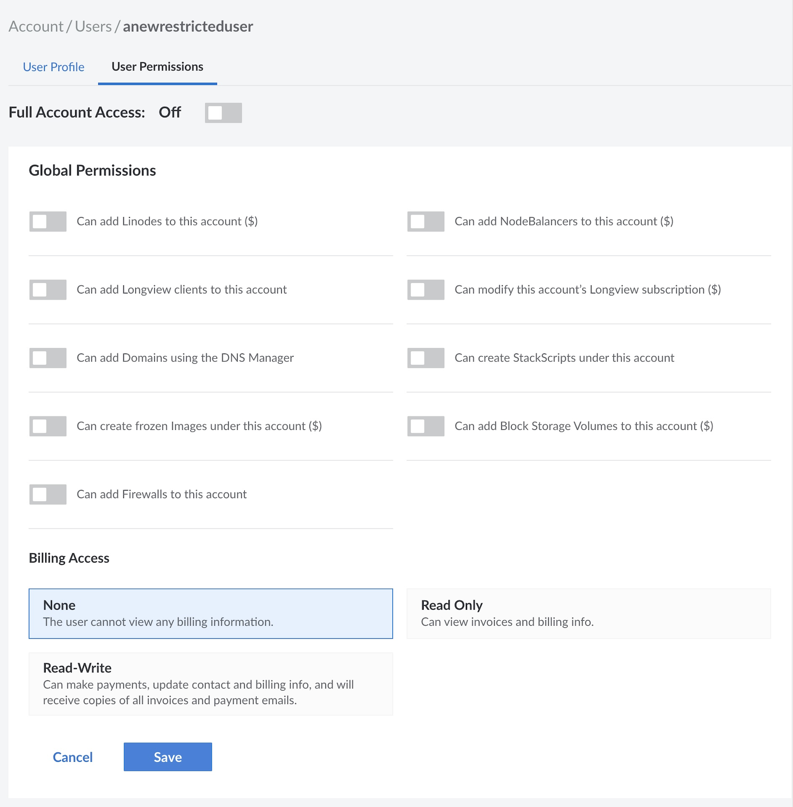

Maintaining your user Linode Cloud Manager accounts, passwords, and contact information is just as important as administering your Linode. This guide shows you how to control access to the Cloud Manager, update your contact information, and modify account passwords. Note that the information in this guide applies to the Cloud Manager only, except for the section on resetting the root password.

## Users and Permissions

You can grant other people access to your Linode Cloud Manager account by creating *users* and assigning *permissions* to restrict access to certain areas of the control panel. Adding users and configuring permissions is useful for groups that need to grant all team members access to the Linode Cloud Manager, or organizations that just want their billing department to have a separate account to receive invoices and billing information.

 
A single user was automatically created for your account when you signed up for Linode. If you are the only person accessing the Linode Cloud Manager, you do not need to create any other users on your account.


### Adding a User



### Setting User Permissions

Setting permissions restricts a user's access to certain areas of the Linode Cloud Manager. For example, you could limit a user to a single Linode and prevent them from removing the Linode or adding extra services. Don't worry--these settings aren't permanent. You can add or remove access for a user at any time in the future. User Permissions are divided into three categories. **Global Permissions**, **Billing Access**, and **Specific Permissions**.

Here's how to set a user's access permissions:

1.  Click the **Account** link in the sidebar.
1.  Click the **Users & Grants** tab.
1.  Click the **User Permissions** link for the desired user.
1.  Toggle the **Full Account Access** button off to limit the user's account access and show permission categories.

    

1.  Toggle the boxes in the **Global Permissions** section to allow the user to add [Linodes](/docs/guides/getting-started/), [NodeBalancers](/docs/guides/getting-started-with-nodebalancers/), [Domains](/docs/networking/dns/dns-manager-overview/#domain-zones), [Longview](/docs/guides/what-is-longview/) clients, [Block Storage Volumes](/docs/products/storage/block-storage/) to the account, create [StackScripts](/docs/platform/stackscripts/), frozen [Images](/docs/products/tools/images/), access all billing information, and cancel the entire account. These permissions are exactly as described and will not add any additional permissions.

    
Granting access to settings denoted with a dollar sign ($) allows the user to perform actions that incur billing costs, such as adding or resizing a Linode.


1. Select an option for **Billing Access** permissions. These options are as follows:

    - **None**: The user is unable to view any billing information. This does not prevent a user from creating billable resources, which are instead applied as **Global Permissions** in the previous step.
    - **Read Only**: The user can [View Invoices](/docs/guides/manage-billing-in-cloud-manager/#viewing-invoices-and-payments) and [Billing Info](/docs/guides/manage-billing-in-cloud-manager/#accessing-billing-information).
    - **Read-Write**: The user has full access to [Billing Information](/docs/guides/manage-billing-in-cloud-manager/#accessing-billing-information), can make payments, edit billing information, view billing information, receive copies of all invoices, and receive email related to payments.

1.  Select the appropriate permissions (None, Read Only, or Read-Write) in the **Specific Permissions** section to allow the user to access individual Linodes, StackSripts, Block Storage Volumes, Images, NodeBalancers, and Domains. Unlike Global Permissions, Specific Permissions can apply to individual resources and not the service as a whole. Specific Permission options are as follows:

    - **None**: The user can not view or otherwise interact with the selected resource.
    - **Read Only**: The user can view the resource and all of its associated information typically visible within the Linode Manager, however they can not otherwise interact with it through Cloud Manager.
    - **Read-Write**: The user has full access to the selected resource, and can make any changes that only an administrator is otherwise able to. This includes resource deletion, cloning, and all other applicable edits.

1.  When you have finished configuring the user's permissions, click **Save**. The user's permissions are saved and effective immediately.

### Recovering a Lost Username



### Removing a User



### Changing a Username



## Email Addresses and Contact Information

Linode uses the contact information on file in your account to notify and bill you. Keep this information current to prevent service interruptions. It's especially important to keep your email address current.

The **Billing Info** and **User & Grants** pages have email address fields. The email addresses saved on these pages receive different notifications, as described in the following sections. If you are the only user, you should enter your email address on both pages. If there are multiple users, verify that the primary account holder's email address is current on the **Billing Info** page.

### Updating Billing Contact Information



### Changing Your User Email Address



## Passwords

Creating strong passwords is essential to protecting your Linode and your Linode Cloud Manager account. If you suspect that an unauthorized user has gained access to one of your accounts, you should change the password immediately. Use the instructions in this section to change your Linode Cloud Manager password and reset the password for the `root` user on the Linode.

### Changing or Resetting Your Linode Cloud Manager Password



### Resetting the Root Password



## Next Steps

You can take additional steps to secure your Linode Cloud Manager account by enabling the two-factor authentication and IP address whitelisting features. You can also configure security event notifications and disable API access. For instructions, see the [Security](/docs/guides/user-security-controls/) guide.
