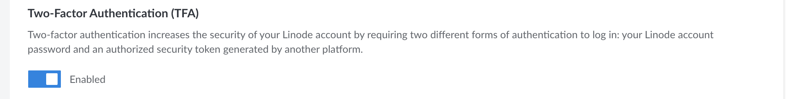
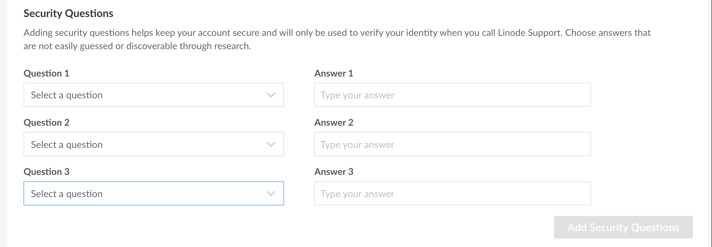
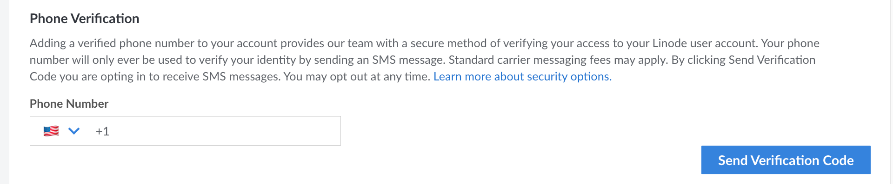

To protect your Linode user account against unauthorized access, there are several security controls you can implement. This guide covers several of these controls, including 2FA, security questions, and phone verification.

## 2FA (Two-Factor Authentication)

2FA (*two-factor authentication*) increases the security of your Linode account by requiring two forms of authentication: your password and an expiring token, also called an OTP (one-time passcode) or 2FA code. This follows the security principle of authenticating with something you *know* (a password) and something you *have* (the device used to generate the token). This additional layer of security reduces the risk that an unauthorized individual can gain access to your Linode account. **Linode highly recommends enabling 2FA**. See [Managing Two-Factor Authentication (2FA) on a User Account](/docs/guides/2fa/) to learn how to enable 2FA. To assist with account lockouts and recovery, you must first configure three [security questions](#security-questions) on your account before enabling 2FA.


Managing 2FA through Linode is only available if *Linode* is selected as the **Login Method**. If you select a third-party authentication provider (such as Google or GitHub), 2FA is managed directly through that provider and not through Linode.


## Security Questions

You can configure three security questions on your user account. Security questions provide our team with a secure method of verifying your identity as the owner of the user account. They can be used to help you regain access to your account in certain situations, such as when TFA is enabled and you no longer have access to the token or recovery codes. When configuring a security question, answers should not be easily guessed or discoverable through research.

### Configuring Security Questions.

1. Log in to the [Cloud Manager](https://cloud.linode.com) and navigate to the [Login & Authentication](https://cloud.linode.com/profile/auth) page of your user profile. To do this, click on your username in the top right of the Cloud Manager and select **Login & Authentication** from the dropdown menu.

1. Scroll down to **Security Questions** under the **Security Settings** section. Here, you can view the security questions available to you or, if you've already configured them, see the questions you have selected.

1. To configure your security questions, click the drop-down field under *Question 1* to select the question you wish to use. Then, type the answer in the corresponding box.

1. Repeat this for *Question 2* and *Question 3*. Once a particular question has been selected, you are not able to select the same one for any other question field.

1. Once all fields have been configured, click **Add Security Questions**. You must fill out all 3 questions when adding security questions for the first time.

1. After a security question has been configured, you can edit one or more questions by clicking the **Edit** button next to each question you'd like to change, updating the answer field with your new answer, and then clicking the **Update Security Questions** button.

## Phone Verification

A verified phone number provides our team with a secure method of verifying access to your Linode user account. It is required for all new accounts created on or after June 27th, 2022, though any existing user can add a verified phone number to increase the security on their account.

This phone number is only ever used to verify your identity when attempting to authenticate to a user account when contacting Linode Support. An SMS message with a verification code is sent to that phone number. Once received, you can provide that verification code to the Support representative you are in contact with. If you receive a verification SMS without contacting us, do not pass along the verification code to anyone.


Standard carrier messaging fees apply for each SMS message.


### Adding a Verified Phone Number

1. Log in to the [Cloud Manager](https://cloud.linode.com) and navigate to the [Login & Authentication](https://cloud.linode.com/profile/auth) page of your user profile. To do this, click on your username in the top right of the Cloud Manager and select **Login & Authentication** from the dropdown menu.

1. Scroll down to **Phone Verification** under the **Security Settings** section. Here, you can view, add, and remove your verified phone number.

1. To add a phone number, select your country from the dropdown list. This populates the country code portion of the phone number. Then enter the remainder of your phone number.

1. Click **Verify Phone Number** to send an SMS verification code.

1. Once you receive the verification code on your phone, enter it within the **Verification Code** field. If you do not receive the code within a few minutes, you can click the **Resend verification code** button.

1. After successfully entering the verification code, your phone number is verified and has been saved to your user account.

## Multiple User Accounts

Organizations that require multiple individuals to access the same customer account should create separate *user accounts* for each individual. Once you've created the accounts, you can assign permissions to restrict access to certain Linode services and areas of the Cloud Manager. This is useful for providing all team members access to a single Linode account, allowing a billing department to view invoices and billing details, or granting access to outside developers. For more information, see our guide on [Accounts and Passwords](/docs/guides/accounts-and-passwords).