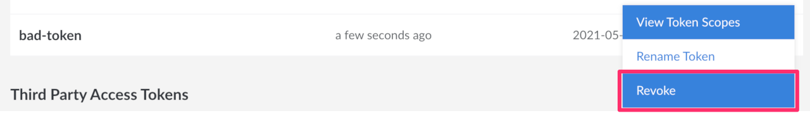
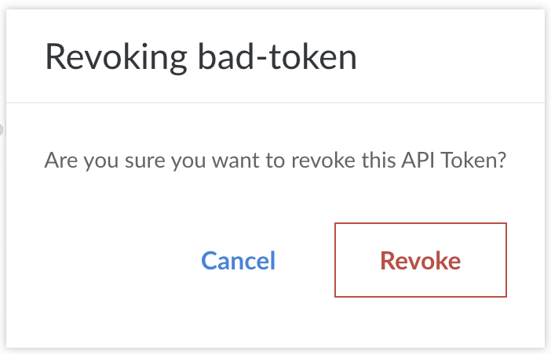

If you forget your access token or think it may have been compromised, you can revoke an API access token in the Cloud Manager.

1.  Log in to the [Cloud Manager](http://cloud.linode.com).

1.  Click on your username at the top of the screen and select **My Profile**.

    

1.  Select the **API Tokens** tab:

    

1.  Find the token you wish to revoke and click the ***more options ellipsis*** to open the options menu and select **Revoke Token**.

    

1.  A popup appears to confirm that you wish to revoke this token. Click the **Revoke** button.

    
