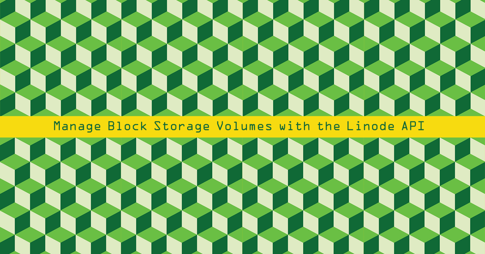

The Linode API allows you to create, delete, attach, detach, clone, and resize Block Storage Volumes.

## Before You Begin

You will need a Personal Access Token to access the `/volumes` endpoint. Create an Access Token through the [Beta Linode Manager](https://cloud.linode.com/profile/tokens). See our [Getting Started with the Linode API](/docs/guides/getting-started-with-the-linode-api/) for more information.

Store the token as a temporary shell variable to simplify repeated requests. Replace `<Access Token>` in this example with your token:

    token=<Access Token>

## Create a Block Storage Volume

Create a new Block Storage Volume by making a POST request to the `/volumes` endpoint. You can also automatically attach the new Volume to an existing Linode by passing the Linode's ID when creating the Volume.

1.  List the Linodes on your account:

        curl -H "Authorization: Bearer $token" \
        https://api.linode.com/v4/linode/instances

    Choose a Linode from the returned list and copy its `id` and `region` values.

2.  Create a Volume in the same region as the target Linode. Use the ID of the target Linode and adjust the size, region, and label to the desired values:

        curl -H "Content-Type: application/json" \
        -H "Authorization: Bearer $token" \
        -X POST -d '{
          "label": "my-volume",
          "region": "us-east",
          "size": 100,
          "linode_id": 1234567
        }' \
        https://api.linode.com/v4/volumes

    
The Volume and Linode must be in the same region.


3.  Examine the response JSON object and copy the values in the `id` and `filesystem_path` fields:

    
{
   "linode_id":1234567,
   "label":"my-volume",
   "size":100,
   "updated":"2018-05-07T14:59:48",
   "created":"2018-05-07T14:59:48",
   "id":6830,
   "status":"creating",
   "region":"us-east",
   "filesystem_path":"/dev/disk/by-id/scsi-0Linode_Volume_my-volume"
}


4.   Query the Volume using the `/volumes/$volume_id` endpoint to make sure it was successfully created:

        curl -H "Authorization: Bearer $token" \
        https://api.linode.com/v4/volumes/$volume_id

      If the `status` field in the response is `active`, your Volume is ready to use.

### Mount the Volume

The API can't directly mount the new Volume after it is attached. SSH into the Linode and mount it manually:

1.  Create a filesystem on the Volume:

        mkfs.ext4 $volume_path

2.  Create a mountpoint:

        mkdir /mnt/my-volume

3.  Mount the Volume:

        mount $volume_path /mnt/my-volume

4.  To automatically mount the Volume every time your Linode boots, add the following line to your `/etc/fstab` file:

    
$volume_path /mnt/my-volume defaults 0 2


## Attach and Detach the Volume

If you did not specify a Linode when creating the Volume, or would like to attach it to a different Linode, use the `/attach` and `/detach` endpoints:

1.  Detach the Volume. Replace `$volume_id` with the Volume ID from the previous section:

        curl -H "Authorization: Bearer $token" \
        -X POST \
        https://api.linode.com/v4/volumes/$volume_id/detach

2.  Attach the Volume to the new target Linode:

        curl -H "Authorization: Bearer $token" \
        -H "Content-Type: application/json" \
        -X POST -d \
        '{ "linode_id": $linode-id }' \
        https://api.linode.com/v4/volumes/$volume_id/attach

    
If a Linode is not running and has more than one configuration profile, include a `config_id` parameter in the POST request to specify which profile to use. If you do not specify a profile, the first profile will be used by default.


## Clone a Volume

To copy all of the data in a Block Storage Volume to a new Volume:

    curl -H "Authorization: Bearer $token" \
    -X POST -d '{
      "label": "new-volume"
    }' \
    https://api.linode.com/v4/volumes/$volume_id/clone

## Delete a Volume

Remove a Volume from your account with a DELETE request. If the Volume is attached to a Linode, you will have to detach it before it can be deleted:

    curl -H "Authorization: Bearer $token" \
    -X DELETE \
    https://api.linode.com/v4/volumes/$volume_id

## Resize a Volume

If you need additional space, you can increase the size of a Volume through the API. It is not possible to reduce the size of a Volume.

Pass the desired size (in gigabytes) using the `size` parameter:

    curl -H "Content-Type: application/json" \
    -H "Authorization: Bearer $token" \
    -X POST -d '{
        "size": 200
    }' \
    https://api.linode.com/v4/volumes/$volume_id/resize
