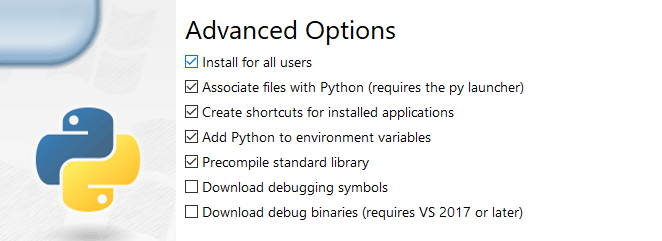

The easiest way to install the CLI is through [Pip](https://pypi.org/project/pip/):

1.  Install the CLI:

        pip3 install linode-cli --upgrade

If you haven't yet installed `python3` and `pip3`, below is a brief outline seperated by Distro and Operating System to help you complete the basic installation process:

### Ubuntu/Debian

1. Ensure that all available packages are up to date:

        sudo apt update

1. Install python3 and pip3:

        sudo apt install python3 && sudo apt install python3-pip

1. Install the Linode CLI using pip3:

        sudo pip3 install linode-cli

### CentOS/RHEL Stream and Fedora

1. Ensure that all available packages are up to date:

        dnf upgrade

1. Install python3 and pip3:

        sudo dnf install python3 && sudo dnf install python3-pip

1. Install the Linode CLI using pip3:

        sudo pip3 install linode-cli

### CentOS 7

1. Ensure that all available packages are up to date:

        sudo yum update

1. Install python3 and pip3:

        sudo yum install python3 && sudo yum install python3-pip

1. Install the Linode CLI using pip3:

        sudo pip3 install linode-cli

### Windows 10

1. Download the latest stable Windows package for python3 for your system at [Python's Downloads Page](https://www.python.org/downloads/windows/).

1. Open up the installer `.exe` to begin the python installation process using Window's GUI.

1. Before proceeding, ensure that your version of Python is added to PATH by checking the box which enables this option:

   

1. Select the **Customize Installation** option to proceed.

1. Ensure that `pip` all desired optional features are selected before proceeding to the next step. The `pip` installation is required by the Linode CLI.

1. In the next step, ensure that the **Install for all users** option is enabled. Your configuration should reflect the following:

   

1. Select `Next` to proceed with the installation. Once the installation is complete, a message will confirm Python3 was successfully installed will appear that can be safely closed.

1. Open the windows command prompt and enter the following command to complete installation of the Linode CLI:

        sudo pip3 install linode-cli

### Mac OSx

By default, python3 should already be installed and configured on the latest versions of Mac OSx. If for whatever reason it is not, you can use `brew` to install python3 which will additionally include `pip` by default:

    brew install python3

## Initial Configuration of the Linode CLI

1.  You need a Personal Access Token to use the CLI. Use the [Linode Cloud Manager](https://cloud.linode.com/profile/tokens) to obtain a token.

1. Run the `linode-cli configure --token` command, you will be prompted with the CLI's configuration script. Paste your access token (which will then be used by default for all requests made through the CLI) at the prompt. You will be prompted to choose defaults for Linodes created through the CLI (region, type, and image). These are optional, and can be overridden for individual commands. Update these defaults at any time by running `linode-cli configure`:

    
Welcome to the Linode CLI.  This will walk you through some initial setup.

First, we need a Personal Access Token.  To get one, please visit
https://cloud.linode.com/profile/tokens and click
"Create a Personal Access Token".  The CLI needs access to everything
on your account to work correctly.
Personal Access Token:



The CLI installs a bash completion file. On OSX, you may have to source this file before it can be used. To do this, add `source /etc/bash_completion.d/linode-cli.sh` to your `~/.bashrc` file.

