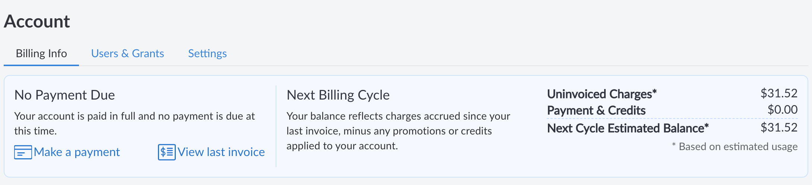
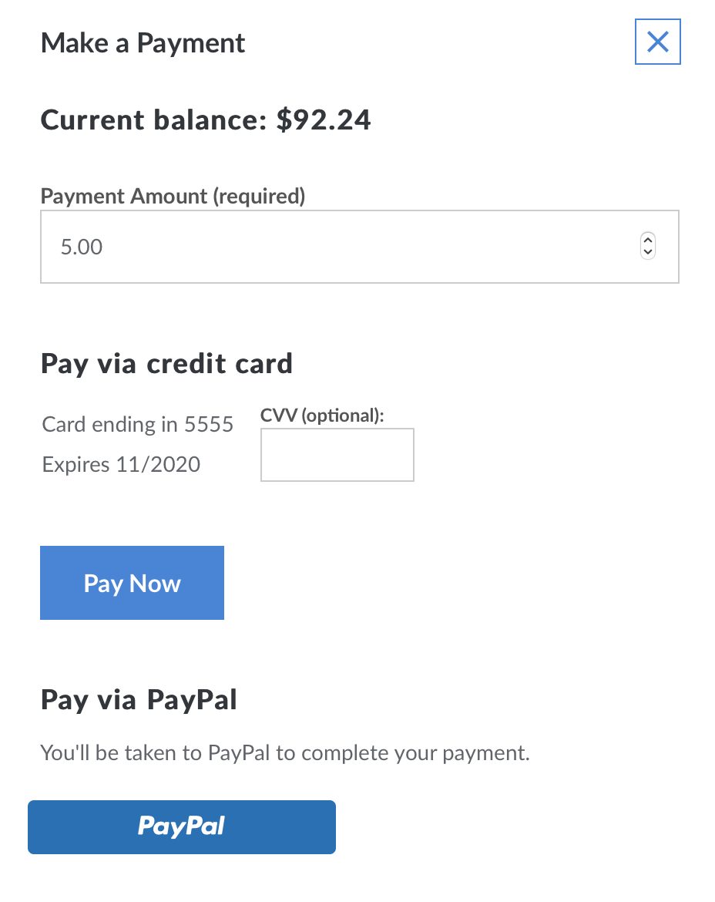
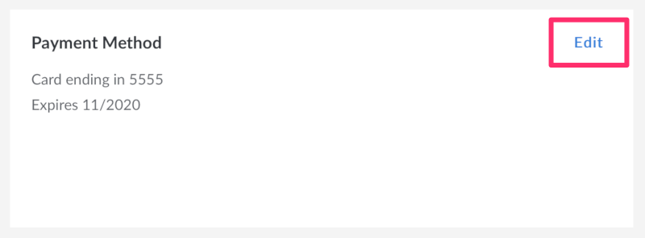
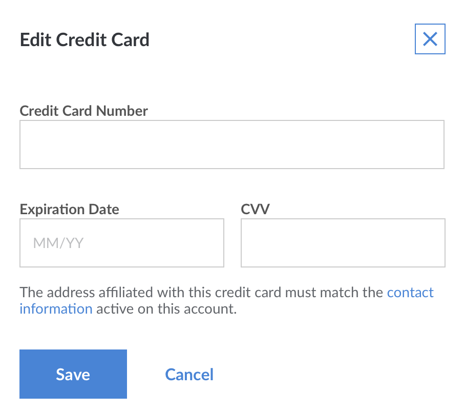
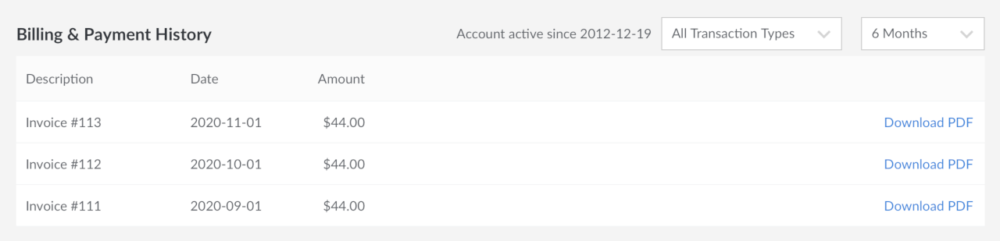

We've done our best to create straightforward billing and payment policies. Still have questions? Use this guide to learn how to make payments, update your billing information, and remove services. To learn how billing works see the [How Linode Billing Works](/docs/platform/billing-and-support/how-linode-billing-works/) guide. If you have a question that isn't answered in either guide, please feel free to [contact Support](/docs/platform/billing-and-support/support/).

## Viewing Current Balance

To view your current balance, follow the steps below. This shows you the sum of all Linode services used so far in the month, down to the hour.

1.  Log in to the [Linode Cloud Manager](http://cloud.linode.com).
1.  Select **Account** from the sidebar links.
1.  The Billing Info page shows you a billing summary at the top of the screen.

    

    **Amount Due** is the current invoiced balance and **Uninvoiced Balance** is the accrued balance that has not yet been invoiced for the month.

    Here, you can keep track of your outstanding balance. In the example above, the customer has accrued a $31.52 balance for Linode services this month so far, but it has not been invoiced yet. You can check this as frequently or infrequently as you wish. It gets updated every hour as you use and add Linode services.

## Making a Payment

You can use the Cloud Manager to pay an outstanding balance or prepay for Linode services. Here's how:

1.  Log in to the [Linode Cloud Manager](http://cloud.linode.com).
1.  Select **Account** from the sidebar links.
1.  In the billing summary at the top, click the **Make a Payment** link.
1.  The **Make a Payment** panel opens.

    

1.  Enter the amount of money you would like to pay in the **Payment Amount** field.
1.  Enter the CVV number on the back of your credit card in the **CVV** field.
1.  Click **Pay Now**.

The payment may take a few minutes to be applied to your account.

## Updating Credit Card Information

Keep your credit card information up to date to prevent service interruptions. Here's how:

1.  Log in to the [Linode Cloud Manager](http://cloud.linode.com).
1.  Select **Account** from the sidebar links.
1.  In the Payment Method pane, click the **Edit** link.

    

1.  The **Edit Credit Card** panel opens. Enter your credit card number, the card's expiration date, and the CVV. The address affiliated with the card must match the [Contact Information](/docs/guides/accounts-and-passwords/#updating-contact-information) active on your account.
1.  Click **Save**. Your credit card information is updated.

    

    
If you have an outstanding balance, you need to make a manual payment to bring your account up to date. See the [Making a Payment](#making-a-payment) section for more information.

    
A $1.00 authorization hold may be placed on your credit card by your banking institution when our payment processor tests the validity of the card. This is normal behavior and does not result in a charge on your card.


## Accessing Billing History

All of your billing history is stored in the Cloud Manager. Here's how to access it:

1.  Log in to the [Linode Cloud Manager](http://cloud.linode.com).
1.  Select **Account** from the sidebar links.
1.  A link to the last invoice is available at the top of the screen in the Billing Summary by clicking the **View Last Invoice** link.
1.  You can view your Billing & Payment History at the bottom of the Billing Info page. This list is filterable by transaction type and time.

    

1.  Click on any invoice to view the charges for a particular month. You can also click the **Download PDF** link next to any invoice to download a PDF of the invoice to your computer. <!-- You can also download invoices in PDF format. -->

## Removing Services

Our services are provided without a contract, so you're free to remove services from your account at any time. Here's how:

1.  Log in to the [Linode Cloud Manager](http://cloud.linode.com).
1.  To remove a Linode from your account, select **Linodes** from the sidebar links. Select the Linode you would like to remove, then select the **Settings** tab. Expand the **Delete Linode** panel and click **Delete**.
1.  To remove a NodeBalancer from your account, select **NodeBalancers** from the sidebar links. Open the menu of the NodeBalancer you would like to remove, then select **Remove**.
1.  To remove the Linode Backup Service, select **Linodes** from the sidebar links. Select the corresponding Linode. Under the **Backups** tab click the **Cancel Backups** button at the bottom of the page.


Removing a Linode from your account makes its data irretrievable. This includes the backups of it that you have created through [our Backup Service](/docs/guides/linode-backup-service/), including Manual Snapshots.

If you would like to preserve your Linode's data before removing it from your account, you need to create an external backup. You may use the suggestions in our [Backing Up Your Data](/docs/guides/backing-up-your-data/) guide for some examples of how to do this.

When removing a Linode from your account that has been active for at least 24 hours, our systems automatically create a [Linode Image](/docs/guides/linode-images/) from the backup. You may use [this guide](https://www.linode.com/community/questions/17441/how-do-i-restore-a-deleted-linode) from [our Community Questions site](https://www.linode.com/community/questions/) to restore this backup.

There is a very small chance that Linode Support can restore your data outside of these circumstances. The sooner you reach out to Linode Support, the more likely this can occur. Please open [a Support ticket](https://cloud.linode.com/support/tickets) to explore this possibility.


## Cancelling Your Account


