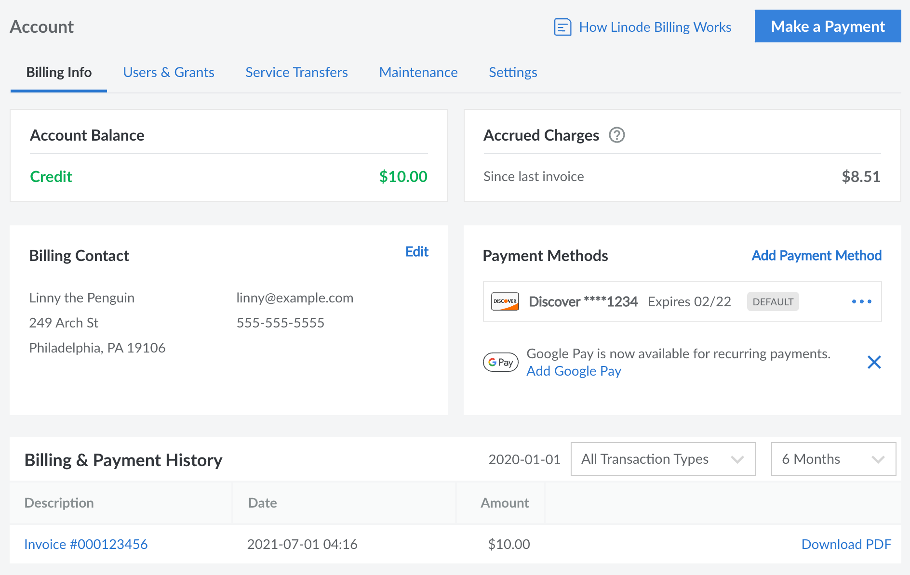
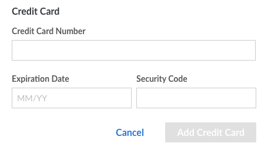
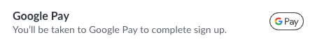
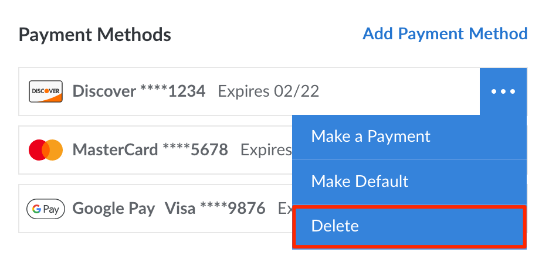
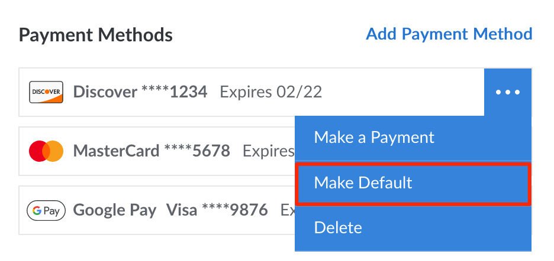
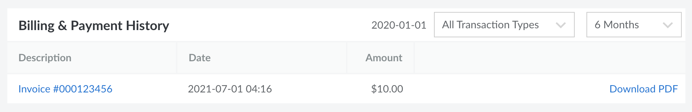
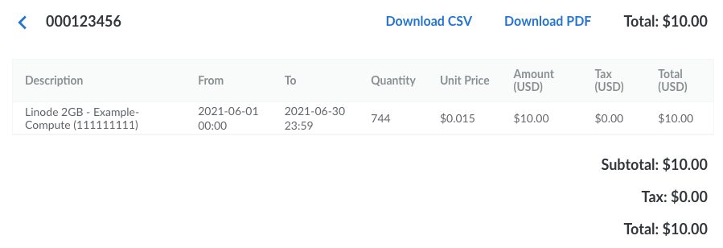
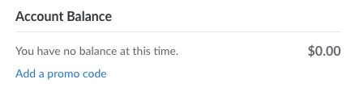

We've done our best to create straightforward billing and payment policies. Still have questions? Use this guide to learn how to make payments, update your billing information, and remove services. To learn how billing works see the [Billing and Payments](/docs/guides/understanding-billing-and-payments/) guide. If you have a question that isn't answered in either guide, please feel free to [contact Support](/docs/guides/support/).

## Before You Begin

Before performing the steps within this guide, please ensure you've completed the following:

1.  **Read through the [Billing and Payments](/docs/guides/understanding-billing-and-payments/) guide** for detailed information about our billing and payment policies.

1.  **Log in to the [Cloud Manager](https://cloud.linode.com)** on a user account with one of the following permissions. See [Setting User Permissions](/docs/guides/accounts-and-passwords/#setting-user-permissions) for more details.

    - **Full account access** (unrestricted).
    - Restricted user with *Read-Write* permissions under **Billing Access**. Users with *Read Only* permissions are able to see most billing information but they are not able to make changes.

## Accessing Billing Information

Most information and settings pertaining to billing are located within the [Billing Info](https://cloud.linode.com/account/billing) page of the Cloud Manager. Follow the instructions below to access this page:

1.  Log in to the [Cloud Manager](https://cloud.linode.com).

1.  Click on the **Account** link on the left menu, which displays the [Billing Info](https://cloud.linode.com/account/billing) page.

This page contains several sections:

- **Account Balance:** The current balance on the account. This includes any past due amounts from unpaid invoices as well as any positive balance remaining from credits or promo codes. In the screenshot above, the account has a positive balance of $10.

- **Promotions:** If there is an active promo/coupon applied to the account, it will be displayed here along with the remaining balance and any expiration date. If there are no active promotions, this section is hidden.

- **Accrued Charges:** The charges that have accrued since your last invoice. This updates frequently to include the hourly charges (up to the monthly cap) for all paid services on the account, as well as any other charges. In the screenshot above, the account has accrued $8.51 of charges since the last invoice. See the [Billing and Payments](/docs/guides/understanding-billing-and-payments/) guide for help understanding these charges.

- **Billing Contact:** The name, address, phone number, and email address for the primary billing contact on the account. See [Accounts and Passwords > Updating Billing Contact Information](/docs/guides/accounts-and-passwords/#updating-billing-contact-information).

- **Payment Methods:** The payment methods that have been added to the account.

- **Billing & Payment History:** Displays a list of previous invoices and payments, along with links to view or download each entry.

## Making a One-Time Payment

You can manually add funds to your account at any time. Manual payments can be used to pay an outstanding balance or prepay for future services.

1.  Navigate to the **Billing Info** page in the [Cloud Manager](https://cloud.linode.com/account/billing) (see [Accessing Billing Information](/docs/guides/manage-billing-in-cloud-manager/#accessing-billing-information)).
1.  Click the **Make a Payment** button on the top right of the page, which opens the **Make a Payment** panel.
1.  Enter the amount of money you would like to add to your account in the **Payment Amount** field. For your reference, the current balance on the account is displayed above this field.
1.  **To pay with a saved payment method:** Select the saved payment method you wish to use in the  **Payment methods** section and click the **Pay now** button.

    **To pay with PayPal:** Click the **PayPal** button towards the bottom of the panel. This will open up PayPal's own payment form, where you can log in to your PayPal account and select your payment method. Once finished, you will be returned to the Cloud Manager.

    **To pay with an new Google Pay account or method:** Click the **Google Pay** button towards the bottom of the panel. This will open up Google's own payment form where you can log in to your Google account and select your payment method. Once finished, you will be returned to the Cloud Manager.

The payment may take a few minutes to be applied to your account.

## Adding a New Payment Method

New payment methods can be added to an account through the Cloud Manager. Up to **6 payment methods** can be active on an account at any given time, including multiple credit cards, Google Pay methods, and PayPal methods.

1.  Navigate to the **Billing Info** page in the [Cloud Manager](https://cloud.linode.com/account/billing) (see [Accessing Billing Information](/docs/guides/manage-billing-in-cloud-manager/#accessing-billing-information)).

1.  If adding a credit card directly (not through Google Pay or PayPal), it must match the account's billing contact information and address. Review the **Billing Contact** section and edit it as necessary (see [Updating Billing Contact Information](/docs/guides/accounts-and-passwords/#updating-billing-contact-information)).

1.  In the **Payment Method** section, click the *Add Payment Method* link. This opens the **Add Payment Method** panel.

1.  Complete the form according to the payment method you wish to add.

    **To pay with a credit card:** Enter the credit card number, expiration date, and the security code (CVV) of the new card. Then click **Add Credit Card**.

    

    
A $1.00 authorization hold may be placed on your credit card by your banking institution when our payment processor tests the validity of the card. This is normal behavior and does not result in a charge on your card.


    **To pay with Google Pay:** Click the **Google Pay** icon/button to open Google's own Google Pay form. Log in to your Google account and select the payment method you wish to use. Press **continue** (or otherwise complete the form) to be taken back to the Cloud Manager.

    

    **To pay with PayPal:** Click the **PayPal** icon/button to open PayPal's own form. Log in to your PayPal account and select the credit card or bank account you wish to use. Optionally check or uncheck the **Use balance first** option to use any PayPal balance before the selected credit card or bank account. Press **Save and Continue** (or otherwise complete the form) to be taken back to the Cloud Manager.

    

1.  After the payment method is added, it will be assigned as the *default* payment method and will be used for future recurring payments. This can be changed by following the instructions within the [Viewing and Changing the Default Payment Method](#viewing-and-changing-the-default-payment-method) section.


This process does not immediately charge any past due balance on the account to the new card. If you have an outstanding balance, you need to make a manual payment to bring your account up to date. See the [Making a One-Time Payment](#making-a-one-time-payment) section for more information.


## Removing a Payment Method

To delete a payment method from your account, follow the instructions below.

1.  Navigate to the **Billing Info** page in the [Cloud Manager](https://cloud.linode.com/account/billing) (see [Accessing Billing Information](/docs/guides/manage-billing-in-cloud-manager/#accessing-billing-information)).
1.  Under the **Payment Methods** section, locate the payment method you wish to remove.
1.  Click the corresponding ellipsis menu and select **Delete** from the dropdown menu. If the payment method is the default payment method on the account, the **Delete** button will be disabled and you will first need to change the default method.

## Viewing and Changing the Default Payment Method

When an invoice is generated, the amount of that invoice (as well as any past due balance) will be charged to the *default* payment method on the account. The default payment method can be viewed and changed by following the instructions below.

1.  Navigate to the **Billing Info** page in the [Cloud Manager](https://cloud.linode.com/account/billing) (see [Accessing Billing Information](/docs/guides/manage-billing-in-cloud-manager/#accessing-billing-information)).
1.  Under the **Payment Methods** section, the payment method currently used by default has a label of *default* (located to the right of the last 4 digits and expiration date).
1.  To change the default payment method, click the ellipsis menu next to the payment method you wish to use and select **Make Default** from the dropdown menu.

## Viewing Invoices and Payments

All of your billing history, including previous invoices and payments, is accessible within the [Cloud Manager](https://cloud.linode.com/account/billing) on the **Billing & Payment History** section within the **Billing Info** page (see [Accessing Billing Information](/docs/guides/manage-billing-in-cloud-manager/#accessing-billing-information)). By default, all transactions (both invoices and payments) from the last *6 months* are displayed. To customize this, use the dropdown menus on the top right of this section.

**To view an itemized invoice,** find the invoice row on the list and click the corresponding invoice number. This opens up a new page that displays each service that was active during the billing period, along with the additional details listed below:

-  **Description:** The type of service and the unique label you've given it.
-  **From:** The date the service started billing during this billing cycle. This could either be the date and time this billing cycle started *or* the date and time the service was added to the account.
-  **To:** The date the service ended billing during this billing cycle. This could either be the date and time this billing cycle ended *or* the date and time the service was removed from the account.
-  **Quantity:** The number of hours the service is being billed.
-  **Unit Price:** The hourly rate for this service.
-  **Amount:** The cost for this service excluding taxes.
-  **Taxes:** The taxes that are charged for this service.
-  **Total:** The cost for this service including taxes.

### Downloading Invoices (PDF and CSV)

An invoice or payment can be downloaded as either a PDF or a CSV file. To do this, open the invoice within the Cloud Manager and select either the **Download CSV** or **Download PDF** button.

## Adding a Promo Code

A *promo code* adds a positive credit to an account, allowing you to pay for services using that credit. You're able to add a promo code when signing up for an account. If you already signed up but haven't entered a promo code, you may be able to do so from the Cloud Manager. To add a promo code to an existing account, certain conditions must be met:

- The account must be less than 90 days old.
- There must not be a negative balance on the account.
- No other promo codes can already be applied to the account.
- The user that's logged in must have unrestricted permissions.

If those conditions are met, you can add a promo code by following these instructions:

1.  Navigate to the **Billing Info** page in the [Cloud Manager](https://cloud.linode.com/account/billing) (see [Accessing Billing Information](/docs/guides/manage-billing-in-cloud-manager/#accessing-billing-information)).

1.  Under the **Account Balance** section, click the *Add a promo code* link.

    

1.  In the **Add promo code** dialog box that is displayed, enter the promo code and click the **Apply Promo Code** button. You should now see the promotional credit amount reflected in your account balance.

## Removing Services

Our services are provided without a contract, so you're free to remove services from your account at any time. Here's how:

1.  Log in to the [Cloud Manager](https://cloud.linode.com).
1.  To remove a Linode from your account, select **Linodes** from the sidebar links. Expand the **more options ellipsis** menu to the right of the Linode you would like to remove, then select **Delete**.
1.  To remove a NodeBalancer from your account, select **NodeBalancers** from the sidebar links. Select **Delete** for the NodeBalancer you would like to remove.
1.  To remove the Linode Backup Service, select **Linodes** from the sidebar links. Select the corresponding Linode. Under the **Backups** tab click the **Cancel Backups** button at the bottom of the page.


Removing a Linode from your account makes its data irretrievable. This includes the backups of it that you have created through [our Backup Service](/docs/products/storage/backups/), including Manual Snapshots.

If you would like to preserve your Linode's data before removing it from your account, you need to create an external backup. You may use the suggestions in our [Backing Up Your Data](/docs/guides/backing-up-your-data/) guide for some examples of how to do this.

When removing a Linode from your account that has been active for at least 24 hours, our systems automatically create a [Linode Image](/docs/products/tools/images/) from the backup. You may use [this post](https://www.linode.com/community/questions/17441/how-do-i-restore-a-deleted-linode) from [our Community Questions site](https://www.linode.com/community/questions/) to restore this backup.

There is a very small chance that Linode Support can restore your data outside of these circumstances. The sooner you reach out to Linode Support, the more likely this can occur. Please open [a Support ticket](https://cloud.linode.com/support/tickets) to explore this possibility.


## Cancelling Your Account


