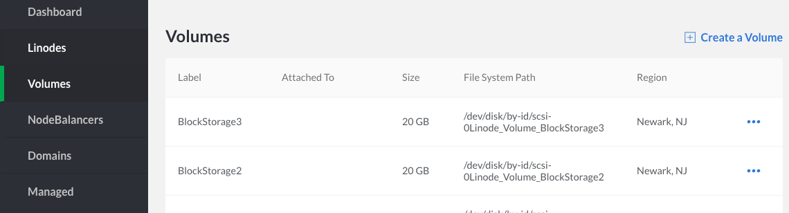
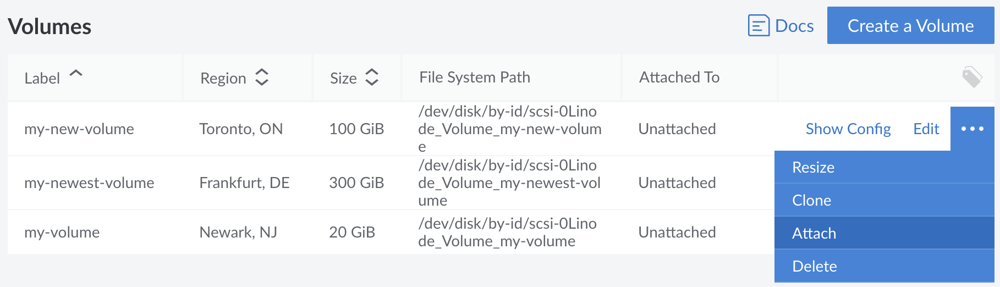
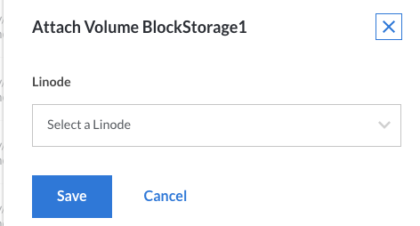

Follow these steps to attach a Block Storage Volume that was previously created in the Cloud Manager or through the Linode API.

1.  Click on the **Volumes** link in the sidebar to see your account's Volume list:

    

1.  Click the **more options ellipsis** to open the menu for the Volume you want to attach to a Linode and select **Attach**:

    

1.  Select the label of the Linode you want to attach the Volume to from the dropdown menu, then click **Save**:

    

    
The Linodes available in this dropdown menu all share the same region as your Volume.


1.   You'll need to create a filesystem in your new Volume if it does not already have one. If you have created a filesystem previously for this volume on any Linode, you should skip this step. If your Volume does not have a filesystem and it is not already running, boot then SSH into your Linode and execute the following command, where `FILE_SYSTEM_PATH` is your Volume's file system path:

        mkfs.ext4 FILE_SYSTEM_PATH

        
If a new filesystem is created on a Block Storage Volume that is already using a filesystem, the above command will result in data loss. You can safely check for the filesystem of an unmounted volume with the following command:

    blkid FILE_SYSTEM_PATH

If you do not receive output, there is currently no filesystem on this volume.


1.  Provided the Volume has a filesystem, you can create a mountpoint for it:

        mkdir /mnt/BlockStorage1

1.  You can then mount the new Volume, where `FILE_SYSTEM_PATH` is your Volume's file system path:

        mount FILE_SYSTEM_PATH /mnt/BlockStorage1

1.  If you want to mount the new Volume automatically every time your Linode boots, you'll want to add the following line to your **/etc/fstab** file:

        FILE_SYSTEM_PATH /mnt/BlockStorage1
