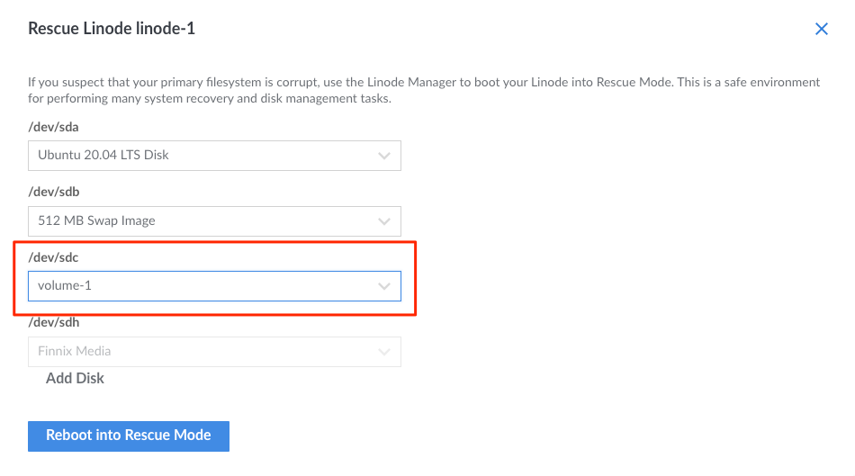
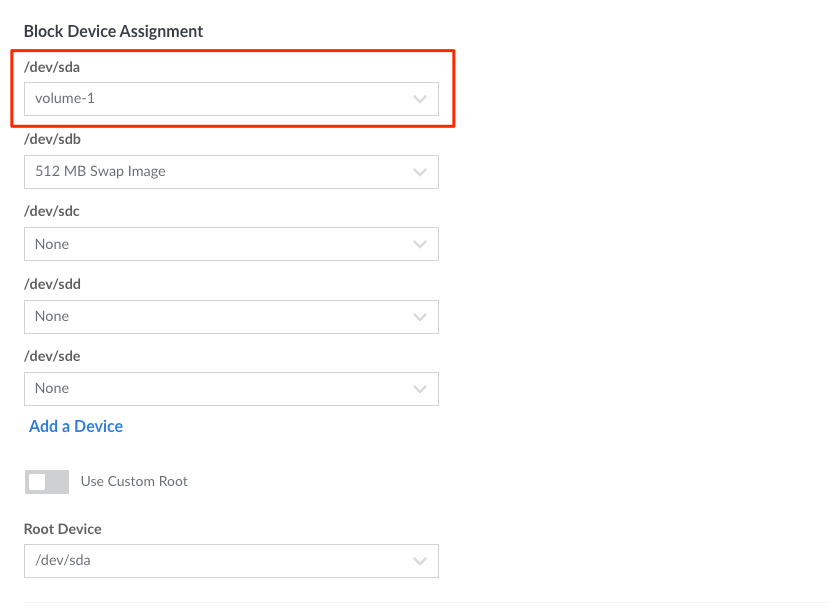

<!--  -->

Linode’s Block Storage service allows you to attach additional storage volumes to your Linode. In addition to storing files and media, you can also use a Block Storage Volume as a boot disk. This can provide a low-cost way to maintain an image that can be quickly attached to a new Linode and booted up when needed.

This guide outlines the steps needed to boot your Linode from a Block Storage Volume. These steps include creating a new Volume, copying the primary disk to that new Volume, and configuring the Linode to boot from that Volume. The process may be reversed in order to restore the primary disk from the Block Storage Volume.

## Create the Block Storage Volume

Create a Block Storage Volume and attach it to the target Linode. Verify that the Volume is the same size as (or larger than) the primary disk and is in the same data center as the Linode. Review the [Block Storage guide](/docs/platform/how-to-use-block-storage-with-your-linode/) for instructions on creating, attaching, and resizing a Volume.

## Copy the Primary Disk onto the Block Storage Volume

1.  Boot the Linode into Rescue Mode and assign the Block Storage Volume to `/dev/sdc` (shown below). The primary disk should remain assigned to `/dev/sda`. If your device assignments are different, you may need to adjust the commands or steps in this guide accordingly. Review the [Rescue and Rebuild guide](/docs/troubleshooting/rescue-and-rebuild/#booting-into-rescue-mode) for more information on booting into Rescue Mode.

    

1.  Connect to the Linode via [Lish](/docs/platform/manager/using-the-linode-shell-lish/).

1.  Run `fdisk -l` to confirm the Linode's primary disk and Block Storage Volume are available as `dev/sda` and `dev/sdc`, respectively.

1.  Run the following `pv` command to copy the contents of the primary disk to the Block Storage Volume. Respectively, the options `-pte` output a progress meter, the elapsed time, and the estimated time remaining.

        pv -pte < /dev/sda > /dev/sdc

## Set the Block Storage Volume as the Primary Disk and Reboot

1.  Power off the Linode.

2.  Edit the Linode's **Configuration Profile**. Under the **Block Device Assignments** section, assign the `/dev/sda` device to your Block Storage Volume (shown below). Confirm that the root device is set to `/dev/sda` (this is the default setting). If your Volume was previously assigned to any other device, such as `/dev/sdc`, set the device to `None`. Save these changes. Review the [Linode Configuration Profiles](/docs/guides/linode-configuration-profiles/) guide for more information on editing a Linode's configuration.

    

3.  Power on the Linode.

The Linode should boot normally from the Block Storage Volume. Keep in mind that Block Storage may not be as fast as the Linode's SSD disks and, as such, performance may be different.
