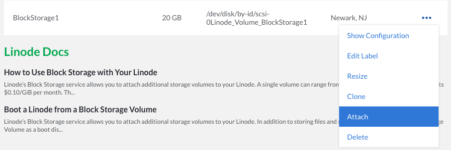

Follow these steps to safely detach a Volume from a Linode and attach it to a different Linode in the same data center:


Volumes cannot be attached to Linodes that are in a different data center. See the [Transfer Block Storage Data between Data Centers](/docs/products/storage/block-storage/guides/transfer-volume-data-between-data-centers/) how-to for help with migrating data on a Volume to a different data center.


1. [Safely detach the Volume](/docs/products/storage/block-storage/guides/detach-volume/).

1.   Click the **more options ellipsis** to open the menu for the Volume you want to attach to a Linode and select **Attach**:

    

1.   Since the Volume already has a filesystem on it, create a mountpoint for the new Linode, provided it hasn't already been created:

        mkdir /mnt/BlockStorage1

1.   Mount the new Volume, where FILE_SYSTEM_PATH is your Volume’s file system path:

        mount FILE_SYSTEM_PATH /mnt/BlockStorage1

1.  If you want to mount the new Volume automatically every time your Linode boots, you'll want to add the following line to your **/etc/fstab** file:

        FILE_SYSTEM_PATH /mnt/BlockStorage1 ext4 defaults 0 2
