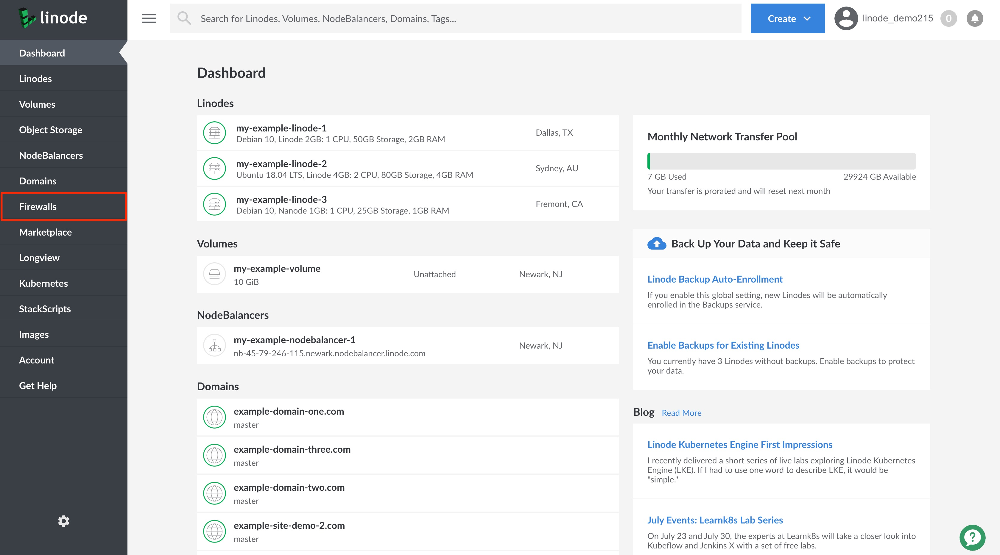
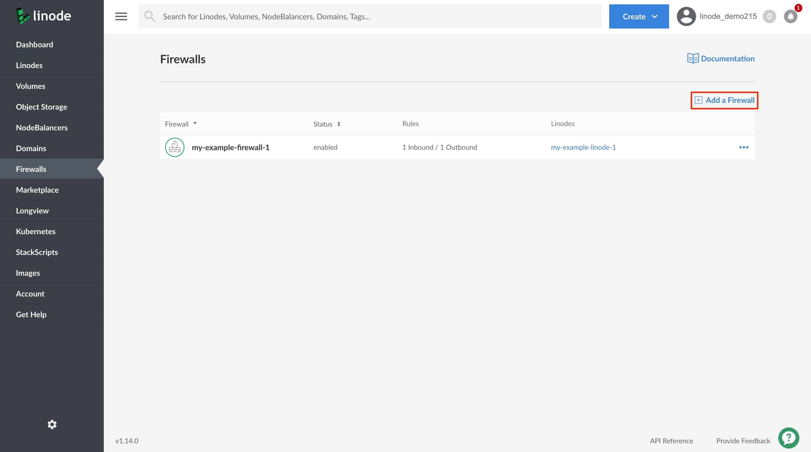
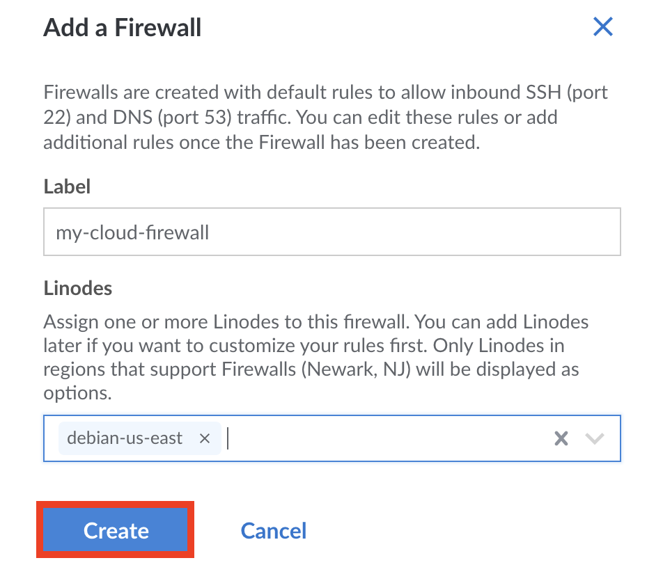

1. Log into your [Linode Cloud Manager](https://cloud.linode.com/) and select **Firewalls** from the navigation menu.

    

1. From the **Firewalls** listing page, click on the **Add a Firewall** link.

    

1. The **Add a Firewall** drawer appears with the Firewall configurations needed to add a Firewall. Configure your Firewall with at minimum the required fields:

    | **Configuration** | **Description** |
    | --------------- | --------------- |
    | **Label** | The label is used an identifier for this Cloud Firewall. *Required*|
    | **Linodes**| The Linode(s) on which to apply this Firewall. A list of all Linodes on your account are visible. You can skip this configuration if you do not yet wish to apply the Firewall to a Linode. |

1. Click on the **Create** button. This creates the Cloud Firewall and it appears on the **Firewalls** listing page. By default, the Firewall has two Inbound rules applied to it; one for DNS queries (port `53`) and a second for SSH connections (port `22`). You can [edit](/docs/products/networking/cloud-firewall/guides/edit-rules/) or [delete](/docs/products/networking/cloud-firewall/delete-rules/) the rules after adding the Firewall, if needed.

    
