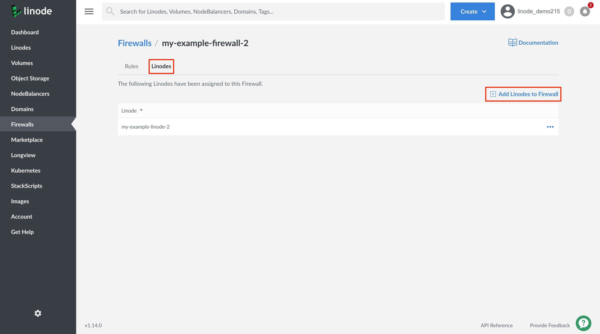
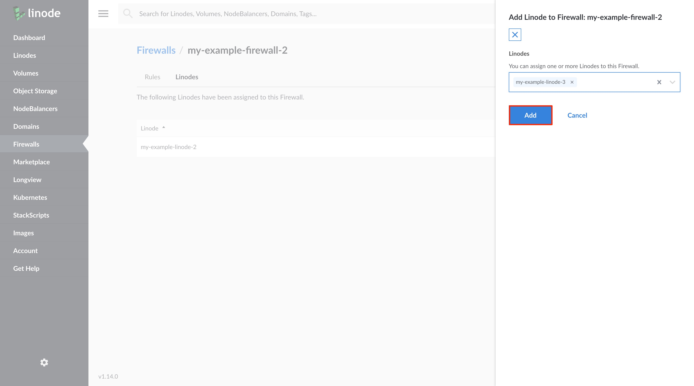

## Add a Cloud Firewall

1. Log into your [Linode Cloud Manager](https://cloud.linode.com/) and select **Firewalls** from the navigation menu.

    

1. From the **Firewalls** listing page, click on the **Add a Firewall** link.

    

1. The **Add a Firewall** drawer appears with the Firewall configurations needed to add a Firewall. Configure your Firewall with at minimum the required fields:

    | **Configuration** | **Description** |
    | :---------------: | :---------------: |
    | **Label** | The label is used an identifier for this Cloud Firewall. *Required*|
    | **Linodes**| The Linode(s) on which to apply this Firewall. A list of all Linodes on your account are visible. You can skip this configuration if you do not yet wish to apply the Firewall to a Linode. |

1. Click on the **Create** button. This creates the Cloud Firewall and it appears on the **Firewalls** listing page. By default, the Firewall has two Inbound rules applied to it; one for DNS queries (port `53`) and a second for SSH connections (port `22`). You can [edit](#edit-cloud-firewall-rules) or [delete](#delete-cloud-firewall-rules) the rules after adding the Firewall, if needed.

    

## Assign a Cloud Firewall to a Linode Service

1. Log into your [Linode Cloud Manager](https://cloud.linode.com/) and select **Firewalls** from the navigation menu.

    

1. From the **Firewalls** listing page, click on the Firewall that you would like to attach to a Linode. This takes you to the Firewall's **Rules** page.

1. Click on the **Linodes** tab. This takes you to the **Firewalls Linodes** page. If the Firewall is assigned to any Linode services they are displayed on the page.

1. Click on the **Add Linodes to Firewall** link.

    

1. From the **Add Linode to Firewall** drawer, click on the dropdown menu and select the Linode service to which you'd like to apply this Firewall. You can also start typing the Linode service's label to narrow down your search.

    
You can assign the Firewall to more than one Linode service at a time. Continue the previous step to assign the Firewall to another Linode service.
    

1. Click on the **Add** button to assign the Firewall to your Linode(s).

    


If you have a Cloud Firewall attached to a Linode and you attempt to [migrate the Linode to a data center](/docs/platform/disk-images/how-to-initiate-a-cross-data-center-migration-for-your-linode/) that does not support Cloud Firewalls, the migration will fail.

