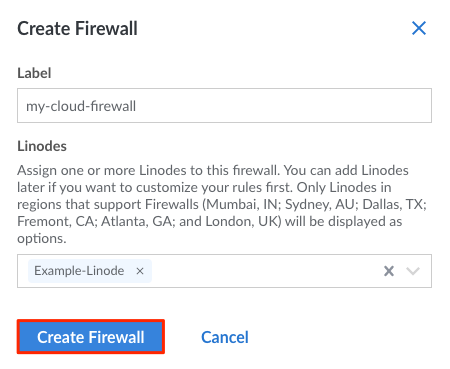

1. Log in to the [Cloud Manager](https://cloud.linode.com/) and select **Firewalls** from the navigation menu.

1. From the **Firewalls** listing page, click on the **Create a Firewall** link.

1. The **Add a Firewall** drawer appears with the Firewall configurations needed to add a Firewall. Configure your Firewall with at minimum the required fields:

    | **Configuration** | **Description** |
    | --------------- | --------------- |
    | **Label** | The label is used an identifier for this Cloud Firewall. *Required*|
    | **Linodes**| The Linode(s) on which to apply this Firewall. A list of all Linodes on your account are visible. You can skip this configuration if you do not yet wish to apply the Firewall to a Linode. |

1. Click on the ****Create**** button to finish creating the Cloud Firewall. By default, a new Cloud Firewall will accept all inbound and outbound connections. Custom rules can be added as needed. See [Add New Cloud Firewall Rules](/docs/products/networking/cloud-firewall/guides/add-rules/).

    