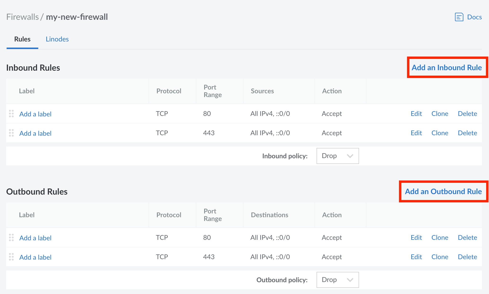
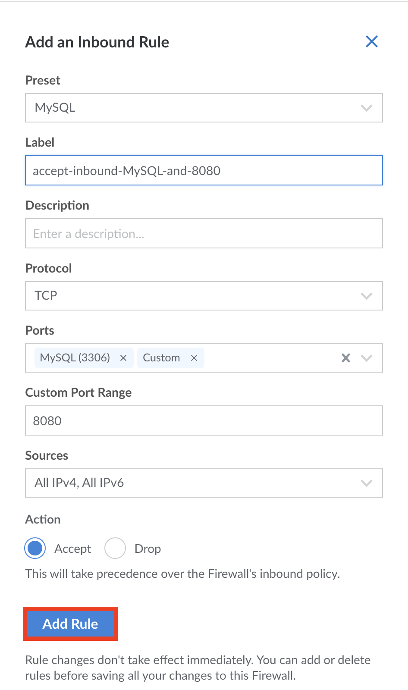
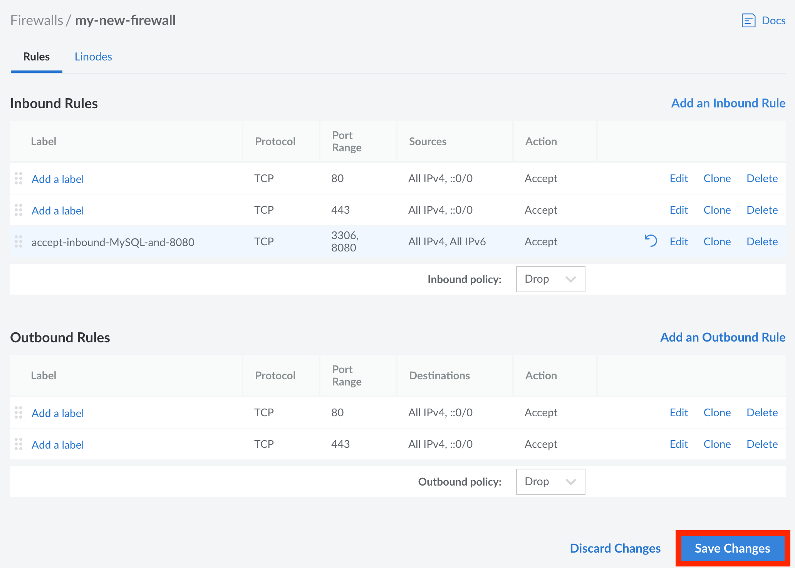
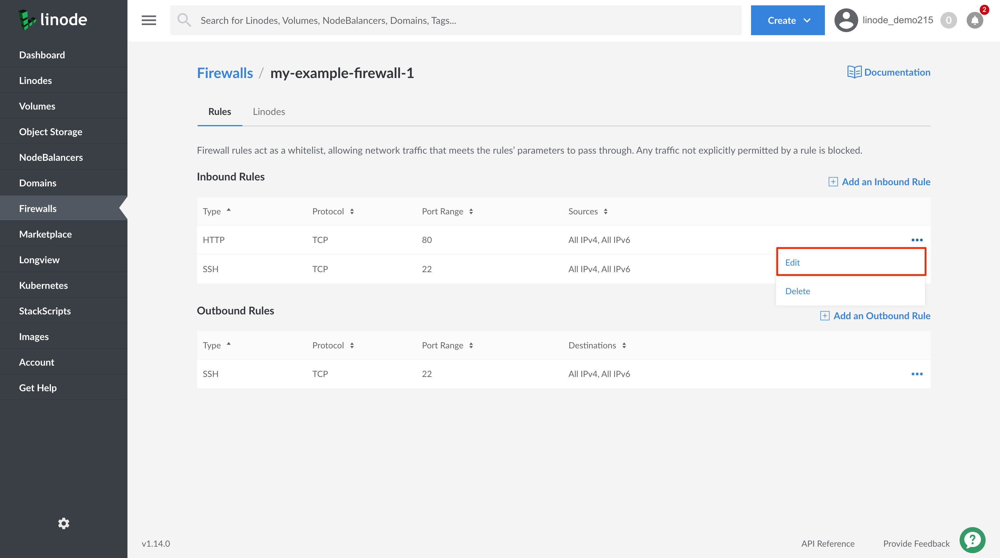
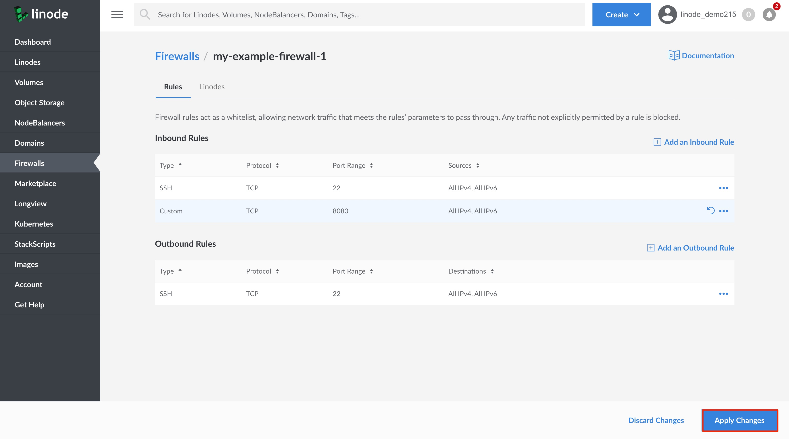

### Add New Cloud Firewall Rules

1. Log into your [Linode Cloud Manager](https://cloud.linode.com/) and select **Firewalls** from the navigation menu.

1. From the **Firewalls** listing page, click on the Firewall that you would like to add new rules to. This takes you to the Firewall's **Rules** page.

1. Click on the **Add an Inbound/Outbound Rule** link (click on the appropriate link for the type of Rule you would like to add).
    

    The **Add an Inbound/Outboud Rule** drawer appears.

1. Provide the following Rule configurations:

    | **Configuration** | **Description** |
    | :---------------: | :---------------: |
    | **Type** | &bull; Select from a list of predefined Firewall rules or select **Custom** to define your own Rule.    &bull;Selecting a predefined rule fills in the remaining Rule configuration values, however, they can all be edited.   &bull;Selecting **Custom**, leaves all configuration values empty for you to define. *Required*|
    | **Protocol** | Select the Transport Layer protocol to use for this Firewall rule. *Required*|
    | **Port Range**| &bull; Provide a port number or a range of ports on which to allow network traffic.    &bull; This configuration is required for TCP and UDP Firewall rules. `ICMP` does not have a port abstraction, so does not require this configuration.   &bull; To configure a **Port Range** provide the starting and ending port numbers. For example, `2000-3000`.  *Required*|
    | **Sources / Destinations**| &bull; When creating an **Inbound Rule**, select from a list of **Sources** that limit incoming connections to the chosen internet protocol, netmask, or specific IP address(es).   &bull; When creating an **Outbound Rule**, select from a list of **Destinations** that limit the outgoing connections to the chosen internet protocol, netmask, or specific IP address(es). |

1. Click on **Add Rule** to add the new rule to this Firewall. If you would like to add any additional rules, repeat the process outlined in this section.

    

1. When you are done adding new Firewall rules, click on the **Apply Changes** button on the **Rules** page.

    
Any newly added rules do not take effect until you **Apply Changes** to the Firewall.
    

    

### Edit Cloud Firewall Rules

Follow the steps in this section to edit predefined and custom Firewall Rules.

1. Log into your [Linode Cloud Manager](https://cloud.linode.com/) and select **Firewalls** from the navigation menu.

1. From the **Firewalls** listing page, click on the Firewall whose rules you'd like to edit. This takes you to the Firewall's **Rules** page.

1. Click on the ***more options ellipsis*** corresponding to the rule you'd like to edit and select **Edit** from the dropdown menu.

    

1. From the **Edit Rule** drawer, update the rule's configurations as needed.

1. Click on the **Edit Rule** button to save your changes and apply them to the rule. If you would like to edit any additional rules, repeat the process outlined in this section.

    

1. When you are done editing your Firewall rules, click on the **Apply Changes** button on the **Rules** page.

    
Any edits made to rules do not take effect until you **Apply Changes** to the Firewall.
    

    
