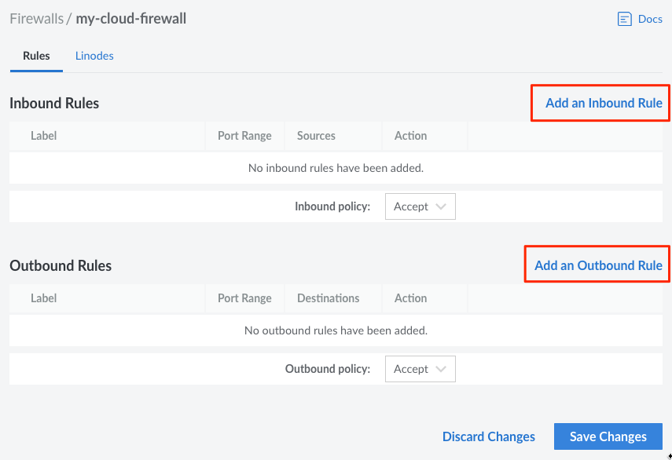
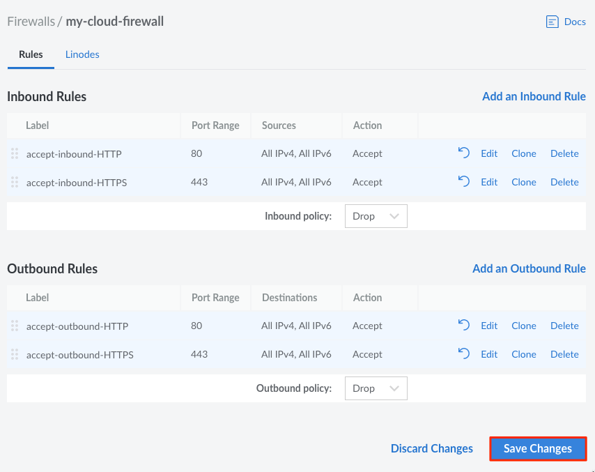

1. Log in to the [Cloud Manager](https://cloud.linode.com/) and select **Firewalls** from the navigation menu.

1. From the **Firewalls** listing page, click on the Firewall that you would like to add new rules to. This takes you to the Firewall's **Rules** page.

1. On the **Rules** page, select the default behavior for both inbound and outbound traffic using the **Inbound Policy** and **Outbound Policy** dropdown menus. **Accept** will allow all traffic except for those defined in the listed rules, and **Drop** will drop or deny all traffic except for those defined in the rules.

    

1. Click on the **Add an Inbound/Outbound Rule** link (click on the appropriate link for the type of Rule you would like to add).

    

    The **Add an Inbound/Outbound Rule** drawer appears.

1. Provide the following Rule configurations:

    | **Configuration** | **Description** |
    | --------------- | --------------- |
    | **Preset** | &bull; Select from a list of optional predefined Firewall rules. Selecting a predefined rule fills in the remaining Rule configuration values, however, they can all be edited. *Optional*|
    | **Label** | &bull; A label for the rule being created. This is used only as an identifier for the Linode Account holder, and does not have any impact on firewall performance. *Optional*
    | **Description** | &bull; A Description of the rule being created. This is used only as an identifier for the Linode Account holder, and does not have any impact on firewall performance. *Optional*|
    | **Protocol** | Select the Transport Layer protocol to use for this Firewall rule. *Required*|
    | **Ports** | &bull; Select from a list of common port numbers, or select **Custom** to open the **Custom Port Range** configuration option. More than one option may be selected. *Required*|
    | **Custom Port Range**| &bull; Provide a port number or a range of ports on which to allow network traffic. To configure a **Port Range** provide the starting and ending port numbers. For example, `2000-3000`.  *Optional*|
    | **Sources / Destinations**| &bull; When creating an **Inbound Rule**, select from a list of **Sources** that limit incoming connections to the chosen internet protocol, netmask, or specific IP address(es).   &bull; When creating an **Outbound Rule**, select from a list of **Destinations** that limit the outgoing connections to the chosen internet protocol, netmask, or specific IP address(es). *Required*|
    | **Action** | &bull; Choose whether this rule will be to allow or drop traffic. The action defined in specific rules will take precedence over the default inbound and outbound traffic policy. *Required* |

1. Click on **Add Rule** to add the new rule to this Firewall. If you would like to add any additional rules, repeat the process outlined in this section.

    

1. When you are done adding new Firewall rules, review them on the **Rules** page you are redirected to by default. Firewall rules are applied in order from top to bottom as they appear on this page. If you would like to re-order these rules, drag and drop any row into their desired position.

1. When you are done reviewing the new Firewall rules, click on the **Save Changes** button on the **Rules** page.

    
Any newly added rules do not take effect until you **Save Changes** to the Firewall.


    