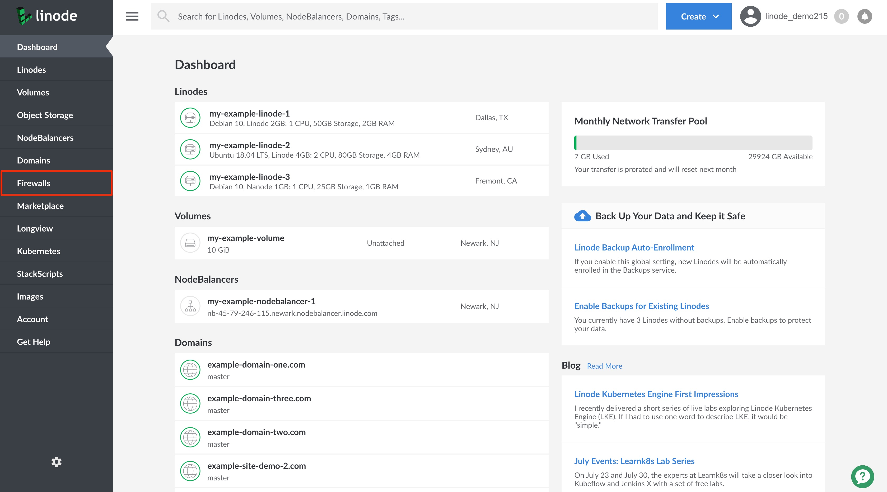
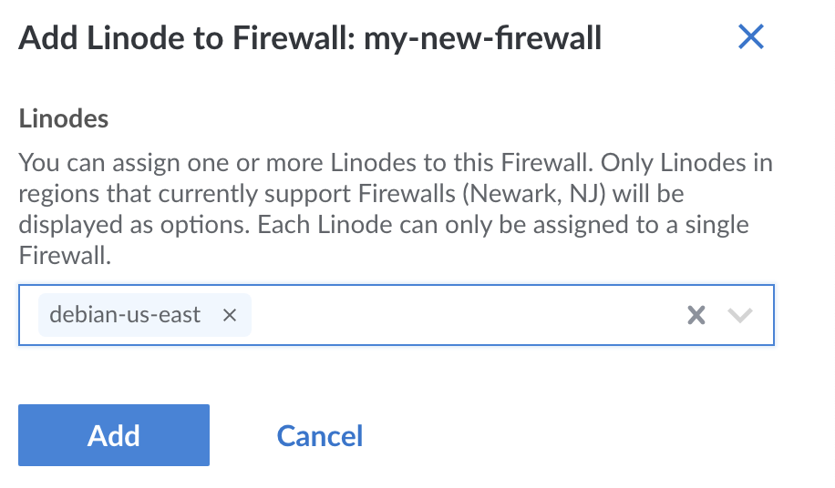

1. Log into your [Linode Cloud Manager](https://cloud.linode.com/) and select **Firewalls** from the navigation menu.

    

1. From the **Firewalls** listing page, click on the Firewall that you would like to attach to a Linode. This takes you to the Firewall's **Rules** page.

1. Click on the **Linodes** tab. This takes you to the **Firewalls Linodes** page. If the Firewall is assigned to any Linode services they are displayed on the page.

1. Click on the **Add Linodes to Firewall** link.

    

1. From the **Add Linode to Firewall** drawer, click on the dropdown menu and select the Linode service to which you'd like to apply this Firewall. You can also start typing the Linode service's label to narrow down your search.

    
You can assign the Firewall to more than one Linode service at a time. Continue the previous step to assign the Firewall to another Linode service.


1. Click on the **Add** button to assign the Firewall to your Linode(s).

    


If you have a Cloud Firewall attached to a Linode and you attempt to [migrate the Linode to a data center](/docs/guides/how-to-initiate-a-cross-data-center-migration-for-your-linode/) that does not support Cloud Firewalls, the migration fails.

