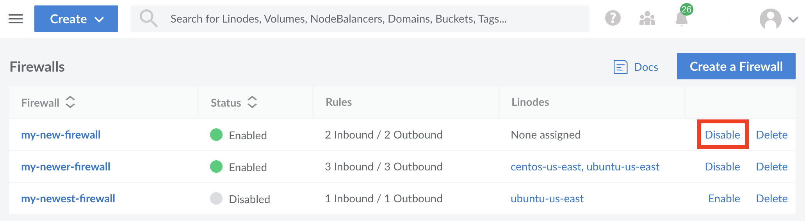
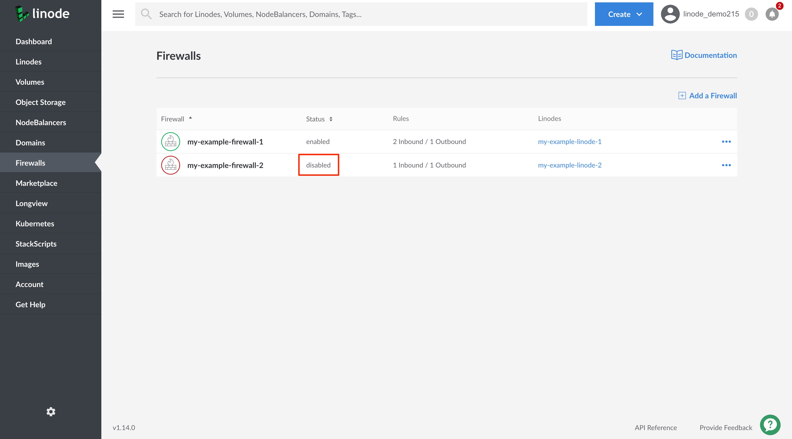

When you [add a Cloud Firewall](/docs/products/networking/cloud-firewall/guides/add-firewall/), the Firewall is enabled by default. Enabled means that the Firewall is active. If it is applied to a Linode service it filters your Linode service's network traffic according to the Firewall's rules. Disabling a Firewall deactivates the Firewall and it no longer filters any traffic for the Linode services it has been applied to.

1. Log into your [Linode Cloud Manager](https://cloud.linode.com/) and select **Firewalls** from the navigation menu. This takes you to the **Firewalls** listing page.

1. Click on the **more options ellipsis** corresponding to the Firewall whose status you'd like to update.

1. From the dropdown menu, click on **Enable/Disable** to update the Firewall's status.

    

    The **Status** column on the **Firewalls** listing page updates to display the Firewall's current status.

    