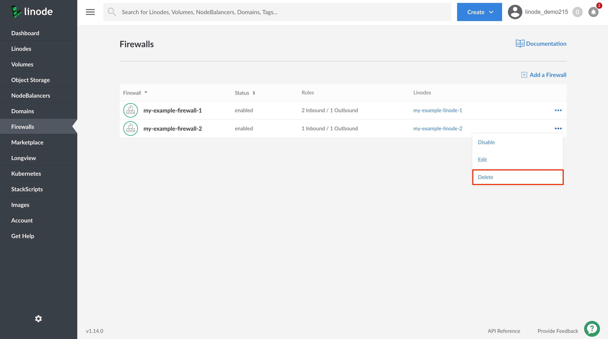

1. Log into your [Linode Cloud Manager](https://cloud.linode.com/) and select **Firewalls** from the navigation menu. This takes you to the **Firewalls** listing page.

1. Click on the **more options ellipsis** corresponding to the Firewall that you'd like to delete.

1. From the dropdown menu, click on **Delete**. You are prompted to confirm deleting the Firewall. Click **Delete** to proceed.

    

    The Firewall is deleted and any services that the Firewall was applied to no longer have their network traffic filtered by the Firewall.